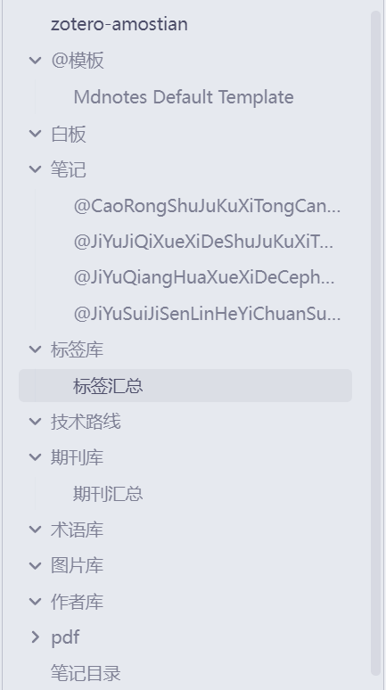
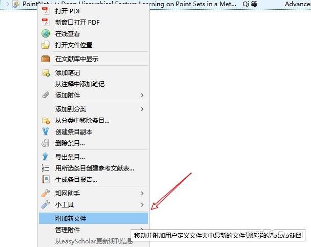
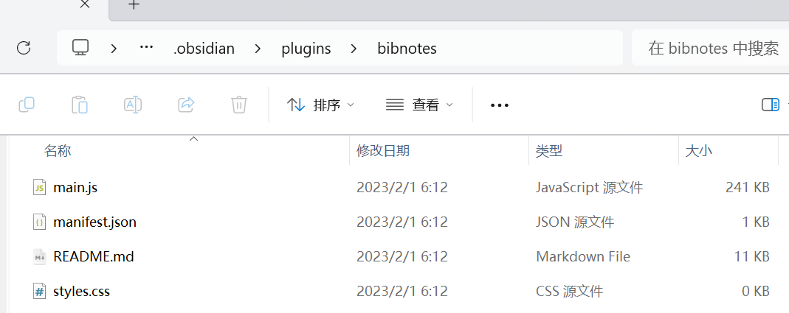
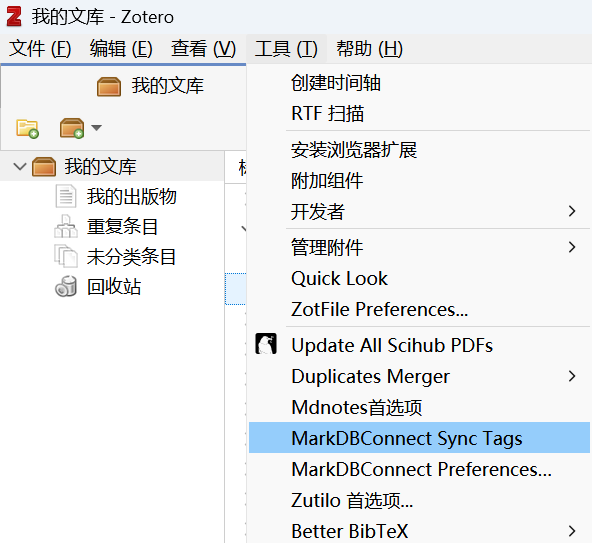

[TOC]

<!--more-->

## 1. Zotero简介

Zotero是开源的文献管理工具，支持安装在网页上的浏览器插件，与Endnote等不同的是，它不是一个独立的软件，而是内嵌在 Firefox等浏览器中的插件应用。

### 1.1 功能

- 浏览器插件抓取：Zotero的最大优点是能够对在线文献数据库网页中的文献题录直接抓取；
- 文件夹+标签的双管理系统：在网页看到中意的文章可以一键导入到软件的文件夹中，而且它使用的是“文件夹+标签”的双管理系统，给文献加上标签，**可以更好地进行搜索和定位**。（比如同一对象，有做实验的，有做模拟的，有做实验＋模拟的，用文件夹来分类就很麻烦，打上标签之后就可以很方便地进行管理和查找）；
- 可以很方便地做笔记：可以将文献的主要思路、主要结论、图片放在笔记栏里，帮助理解，下次再看这篇文献的时候可以快速帮助你回想起文献的内容。【如果觉得内容很多，也可以单独见一个笔记文件夹，与原文件放在一起，这样方便查看，不用担心笔记丢失】；
- 在Word中添加一个插件：在写文章的时候，可以很方便地进行文献的引用和调整。

### 1.2 使用/常用功能

https://blog.csdn.net/qq_36667170/article/details/124133119

## 1.2 配置

### 1.2.2 修改首选项


#### 中文


#### 引用格式


在文章中引用完成后，需要在参考文献部分列出


更改参考文献标准：


至于参考文献样式，可以在首选项中添加。


搜索目标样式即可


### 1.2.3 修改PDF解析器


将原先的 `[]` 替换为下列内容

```json
{     
	"name":"sci-hub",     
	"method":"GET",     
	"url":"https://sci-hub.st/{doi}",     
	"mode":"html",     
	"selector":"#pdf",     
	"attribute":"src",     
	"automatic":true 
}
{
    "name": "Google学术搜索(需翻墙)",
    "url": "http://scholar.google.com/scholar?q={title}&as_sdt=0&as_vis=1&oi=scholart",
    "mode":"html",     
    "selector":"#pdf",     
    "attribute":"src",     
    "automatic":true 
},
```

作用是以 `sci-hub` 为来源导入文献PDF

### 1.2.4 检索引擎


*/zotero/locate/engine.js*

```js
[
    {
		"_name": "Sci-Hub DOI",
		"_alias": "Sci-Hub DOI",
		"_description": "SciHub Lookup Lookup",
		"_icon": "https://figurebed-iseex.oss-cn-hangzhou.aliyuncs.com/img/20201016200912.png",
		"_hidden": false,
		"_urlTemplate": "http://sci-hub.se/{z:DOI}",
		"_urlParams": [],
		"_urlNamespaces": {
			"z": "http://www.zotero.org/namespaces/openSearch#"
		},
		"_iconSourceURI": "https://figurebed-iseex.oss-cn-hangzhou.aliyuncs.com/img/20201016200912.png"
	}
]
```

> 参考链接：https://zhuanlan.zhihu.com/p/564921230

以上代码中，我们其实只需要重点修改 `"_urlTemplate"` 的地址；

`"_name"` ，`"_alias"` ：为检索引擎的名称/简称，这个自定义就可以，比如谷歌搜索我们就都写为“Google”就可以了；

`"_icon"` 是显示的图标，一般在网站地址后面加上 `/favicon.ico` 就可以了，比如谷歌的地址为：[https://www.google.com](https://link.zhihu.com/?target=https%3A//www.google.com)那么“icon”的地址就为：ttps://[http://www.google.com/favicon.ico](https://link.zhihu.com/?target=http%3A//www.google.com/favicon.ico)

- 对于地址不正确的检索引擎，我们可以用谷歌浏览器打开网站，按**F12**打开开发者模式来查找图标的地址；大多数都可以在 `<head>` 标签中找到**带icon属性的标签**，复制标签中的地址即可。

`"_urlTemplate"` 是最关键的需要修改的地方

- 首先打开SCI-HUB的一个可用地址，如：[https://sci-hub.st/](https://link.zhihu.com/?target=https%3A//sci-hub.st/)

- 然后**输入任意文献的DOI进行搜索**，比如“10.1039/C9CP04353E”，可以注意到搜索结果的地址为：[https://sci-hub.st/10.1039/C9CP04353E](https://link.zhihu.com/?target=https%3A//sci-hub.st/10.1039/C9CP04353E)

  也就是说结果地址为**原地址+搜索字段（输入的DOI）**，那么就**可以将结果地址中的DOI进行替换，替换为“**{z:DOI}**”**，即`_urlTemplate`为：[http://sci-hub.st/](https://link.zhihu.com/?target=http%3A//sci-hub.st/){z:DOI}

`_description` 处可以添加有关检索引擎的简单描述，在Zotero中将鼠标移至检索引擎时，会显示该描述。其它部分基本不需要修改

#### 中文文献

登上校园网，就不能抓取条目

我选择知网获取条目，再登上校园网下PDF

## 1.3 基本操作

> 安装注册+文件导入+添加标签+添加笔记+数据管理与同步+参考文献引用

### 1.3.1 安装注册

在 [ 官网 ](https://www.zotero.org) 下载软件，科学上网方式进行注册，在 **编辑-首选项-同步**里登录，可以实现多设备同步；安装插件！！

### 1.3.2 下载插件+文件导入

- 下载插件，几乎所有的网站（ScienceDirect、知网等）都可以使用该插件，点一下浏览器插件，选择要放入的文件夹【Zotero的文件夹可以自由添加子目录】，文献就自动导入了，如果连校园网，文献也可以自动下载下来。
- 如果下载不了，可以用其他方法下载。然后将下载的文件拖入到Zotero当中，正常是可以自动识别文献的题目，如果没有反应，可以点击右键 **重新抓取PDF的元数据**；
- 批量文件导入：比如在一个网页有很多文献，只要点击插件按钮，选择想要的文献，就可以了；

### 1.3.3 添加标签

- 下次想找到某一类文献就很方便了，只要点击左下角的标签，相关的文献就被筛选出来了。
- 也可以改标签的颜色，这样相关的文献前面就有相应的颜色块，一眼就能看见；

### 1.3.4 添加笔记

- 可以添加图片。【建议把 **自动同步功能取消，要不可能在做笔记的时候笔记突然消失** 】
- Markdown插件：下载Markdown插件，把它拖到Zotero安装文件夹里。回到Zotero中，点击 **工具-选择-插件** ；

### 1.3.5 数据管理与同步

**编辑-首选项-高级** 选择储存位置。可以每隔一段时间将相应的文件夹复制备份一下，也可以选择同步到云端，登入Zotero官网就可以看到，在不同设备上只用登录账号就可以获得相关数据，不过Zotero的免费空间只有300M。

### 1.3.6 参考文献引用

- 安装好Zotero，打开Word会自动在里面安装插件，如果没有，可以在Zotero的 **编辑-首选项-引用-文档编辑软件** 里面进行添加。在需要引用文献的地方点击Add Citation，选择引文格式，会弹出一个对话框，可以进行搜索， 也可以直接进行选择。然后将光标移到参考文献后面，点击Bibliography，添加参考书目。
- 如果调整了文献的顺序，只要点击下更新“Refresh”，编号和后面的书目，也会自动调整。调整参考文献的格式：Document Preferences。
- 如果没有想要的参考文献格式，也可以手动添加，可以在Zotero的 **编辑-首选项-引用-获取更多样式**，搜索“Chinese National Standard”【国标】，添加进来就可以了。写完之后，我们可以点击Unlink Cititions，取消链接，这样参考文献就会变成文本格式。
- 【**Word安装不上Zotero解决办法**】：
  1. 可以在Zotero的 **编辑-首选项-引用-文字处理软件** 里面进行添加；
  2. 在Word里面点击 **更多-选项-加载项**，先检查一下 **禁用项目**，点击 **转到**，看有没有被禁用的项目。
  3. 还不行，点击“Word加载项”，点击“转到”，点击“添加”，找到Zotero的安装目录，点击“extensions”,点击“zoteroWinWordIntegration@zotero.org”，点击“install”，点击“Zotero.dotm”，点击“确定”就OK了。

### 1.3.7 展开快捷键

方向键左、右来打开和收回。

全部展开 **Shift与+** 来实现，收回按 **-**

### 1.3.8 标签

- 可以在Zotero的 **编辑-首选项-常规** 将 **从Web页面创建条目时生成快照** 以及**使用关键词和标签自动给条目施加标签** 取消；
- 标签颜色有对应的编号：选择文献输入对应数字就可以打上标签；

## 1.4 插件

### 插件安装


### 1.4.1 文件预览

> 在Zotero里面选择相应的文件，按下空格进行预览，再空格可以取消预览

需要安装插件 **Zoteroquicklook** ，在Zotero中，点击 **工具-选择-插件**，点击“齿轮图标”，选择“Install Add-on From File”，找到Zoteroquicklook插件，安装后重启软件。

- Mac，加上这个插件就直接可以用了
- Windows系统还需要安装软件QuickLook

【Quicklook这个软件可以预览Windows上的其他文件，比如像图片、Word之类的都可以，可以设置开机自启】

### 1.4.2文献获取

#### sci-hub插件——英文

与 1.2.4 二选一操作

#### jasminum(茉莉花)——中文

> 抓取中文的信息条目

点击“编辑”“首选项”，在“高级”旁边会出现“茉莉花”图标，勾选“添加中文PDF/CAJ自动抓取题录”

将“非官方维护中文翻译器”更新一下，这回点击中文期刊，右键就会出现“抓取知网元数据”；【隔一段时间看一下是否需要更新】【文献点右键：合并拆分姓名（中文文献作者姓名拆分）】


自行下载 PDFtk Sever

##### 更新翻译器

**更新翻译器配置**


**更新本地翻译器**

[翻译器下载地址](https://github.com/l0o0/translators_CN)


用下载到的中文翻译器脚本替换原装中文网站翻译脚本


复制后替换即可，重启 Zotero

**更新浏览器插件**

打开知网或者其他网站


多点击几下，之后重启浏览器。

再打开知网查看是否可以获取到 PDF

#### 究极——下PDF拖进去

### 1.4.3 英文文献翻译

#### zotero-pdf-translate

[插件下载地址](https://github.com/windingwind/zotero-pdf-translate/releases)


**效果如图**


切换翻译引擎


#### 小绿鲸


### 1.4.4 小功能

#### 获取文献引用次数

> 可以从谷歌学术当中提取文献的引用次数

下载地址：https://github.com/MaxKuehn/zotero-scholar-citations

选择文件点击右键选择“Update citation”，第一次使用需要验证，验证完之后就可以批量地提取了，选择左侧文件夹右键选择“Update citation”，在文件栏右上角选择要显示的信息，选择“其它”。


##### 版本不兼容问题

试过改xpi的最大支持版本，没用

这个链接有用

https://www.xiaohongshu.com/explore/623939e3000000000102416a

1. 打开首选项的设置编辑器

   

2. 在弹出的设置编辑器窗口，右键任意设置，在右键菜单选择New -> Boolean

   

3. 按p4在参数名处，填入extensions.checkCompatibility.6.0，点ok，再后续窗口选择false。意思就是不检查6.0版本的兼容性。

4. 重启Zotero，就能看到如p5的黄色提示。记住不要点右边的Enable，那是让你开启兼容检查。

   

##### 引用次数抓取失败

原因：查zotero调试日志，发现默认是从google scholar抓取，国内被墙

方法：修改国内镜像源

https://blog.csdn.net/qq_43210428/article/details/120457378

1. 将下载的xpi解压

2. 修改 **chrome/content/zsc.js** 中的 `_baseUrl`

   ```
   https://gfsoso.99lb.net/scholar.html # 我这个抓不出来
   或
   https://sc.panda321.com/
   ```

3. 打包为zip，修改文件后缀为xpi

#### 设置快捷键

`Zutilo` ：在**“工具”栏里**，就出现了**Zutilo首选项**，点进去就是一个快捷键的设置，根据使用习惯设置功能。也可以定义快捷键

#### 中文等变英文等-delitemwithatt

> 批量修改文献的格式，文献的语言

点击文献右键，出现“将语言字段设为en”【多的一个功能】，在打开Word中的Zotero插件，点“Refresh”，会发现“等”变成了“et al”；


#### zotero笔记

`zotero-better-notes` https://zhuanlan.zhihu.com/p/663491418

条目笔记就是论文的阅读笔记，插件有很多现成模板 `<html>` 

主笔记的作用就是条目笔记的归纳，很多功能在ob中都可以找到原型

这个介绍BN功能比较全面详细：https://www.bilibili.com/video/BV1Fg411H7ZH/

BN插件作者亲述的同步方案  https://www.bilibili.com/video/BV1jP411M735/

由于重度md患者且有多端同步的需求，我就使用ob了，没有用过这个插件

## 1.5 实现zotero的文件(含笔记)多端同步

> https://zhuanlan.zhihu.com/p/622518457

Zotero把整个同步分为两个部分：数据同步+文件同步

- 数据包括：信息条目、笔记、标签、链接等。这些只能同步在Zotero里面，但这个是免费无限制的

  若关闭自动同步，可点击 Zotero 工具栏右侧的“与 zotero.org 同步”按钮来手动同步

  

- 文件包括：PDF、音频、视频等等。这些文件你可以选择同步在Zotero网盘里（免费空间只有300MB），也可以选择其他网盘（目前国内支持WebDAV直接接入的只有坚果云，具体操作 [坚果云教程](https://blog.csdn.net/qq_33957603/article/details/127876355)）

  另外目前有阿里云的 WebDav 同步方案，

  - 文档存储在阿里云盘
  - 需要ESC或者本地服务器作为 WebDav 服务器

  核心是 [搭建WebDav服务器](https://developer.aliyun.com/article/1070706)

**若不打算用官方的云同步，一定取消勾选zotero的文件自动同步**


### 1.5.0 文件(+笔记)同步思路

[目录结构参考](https://www.bilibili.com/video/BV1Fk4y1376L/?vd_source=260d5bbbf395fd4a9b3e978c7abde437) ：可以下载视频中的附件



https://www.bilibili.com/video/BV1HY411t7tB/：主要是了解工作流

1. 文件重命名及文件迁移——zotfile

   为了便于进行统一管理与同步

2. 笔记同步思路

   - 借助mdnotes，在zotero中生成笔记
   - 借助bibtex，在obsidian中生成笔记——自用

   二者区别在于，bibtex可以导出pdf中的注释，其余功能类似

3. dataview(obsidian) 实现文献汇总

4. obsidian+阿里云OSS实现多端同步

### 1.5.1 文件重命名及迁移——zotfile

**实现附件的批量管理** ：文件重命名+文件迁移

> 附加功能(其他插件也可实现)：
>
> 抓取文件中的笔记：抓取文件中的笔记：例如论文中的勾画和批注，点击右键选择 **Manage Attachments-Rename Attachments-Extract Annotations**（提取注释）【get table of Contents】，就会生成一个笔记文件，刚才勾画的重点文件就在这里面了
>
> 可以与平板电脑之间进行文件传输：与平板电脑间进行文件传输：选择 **工具-Zotfile Preferences-Tablet Settings**，功能上说可以将PDF发送给平板，用平板阅读做完笔记后，它可以将这篇文献拿回来，提取中间的笔记，保存在Zotero中。

#### 重命名文件

选择 **工具-Zotfile Preferences-Renaming Rules** 指定命名的规则（只保留标题）

选择几篇文献，右键选择 **Manage Attachments-Rename Attachments** ，Zotfile就会工作更改命名，下次导入文献的时候，Zotfile就会自动将其命名为设定的格式。

##### 重命名规则配置


1. 取消勾选使用Zotero重命名，因为这里我们要利用ZotFile重命名

2. 设置重命名格式，上面是除专利之外的命名格式，下面是专利命名格式，可以设置成一样的

   ```
   {%t_}{%y_}{%a}
   ％a，作者，在“其他设置”下更改了最大作者数量。
   ％y，年（从“日期”字段中提取）
   ％t，标题。标题其余部分的最大长度可以更改。
   ％j，期刊名称
   ％p，出版者的名称
   ％w，期刊或出版者的名称（与“％j”,“％p”相同)
   ％s，期刊缩写
   ％v，期刊第几卷
   ％e，期刊发行号
   ％f，期刊页码
   ％c，收集路径（仅适用于子文件夹，不适用于文件名）。当项目在多个集合中时，用户可以在不同的集合之间进行选择。
   ％n，专利号（仅限专利项）
   ％i，受让人（仅专利项目），assignee
   ％i ，作者首字母缩写。
   ％F ，位作者的姓氏，包括名字的首字母（例如EinsteinA）。
   ％ ，作者的第一封信（适用于子文件夹）
   ％d、％D、％L、％l，编辑者的通配符，与作者相同。
   ％t，条目类型（本地化）
   ```

   注意，**这里的重命名格式要和后面设备B的重命名格式相同**，这样在云盘文件夹中才能识别到同一个文件

3. 附加设置，主要包括作者间的分隔符，最大标题长度、最大作者数目等

**高级设置**

> 不需要额外设置，保持默认设置即可

#### 文件迁移

**zotero文件下载路径配置**

1. 设置链接附件的根目录

   - 相当于设置相对路径，不同设备该目录不同。

     相对路径（根目录）下目录结构与文件都相同时，就可以在不同设备上一相同结构访问某文件
   
   

2. 设置Zotero的数据存储位置，Zotero自带同步即是同步此文件夹下的内容，包括笔记、标注、附件等，附件则是存放在此文件夹下的 *storage* 文件夹中

**zotfile路径配置**

3. 设置 *附加新文件的源文件夹*，在网上抓取文献时，只抓取到了文献信息，而没有附件。这时可以手动将附件下载到这个文件夹，再 **右击条目-附件新文件** ，即抓取此条目下最新的文件作为此条目的附件。**因此，此路径设置为zotero的下载路径即可** 

   

4. 设置文件目标位置，即利用ZotFile转移附件的目标文件夹，设置此路径后，就可以利用ZotFile将附件转移到这个文件夹中。注意，**这里的路径要设置为和路径1一致**，这样才可以检索到相应的附件

   

#### Zotefile操作

这一步是将本来存在于Zotero数据文件夹（即路径2）下的storage文件夹中的附件移动到待同步文件夹下


接着点击 **我的文库-全选所有条目-右击-管理附件-重命名并移动附件**，这时候Zotero就会按照设置的命名规则重命名所有附件，并将其移动到设置的路径4中


当移动之后，条目下的附件也会由之前的存储文件变为链接文件形式：


### 1.5.2 利用mdnotes生成笔记

下载后 [mdnotes.xpi](https://github.com/argenos/zotero-mdnotes/releases) ，安装插件

[参考](https://blog.csdn.net/weixin_43703494/article/details/131775341)

#### 模板

在路径的 *@模板* 下，新建模板名为 `Mdnotes Default Template.md` 


[官网](https://argentinaos.com/zotero-mdnotes/docs/advanced/templates/defaults) 给出的模板

```
{{title}}

## Metadata

{{itemType}}
{{author}}
{{proceedingsTitle}}
{{date}}
{{dateAdded}}
{{url}}
{{DOI}}
{{citekey}}
{{collections}}
{{related}}
{{tags}}, #zotero, #literature-notes, #reference
{{pdfAttachments}}

{{abstractNote}}

## Zotero links

{{localLibrary}}
{{cloudLibrary}}

{{notes}}
```

在此基础上，增加与删除字段，形成自己模板

```markdown
# {{title}}

---

> [!info] 
> {{DOI}}
> {{publicationTitle}}
> {{author}}
> {{date}}
> {{tags}}
> {{citekey}} 

> [!abstract] 
> {{abstractNote}}

> [!todo] 
> State:: #Pending 

> [!note] 
> PDF: {{pdfAttachments}}
> 库: {{localLibrary}}
> 白板:  


---

## 思路


## 方法


## 结论


## 亮点


## 启发
```

#### 插件配置

修改mdnotes模板位置


对一些字段的格式进行设置 **编辑-首选项-高级设置-编辑器** 

- `"link_style": "no-links"` 表示将链接改为普通字符；"wiki" 表示 `[[]]` 格式的链接

- `"list_separator": ", "` ：作者有多个，因此需要用逗号进行分割

- 属性名采用双引号，Dataview插件调用数据格式为双冒号

- `{{bullet}}` ：定义了占位符，此处为 `- *` 

  `{{filed_content}}` 导出字段的内容，可添加

| Preference Name                                 | Value                                                        |
| ----------------------------------------------- | ------------------------------------------------------------ |
| extensions.mdnotes.placeholder.DOI              | `{"content":"{{bullet}} DOI:: {{field_contents}}",  "field_contents": "{{content}}", "link_style":  "no-links"}` |
| extensions.mdnotes.placeholder.title            | `{"content":"{{field_contents}}", "field_contents": "{{content}}", "link_style": "no-links"}` |
| extensions.mdnotes.placeholder.abstractNote     | `{"content":"{{field_contents}}\n",  "field_contents": "{{content}}", "link_style":  "no-links", "list_separator": ", "}` |
| extensions.mdnotes.placeholder.author           | `{"content":"{{bullet}} Authors:: {{field_contents}}",  "link_style": "wiki", "list_separator": ",  "}` |
| extensions.mdnotes.placeholder.citekey          | `{"content":"{{bullet}} Cite key::  {{field_contents}}", "field_contents":  "{{content}}", "link_style": "no-links"}` |
| extensions.mdnotes.placeholder.collections      | `{"content":"{{bullet}} Topics:: {{field_contents}}",  "field_contents": "[[{{content}}]]",  "link_style": "wiki", "list_separator": ",  "}` |
| extensions.mdnotes.placeholder.date             | `{"content":"{{bullet}} Date:: {{field_contents}}",  "field_contents": "{{content}}", "link_style":  "no-links", "list_separator": ", "}` |
| extensions.mdnotes.placeholder.localLibrary     | `{"content":"{{field_contents}}",  "field_contents": "[Local Library]({{content}})"}` |
| extensions.mdnotes.placeholder.pdfAttachments   | `{"content":"{{field_contents}}",  "link_style": "wiki"}`    |
| extensions.mdnotes.placeholder.publicationTitle | `{"content":"{{bullet}} Journal:: {{field_contents}}",  "field_contents": "{{content}}", "link_style":  "wiki", "list_separator": ", "}` |
| extensions.mdnotes.placeholder.tags             | `{"content":"{{bullet}} Tags:: {{field_contents}}",  "field_contents": "[[{{content}}]]",  "link_style": "no-links", "list_separator":  ", ", "remove_spaces": "true"}` |

### 1.5.3 利用bibTex生成笔记

[参考](https://blog.csdn.net/qq_43309940/article/details/125150487) 

- [Better BibTex](https://retorque.re/zotero-better-bibtex/)：主要用来将文献数据生成.json文件——zotero插件
- [BibNotes Formatter](https://github.com/stefanopagliari/bibnotes)：主要用来将.josn文件生成.md文件——Obsidian插件
- [[MarkDBConnect](https://github.com/daeh/zotero-markdb-connect)]：同步元数据，类似与git的功能

方案：


zotero通过 Better-BibTex 插件生成JSON文件导入ob的文件夹目录，ob插件 Bibnotes Formatter 读取JSON文件信息在用户命令下生成指定文献的md格式文件

- 笔记中包含 `{{localLabraryLink}}` (zotero中文献条目链接) 和 `{{file}}` (zotero中文献pdf链接) 可以从ob中直接打开文献

zotero通过 MarkDBConect 插件搜索OB中的 `@{{citeKey}}` 格式文件名将 zotero 中的文献条目与OB中的文献笔记实现联动

#### zotero条目导出——BETTER BIBTEX

##### 插件配置

1. 设置 Citation Keys

   Citation Keys用于后面obsidian笔记的命名和关联zotero条目和obsidian笔记，可以换自己设置格式

   `shorttitle(3,3).lower + auth.lower + '(' + year + ')' `

   - `auth.lower` ：将作者姓名小写，
   - `shorttitle(n,m)` ：取标题前n个单词，前m个单词大写

   

2. 设置不导出字段

   

3. 其余保持默认

##### 条目导出

1. 设置导出目录

   

   *E:\zotero-amostian\@模板* 

2. 尝试导出

   

3. 设置 **自动导出** 为 `修改时` 

   

   可见已生成自动导出计划

   

#### obsidan导入条目——Bibnotes Formatter

[官网下载](https://github.com/stefanopagliari/bibnotes/releases)

解压 `.zip` 文件

将解压缩后的文件复制到 *.obsidian* 目录下的 *plugins* 文件夹下



重启obsidian，并启用插件

##### 修改pdf默认应用

```js
function createLocalFileLink(reference2) {
  if (reference2.attachments.length == 0)
    return "{{localFile}}";
  const filesList = [];
  for (let attachmentindex = 0; attachmentindex < reference2.attachments.length; attachmentindex++) {
    if (reference2.attachments[attachmentindex].itemType !== "attachment")
      continue;
    // if (reference2.attachments[attachmentindex].path == void 0) {
    //   reference2.attachments[attachmentindex].path = "";
    // }
    // const attachmentPathCorrected = reference2.attachments[attachmentindex].path.replaceAll(" ", "%20");
    // const selectedfile = "[" + reference2.attachments[attachmentindex].title + "](file://" + attachmentPathCorrected + ")";
    if (reference2.attachments[attachmentindex].uri == void 0) {
      reference2.attachments[attachmentindex].uri = "";
    }
    const selectedfileUri = reference2.attachments[attachmentindex].uri
    const attachmentKey = selectedfileUri.split('/')[selectedfileUri.split('/').length - 1]
    selectedfile = "[" + reference2.attachments[attachmentindex].title + "](zotero://select/library/items/" + attachmentKey + ")";
    if (reference2.attachments[attachmentindex].title.endsWith('pdf')) {
      selectedfile = selectedfile.replaceAll("zotero://select/","zotero://open-pdf/");
    }
    filesList.push(selectedfile);
  }
  const filesListString = filesList.join("; ");
  return filesListString;
}
```

##### 配置


##### 模板

**默认模板**

```markdown
# {{title}}

## Metadata
- **CiteKey**: {{citekey}}
 - **Type**: {{itemType}}
 - **Title**: {{title}}, 
 - **Author**: {{author}};  
- **Editor**: {{editor}};  
- **Translator**: {{translator}}
- **Publisher**: {{publisher}},
- **Location**: {{place}},
- **Series**: {{series}}
- **Series Number**: {{seriesNumber}}
- **Journal**: {{publicationTitle}}, 
- **Volume**: {{volume}},
- **Issue**: {{issue}}
- **Pages**: {{pages}}
- **Year**: {{year}} 
- **DOI**: {{DOI}}
- **ISSN**: {{ISSN}}
- **ISBN**: {{ISBN}}

## Abstract
{{abstractNote}}
## Files and Links
- **Url**: {{url}}
- **Uri**: {{uri}}
- **Eprint**: {{eprint}}
- **File**: {{file}}
- **Local Library**: [Zotero]({{localLibraryLink}})

## Tags and Collections
- **Keywords**: {{keywordsAll}}
- **Collections**: {{collectionsParent}}


----

## Comments
{{UserNotes}}


----

## Extracted Annotations
{{PDFNotes}}
```

**自用模板**

```markdown
# {{title}}

## 元数据

> [!info] 
> **Title**:: {{title}}
> **DOI**:: {{DOI}}
> **Journal**:: {{publicationTitle}}(页码：{{pages}})
> **itemType**:: {{itemType}}
> **Date**:: {{date}}
> **Authors**:: {{author}};
> **Tags**:: {{keywordsAll}}
> **Keywords**::

> [!abstract] 
> {{abstractNote}}

> [!todo] 
> State:: #Pending 

> [!note] 
> **PDF**: {{file}}
> **库**: {{localLibrary}}
> **Url**: {{url}}
> 白板:  

## 笔记

### Comments
{{UserNotes}}

----

### Extracted Annotations
{{PDFNotes}}

---

## 阅读笔记

### ABSTRACT


### INTRODUCTION


### SYSTEM OVERVIEW


### Conclusion


## 总结

### 思路


### 方法


### 结论


### 亮点


### 启发
```


##### 笔记中图片问题

借助 `Custom Attachment Location` 插件，


#### MarkDBConnect

[下载地址](https://github.com/stefanopagliari/bibnotes/releases)

##### 配置

要填写 Bibnotes Formatter 配置中设置的文献笔记保存路径


#### 同步步骤

1. 通过 `citeKey` 创建笔记

   obsidian中 **ctrl+p**  打开命令面板，输入bib

   

   - **Update Library** ：插件将生成/更新自上次选择同一命令以来从 Zotero 修改的所有笔记。如果第一次选择此命令，则插件将为导入的参考书目中的所有条目创建/更新文献信息

   - **Create/Update Literature Note** ：系统将提示您从已导入的库中选择参考文献之一。如果在指定文件夹中尚未导入该文献笔记，则会根据之前设置的模板生成新的笔记。如果笔记已经存在，其内容将被更新而不会覆盖现有笔记。可以选择第一个选项（“整个库”）来创建/更新导入库中的所有笔记。

     

     

2. 依次点击 **工具-MarkDBConnect Sync Tags** ，自动名为 `{{citeKey}}` 文件名的笔记并与之关联

   

3. 关联后，即可从zotero中打开obsidian中生成的笔记

   

4. 在阅读完论文后，右键 **从注释中添加笔记** 会将pdf中做的笔记和高亮部分提取出来

5. 导出笔记后在obsidian中运行再次运行 **Create/Update Literature Note** ，可将更改的信息全部更新至obsidian文献笔记中，不会覆盖前一次的笔记，同时也会记录每一次的阅读笔记，当然也可以在阅读完文献以后再生成阅读笔记，此过程可反复操作，至此zotero和Obsidian的联动就完成了，可以很方便地在两个软件中快速实现切换。

   

   

### 1.5.4 生成文献汇总表格

在obsidian中安装dataview插件，**设置-第三方插件-社区插件市场-dataview(Michael Brenan)** 

这个插件以 `::` 作为标识符，用于提取指定目录下markdown文件中的元数据，如

```markdown
//某笔记.md
> [!info] 
> **Title**:: 基于机器学习的数据库系统参数优化方法综述
> **DOI**:: 10.13705/j.issn.1671-6833.2024.01.008
> **Journal**:: 郑州大学学报(工学版)(页码：1-11)
> **itemType**:: Journal Article
> **Date**:: 2023-10-07
> **Authors**:: 石磊; 李天; 高宇飞; 卫琳; 李翠霞; 陶永才;
> **Tags**:: ObsCite; aaa
> **Keywords**::
```

新建一个文件

````
//汇总.md
```dataview
table as 标题
from "笔记"
sort file.name asc
```
````

会生成


其余汇总表类似

### 1.5.5 Obsidain+OSS作为zotero服务器及客户端

#### obsidian插件库

不需要科学上网，就可以浏览社区版第三方插件

https://f8lfn9zs2l.feishu.cn/docs/doccnt33rKKHkjiQvBY54FysNJc

[下载obsidian插件市场代理插件](https://pan.baidu.com/s/1ld535VDWYmtqJByZNEnx6w?pwd=faef)

在 **.obsidian** 下新建 *plugins* 文件夹，并将下载的插件解压并移入

重新加载obsidian后，可查看插件


Obsidian安装 `Remotely Save`  


ipad做同样设置即可，然后用ipad上阅读APP笔记，相当于用OB当做读写PDF的API


## 1.6 Zotero的学习教程和相关问题解决的文档

（1）插件下载集合网站：

 [https://zotero-chinese.gitee.io/zotero-plugins/#/](https://zotero-chinese.gitee.io/zotero-plugins/#)

 （2）zotero笔记使用教程：

 [https://zotero.yuque.com/books/share/f3fe159f-956c-4f10-ade3-c87559cacb60/biigg4（在线更新）](https://zotero.yuque.com/books/share/f3fe159f-956c-4f10-ade3-c87559cacb60)

（3）Zotero 突然无法翻译词组/语句/段落，或者无法翻译标题/摘要 

 https://zotero.yuque.com/books/share/4443494c-c698-4e08-9d1e-ed253390346d/ngu6mc 

（4）从浏览器保存条目时发生错误 / 抓取时不能自动下载PDF / 无法自动给添加的PDF附件创建条目 [https://gitee.com/zotero-chinese/zotero-chinese/issues/I56D62）](https://gitee.com/zotero-chinese/zotero-chinese/issues) 

（5）关于 Word 中参考文献和引用样式的一揽子问题

 https://gitee.com/qnscholar/zotero-if-pro-max/issues/I515ZW 
