> Intellij产品破解

https://www.exception.site/

贴一个破解工具的网站

<!--more-->

# 1. 软件安装

官网地址：[JetBrains: Essential tools for software developers and teams](https://www.jetbrains.com/)

为什么推荐从官网下载呢。。。一个字：好（自己体会）

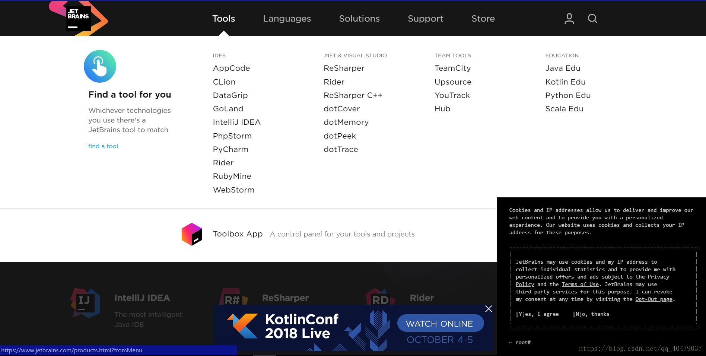

看到没，各种软件，要啥点就行了。

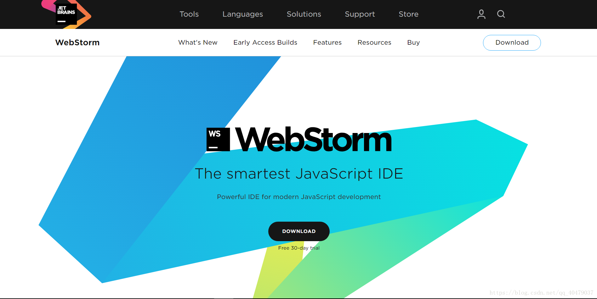

不管是mac还是windows，点中间黑色的下载是最稳妥的。

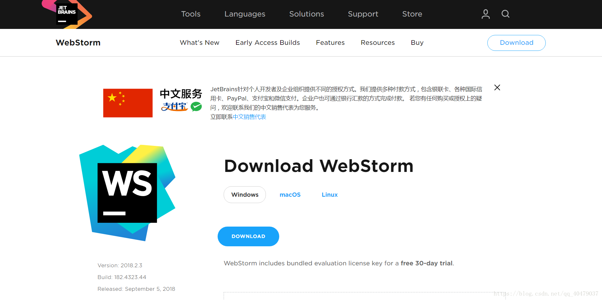

- 如果是其他版本可以选择

  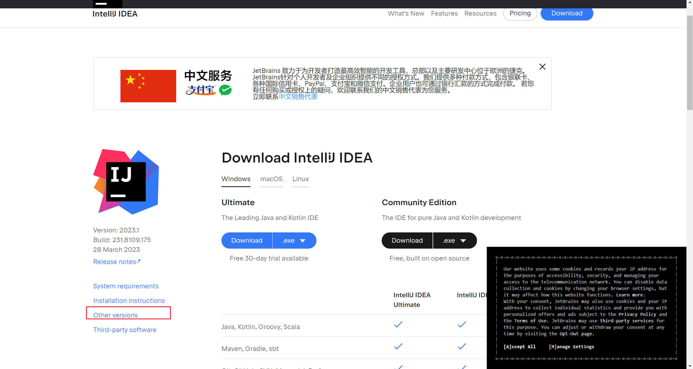

  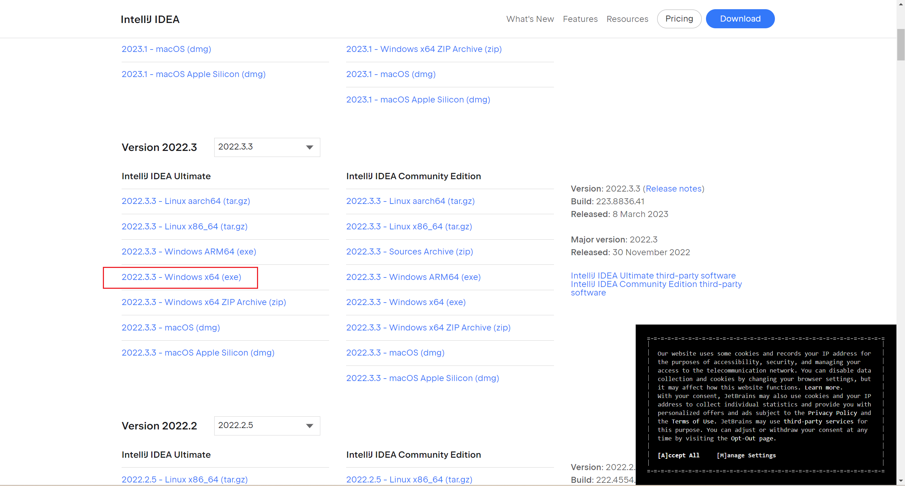

左下角，正在下载。

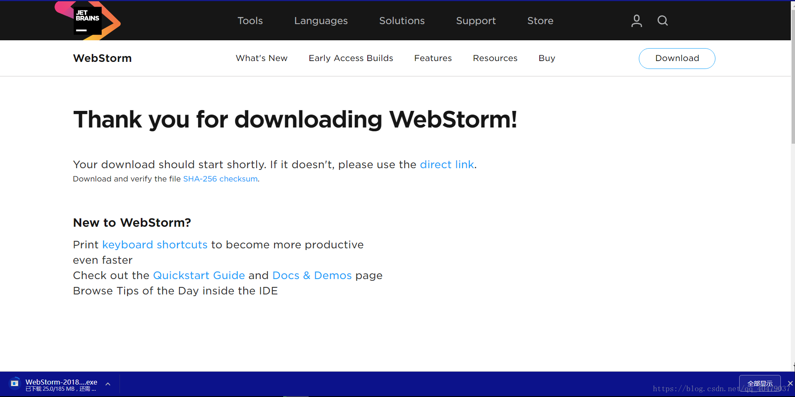

 这个就是安装程序了。 （如果有人找不到包在哪，我也没办法，从浏览器的下载管理器里看）

接下来跟着点就是了。。。 

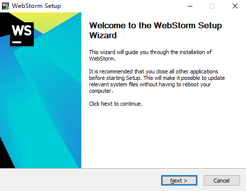

**一定要记住自己的安装位置，毕竟一会破解要用。（不是必须安装到C盘的软件）** 

**【盗来的图，将就着看吧】**

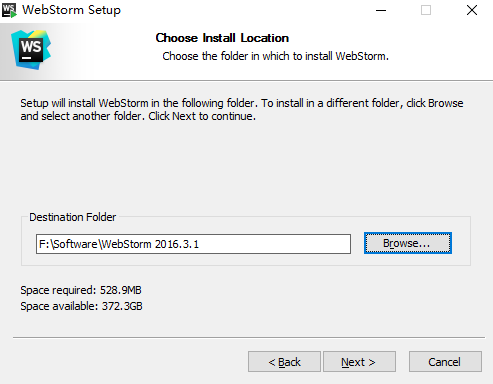

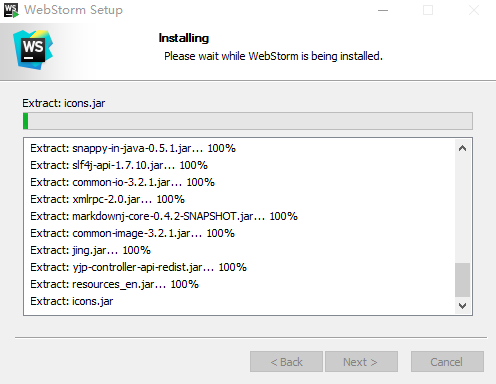

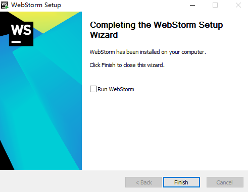

启动软件，估计都会在桌面上建快捷方式，如果没有，就到安装目录里找文件名为bin的

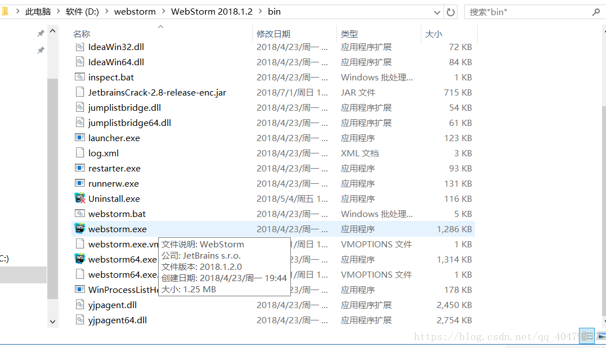

反正一会就会让你找。。。

**启动软件**

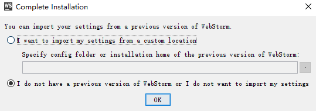

**下面会要求你激活，如果不激活的只有免费使用30天**

# 2. 激活

------

## 2.1 破解之前一定要开一次软件

### 1. 打开 https://3.jetbra.in/

选择合适结点，下载东西

这里我选择 https://cloudflare-ipfs.com/ipfs/bafybeiatyghkzrrtodzt3stm652rkrjxndg4hq2ublfdmifk7plg5k5brq/

贴破解包：

链接：https://pan.baidu.com/s/1hsxodu4KCVbcDEa1peurNQ?pwd=ji8h 
提取码：ji8h 

### 2. 下载破解包

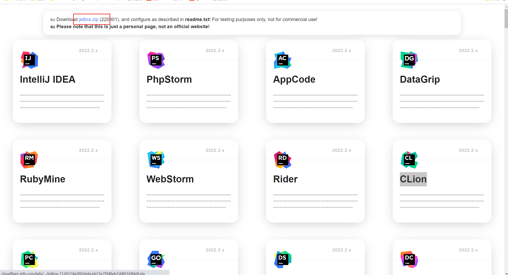

### 3. 将破解包放到合适位置

之后不能移动 `jetbra` 这个文件夹

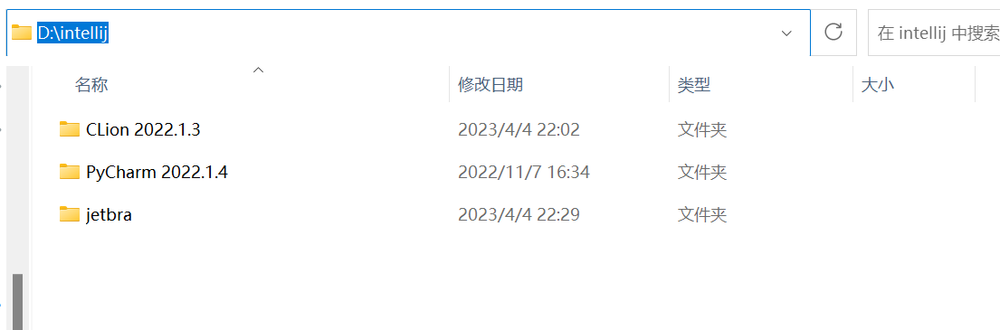

### 4. 运行脚本，替换一些文件

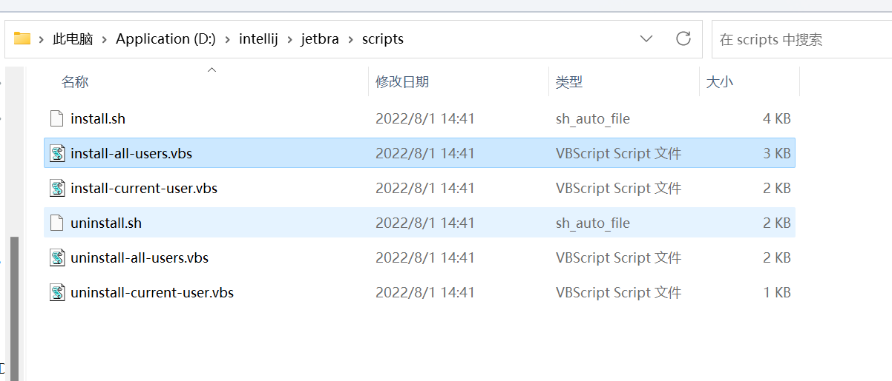

#### 5. 等待一会，会出现done的提示

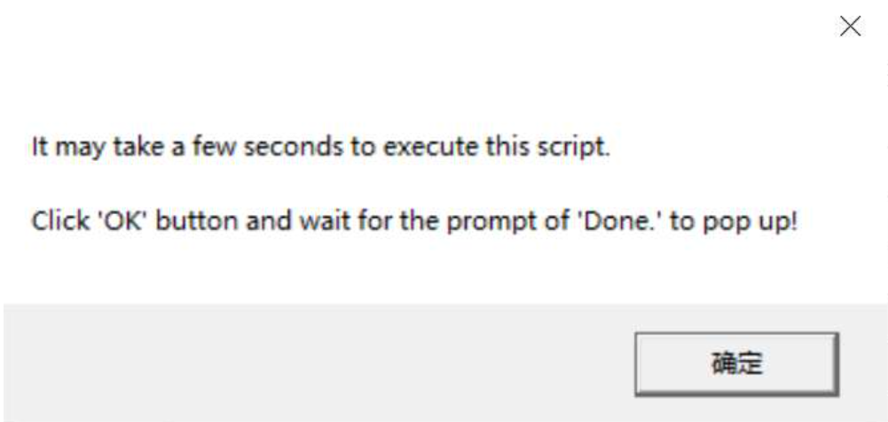

### 6. 打开要破解的软件，切换到激活码

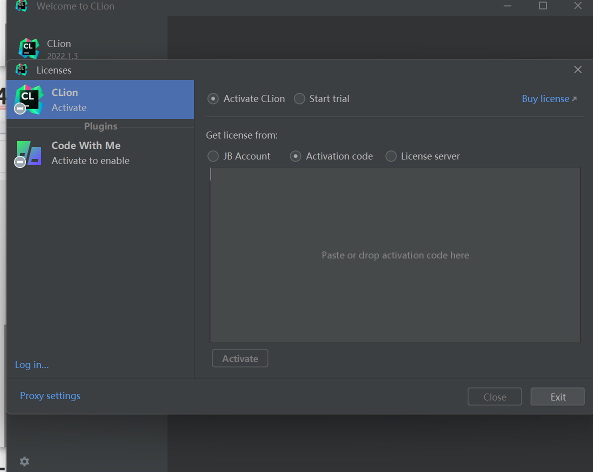

### 7. 找激活码，复制粘贴

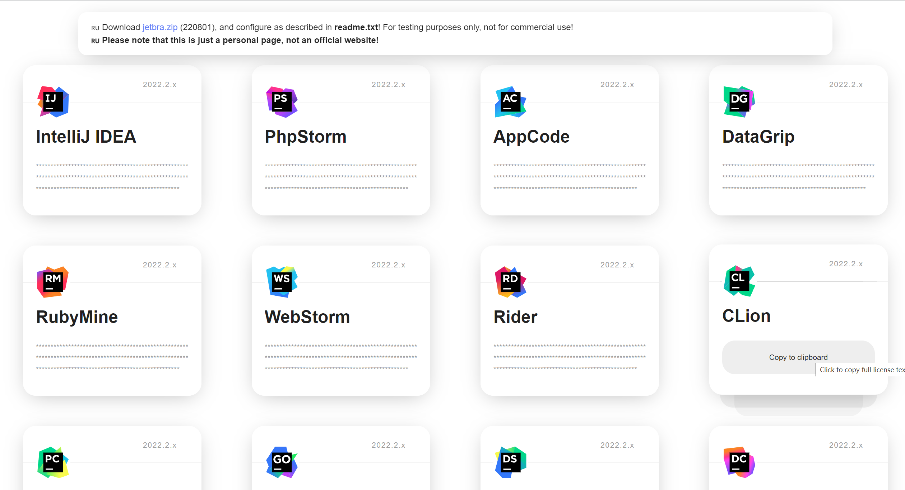

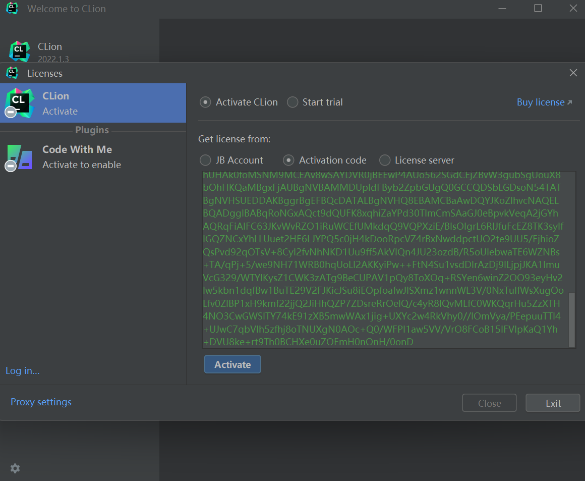

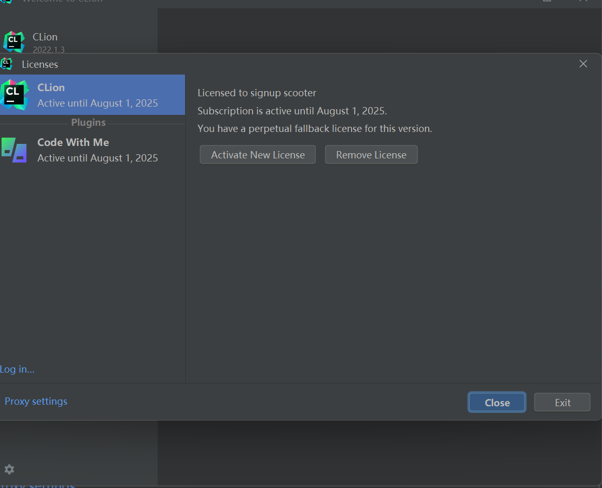