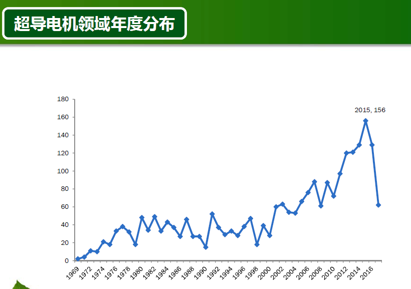
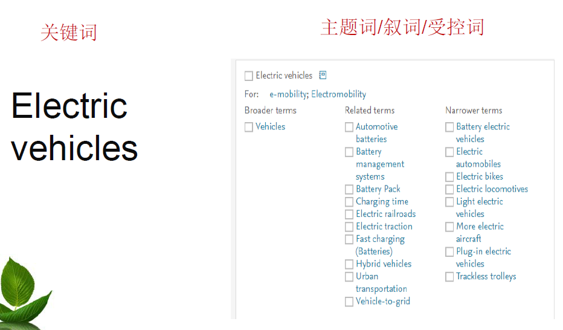

[TOC]

<!--more-->

## 1.1 什么时候用到信息检索

### 1.1.1 前沿跟踪

#### 保持在相应领域的与时俱进，因选题需要了解领域动态

解决方案：博览群书

- 新书
- 目次推送/信息推送
  - 个性化服务
  - 需要注册
  - E-mail 或 RSS推送
- 微信

注意事项：

- 数量少而精
- 目次推送：重点文献（期刊、会议或专利）
- 微信关注：重点人物、实验室；信息源的可靠性

#### 大型项目申报前

需求：

- 短时间把握领域热点
- 确定领域内的重点文献

解决方案：借助文献分析工具

- 基于文献计量、引用、聚类
  - 重点作者、实验室和机构
  - 高被引论文
  - 热点论文
  - 研究前沿
- 工具
  - 计量分析：数据库
  - 引用分析：SCI/ESI, Scopus/SciVal

### 1.1.2 立项开题

检索工具：

- 国际联机检索系统
- 文摘型检索工具
  - SCI
  - EI
  - Inspec

- 专业性较强的或大型的全文数据库
  - IEEE
  - Elsevier
  - Springer

- 谷歌/百度学术搜索

检索词：

- 确定检索主题
  - 找出核心关键词
  - 分解主题时，应做概念组配
  - 深入了解课题内容，挖掘更多核心关键词
- 扩展检索主题
  - 同近义词、下位词和相关词
  - 方法：主题词表、数据库测词、阅读综述文献
- 翻译检索主题
  - 最好源自于英文文献
  - 可借助翻译工具，但规避中国式英语
  - 注意中英表达差异
  - 慎用简称（通用的除外，如UAV，ECG，
    HTTP）
- 将检索主题转换为检索式
  - 截词检索、位置算符
  - 逻辑运算符
- 检索字段选择
  - 尽量不要使用all fields(所有字段)
  - 灵活利用不同的检索字段进行检索

检索策略(检索表达式)=检索词+检索技术

> 不断调整检索策略，实现最佳检索结果

### 1.1.3 研发过程

- 获得科学技术的新知识
- 创造性地运用科学技术新知识
- 探索技术的重大改进
- 开发创新性的产品、工艺和服务

信息需求

- 具体的技术与方法及其应用
- 同类产品及其性能、生产工艺等
- 关注文献中的内容-全文阅读
- 多种文献类型，如期刊论文、会议
- 论文、专利、标准等
- 多种信息来源，文献和网络信息
- 文献知识与数值数据兼而有之

全文数据库

- Elsevier
- Springer
- Wiley
- SPIE
- AIAA
- IEEE

图书馆馆藏

- 机构内图书馆
- 区域性图书馆
- 国家科技图书文献中心

网络资源

- 竞争对手网站
- 各国专利局网站
- 标准制定机构网站

参考工具书

- 世界竞争力年鉴
- 简氏世界铁路
- 国家预测报告

### 1.1.4 出版成果

- 规范写作
- 评审跟进
- 查重服务；查收查引服务；查新服务

## 1.2 信息检索概念

### 1.2.1 基本概念

广义：指将信息按一定的方式组织和存储起来，并根据信息用户的需要找出有关的信息过程，故全称：“信息的存储与检索(Information Storage and Retrieval ) 。

狭义：仅指上述过程的后半部分，即从信息集合中找出所需要的信息的过程，相当于人们通常所说的信息查（Information Search)。

### 1.2.2 检索类型

#### 特定文献检索

目的：找到特定文献的全文

重点：找到收藏该篇文献的来源渠道。

#### 指标检索

目的：查找特定的指标

重点：检索工具

- 国家标准馆：标准指标的揭示
- 文摘数据库：EI和INSPEC

https://www.nssi.org.cn/nssi/front/neirongzhibiao.jsp

#### 知识检索

目的：针对检索提问，给出计算后的答案。

重点：检索工具

- 计算引擎: https://www.wolframalpha.com/
- ChatGPT

https://www.wolframalpha.com/

#### 相关检索

目的：查找与特定主题相关的所有文献

**查全率和查准率**

### 1.2.3 检索技术发展历程

- 手工检索阶段(1876年-1954年)
- 脱机批处理检索(1954-1965)
- 计算机检索：联机检索(1965-1991)
- 计算机检索：网络化检索(1991-)

## 1.3 检索技术

检索词（中英文）：表达一个完整概念

一个检索词包括一个或多个汉字（单词)

- 电动汽车：电动/汽车，电/动/汽/车
- Electric vehicle: Electric/vehicle

### 1.3.1 截词检索

> 查全率

适用场景：英文单词，单复数、词性的词尾变化、词根相同的词、同一词拼法变异
- 中文数据库无截词检索

**截断位置**

- 右截断(后截断，前方一致)

  librar*: Library; libraries

- 中截断(中间屏蔽，词间截断)

  Propell?r : Propeller; propellor

- 左截断(前截断，后方一致）

  *ilingual: Bilingual; trilingual

**截断字符数量**

- 无限截断

  `librar*` : Library; `libraries*`

  `*ilingual`: Bilingual; trilingual

- 有限截断(中间屏蔽，词间截断)

  Propell?r : Propeller; propellor

**自动截词**

以所输入词的词根为基础的所有派生词

- 用户输入：management

- 系统检索：managing, managed, manager, manage, manager, managers

**注意**

- 不同数据库的截词规则和算符不尽相同
- 如何截词：将所有单词形式写出来，从不一致的位置开始截取

### 1.3.2 位置检索

> 查准率

**适用场景**：一个检索词包括多个单字或单词

位置算符：为了表达各个检索词之间的相对顺序

- 用位置算符连接两个单词，两词的相互位置必须符合规定的相邻度才能被命中检出。
- 位置算符主要用于限定两词间的位置关系，提高查准率。
- 不同的检索系统其位置算符的表示方法不尽相同。

确定性以太网Deterministic Ethernet

如：

- Deterministic Real-Time Ethernet；
- Deterministic Communication of Ethernet
- Deterministic communication using Ethernet
- Ethernet based on Deterministic network

### 1.3.3 短语检索

> 查准率

固定词组检索

- 在检索屏幕上选择［短语检索］或者［phrase search］
- 用双引号（“”）将检索词引起来
- 精确或模糊短

相关检索中，一般不建议使用短语检索来限定两个词的位置，以免影响查全率。但是，可以用于单个词，避免自动截词的影响，提高查准率

Train

- Train, trains, training, trained
- “Train” or “Trains”

### 1.3.4 布尔检索

> 查准率

应用场景：

- 同一个提问涉及多个检索词（中英文）
- 同一个检索词涉及多个单词（英文）

布尔逻辑运算符：在检索过程中用于表达词与词之间的逻辑关系的算符。

逻辑与：AND

- A AND B：检索词A和检索词B同时出现在一条记
  录中。
- 其作用是缩小检索范围，提高查准率。

逻辑或：OR

- A OR B：记录中出现检索词A或检索词B
- 作用：扩大检索范围，提高查全率

逻辑非：NOT

- A NOT B：记录必须包含检索词A但不能包含检索词B

默认优先次序：NOT > AND > OR

- ( )号里的部分运算优先
- (A OR D) AND B

- 各个数据库的优先顺序都不一样：检索界面上罗列着多个检索框，允许多个逻辑运算符同时运行，可能会出错（数据库操作）

- **布尔逻辑由词与词之间的关系来确定，不能调整**
  - **两个不同的概念：AND**
  - **同近义词：OR**

- 不用NOT，影响查全率

### 1.3.5 字段检索

> 查全率和查准率

#### 字段

字段（Field）文献数据库：每个字段描述文献的某一特征,多个字段集合组成一条记录。

- 外部特征：作者、作者机构、基金项目、来源出版物等

- 内容特征：
  - 检索词：标题、关键词和摘要（最常用）；主题（复合字段）
  - 代码标识：如：分类号；WOS号
    - CNKI：中图分类号
    - 专利：IPC分类号（推荐）

#### 字段检索

> 查准率

字段检索：又称为限制检索，通过限制检索词在记录的不同字段位置，来提高检索的查准率。

- 常用字段：主题（subject, topic等）
- 复合字段：同时检索多个字段，方便，其复合的字段相关性差异不大
  - 一般包括标题、关键词和摘要
  - 是否采用，视情况而定
  - 慎重使用复合字段，包括all fields(所有字段)
  - 了解各个数据库的每一个字段及其含义
    - 关注特色字段（专业的编排方式）
  - 标题/关键词/摘要/主题：文献的相关性不一
- 相关性差异不大
  - 标题、关键词和摘要(标题>关键词>摘要)

限制符：用于高级检索或专家检索；不同数据库的限制符不尽相同

#### 主题词/叙词/受控词

- 揭示概念之间的等同关系
  - 土豆；马铃薯；洋芋
- 揭示概念之间的从属关系
  - 微量元素：铜、铁、锌
- 揭示概念之间的相关关系
  - 电动汽车与电池管理系统

- 建议使用“标题”、“关键词”、“主题词（受控
  词或叙词）”字段
  - 标题、关键词：自行输入；需要运用上述的检
    索技术
  - 主题词（受控词或叙词）：在词表中勾选，无
    需其它检索技术

**对比**

建议：

- 文摘数据库：关键词检索OR 主题词检索
- 其它数据库：关键词检索