[TOC]

<!--more-->

## 2.1 检索工具

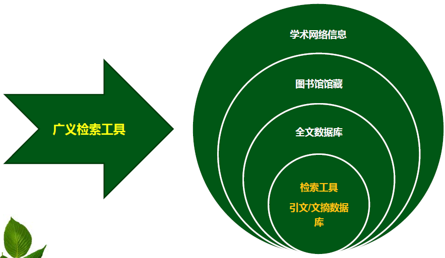

检索工具：用于存储、查找和报道信息的系统化文字描述工具，是目录、索引、指南等的同城

- 收录的资源经过遴选，有**质量保证**(SCI,EI收录)
- 详细描述文献的 **内容特征** 和 **外表特征** （节省阅读时间）
- 每条文献记录必须有 **索引标识**
- 文献条目按 **一定顺序** 形成一个有机整体
- 往往具有 **专业特色** 的组织编排方式

检索前了解检索工具
获取到的文献类型
数据库体量
五种检索技术


### 2.1.1 分类

#### 题录&文摘

**题录数据库** ：提供重要的信息项（书名，刊名，篇名、主
题、人名、地名等），按一定方式编排(字顺关系、引文关系)，并指明出处（年卷期）

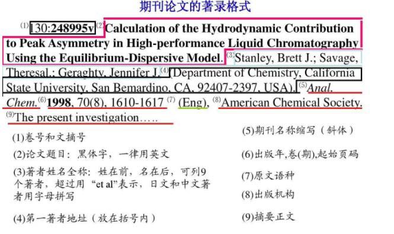

**文摘数据库** ：提供以上索引信息，并提供文献摘要。

- 需要更大篇幅，但可以提供更多相关信息

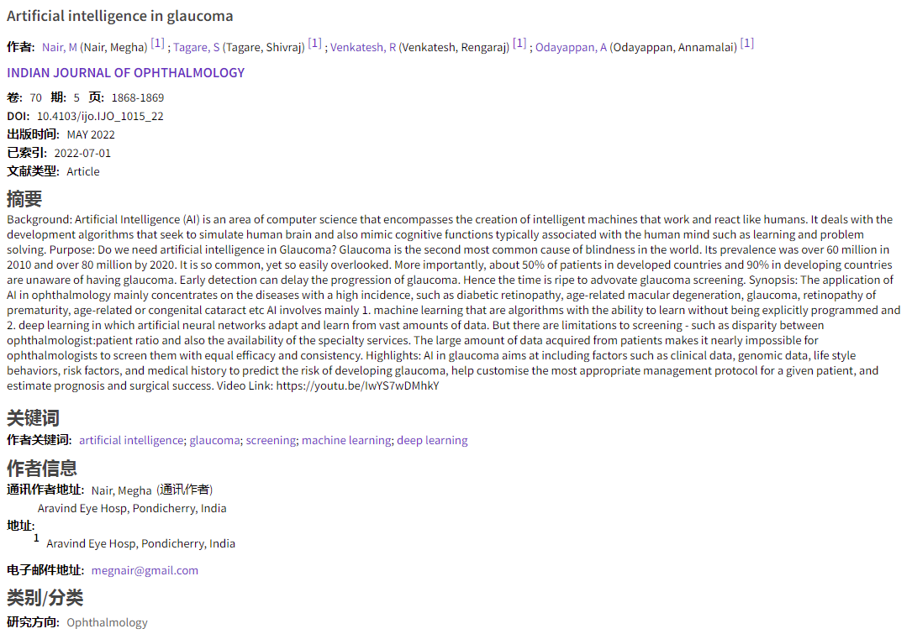

#### 组织方式

**基于字顺组织的数据库** （相对单一的学科领域）

- **基于文献信息某方面的特征**，如主题词、著者、分类号等，提供检索文献的途径，**能够获取相关文献的题录信息和文摘信息**。

- EI，CA，Medline

**基于引文关系组织的数据库** （较宽泛的学科领域）

- **基于文献之间的相互引用关系**，满足用户检索科技文献的需求。通过引文检索功能可查找相关研究课题早期、当时和最近的学术文献。

- SCIE，SSCI，SCOPUS，CSSCI，CSCD

#### 出版方式

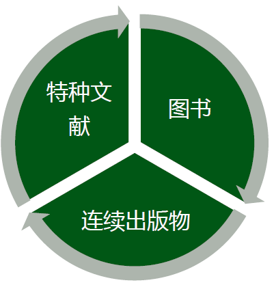

**图书**

> 48页以上，不定期出版，以印刷形式单本刊行的出版物

- 阅读类图书：教科书、专著、论文集等
- 参考类图书：参考工具书，如百科全书、手册等

图书的检索与获取途径

- 国家图书馆
- 大英图书馆
- 美国国会图书馆
- 哈佛大学图书馆
- 哥伦比亚大学图书馆

**连续出版物**

具有统一的题名，定期或不定期以连续分册形式出版，有卷期或年月标识，并且计划无限期地连续出版。

- 期刊
- 报纸
- 年鉴：以年为限、逐年出版，系统概述上年度有关事物或学科的进展情况，汇集有关重要文献及统计资料的资料性工具书。

连续出版物的检索与获取途径

- 期刊：有众多检索工具，也有丰富的获取渠道

  - 文摘数据库：EI/INSPEC

  - 引文数据库：SCI/SSCI/CSCD

  - 替代方案：专业性较强的或大型的全文数据库（IEEE/Elsevier）

- 报纸：没有专业检索工具，但有以下获取途径

  - 国家图书馆

  - 人民日报+光明日报（自建数据库）

  - 北京印刷学院图书馆

- 年鉴：没有检索工具，有部分作为政府官网查询

**特种文献**

出版发行和获取途径都比较特殊的科技文献

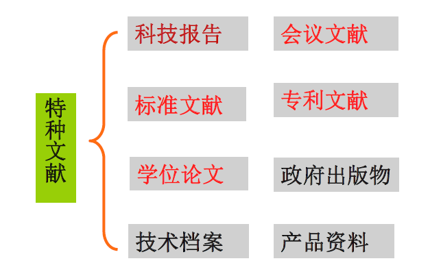

特种文献的检索与获取途径

- 科技报告：没有检索工具，但有以下获取途径
  - 美国四大套科技报告：NTIS网站
  - 中国科技报告：国家科技报告服务系统https://www.nstrs.cn/index
- 会议文献：有检索工具
  - CPCI(会议录)
  - EI（会议论文）
- 专利文献：有检索工具
  - 德温特专利索引
  - 各国专利局网站
  - 专利分析工具

- 标准文献：有检索工具
  - Perinorm (标准)：中国标准化研究院
  - 国家标准馆；ISO/IEC网站
- 学位论文：没有专业检索工具，但有以下获取途径
  - 国家图书馆、万方、CNKI
  - PQDT博硕士论文库
- 政府出版物：没有专业检索工具，但有以下获取途径
  - 各政府机构网站
- 产品说明：没有专业检索工具，但有以下获取途径
  - 行业博览会；产品展销会
- 技术档案：通过机构内部的系统或程序获取

### 2.1.2 科技文献系统

三大科技文献检索系统

- 科学引文索引（Science Citation Index），更名为Science Citation Index-Expanded (SCIE）
- 工程索引（Engineering Index）
- 科技会议录索引（Index to Scientific & Technical Proceedings），更名为Conference Proceedings Citation Index - Science（CPCI-S）

#### SCI

世界著名的三大科技文献检索系统，是国际公认的进行科学统计与科学评价的主要检索工具,其中以SCI最为重要

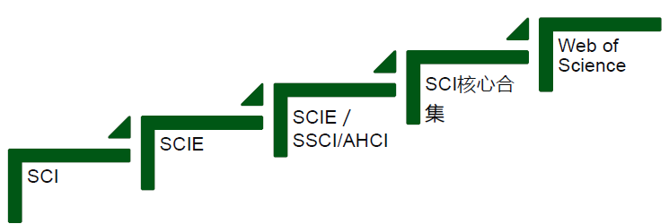

**SCI**

- 编辑出版：美国科学信息研究所
- 出版形式：印刷版，光盘版及联机数据库和Web版数据库
- 学科范围：数、理、化、农、林、医、生命科学、天文、地理、环境、材料、工程技术收录期刊：约3500种
- ISI通过它严格的选刊标准和评估程序挑选刊源，而且每年略有增减

**SCIE**

- Multidisciplinary index to the journal literature of the sciences
- Fully covers major journals across 178 scientific disciplines
- includes all cited references captured from indexed articles.
- SCI的web版联机数据库
- 涵盖9000多种期刊，远远超出原来的3000多种

**SCIE/SSCI/AHCI**

- Science Citation Index Expanded (SCIE) 1900 – Present
- Social Sciences Citation Index (SSCI) 1900 – Present
- Multidisciplinary index to the journal literature of the social sciences
- Fully covers journals across 58 social sciences disciplines
- Includes all cited references captured from indexed articles.
- Arts & Humanities Citation Index (AHCI)1975 – Present
- Multidisciplinary index to the journal literature of the arts and humanities across 28 arts & humanities disciplines.

**SCI核心合集**

Web of Science Core Collection

- Science Citation Index Expanded (SCIE)
- Social Sciences Citation Index (SSCI)
- Arts & Humanities Citation Index (AHCI)
- Emerging Sources Citation Index (ESCI)
- Conference Proceedings Citation Index (CPCI)
- Book Citation Index (BKCI)

**Web of Science**

为获得最为全面的检索结果，可通过一组共有的检索字段同时检索所订阅的全部资源。

#### CPIC

Conference Proceedings Citation Index (CPCI) 1990 – Present
The Conference Proceedings citation indexes include the published literature of the most significant conferences, symposia, seminars, colloquia, workshops, and conventions in a wide range of disciplines. They cover journal and book-based proceedings in science, social sciences, and humanities across 256 disciplines. Use these indexes to track emerging ideas and new research in specific fields.

#### EI

美国工程索引（Engineering Index，EI）

挂靠平台：Engineer Village平台，属于Elsevier公司

#### Inspec®

挂靠平台：WOS平台/Engineer Village平台

前身是科学文摘（Science Abstracts，1898-1968）。

- 编辑出版：英国电气工程师协会（Institution of
  Electrical Engineers，IEE）
- 时间范围：1969-至今
- 学科范围：物理学、电气工程、电子、通讯、控制工程、计算机科学、机械工程、信息技术、制造和生产工程
- 特定领域：材料科学、海洋学、核工程、地球物理学、生物医学工程和生物物理学。

#### 德温特专利索引（DII）

Derwent Innovations Index

- 起源于1963年，其将原来的德温特世界专利索引（WPI）与专利引文索引（PCI）加以整合，成为世界上国际专利信息收录最全面的数据库之一。
- 人工编辑的英语标题和摘要：汤森路透技术专家在仔细阅读专利原文后，用英语改写的描述性专利标题和文摘。

#### 中国科学引文数据库(CSCD)

Chinese Science Citation Database （CSCD）

创建时间：1989年

学科范围：数学、物理、化学、天文学、地学、生物学、农林科学、医药卫生、工程技术、环境科学和管理科学期刊数量：千余种

数据量：论文记录5982435 条，引文记录92705879 条。

功能：常规的检索功能，引文索引功能，提供了数据链接机制，支持用户获取全文。

#### 中文社会科学引文索引(CSSCI)

Chinese Social Sciences Citation Index（CSSCI）

研制机构：南京大学中国社会科学研究评价中心

主要功能：检索中文人文社会科学领域的论文收录和被引用情况

期刊遴选：从全国2700余种中文人文社会科学学术性期刊中精选出学术性强、编辑规范的期刊作为来源期刊。

学科范围：法学、管理学、经济学、历史学、政治学等在内的25大类

期刊数量：500多种学术期刊

## 2.2 检索过程

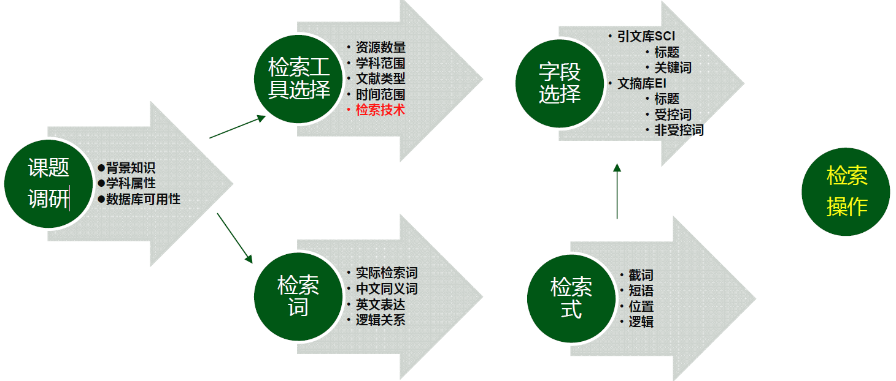

1. 分析信息检索需求
2. 选择检索工具
3. 制定检索策略
4. 基于检索结果调整检索策略
5. 获取并整理检索结果

### 2.2.1 分析信息检索需求

- 确定全面正确的检索词
- 符合计算机检索的默认规则

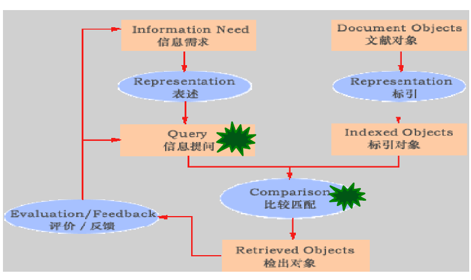

#### 检索目的

- 申请专利
- 了解某一学科的最新进展
- 撰写综述
- 编写教材

#### 内容特征

根据

- 背景知识
- 学科范围
- 主要检索词及其相互关系
- 相关名词术语

确定检索词

#### 形式特征

- 语种
- 年限
- 文献类型
- 数量

#### 检索词确定

> 检索词：表达信息需求和检索课题内容的基本单元，体现检索课题的主要内容

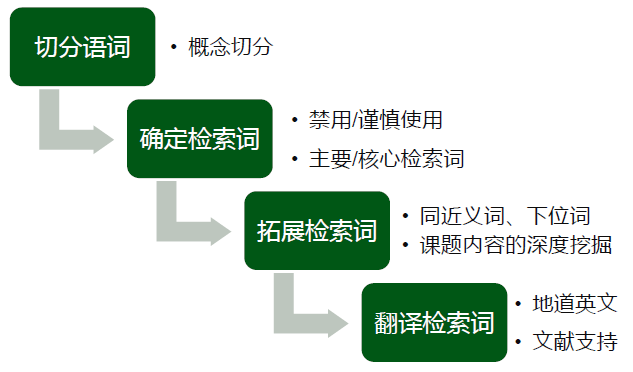

##### 切分词语

- $概念切分\neq 字面切分$

  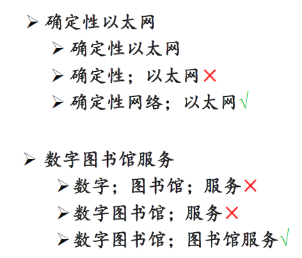

##### 确定检索词

- 禁用：
  - 英文：介词、冠词、连接词、感叹词（an and；for；by；from；of；the； to；with ）
  - 通用词汇：方法、问题、报告、研究、探讨
- 慎用：特点、模式、机制、优化、对比、案例分析。。。（影响查全率）
  - 具有一定的实际意义
  - 如标题中包含以上词汇，就一定有相关内容
  - 标题中不包含以上词汇，也可能有相关内容
  - 适用情境：只强调查准率，对查全率没有要求

**核心检索词**：体现检索课题的研究问题

**主要检索词**：具有实际检索意义

需要基于自身掌握的背景知识划分检索词

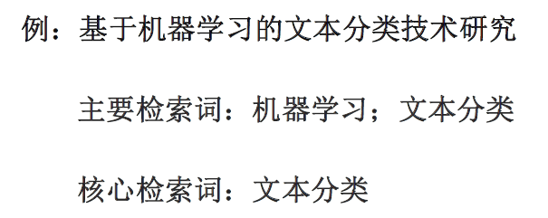

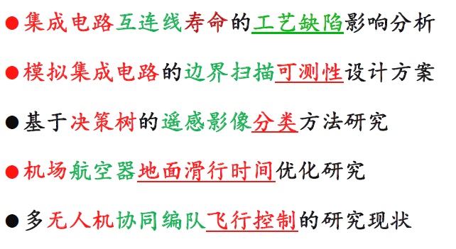

##### 拓展检索词

来源：

- 查看数据库测词

  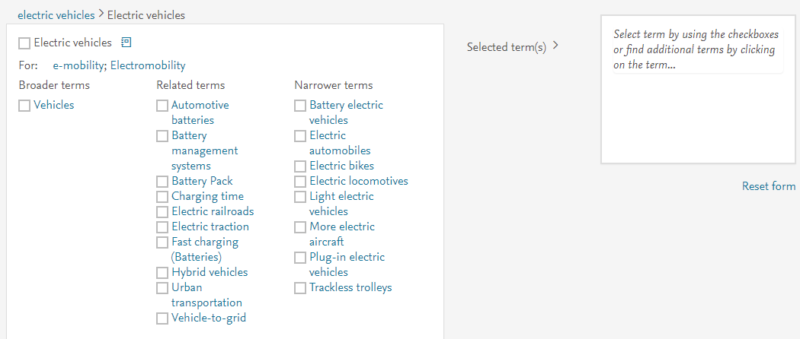

- 查看主题词表

- 查看参考文献（综述）

- 阅读相关文献

方法：

- 找一篇非常相关的综述文献
- 查看其参考文献标题
- 从标题中查找意义相近的词

深层次需求：

- 基于特定需求
- 课题背景内容的深度理解

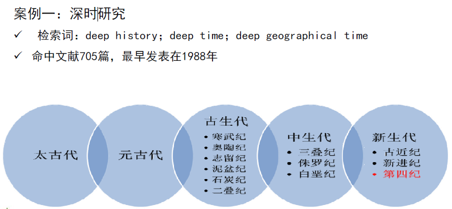

- 深时：指第四纪前，都可以作为主要检索词

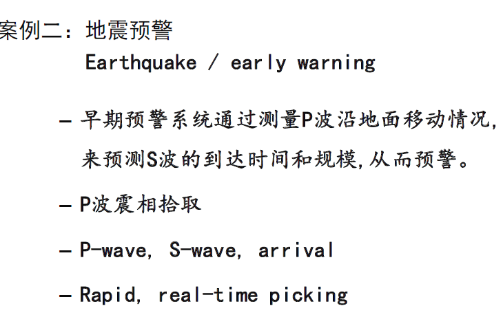

- 地震发生后会有P波与S波，所以这两种波也可以作为检索词

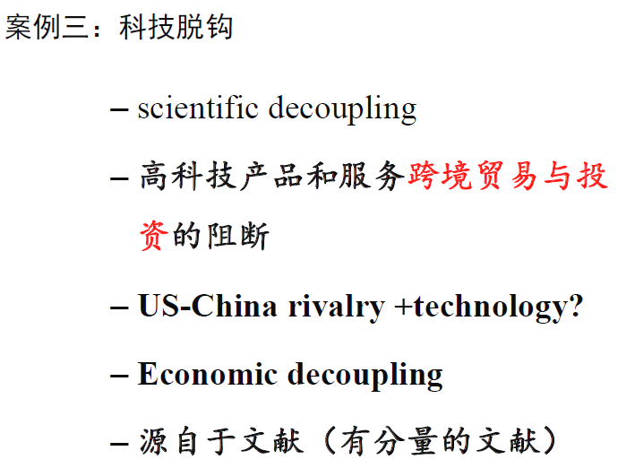

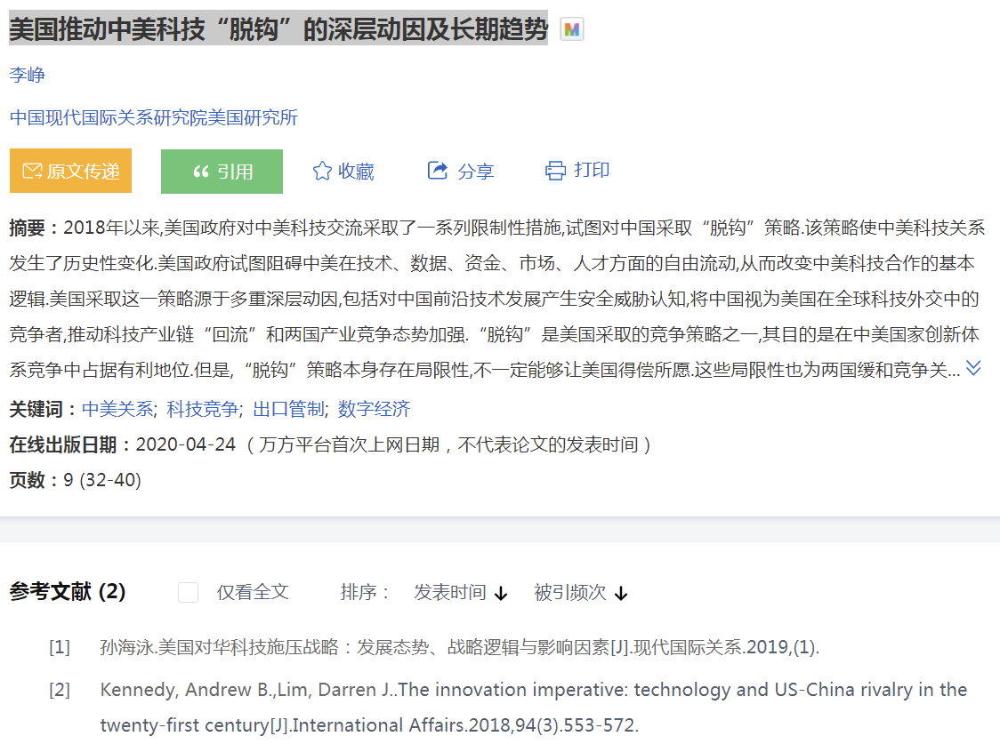

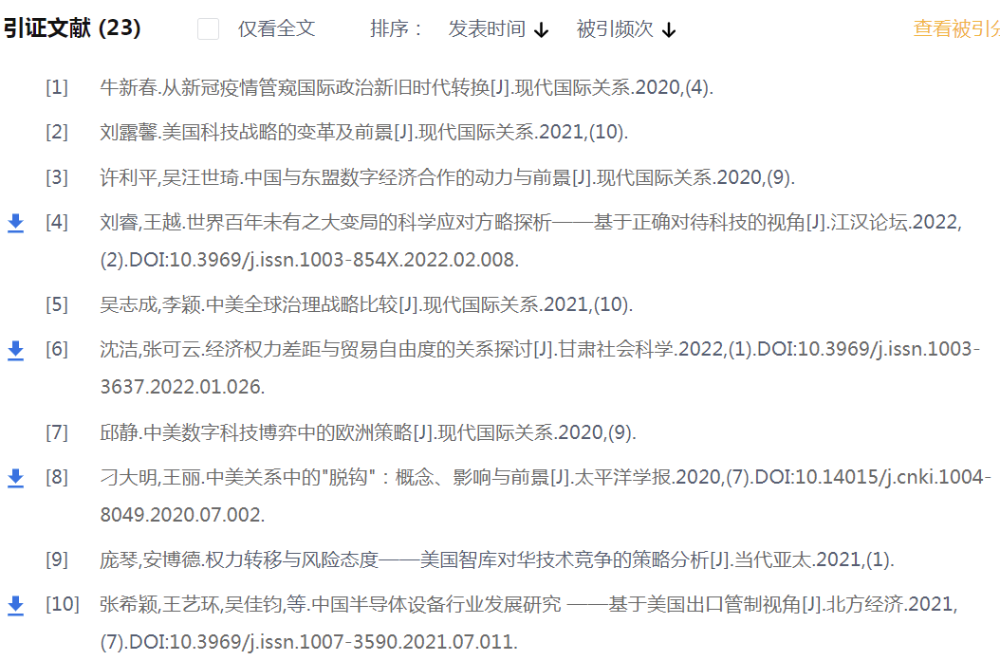

##### 翻译检索词

获取检索词的翻译结果：

- 精确翻译（字面翻译）：

  - 搜索引擎：短语检索
  - 词典：英英释义
  - 数据库：命中结果数量

  注意用词准确：

  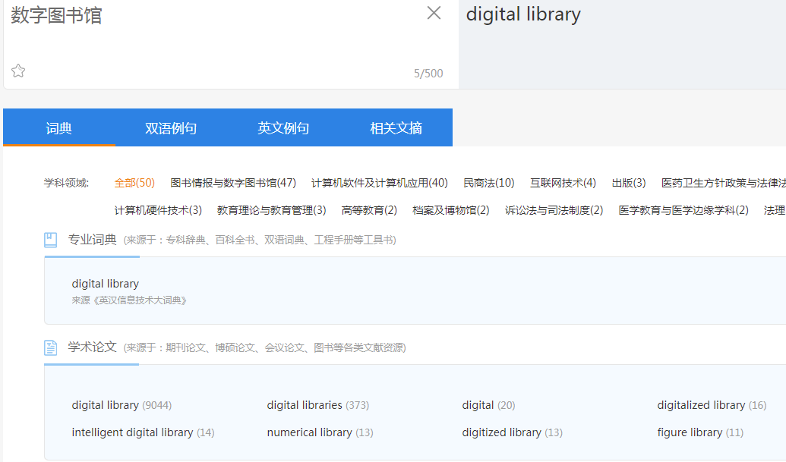

  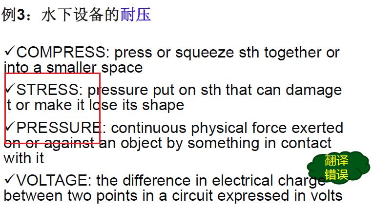

- 中英表达差异

  - 命中文献的计量分析
  - 命中文献中相关表达
  - 一词多义

  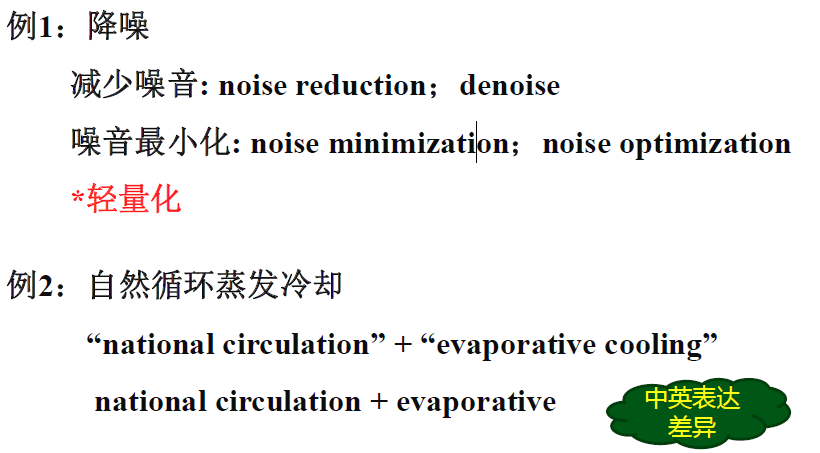

  上图中，减少的也能用轻量化代替；蒸发冷却，在英文中只需要翻译蒸发，冷却是必然的

- 慎用英文简称
  - 可用：通用简称，如UAV，ECG，HTTP
  - 非通用：数据库测词

### 2.2.2 选择检索工具

基于信息检索的需求，选择合适的检索工具

- 主题相关性
- 文献类型
- 检索工具的可获得性

选定检索工具后，需要了解检索工具的相关技术及使用方法(帮助手册)

- 历史沿革；研发机构
- 资源收录情况
  学科主题；文献类型；语言种类；年代跨度
- 检索方式
  主要检索途径和相应功能
- 标引方式
  使用的分类表和主题词表

### 2.2.3 拟定检索策略

检索策略=检索词+检索技术

```
IPC=(B01D21/01 OR C02F1/48 OR C02F1/52
OR C02F9/12) AND TIABC=((煤OR COAL) (2N)
(采OR 矿OR 井OR EXCAVAT* OR MINE OR
MINING OR PRODUCTING))

字段检索
布尔检索
位置检索
截词检索
```

### 2.2.4 检索结果相关性判定

1. 突出显示为不同颜色
2. 出现频率高
3. 出现在标题位置
4. 出现在摘要的前两句话

## 2.3 检索实例

### 2.3.1 分析信息检索需求

1. 主要关键词

   水下机器人（海洋机器人；无人遥控潜水器；遥控潜水器；无人潜航器；无人潜水器；自治潜水器）；推进器

2. 核心关键词

   推进器或推进

3. 英文关键词

   水下机器人：underwater robot; unmanned underwater vehicles; autonomous Underwater vehicles; unmanned marine vehicles

   推进器：propeller; propellor; propulsor; thruster; propulsion system

### 2.3.2 选择检索工具

学科

文献类型

文献数量

起止时间

检索算符

- 注：检索工具远远不止SCI；SCI不能满足所有的文献需求

### 2.3.3 制定检索策略

水下机器人：underwater robot; unmanned underwater vehicles; autonomous Underwater vehicles; unmanned marine vehicles

推进器：propeller; propellor; propulsor; thruster; propulsion system

**位置检索**

- 水下机器人：

  underwater NEAR/2 robot; unmanned NEAR/1 underwater NEAR/1 vehicle; autonomous NEAR/1 Underwater NEAR/1 vehicles; unmanned NEAR/1 marine NEAR/2 vehicles

- 推进器：

  propeller; propellor; propulsor; thruster

**截词检索**

- 水下机器人：

  ```
  underwater NEAR/2 robot*; unmannedNEAR/1 underwater NEAR/1 vehicle*; autonomous NEAR/1 Underwater NEAR/1 vehicle*; unmanned NEAR/1 marine NEAR/1 vehicle*
  ```

- 推进器：

  ```
  Propell?r; propulsor; thruster
  ```

**布尔检索**

```
#1：underwater NEAR/2 robot OR unmanned NEAR/1 underwater NEAR/1 vehicle OR autonomous NEAR/1 Underwater NEAR/1 vehicles OR unmanned NEAR/1 marine NEAR/2 vehicles
#2：propell?r OR thruster OR propuls*
#3：#1 AND #2
```

**字段检索**

> 标题(TI)+关键词(AK)

```
(TI＝((underwater NEAR/2 robot) OR (unmanned NEAR/1 underwater NEAR/1 vehicle) OR (autonomous NEAR/1 Underwater NEAR/1 vehicles) OR (unmanned NEAR/1 marine NEAR/2 vehicles)) AND (propeller OR thruster OR propuls*) OR (AK＝((underwater NEAR/2 robot) OR (unmanned NEAR/1 underwater NEAR/1 vehicle) OR (autonomous NEAR/1 Underwater NEAR/1 vehicles) OR (unmanned NEAR/1 marine NEAR/2 vehicles)) AND (propel?r OR thruster OR propuls*)
```

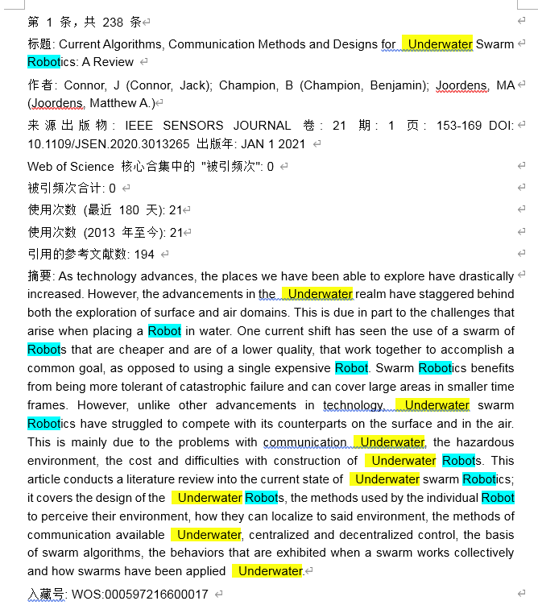
