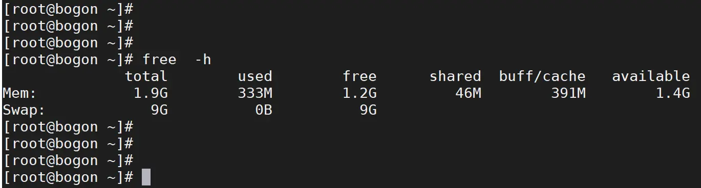

[TOC]

<!--more-->

## free

用于显示系统内存的使用情况

- 物理内存Mem
- 交换内存Swap
- 内核缓冲区内存(buffer/cache)

```shell
free -m	#以MB为单位显示输出内容
```



Mem：内存使用信息

Swap：交换空间使用信息

---

- total：系统总的物理内存

- used：系统已使用的物理内存（包含共享内存）

- free：系统剩余的物理内存

- shared：被共享使用的内存

- buff / cache：缓存/缓冲使用的内存

- available：还可为新进程分配的物理内存

  一般比未使用内存 free 大一些，因为还包括可回收的缓存，但正在被使用的缓存不可被回收，所以也小于 `free + buff/cache`

```
total = used + free + buff/cache
buff/cache = buffers + cache
available = free + buff/cache - 不可释放的部分
```

### buff / cache

**体系结构分层结构的设计思想** ：计算机科学领域的任何问题都可以通过增加一个间接的中间层来解决

硬件由于制作工艺上的不同，不同硬件读写速率有显著差异。

所以内存作为高速的CPU与低速磁盘间的中间缓存层，让中间层能够抹平双方的读写速率差异

```shell
man free
# buffers Memory used by kernel buffers (Buffers in /proc/meminfo)
# cached Memory used by the page cache and slabs (Cached and SReclaimable in /proc/meminfo)
```

- buffers 是内核**缓存**区用到的内存，对应的是 */proc/meminfo* 中的buffers 值

- Cache 是内核页**缓存**和 Slab 用到的内存，对应 */proc/meminfo* 中的 Cached与SRecalimable 的和

  */proc/meminfo* 是Linux内核提供的一种特殊文件系统，是用户与内核交互的接口，用户可以从 */proc* 中查询内核的运行状态和配置，查询进程的运行状态、统计数据等，也可以通过 */proc* 修改内核配置

  `free` 是通过读取 */proc/meminfo* 得到内存的使用情况。

```shell
man proc# 获取proc文件系统的文档
```

- Buffers 是对磁盘块的临时存储，作为 **从磁盘的数据缓存、将数据写入磁盘的缓存**，通常不会特别大，内核将分散的写集中起来，统一优化磁盘的写入；将多次小的写合并成单次大的写
- Cached 是从磁盘对文件的页缓存，作为 **从文件读取数据的页缓存、将数据写入文件的页缓存** 。下次访问这些文件数据时，直接从内存中获取，不需要再次访问磁盘
- SReclaimable 是 Slab 的一部分。Slab包括两部分：SReclaimable记录可被回收的部分；SUnreclaim记录不可被回收的部分


