[TOC]

<!--more-->

# 常用命令

## 文件(目录)命令

### ls

#### ls通配符

| 通配符 | 含义                                      | 示例                                                         |
| :----: | :---------------------------------------- | ------------------------------------------------------------ |
|  `*`   | 表示任意个数字符                          | `ls te*` 查找以te开头的文件<br />`ls *html` 查找以html开头的文件 |
|  `?`   | 代表任意一个字符，至少一个                | `ls ?.` 查找第一个字符任意，后缀为.c的文件<br />`ls a.?` 只找前2个字符为a.，最后一个字符任意的文件 |
|  `[]`  | 表示可以是字符组 的任意一个，`-` 表示范围 | ls [abc]匹配a、b、c的任意一个字符<br />ls [a-f]匹配从a到f的任意一个字符开头的文件<br />ls [a-f]*找到从a到f范围内的任意一个字符开头的文件<br />ls a-f：查找文件名为a-f的文件，当-不在 `[]` 内，失去统配作用 |


### 修改文件内容

|        命令         | 对应英文 | 含义             |
| :-----------------: | :------: | :--------------- |
|                     |          |                  |
|                     |          |                  |
| grep 搜索文本文件名 |   grep   | 搜索文本文件内容 |

#### grep

> 文本搜索工具，对文本文件进行模式查找。如果找到匹配模式， grep打印包含模式的所有行。

`grep [-option] 搜素内容串 [文件名]`

| 选项 | 含义                             |
| :--: | :------------------------------- |
|  -n  | 显示匹配行及行号                 |
|  -v  | 显示不含匹配文本的所有行(-n取反) |
|  -i  | 忽略大小写                       |

允许对文本文件进行正则查找

| 选项 | 示例          | 含义                                                      |
| ---- | ------------- | --------------------------------------------------------- |
| ^    |               | 行首匹配                                                  |
|      | ^a            | 搜索以a开头的行                                           |
| $    |               | 行尾匹配                                                  |
|      | ke$           | 匹配以ke结尾的行                                          |
| []   |               | 匹配[]中的任意一个字符                                    |
|      | [Ss]ignal[Ll] | 相当于搜索包含单词signal、signaL、Signal、SignaL的行      |
| .    |               | 匹配非换行符的占位符                                      |
|      | e.e           | 匹配e和e中间有一个字符的行<br />匹配e*e，但不匹配ee，e**e |


### echo

> `echo` 会在终端显示参数指定的文字，通常和 **重定向** 联合使用

- 若重定向的文件不存在，则新建文件并写入内容

### 重定向

1-Linux允许将命令执行结果重定向到一个文件，将本应在中断上输出的内容 **追加/输出** 到指定文件中

其中

- `>` ：表示输出，会覆盖文件原有内容
- `>>` ：表示追加，将内容追加到已有文件的末尾

```shell
# test.txt如果不存在，则创建；若存在，则覆盖其内容
echo Hello World > test.txt #覆盖
cat test.txt

# 输出重定向会追加到文件尾部
echo Hello World >> test.txt #追加
cat test.txt
```

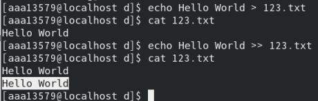

### 管道

> 多个连续命令分隔符

`|` ：一个命令的输出作为另一个命令的输入，进行二次处理

**常用管道命令**

- `more` ：分配显示内容
- `grep` ：在执行结果基础上查询指定文本

```shell
ls -lha | more
ls -lha | grep -i vi
```

### 清屏

```shell
clear 
```

### 计算文件行数或字数：wc

| 选项 | 参数 | 含义                                     |
| ---- | ---- | ---------------------------------------- |
| -l   |      | 统计行数                                 |
| -w   |      | 统计字数，字之间由空格、跳格或换行符分隔 |
| -c   |      | 统计字节数                               |
| -m   |      | 统计字符数，不能与-c同时使用             |

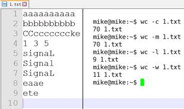


# 用户管理

## 基本概念

> 用户管理包括 `用户管理` 与 `组管理`

### 用户管理

- 可指定 **每一用户** 针对 **不同文件或目录** 的 **不同权限**

### 权限

| 权限 |  英文  | 缩写 | 数字代号 |
| :--: | :----: | :--: | :------: |
|  读  |  read  |  r   |    4     |
|  写  | write  |  w   |    2     |
| 执行 | excute |  x   |    1     |

#### 权限查看

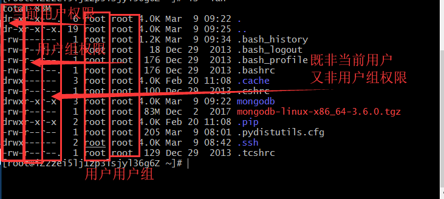

- **权限** 第一个字符如果是 d 表示目录

  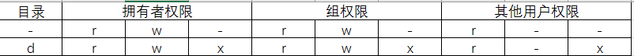

- **硬连接数** 多少种方式可访问当前目录/文件

- **拥有者** 家目录下 **文件/目录** 拥有者通常是当前用户

- **组**

- **大小**

- **时间**

- **名称** 

### 组

> 对组设置权限，将 **不同用户添加到对应组中** ，同属一个组的用户有相同权限，不用逐个为用户单独设置权限

### 超级用户

> `root` 账号通常用于 **系统维护和管理** ，对操作系统的所有资源具有访问权限

- 不推荐直接使用 `root` 账户登录系统
- 在1-Linux安装过程中，系统会自动创建一个标准用户账号

#### sudo

- **su** ：(substitute user) 缩写，表示切换用户

- `sudo` ：用来表示以其他身份执行命令，预设身份为 `root`
- 用户使用 `sudo` 时，必须先输入密码，之后五分钟的有效期，超过期限必须重新输入密码

未经授权的用户试图切换 `sudo` 会发出警告邮件

## 权限修改

- 文件拥有者默认有 **读/写** 权限
- 1-Linux中文本文件也可执行
- 目录有可执行文件才能执行

`chmod` 命令用于修改 **用户/组** 对 **文件/目录** 的权限

```shell
chmod +/-rwx 文件名/目录名

chmod -rw 01.py
chmod +rw 01.py

./01.py
```

## 组管理

> 创建 / 删除 组 需要通过 `sudo` 执行

|           命令            | 作用                      |
| :-----------------------: | :------------------------ |
|       groupadd 组名       | 添加组                    |
|       groupdel 组名       | 删除组                    |
|       cat/etc/group       | 确认组信息                |
| chgrp -R 组名 文件/目录名 | 递归修改 文件/目录 所属组 |

组信息保存在 `/etc/group` 文件中

`/etc` 目录用于保存系统配置信息的目录

```shell
mkdir Python学习
sudo groupadd study
sudo chgrp -R study Python学习
```

## 单用户

> 创建用户/删除用户/修改其他用户密码 都需要通过 `sudo` 执行

|             命令              | 作用         | 说明                                                         |
| :---------------------------: | :----------- | :----------------------------------------------------------- |
| useradd -m -g 组名 新建用户名 | 添加新用户   | -m 自动创建用户家目录 <br> -g 指定用户所在组，否则会创建一个同名的组 |
|         passwd 用户名         | 设置用户密码 | 普通用户，直接用passwd可以修改自己密码                       |
|       userdel -r 用户名       | 删除用户     | -r 自动删除家目录                                            |
|        cat /etc/passwd        | 确认用户信息 | 新建用户后，用户信息会保存在 `/etc/passwd` 文件中            |

创建用户时，如果忘记加 `-m` 指定家目录，最简单的方法就是删除用户重新创建

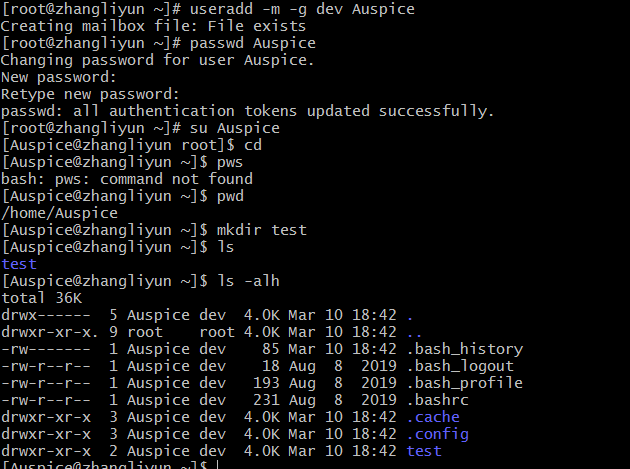

## 查看用户信息

|    命令     | 作用                       |
| :---------: | :------------------------- |
| id [用户名] | 查看用户UID和GID           |
|     who     | 查看当前所有登录的用户列表 |
|   whoami    | 查看当前登录用户的账户名   |

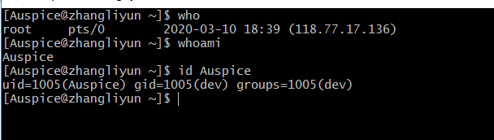

### id

> `id` 不加参数，则返回当前用户信息

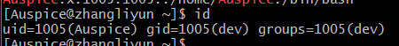

### passwd文件

> 在 `/etc/passwd` 文件中存放用户的信息

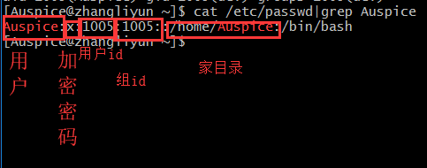

1. 用户名
2. 密码（x，表示加密的密钥）
3. UID（用户标识）
4. GID（组标识）
5. 用户全名或本地账号
6. 家目录
7. 登录使用的Shell，就是登录之后，使用的终端命令

## usermod

> 设置用户所属的组 （主组/附加组）和 登录shell

主组：新建用户时指定

附加组：用于指定用户的附加权限

```shell
# 修改用户的主组(passwd 中的GID)
usermod -g 组 用户名

# 修改用户的附加组
usermod -G 组 用户名

# 修改用户的登录Shell
usermod -s /bin/bash
```

## which

`/etc/passwd` ：用于保存用户信息文件

`/user/bin/passwd` ：用于修改用户密码程序

`which` ：查看执行命令所在的位置

```shell
which ls
# 输出
# /bin/ls

which useradd
# 输出
# /user/sbin/useradd
```

### /bin和/sbin

绝大多数可执行文件都保存在 `/bin` ，`/sbin` ，`/user/bin` ，`/user/sbin` 中

`/bin(binary)` 目录是二进制的可执行文件目录

`/sbin(system binary)` 是系统管理员专用的二进制代码存放目录，主要用于系统管理

`/user/bin(user commands for application)` 用于存放后期安装的软件

`/user/sbin(super user commands for application)` 超级用户的一些管理程序

## 用户身份切换

|    命令     |          作用           | 说明                 |
| :---------: | :---------------------: | :------------------- |
| su - 用户名 | -切换用户，并且切换命令 | 可以切换到用户家目录 |
|    exit     |    退出当前登录账户     |                      |

`su` 不接用户名，可以切换到 `root` 用户

## 修改文件权限

| 命令  | 作用       |
| :---: | :--------- |
| chown | 修改拥有者 |
| chgrp | 修改组     |
| chmod | 修改权限   |

```shell
# 修改文件|目录拥有者
chown 拥有者用户名 文件名|目录

# 递归修改文件|目录的组
chgrp -R 组名 文件|目录

# 递归修改文件权限
chmod -R 755 文件名|目录名
```

### chmod

```shell
# 直接修改 文件|目录 的 读|写|可执行， 但是不能精确到 拥有者|组|其他
chomd +/-rwx 文件名|目录名
```

> 在设置权限时，可以简单使用三个数字分别对应 **拥有者/组** 和 **其他** 用户权限

|      |      | 拥有者 |      |      |  组  |      |      | 其他 |
| :--: | :--: | :----: | :--: | :--: | :--: | :--: | :--: | :--: |
|  r   |  w   |   x    |  r   |  w   |  x   |  r   |  w   |  x   |
|  4   |  2   |   1    |  4   |  2   |  1   |  4   |  2   |  1   |

|  4   |  2   |  1   |  7   | rwx  |
| :--: | :--: | :--: | :--: | :--: |
|  4   |  2   |  0   |  6   | rw-  |
|  4   |  0   |  1   |  5   | r-x  |
|  4   |  0   |  0   |  4   | r--  |
|  0   |  2   |  1   |  3   | -2x  |
|  0   |  2   |  0   |  2   | -w-  |
|  0   |  0   |  1   |  1   | --x  |
|  0   |  0   |  0   |  0   | ---  |

# 系统信息

> 查看服务器上当前 **系统日期和时间 / 磁盘空间 / 占用情况 / 程序执行情况**

- 时间和日期：date，cat
- 磁盘和目录空间：df，du
- 进程信息：ps，top，kill

##  时间和日期

| 命令 | 作用                                        |
| :--: | :------------------------------------------ |
| date | 查看系统时间                                |
| cal  | calendar 查看日历，-y选项可以查看一年的日历 |

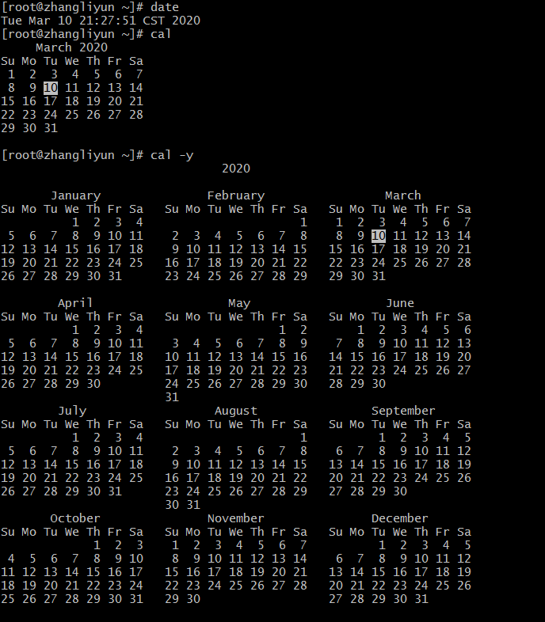

## 磁盘信息

|     命令      | 作用                            |
| :-----------: | :------------------------------ |
|     df -h     | disk free 显示磁盘剩余空间      |
| du -h[目录名] | disk usage 显示目录下的文件大小 |

| 参数 | 含义                |
| :--: | :------------------ |
|  -h  | K为单位显示文件大小 |

## 进程

> 当前正在执行的程序

|        命令         | 作用                                                      |
| :-----------------: | :-------------------------------------------------------- |
|       ps aux        | process status 查看进程的详细状况 aux为选项  不需要加 `-` |
|         top         | 动态显示运行中的进程并排序                                |
| kill [-9] PID进程号 | 终止指定进程号的进程  [-9]表示强行终止                    |

- `ps` 只显示当前用户通过终端启动的应用程序

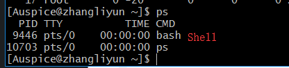

| 选项 | 含义                                     |
| :--: | :--------------------------------------- |
|  a   | 显示终端上的所有进程，包括其他用户的进程 |
|  u   | 显示进程的详细状态                       |
|  x   | 显示没有控制终端的进程                   |

- 退出 `top` ，直接输入 `q`
- 使用 `kill` 命令时，最好只终止由当前用户开启的进程，不要终止以 `root` 身份开启的进程，否则系统崩溃

# 其他命令

- 查找文件：find
- 文件链接：ln
- 打包和压缩：tar
- 软件安装：apt-get


## 打包压缩

- Windows 系统常用  `rar` 格式文件
- Mac 系统常用 `Zip` 格式文件
- 1-Linux 系统常用 `tar.gz` 

### 打包/解包

`tar` 把一系列文件打包到一个大文件中，也可以把一个打包的大文件恢复成一系列小文件

```shell
# 打包文件
tar -cvf 打包文件 .tar 被打包文件/路径

# 解包文件
tar -xvf 打包文件
```

| 选项 | 含义                                                    |
| :--: | :------------------------------------------------------ |
|  z   | 调用gzip,直接压缩                                       |
|  j   | 调用bz2,直接压缩                                        |
|  c   | 生成档案文件，创建打包文件                              |
|  x   | 解开档案文件                                            |
|  v   | 列出归档文件的详细过程,显示进度                         |
|  f   | 指定档案文件名称，f后跟的一定是 *.tat* 文件，必须在最后 |
|  C   | 指定路径                                                |

**步骤**

1. 将含有 `01` 的文件打包成一个 `.tar` 文件
2. 新建 `tar` 目录，并且将 `01.tar` 移动到 `tar` 目录下
3. 解包 `01.tar` 

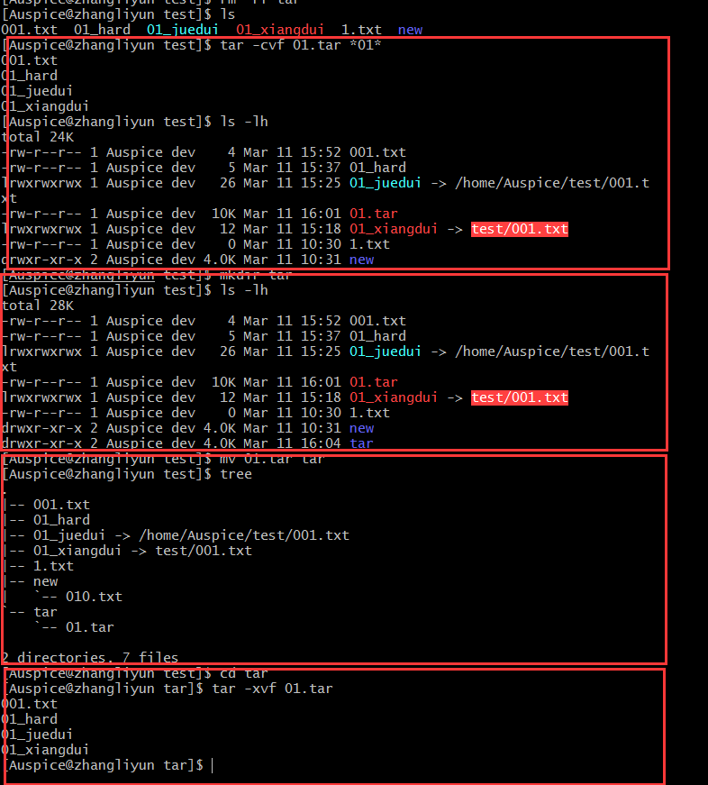

### 压缩/解压缩

`tar` 与 `gzip` 结合使用实现文件 **打包和压缩**

- `tar` 只负责打包文件，但不压缩
- 用 `gzip` 压缩 `tar` 打包后的文件，其扩展名为 `.tar.gz`

在 `tar` 命令中有一个选项 `-z` ，可以调用 `gzip` ，从而方便的实现压缩和解压缩功能

```shell
# 压缩文件
tar -zcvf 打包文件.tar.gz 被压缩文件/路径

# 解压缩文件
tar -zxvf 打包文件.tar.gz

# 解压缩到指定路径
tar -zxvf 打包文件.tar.gz -C 目标路径
```

| 选项 | 含义                                           |
| :--: | :--------------------------------------------- |
|  -C  | 解压缩到指定目录，注意：要解压缩的目录必须存在 |

```shell
# 压缩文件
tar -zcvf 打包文件.tar.gz 被压缩的文件/目录...

# 解压缩
tar -zxvf 打包文件.tar.gz

# 解压缩到指定路径
tar -zxvf 打包文件.tar.gz -C 目标路径
```

**步骤**

1. 压缩
2. 移动
3. 解压


### bzip(two)

- `tar` 与 `bzip2` 命令结合可以使用实现文件 **打包和压缩**
  - `tar` 只负责打包文件，不压缩
  - 用 `bzip2` 压缩 `tar` 打包后的文件，其扩展名一般用 `xxx.tar.bz2`
- tar 中有 选项 `-j` 可以调用 `bzip2` ，从而方便实现压缩和解压缩

```shell
# 压缩文件
tar -jcvf 打包文件.tar.bz2 被压缩的文件/路径
# 解压缩文件
tar -jxvf 打包文件.tar.bz2
```

## 软件安装

- `apt` 是 **Advanced Packaging Tool** ,Unbuntu下安装包管理工具
- `yum` 是 **Advanced Packaging Tool** ,CentOS下安装包管理工具 
- 可以在终端中方便 **安装/卸载/更新安装包**

```shell
# 安装软件
sudo yum install 软件包

# 卸载软件
sudo yum remove 软件包

# 更新已安装的包
sudo yum upgrade
```
