> 0. 计算机概论与Linux简介
>     - 计算机概论
>     - Linux介绍与版本
>
> 1. Linux的规划与安装
>    - Linux与硬件平台密切相关
>    - 规划硬件与Linux安装
>      - 主机规划与磁盘分区
>      - 安装CentOS、多重引导
> 2. 简单使用
>
>       - 帮助手册
>       - 文本编辑器
>       - 关机
> 3. Linux文件、目录与磁盘格式
>    - 基本的文件权限与目录配置（Linux是多用户多任务的环境，文件权限的管理很重要）
>    - Linux文件与目录管理
>    - 用户身份
>    - 磁盘与文件系统管理
>    - 挂载、虚拟内存容量扩充
>    - 文件的压缩与打包
> 4. Shell与Shell脚本
>    - GNU（第二代Shell）——BASH Shell
>    - Bash功能：指令管理、记录、文件或命令补全、环境变量的使用
>    - 数据流重导向——正则表达式与文件格式化处理
>    - Shell脚本
>    - Vim编辑器
> 5. Linux用户管理
>    - 账号规则与ACL权限控制
>    - 主机的系统与程序的管理
>    - 磁盘配额（Quota）与文件系统管理
>    - 工作调度
>    - 程序管理与SELinux
> 6. Linux系统管理员
>    - 系统服务daemon
>    - 开关机流程、模块管理、loader，登录文件
>    - 网络设置与备份策略
>    - 软件安装
>      - 源码、Tarball
>      - RPM、SRPM与YUM
>      - 图形窗口 X Window
>    - 内核编译

<!--more-->

# 0. Linux介绍与版本

操作系统（Linux）：高效地控制计算机系统硬件，以及系统资源的分配，提供计算机运行所需的功能，为应用层提供一组系统调用接口

> 操作系统移植：参照硬件的功能函数，修改操作系统程序码，经改版后的操作系统就能在另一个硬件平台运行
> - 2006之前，MAC基于Power CPU架构（IBM设计的硬件架构），之后，基于X86架构（采用Intel设计的硬件架构）

## 0.1 操作系统

### 0.1.1 操作系统简介

作用：

- 方便：使计算机系统易于使用
- 有效：更有效地控制与使用计算机系统资源
- 扩展：方便用户有效地开发、测试和引进新功能

操作系统在计算机系统中的地位：向下封装硬件，向上提供操作接口

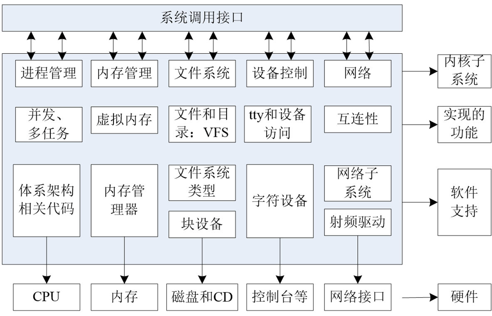

## 0.2 Linux诞生与发展依赖于五个重要支柱

- Linux是类Unix的GNU GPL自由、开源软件

### 0.2.1 Unix操作系统

第一阶段：Unix出现前

1969年前，主机的输入输出设备仅可用读卡机/打印机——批次型操作系统

- 程序设计者将程序相关信息在读卡纸上打孔，再将读卡纸插入读卡机作为主机的输入，进行运算

1960年，MIT提出 **相容分时系统** （Compatible Time-Sharing System, CTSS），多个终端机通过连线接入大型主机，利用主机的资源进行运算

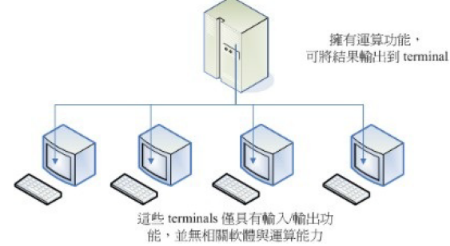

1965：贝尔实验室（Bell Labs）加入一项由通用电气和麻省理工学院合作的计划，该计划要建立一套多使用者、多任务、多层次的MULTICS操作系统（让大型主机达成可供300个以上终端机连线使用）。后来因为项目太为复杂失败。

- 1969年前后，贝尔实验室退出，但最终发展出这一系统https://www.multicians.org/

---

第二阶段：Unix的产生

- 1969年，Ken Thompson的小型文件服务系统

  Thompson基于PDP-7这一主机，进行操作系统核心程序编写。基于组合语言（Assembler）写出了一组核心程序，包括核心工具程序以及一个文件系统——Unics，Unix的原型

  > Assembler：直接与芯片对接的低级语言，必须了解硬件架构

  - 所有程序或设备都是文件

  - 构建编辑器环境或文件，一个程序完成一个目标，且要高效地完成目标


- 1971：Ken Thompson与Ritchie共同发明C语言

- 1973年，Ritchie等人以C语言写出Unix的核心

  thompson与Ritchie合作想将Unics改为高阶语言编写，但当时的B高级语言性能不好，所以将B重写为C语言，以C语言改写Unics的核心程序。

	> 使用高级语言编写，与硬件相关性减小，可以轻易移植到不同机器上
	>
	> Assembler具有专一性，每次安装到一台新的机器都需要重新编写组合语言

- 1977年，Unix第一个重要分支——BSD

  贝尔属于AT&T，Berkeley大学取得了Unix的核心源代码后，着手修改成适合自己机器的版本， 并且同时增加了很多工具软件与编译程序，最终将它命名为Berkeley Software Distribution（BSD）

  Sun公司以BSD发展的核心进行自己的商业Unix版本发展

- 1979年，Unix第二个重要分支——System V架构，以及版权宣告

  每一家公司自己出的Unix虽然在架构上面大同小异，但是却真的仅能支持自身的硬件

  Unix强调多用户多任务环境，但早期286架构下的CPU性能不足，所以没有人研究将Unix移植到x86 CPU

- 1979年，AT&T推出System V第七版Unix，支持x86架构的计算机

  出于商业考虑，AT&T在发布时，提及版权限制，“不向学生提供源码”

### 0.2.2 Minix操作系统

1984年，X86架构的Minix操作系统开始撰写，1986年完成，次年出版Minix相关书籍（Andrew Tanenbaum，谭宁邦），完全不参考Unix源码，但强调与Unix相容

可通过磁片/磁带购买，且提供源码

教学目的，因此并不关注生态以及用户需求

### 0.2.3 GNU计划

1983年以后，因为实验室硬件的更换，使得史托曼无法继续以原有的硬件与操作系统（Lisp）继续自由程序的撰写

将软件移植到Unix上面，为了让软件可以在不同的平台上运行， 因此，史托曼将他发展的软件均撰写成可以移植的型态（公布源码）

> 自由软件活动：将源代码连同软件程序释出，在 GNU 计划的范畴之内就称为自由软件（Free Software）运动
>
> - http://people.ofset.org/~ckhung/a/c_83.php
> - http://www.gnu.org

1984年，Richard Mathew Stallman（史托曼）发起GNU计划，目的是：创建一个自由、开放的Unix系统

参考Unix上的软件，依据这些软件开发相同功能的软件——GNU软件

1985年，为避免GNU开发的自由软件被转化为专利软件，与律师起草了通用公共许可证（General Public License，GPL）。

> 自由软件的版权GNU GPL：为了避免开源的自由软件被拿去做成专利软件， 于是Stallman同时将GNU与FSF发展出来的软件，都挂上GPL的版权宣告。
>
> 如：
>
> - emacs
> - GCC
> - glibc
> - Bash shell
> - hurd，GNU开发的内核

随着GNU软件的流行，史托曼开始撰写GCC编译器，

- 所有软件都需要编译为二进制的可执行文件，C语言编译器众多，但都是专利软件

- GNU C Compiler

- 先将编辑器Emacs移植到Unix上（语法检查），磁带出售，资金，成立自由软件基金会（Free Software Foundation，[FSF](https://www.fsf.org/resources)）。而后，合作完成了GCC。

  并撰写了很多可以被调用的C语言函数库（GNU C library，glibc）以及操作系统的接口BASH Shell——1990年左右完成

#### 开源软件、自由软件、专利软件

开源（Open Source）：软件在发布时，同时将作者的源代码一起公布的意思

开源软件：满足开源软件授权的软件

> 需要满足的条件
>
> - 公布源码
> - 源码可被全部或部分出售
> - 允许修改或衍生产品
> - 可以使用与原本完全不同的名称或编号再发行
> - 不可限制个人或团体、领域、产品使用权
> - 不可具有排他条款
>
> 常见的开源软件授权
>
> - Apache License 2.0
> - BSD 3-Clause "New" or "Revised" license
> - BSD 2-Clause "Simplified" or "FreeBSD" license
> - GNU General Public License （GPL）
> - GNU Library or "Lesser" General Public License （LGPL）
> - MIT license
> - Mozilla Public License 2.0
> - Common Development and Distribution License

---

自由软件（Free Software）：一个软件挂上了GPL版权宣告之后，他就成了自由软件

> - 任何人可取得软件与源代码
>   任何人可复制、修改、再发行
>   回馈：你应该将你修改过的程序码回馈于社群！
>
> 但不能
>
> - 修改授权：不能将一个GPL授权的自由软件，在你修改后而将他取消GPL授权’
> - 单纯贩卖：你不能单纯的贩卖自由软件。
>
> 自由软件与商业行为：自由软件搭配售后服务与相关手册是可以售卖的
>
> - GPL是可以从事商业行为的
>
> - GPL 目前已经出到第三版 GPLv3。但是，目前使用最广泛的，还是 GPLv2，包括 Linux 核心就还是使用 GPLv2 的

---

开源软件与GPL自由软件的区别：

- 开源软件授权不要求再发行软件具有相同的授权

- 开源软件的全部或部分可作为其他软件的一部分

  任何软件只要用了GPL的全部或部份程序码，那么该软件就得要使用GPL的授权

---

专利软件：仅推出可执行的二进制程序

- 免费专利软件授权模式
  - Freeware：不公布源码的免费软件
  - Shareware：有试用期

---

- 1988年：图形接口XFree 86计划

  1984年，MIT与合作厂商发布 X Window System

  1988年，成立非营利性XFree86组织（X Window System+Free+x86）

### 0.2.4 POSIX标准

可移植操作系统接口（Portable Operating System Interface，POSIX）标准，规定了操作系统应当提供哪些功能，以及这些功能的接口和行为方式

POSIX标准用于统一Unix、Linux各分支编程接口，以提高其通用型和可移植性

- 系统级应用：系统调用、文件系统、网络接口、进程控制、信号处理、进程间通信等

- 编程语言绑定：为C语言等常用编程语言提供了与操作系统接口交互的方式

- 工具与工具接口：定义了一系列工具的规范，比如文本处理工具（如grep、awk等）

### 0.2.5 Linux

**386的多任务测试**

> 多任务：同一CPU的分时复用
>
> - 假设CPU频率1GHZ，即每秒工作周期为$10^9$ 次，假设每个程序运行1000个时钟周期，然后就要切换到下一个程序，则CPU一秒可切换 $10^6$ 次
> - 实际上，任务切换也需要占用一定资源，所以在CPU上同时启动两个任务，比一个一个执行更耗时

早期X86的多任务处理表现不佳，386得到很大改善

- 要实现多任务，除了硬件（主要是CPU）具有多任务的特性外，操作系统也需要支持这个功能

多任务操作系统中，每个程序被执行，都会被分配一个最大CPU使用时长，一旦超过，当前工作就会被丢出CPU，等待下次工作调度再次调入内核

**释放Linux0.02**

测试完386硬件性能后，Linus将Minix安装到386计算机。

但Minix的软件支持并不多，所以Linus决定依靠bash与gcc编译器自己写内核

很多在Unix上能够运行的软件，不能在Linux上运行

为了让Linux相容于Unix系统，有两种思路

- 修改软件
- 修改Linux，让Linux符合Unix的软件运行规范

**Linux的发展**

- 个人维护阶段，Linus解决使用者的问题，或者特殊需求所需的硬件驱动

- 广大志愿者维护阶段，志愿者写出相容的驱动程序/软件，Linus将其代入内核，只要测试可以运行，则讲这些程序加入内核

  为应对随时加入的程序，Linux发展出模块化，一些功能独立于内核，仅有需要时才加入内核，

- 核心功能分工发展阶段，副手会先将来自志工们的修补程序或者新功能的程序码进行测试， 并且结果上传给托瓦兹看，让托瓦兹作最后核心加入的源代码的选择与整合

1991年，芬兰的赫尔辛基大学的Linus Torvalds，宣称他以bash, gcc等 GNU 的工具写了一个小小的核心程序，可以在Intel的386机器上面运行

1992年Linux与其他GNU软件结合，完全自由的操作系统正式诞生。该操作系统往往被为“GNU/Linux”或简称Linux。

1994年，完成Linux正式版内核，V1.0，并加入X window system的支持

1996年，完成2.0，2011年3.0，2015年4.0

### Linux与Unix联系

UNIX系统是工作站上最常用的操作系统，一个多用户、多任务的实时操作系统

- 一种大型的而且对运行平台要求很高的操作系统，只能在工作站或小型机上才能发挥全部功能，并且价格昂贵

Linux是免费的、不受版权制约、与UNIX兼容的操作系统。

1) 开放性；

2) 完全免费；

3) 多用户；

4) 多任务；

5) 良好的用户界面；

6) 设备独立性；

7) 提供了丰富的网络功能；

8) 可靠的系统安全性；

9) 良好的可移植性。

## 0.3 Linux版本

### 0.3.1 内核版

内核提供了一个裸设备与应用程序间的抽象层，是运行程序和管理硬件设备的核心程序

对上层应用提供 *系统调用* 与 *终端命令*

内核版本分为 *稳定版* 与 *开发版*

- 稳定版：工业级，可广泛地应用和部署，相对旧版只是修改一些BUG或加入新的驱动程序
- 开发版：需要试验各种解决方案，所以变化很快

内核源码网址：http://www.kernel.org

- 由Linus领导的开源社区对其进行甄别和修改最终决定是否进入到Linux主线内核源码中。

### 0.3.2 发行版

> Linux内核与可运行软件整合，加上独有工具，成为LInux的发行版（Linux distribution=Kernel+Softwares+Tools+安装程序）
>
> 包括：
>
> - Linux内核
>
> - 来自GNU计划的大量函数库
>
>   GNU很多软件都以LInux为主要操作系统进行开发
>
> - 基于X Window的图形化界面（可选的应用程序组件）
>
>   X Window的实现与操作系统分离，X Window的结构与设备无关
>
>   基于客户机/服务器结构，有X Server与X Client两部分组成

**主线版本与长期维护版本**

旧的版本在新的主线版本出现之后，会有两种机制来处理，一种是**结束开发** （End of Live，EOL），另一种是保持该版本的持续维护，即长期维护版本（Longterm）

`uname -r`

#### Linux distributions版本

为了让所有Linux distributions开发不至于过大差异，采用Linux Standard Base（LSB），以及目录架构的File system Hierarchy Standard（FHS）等标准来规范开发者

主要分为两大类系统，一种使用RPM方式安装软件，一种使用Debian的dpkg方式安装系统

|            | RPM软件管理                                 | DPKG软件管理             |
| ---------- | ------------------------------------------- | ------------------------ |
| 商业公司   | RHEL （Red Hat 公司）、SuSE （Micro Focus） | Ubuntu（Canonical Ltd.） |
| 非商业公司 | Fedora、CentOS、OpenSuSE                    | Debian、B2D              |

##  0.4 Linux应用

企业环境应用：向消费者或员工提供产品信息，整合企业内部的数据统一性

- 网络服务器：提供Web、FTP、Gopher、SMTP/POP3、Proxy/Cache、DNS等服务器，支持服务器集群，支持虚拟主机、虚拟服务、VPN等。

- 关键任务的应用（金融数据库、大型企业网管环境）

  x86计算机性能大幅提升，且价格便宜

- 学术机构的高性能运算任务

个人环境的应用：图形化界面

- 与X window System结合——KDE与GNOME窗口

移动设备

- Android，针对ARM机器

  安卓版本号就是Linux内核版本号

嵌入式系统：嵌入式Linux是将流行的Linux操作系统进行剪裁修改，能够在嵌入式计算机系统上运行的一种操作系统

- 操作系统嵌入产品，不会被改动
- 家电、路由器、控制芯片等微控制器
- 包括Embedix、uCLinux、muLinux等

云端应用：单一主机功能强大，造成硬件资源闲置

- 虚拟化技术得以快速发展：在一部实体主机上仿真出多个逻辑上完全独立的硬件

# 1. Linux规划与安装

> 安装Linux之前，需要对distributions特性，服务器的驱动支撑程度、未来升级需求、硬件扩充性需求等考虑
>
> 安装过程中，需要对磁盘分区、文件系统等有一定程度的了解

## 1.1 主机规划

各组件或装置在Linux系统中都是一个文件

### 1.1.1 硬件选购

**任务目标**

> 首先要了解Linux系统预计实现的任务，在选购硬件时才知道哪些组件最为重要

- 装机目标

  计算机硬件的等级与主机未来的功能相关

- 效能/价格、效能/消耗瓦数

  如果高一级的产品让你的花费多一倍，但是新增加的效能却只有10%，效能/价格比太低

  每瓦效能越高，越省电

- 驱动支撑程度

  硬件厂商是否提供操作系统相应的驱动程序

**硬件选购**

较早期的计算机已经没有能力再负荷新的操作系统

较早期的硬件配备也可能由于保存的问题或者是电子零件老化的问题， 导致系统在运行过程中出现不明的宕机

- CPU

- RAM：主存越大越好

- 硬盘：若是作为备份或文件服务器，需要考虑磁盘阵列（RAID）

  RAID利用硬件技术将多个硬盘整合为一个大硬盘，操作系统只会看到最后被整合起来的大硬盘

- 网卡

**装机目标与硬件搭配**

- 需要桌面系统，则对CPU于内存要求高一些
- 中型以上单位的网络服务器，对CPU、内存、网卡要求高一些，最好组磁盘阵列

需要更为稳定的Linux服务器，并考虑到系统整体搭配与运行效能，购买已组装测试过的商用服务器是很好的选择

- Red Hat 的硬件支持：https://hardware.redhat.com/?pagename=hcl
- Open SuSE 的硬件支持：http://en.opensuse.org/Hardware?LANG=en_UK
- Linux 对笔记本电脑的支援：http://www.linux-laptop.net/
- Linux 对打印机的支持：http://www.openprinting.org/
- Linux 硬件支持的中文HowTo：http://www.linux.org.tw/CLDP/HOWTO/hardware.html#hardware

### 1.1.2 磁盘分区

#### 硬盘连接方式与设备文件名的关系

在Linux中，每个设备都被当做一个文件，*/dev* 目录下

- 实体硬盘大多使用 */dev/sd[a-]* 的文件名
- 虚拟机内的硬盘由仿真器产生，磁盘名为 */dev/vd[a-p]*

SATA/USB/SAS等磁盘接口都是用SCSI模块驱动，这些接口的磁盘装置文件名都是 */dev/sd[a-p]* 格式

因此，**各装置文件名与Linux核心侦测到的顺序有关**

#### 磁盘结构

数据的写入实际是在磁盘盘片上，磁盘盘面分为扇区与磁道两种单位

- 内侧磁道周长短，可存储的数据量少；外侧磁道周长常，可存储的数据量大

- 每个磁道分为若干扇区（每个磁道的扇区编号都从0开始），不同磁道的扇区有相同的存储容量，每个扇区的存储容量为512Bytes或4KBytes

在对硬盘划分扇区时，有两种思路：

- 固定磁道密度：每个磁道的扇区数相等
- 分区磁道密度：外侧磁道的扇区数比内侧磁道多，内外磁道的扇区存储容量相等

相对内侧磁道，外侧磁道的线速度快，数据存取速度更快

#### 磁盘分区

**分区：以柱面（cylinder）为单位的连续磁盘空间**

- 不同盘片的同一磁道组成一个柱面，柱面是**文件系统**的最小单位
- 一跨多个磁道

##### 分区目的

- 数据安全性：每个分区的数据都是独立的，需要对分区内的数据重整时，可将重要数据移动到其他分区

- 系统的效率：利用分区，将数据集中在柱面的某个区段，有助于提高数据读取的速度与效率

> 整个磁盘的第一个扇区（0磁道0扇区）存储磁盘的重要信息，这些信息以MBR（Master Boot Record）格式保存。
>
> 但MBR格式的分区，最大的磁盘分区容量为2TB，因此新出现了GPT分区

#### MBR分区格式

##### 整个盘片的第0扇区

存放两个信息

- 主要启动记录区（MBR）：安装开机管理程序，446Bytes

- 分区表：记录整颗磁盘的分区状态，有64Bytes

  - 分区表项

    | 字节位      | 内容及含义                                                   |
    | ----------- | ------------------------------------------------------------ |
    | 0           | 引导标志。<br />0X80H：活动分区<br />0X00H：非活动分区。     |
    | 1,2,3       | 本分区的起始磁头号(第1字节)、扇区号（第二字节低6bit）、柱面号（第3字节高2位+第4字节8位） |
    | 4           | 分区类型符。 <br />0X00H：分区未用（即没有指定）  <br />0X06H：FAT16基本分区<br />0X0BH：FAT32基本分区；  <br />0X05H：扩展分区；<br />0X07H：NTFS分区；<br />0X0FH：（LBA模式）扩展分区（83H为[Linux](http://lib.csdn.net/base/linux)分区等）。 |
    | 5,6,7       | 本分区的结束磁头号、扇区号、柱面号。                         |
    | 8,9,10,11   | 逻辑起始扇区号 ，本分区之前已用扇区数。                      |
    | 12,13,14,15 | 本分区的总扇区数。                                           |

  - 本分区已占用扇区数第9~12Bytes，本分区总扇区数为第13~16Bytes、

     $2^{32}=4G$ 个扇区，若一个扇区512B，则最多可识别2TB磁盘空间

##### MBR分区类型

分区表所在的区块仅有64Bytes，因此最多仅能记录4个分区的信息，这**四组分区称为主要（Primary）分区或延伸（Extended）分区**

> 假设硬盘有400个柱面，共分为4个分区，第四个分区的柱面号为301~400
>
> - 当操作系统为Linux时，分区编号为 /dev/sda1，/dev/sda2，/dev/sda3，/dev/sda4
> - 当操作系统为Windows时，分区为C,D,E,F
>
> 将数据写入第四个分区时，相当于写入到磁盘的301~400号柱面

##### 延伸分区

延伸分区：将柱面相应的分区表项标记为延伸分区，**对延伸分区指向的区块继续分区，可得到多个逻辑分区**

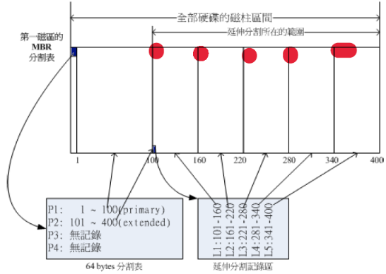

- 延伸分区使用额外的扇区来记录分区信息，延伸分区本身不能被格式化并写入数据

  每个逻辑分区的前几个扇区用来记录分区信息——分区表项
  
- 延展分区最多只有一个

- 延展分区不能被格式化存取数据，主要分区与逻辑分区可被格式化，并进行数据存取

- 逻辑分区数量随操作系统而不同

> 上述逻辑分区，在LInux中的文件名为：
>
> - P1:/dev/sda1
> - P2:/dev/sda2
>   - L1:/dev/sda5
>   - L2:/dev/sda6
>   - L3:/dev/sda7
>   - L4:/dev/sda8
>   - L5:/dev/sda9

##### MBR分区迁移

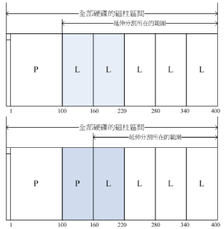

图一，同属于延伸分区的逻辑分区可合并：，只需要将两个逻辑分区删除，然后将两个旧逻辑分区的磁盘空间重新建立一个新的分区即可，并不影响其他逻辑分区

图二，主分区与逻辑分区不可合并：需要将延伸分区内所有的逻辑分区全部破坏，再重新划分延伸分区与逻辑分区

##### MBR分区的缺陷

- 一个逻辑分区或主分区，最多记录2TB的磁盘容量
  - 每个分区的容量很小，当总磁盘容量很大，则需要很多分区数
- MBR仅有一个扇区块，若被破坏，很难恢复
- MBR分区的开机管理程序仅446Bytes，无法容纳较多的程度代码

#### GPT分区格式

扇区有512B和4KB，为兼容所有的磁盘，因此在定义扇区时，大多会使用逻辑区块地址（Logical Block Address，LBA）

GPT将所有区块以LBA规划（512B），使用34个LBA区块来记录分区信息，整个磁盘的最后34个LBA也拿来作为备份

- LBA0：同MBR的0扇区，446B记录开机管理程序，在分区表记录区内，放入特殊标志的分区，表示此磁盘采用GPT格式的分区

- LBA1（GPT表头记录）

  记录分区表本身的位置与大小，记录备份用的GPT分区放置的位置，分区表的检验码（CRC32）

- LBA2-LBA33（记录分区信息）

  每个LBA都可以记录4笔分区记录，默认情况下，32个LBA可容纳128笔分区记录

  每个LBA有512B，即每笔分区纪录用到128B的空间，共64bit记录开始/结束扇区号，因此，每个分区的最大容量限制为 $2^{64}*512B=8ZB$

配合操作系统内核的udev等方式，现在Linux对逻辑分区数量没有限制

GPT分区没有逻辑分区与延展分区的概念，每个分区都可用于格式化

**注**
并不是每个内核都支持GPT格式的磁盘分区

- 磁盘管理工具，fdisk并不识别GPT，需要gdisk或parted指令
- 开机管理程序，grub第一版不识别GPT，grub2之后才识别

总之，是否能够读写GPT格式的分区与开机检测程序有关

### 1.1.3 开机管理程序

> 开机管理程序是写在主板上的固件（写入到ROM的软件程序），第一个被自动执行的程序

主机在加载硬件驱动方面的程序，主要有早期的BIOS与新的UEFI两种机制

#### BIOS+MBR/GPT

1. 在开机时，BIOS会被自动执行

2. BIOS会分析计算机的存储设备，访问设定的系统盘（能够开机的硬盘），系统盘的第一个扇区为MBR分区，放置**开机管理程序**（Boot loader）

   开机管理程序在操作系统安装时便提供

   >开机管理程序提供的功能：
   >
   >- 提供开机选项：对应多重引导功能，可以选择不同的开机项
   >
   >- 载入核心文件：直接指向可开机的程序区段，将控制权转交给操作系统
   >
   >  若使用类似grub的开机管理程序，则需要额外分区除一个**BIOS boot分区**，在该分区内，**放置引导过程所需的其他程序代码**
   >
   >- 转交其他开机管理程序：若选择多重引导，可能会将开机管理功能转交给其他开机管理程序

##### 多重引导

开机管理程序除安装在MBR外，还可以安装在每个分区的启动扇区（boot sector）。

**每个分区都有启动分区**，启动分区中的**开机管理程序** 只能识别当前分区内的**开机核心文件**及**其他开机管理程序**

**开机管理程序** 可直接指向或间接将管理权交给另一个管理程序

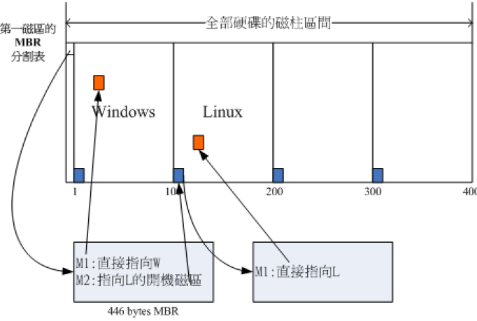

如上图，有两个系统分区，因此，MBR的开机管理程序提供两个选项

- M1：直接加载Windows的核心程序
- M2：将开机管理工作交给第二个分区的开机管理程序

当选择M2选项时，整个开机管理工作就交给第二个分区的开机管理程序，由于该开机管理程序仅有一个开机选项，所以使用Linux的核心文件开机

> 最好先安装Windows再安装Linux
>
> - Windows安装时，安装程序会主动覆盖掉MBR以及系统分区的启动分区
> - Linux在安装时，可以选择将开机管理程序安装在MBR或其他分区的启动分区，LInux可以手动设置选项

#### UEFI BIOS+GPT

BIOS仅有16bit，难与现阶段新的操作系统接轨

UEFI（Unified Extensible Firmware Interface）同一可扩展固件接口

加载所有的UEFI驱动程序后，系统会开启类似操作系统的Shell环境

- UEFI用于启动操作系统之前的，硬件检测、开机管理、软件设定等目的
- 加载完操作系统后，UEFI会将控制权移交给操作系统
- 此外，UEFI为防止黑客在BIOS阶段破坏系统，加入安全启动机制（即将开机的操作系统必须要被UEFI验证）

|                        | BIOS                                               | UEFI               |
| ---------------------- | -------------------------------------------------- | ------------------ |
| 语言                   | 汇编                                               | C                  |
| 硬件资源控制           | 中断管理<br />不可变的内存存取<br />不可变的IO存取 | 使用驱动程序和协议 |
| CPU运行环境            | 16bit                                              | CPU保护模式        |
| 设备扩充方式           | 通过IRQ连接                                        | 直接加载驱动程序   |
| 第三方厂商支持         | 差                                                 | 可支持多平台       |
| 图形化                 | 差                                                 | 支持               |
| 内建简化操作系统前环境 | 不支持                                             | 支持               |

UEFI只需要加载驱动程序即可控制系统硬件，但并不能代替操作系统

- 硬件资源的管理使用轮询方式来管理，效率比较低

- UEFI并不提供完整的快取功能，不能保证效率

##### \boot目录的分区

>基于GRUB引导程序的系统安装中，BIOS boot分区用于存放GRUB（引导过程）第二阶段的引导文件
>
>第一阶段：BIOS加载MBR分区（*/dev/sda1*）中的开机管理程序，该程序的主要目的是找到并加载第二阶段的开机管理程序
>
>- ESP分区，FAT32格式的分区（被不同操作系统和UEFI固件兼容），存储UEFI开机程序
>- 在ESP分区中，有*grubx64.efi* 文件，第一阶段会从ESP分区被加载到内存执行
>
>第二阶段：BIOS boot分区，为引导过程提供更多的空间，来**存放必要的引导文件**，使引导程序能正确地找到并加载操作系统内核
>

> 为与Windows兼容，并提供其他第三方厂商所使用的UEFI应用程序的存储空间，还必须格式化一个vfat的文件系统，作为UEFI分区（*/dev/sda2*）

因此，鉴于上述两个分区（BIOS boot分区与UEFI 分区），*/boot*目录基本从 */dev/sda3* 之后的分区开始

- */boot* 目录通常用于存放与内核相关的文件，这些文件用于开机管理程序将控制权移交给内核后，用于操作系统内核的加载与初始化阶段

### 1.1.4 分区与挂载

Linux内，数据与设备都是以文件形态呈现。

目录树结构以根目录为主，然后向下呈分支状的一种文件结构

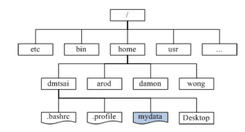

Linux系统通过目录挂载，将文件系统与目录树结构结合

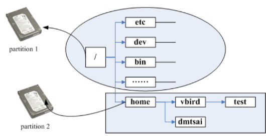

**挂载** ：利用一个目录当做进入点，当磁盘分区的数据放置在该目录下——进入该目录即可读取该分区

- 根目录一定要挂载到分区下
- 其他目录可按用户需求挂载到不同的分区

**挂载点** ：被挂载的目录

> 根据用途区分析需要较大容量的目录，以及读写较为频繁的目录，将这些重要的目录分别独立出来，不于根目录放在一起

## 1.2 安装

### 1.2.1 单Linux

#### 规划

- 用途：练习
- 虚拟机硬件配置：
  - CPU：X86还是ARM
  - 内存
  - 硬盘：*/dev/vda* 40GB
- distribution：CentOS
  - 刻录镜像载体
- 网卡：设置桥接
  - 确定IP与掩码


- **磁盘分区的规划**

  在Linux环境下，如果分配的磁盘未超过2TB，则默认采用MBR分区，所以为强制使用GPT分区，需要指定安装参数

  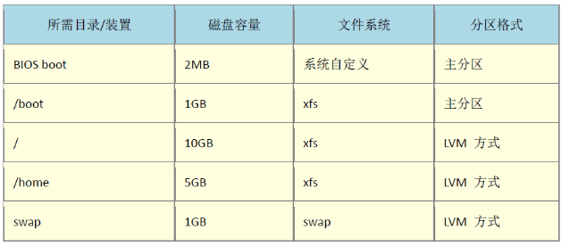

  - CentOS预设使用LVM方式管理文件系统

- 开机管理程序：CentOS7.X使用grub2，需要安装在MBR分区

#### 安装步骤

> 0. 虚拟机硬件配置
> 1. 镜像制作
> 2. 调整开机介质
> 3. 选择安装模式、加入核心参数
> 4. 安装引导与软件选择
> 5. 自定义系统盘分区
> 6. 核心管理与网络设定
> 7. 安装完成后的设置

**0. 虚拟机硬件配置**

在分配硬盘时，现在虚拟机的磁盘驱动器，大多采用qcow2这种虚拟磁盘格式，用多少记录多少，与实际使用量有关

**1. 镜像制作**

拷贝到DVD太慢，可通过dd或其他刻录软件，将ISO刻录到USB设备上

```shell
# 假设你的 USB 装置为 /dev/sdc ，而 ISO 档名为 centos7.iso 的话：
# if=输入文件 of=输出路径
[root@study ~]# dd if=centos7.iso of=/dev/sdc
```

**2. 调整开机介质**

- 进入BIOS（DEL或F2），调整开机顺序
- 若是虚拟机，在Boot Option中调整开机顺序

**3. 选择安装模式、加入核心参数**

- 安装模式

  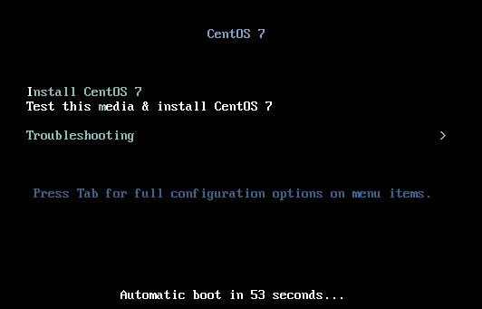

  - 正常安装CentOS7的流程

  - 测试此光盘，在安装CentOS7

  - 进入排错模式，
    - 以基本图形窗口安装CentOS7（使用标准显卡设定安装流程）
    
    - 救援CentOS
    
    - 执行内存测试
    
      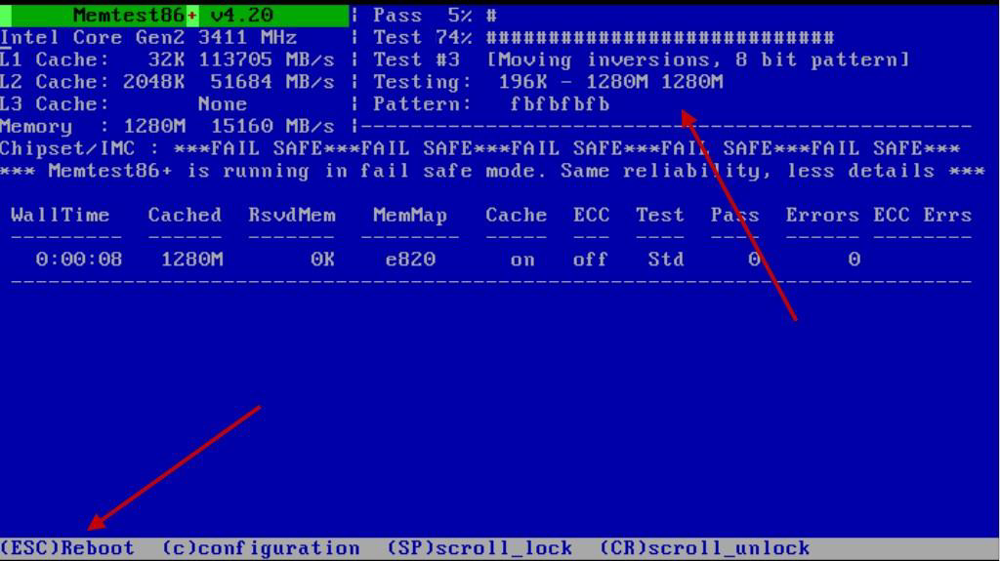
    
      直至 *esc* 停止
    
    - 使用本机磁盘开机，不由移动介质开机

- 加入核心参数，修改安装程序

  强制使用GPT分区时，需要输入安装参数

  安装模式为 *Install CentOS 7* 

  按 *Tab* 键，让光标跑到画面最下方等到输入额外的安装参数

  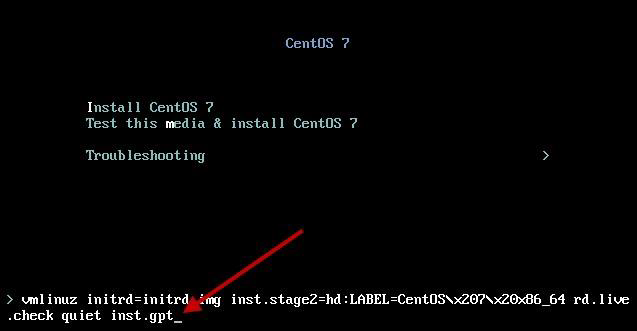

  在出现的画面中，输入 GPT分区的参数

**4. 安装引导与软件选择**

- 安装引导略

- 软件选择

  - 最小型安装：只安装内核与Shell

  - 含GUI的服务器：预打在GNOME

  - GNOME桌面环境：Linux常见的图形接口

  - KDE Plasma Workspaces：另一套常见的图形接口

**5. 自定义系统盘分区**

1. 删除残留分区

   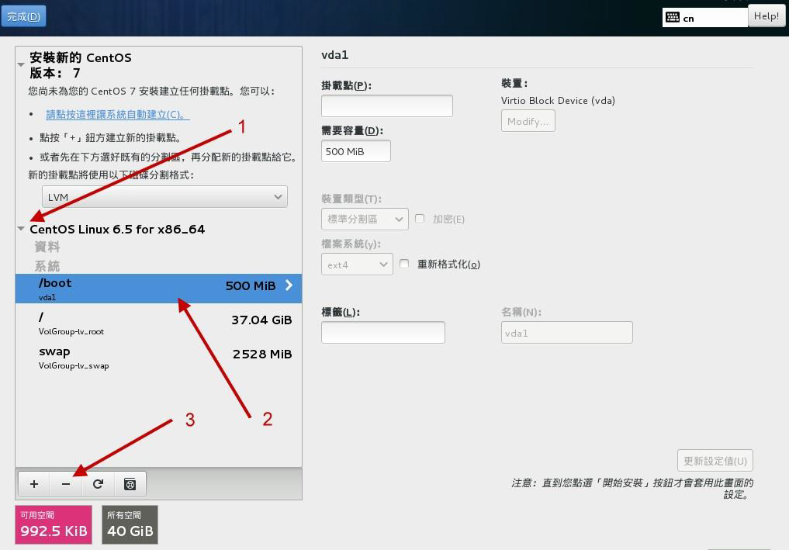

2. 第一个分区为 *BIOS boot* 分区

   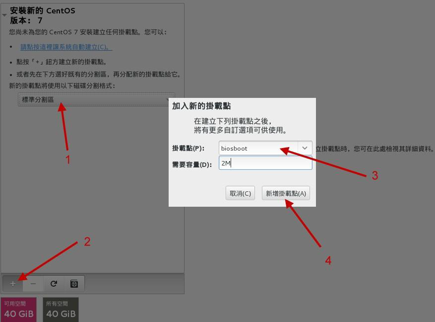

   > 分区类型：
   >
   > - 标准分区：*/dev/sda1* 类似的分区
   > - LVM：传统LVM直接给分区分配固定的容量，但可以弹性地增加/削减分区容量
   > - LVM紧张供应：实际使用多少容量，才会从磁盘分配多少容量
   >
   > 文件系统类型：
   >
   > - ext2/ext3/ext4：Linux早期使用的文件系统类型
   >
   >   ext3/ext4多了日志记录，便于复原。
   >
   >   但磁盘容量越来越大，ext格式不太使用
   >
   > - swap：磁盘仿真内存，swap分区不会直接挂载到目录树
   >
   > - BIOS boot：GPT分区才会用到
   >
   > - xfs：适用于大容量的磁盘管理，目前常用
   >
   > - vfat：同时被Linux与Windows所支持的文件系统类型。

3. */boot* 分区

4. */* ，*/home* ，*/swap* 分区

   使用LVM的管理方式

   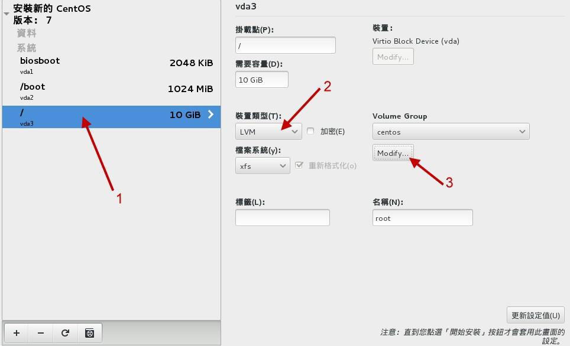

   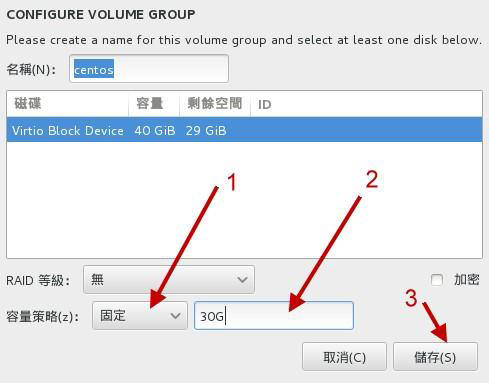

   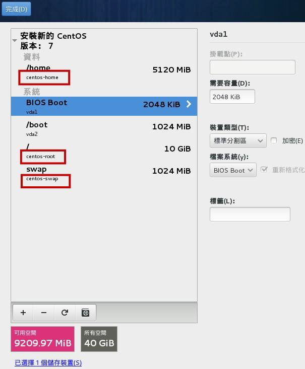

   > */swap* 内存置换区，当有数据被存放在内存，但不常被CPU取用，这些数据会被放入*/swap* 分区

**6. 核心管理与网络设定**

核心管理：*系统* 下的 *KDUMP* ，当Linux系统因为核心问题导致宕机时，会将该宕机事件的内存内数据存储

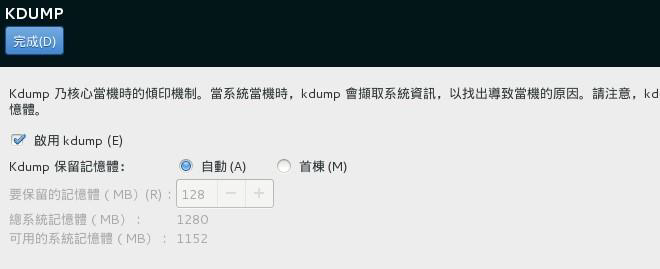

网络设定：设置静态IP

**7. 安装完成后的设置**

最好设置一个普通用户为管理员，不要直接使用root用户

---

**注**

笔记本加入了非常多的省电机制或其他硬件的管理机制，

当使用适用于一般桌面计算机的镜像安装Linux时，不一定适用于笔记本电脑

```shell
nofb apm=off acpi=off pci=noacpi
```

apm是早期的电源管理模块，acpi是近期的电源管理模块，这两者都需要特定的硬件支持，但笔记本电脑可能不适用这些机制

nofb：取消显卡的缓存侦测，笔记本的显卡通常是核显，Linux安装程序可能不会侦测该显卡

### 1.2.2 Linux与Windows多重引导

#### 规划

BIOS+MBR分区，CentOS 7与Windows 7，同时挂载一个共享的数据盘

> Windows 8.1之前的版本，UEFI BIOS+GPT分区才能开机
>
> 在没有UEFI环境下，无法使用GPT分区安装Windows
>
> - 只需要保证系统盘含UEFI分区

先安装Linux再安装Windows，再通过修改系统配置文件达成多重引导

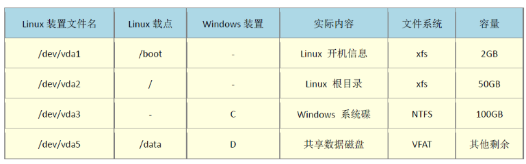

为强制各系统的BIOS位于指定分区，在Linux安装前，就需要先将分区划分

#### 安装步骤

> 1. 分区与安装Linux
> 2. 安装Windows
> 3. 救援MBR内的开机管理程序
> 4. 设定多重引导选项

**注**

- Windows环境最好隔离Linux的系统盘（根目录与swap分区）
- Linux不可删除，因为grub开机管理程序会读取 */boot*目录下的内容，如果Linux移除，则无法识别到Windows的开机管理程序

---

**1. 安装Linux**

开机后，在开始安装前


按键 *CTRL+alt+F2* 进入安装过程的shell环境

```shell
[anaconda root@localhost /]# parted /dev/vda mklabel msdos # 建立 MBR 分区
[anaconda root@localhost /]# parted /dev/vda mkpart primary 1M 2G # 建立 /boot
[anaconda root@localhost /]# parted /dev/vda mkpart primary 2G 52G # 建立 /
[anaconda root@localhost /]# parted /dev/vda mkpart primary 52G 152G # 建立 C
[anaconda root@localhost /]# parted /dev/vda mkpart extended 152G 100%# 建立延伸分区
[anaconda root@localhost /]# parted /dev/vda mkpart logical 152G 100% # 建立逻辑分区
[anaconda root@localhost /]# parted /dev/vda print # 显示分区结果
```

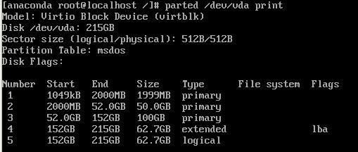

按键 *CTRL+alt+F2* 回到原本的安装流程，再一步步到分区挂载，再重新格式化

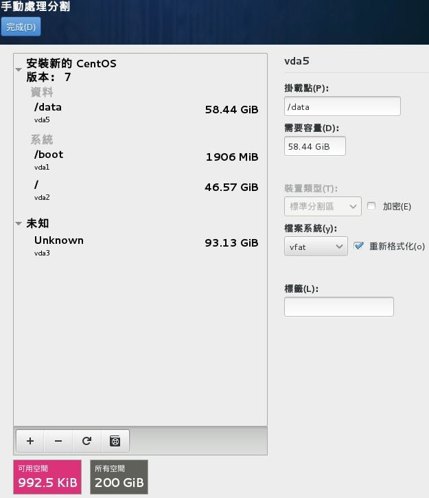

**2. 安装Windows**

重启机器，进入Windows的安装过程，注意选择规划的系统分区

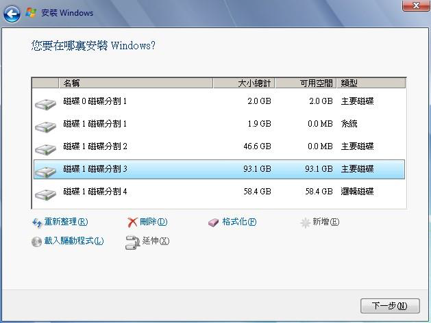

**3. 救援Linux的开机管理程序**

> 后安装的Windows会将MBR分区占用，因此，需要救援回Linux的开机管理程序

救援Linux的开机管理程序

放入安装介质，开机后，选择救援模式 *Troubleshooting* -> *Rescue a CentOS system*，等待开机后，选择 *Continue*

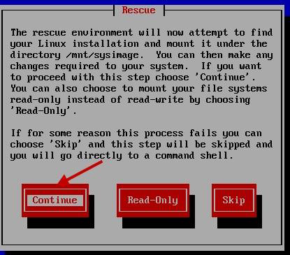

如果有Linux，则会告诉你，原本的系统放置与 */mnt/sysimage* 中

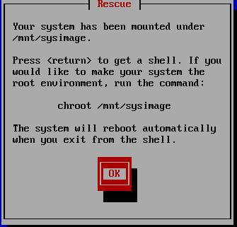

输入指令，将Linux的开机管理程序重新装回MBR分区

```shell
sh-4.2# chroot /mnt/sysimage
sh-4.2# grub2-install /dev/vda
Installing for i386-pc platform.
Installation finished. No error reported.
sh-4.2# exit
sh-4.2# reboot
```

**4. 修改开机选项**

开机进入Linux后，切换到root用户

```shell
[root@study ~]# vim /etc/grub.d/40_custom
#!/bin/sh
exec tail -n +3 $0
# This file provides an easy way to add custom menu entries. Simply type the
# menu entries you want to add after this comment. Be careful not to change
# the 'exec tail' line above.
menuentry "Windows 7" {
set root='(hd0,3)'
chainloader +1
}
[root@study ~]# vim /etc/default/grub
GRUB_TIMEOUT=30 # 将 5 秒改成 30 秒长一些
...
[root@study ~]# grub2-mkconfig -o /boot/grub2/grub.cfg
```

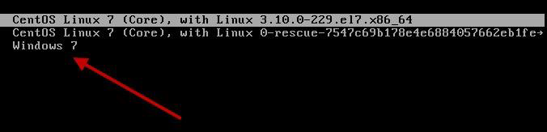

# 2. 简单使用

## 2.1 登入与关键字注解

### 2.1.1 交互界面

#### 图形化窗口

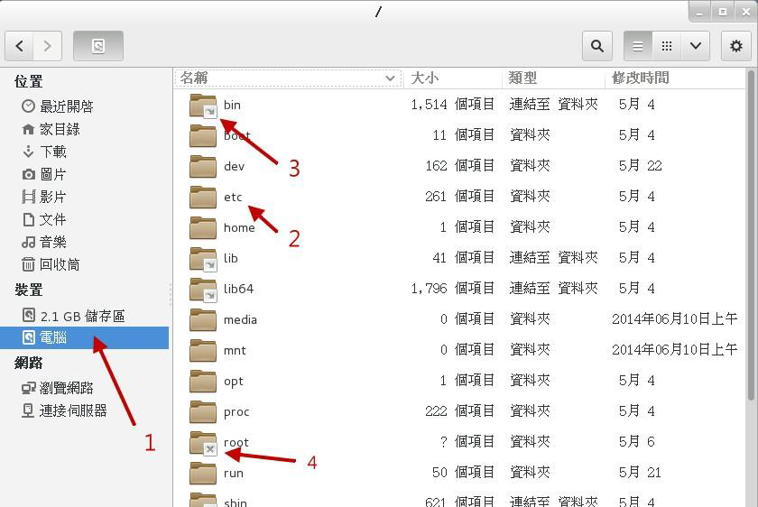

- 3：连接目录
- 4：没有权限进入的目录

**重启图形化界面**

在图形化界面，重启快捷键 *Alt+Ctrl+Backspace*

#### 图形化窗口与文本模式切换

> 文本模式：终端，terminal，console

快捷键 *Ctrl+Alt+[F1]~[F6]* 

-  根据 [F1]~[F6] ，依次命名为 tty1~tty6
- 开机完成后，默认系统只会提供 tty环境，首选的开机窗口为tty1
- 当切换时，才会产生额外的ttyx环境

**终端启动图形化窗口**

指令：startx

- 仅能启动一个X Window
- 已安装 X Window System，并且X server已启动
- 有窗口管理程序，如 GNOME/KDE等

将图形化窗口设为启动默认：将 `graphical.target` 服务设为默认

> CentOS 7开始使用systemd这种服务管理方式，之前是SystemV

#### 终端登录与注销

```shell
CentOS Linux 7 (Core)
Kernel 3.10.0-229.el7.x86_64 on an x86_64
study login: dmtsai
Password: <==这里输入你的密码
Last login: Fri May 29 11:55:05 on tty1 <==上次登入的情况
[dmtsai@study ~]$ _ <==光标闪烁，等待你的指令输入
```

- CentOS Linux 7 (Core)

  Linux distribution名称与版本

- Kernel 3.10.0-229.el7.x86_64 on an x86_64

  内核版本

- study login: dmtsai

  [主机名] login: [用户名]

  study.centos.vbird 主机名只显示第一个小数点之前的字母

- [dmtsai@study ~]$

  [当前用户名]@[主机名] [当前目录] $

> root用户的提示符为 `#`，一般用户的提示符为 `$`

注销 `exit`

### 2.1.2 指令与指令执行

#### 指令格式

```shell
command 		[-options]/[--options] parameter1 parameter2 ...
指令/可执行文件	选项 					参数(1) 		参数(2)
```

> 指令：理解为可执行的脚本名
>
> 只有在**环境变量**里的，可以在任何地方调用
>
> 其余指令需要在特定的目录下才可执行

- 若指令过程，使用反斜杠（\）换行

- 语系支持：默认情况下，不支持以中文编码输出，需要将语系改为英文，

  ```shell
  [dmtsai@study ~]$ date
  鈭? 5??29 14:24:36 CST 2015 # 纯文本界面下，无法显示中文字，所以前面是乱码
  
  1. 显示目前所支持的语系
  [dmtsai@study ~]$ locale
  LANG=zh_TW.utf8 # 语言语系的输出
  LC_CTYPE="zh_TW.utf8" # 底下为许多信息的输出使用的特别语系
  LC_NUMERIC=zh_TW.UTF-8
  LC_TIME=zh_TW.UTF-8 # 时间方面的语系数据
  LC_COLLATE="zh_TW.utf8"
  
  2. 修改语系成为英文语系
  [dmtsai@study ~]$ LANG=en_US.utf8
  [dmtsai@study ~]$ export LC_ALL=en_US.utf8
  # LANG 只与输出讯息有关，若需要更改其他不同的信息，要同步更新 LC_ALL 才行！
  
  [dmtsai@study ~]$ locale
  LANG=en_US.utf8
  LC_CTYPE="en_US.utf8"
  LC_NUMERIC="en_US.utf8"
  ....中间省略....
  LC_ALL=en_US.utf8
  # 再次确认一下，结果出现，确实是en_US.utf8 这个英文语系！
  ```

#### 常见指令

- 日期：date
- 日历：cal
- 计算器：bc

**date**

```shell
date #显示系统时间
date +%Y/%m/%d
[年]/[月]/[日]
date +%H:%M
[时]:[分]
```

**cal**

```shell
[dmtsai@study ~]$ cal [month] [year]
cal [年] # 显示整年月历
cal # 显示本月日历
```

**bc**

输入bc，会打印版本信息，然后进入bc工作环境（类似python）

```shell
[dmtsai@study ~]$ bc
bc 1.06.95
Copyright 1991-1994, 1997, 1998, 2000, 2004, 2006 Free Software Foundation, Inc.
This is free software with ABSOLUTELY NO WARRANTY.
For details type `warranty'.

scale=3 # bc预设只输出整数部分，指定小数点位数
1/3
.333
```

```
+ 加法
- 减法
* 乘法
/ 除法
^ 指数
% 取余
```

#### 指令执行模式

- 该指令会直接显示结果，然后回到命令提示字符等待下一个指令的输入；
- 进入到该指令的工作环境，直到结束该指令 `quit` ，才回到命令提示字符的环境。

#### 常用快捷键

*Tab*

- 在一串指令的第一个字的后面，则为 **命令补全**
- 在一串指令的第二个字以后时，则为『文件补齐』
- 若安装 bash-completion 软件，则在某些指令后面使用[tab] 按键时，可以进行『选项/参数的补齐』

*Ctrl+C*

- 指令中断

*Ctrl+d*

- 表示键盘输入结束—— EOF
- 相当于输入 *exit*

*shift+Page Up* 、*shift+Page Down* 

- 上下翻页

### 2.1.3 指令注释

> 理解在什么情况下，应该使用哪方面的指令

#### help选项

```shell
[指令] -h/--help
```

局限：

- 必须已知 [指令]
- 不适用于查询文件 格式

#### man

```shell
man [关键字]
```

> 更为详细的[关键字]注解
>
> 这些man page的输出数据通常放在 */usr/share/man* 这个目录下
>
> 也可以修改 */etc/man_db.conf* 来重定向该目录（一些distribution中为 *man.conf* 或 *manpath.conf* 或 *man.config*）

##### man的输出

| 输出项          | 说明                                               |
| --------------- | -------------------------------------------------- |
| **NAME**        | 简短的指令、数据名称说明                           |
| SYNOPSIS        | 简短的指令下达语法（syntax）简介                   |
| **DESCRIPTION** | 较为完整的说明                                     |
| **OPTIONS**     | 针对 SYNOPSIS部分，有列举的所有可用的选项说明      |
| COMMANDS        | 当此程序（软件）在执行时，此程序（软件）可识别指令 |
| **FILES**       | 此程序或数据，使用或参考或连结的某些文件           |
| **SEE ALSO**    | 与该指令相关的其他指令或说明                       |
| EXAMPLE         | 示例                                               |

- 翻页：
  - *空格键* 或 *Page Down* 或 *f* ：下一屏
  - *Enter*：一次性滚动一行
  - *Page Up* 或 *b* ：上一屏
  - *Home*：首页
  - *End*：末页
- 关键字搜寻：
  - */[关键字]* 向后搜索[关键字]
  - *?[关键字]* 向前搜索 [关键字]
  - *n/N* ：n表示下一个搜索结果，N表示上一个搜索结果

- *q* 离开man环境

##### 关键字的精确匹配

`man -f [关键字]` ：会搜索与[关键字]完全匹配的指令名称

> 相当于 `whatis [关键字]`

如：

```shell
[dmtsai@study ~]$ man -f man
man (1) - an interface to the on-line reference manuals
man (1p) - display system documentation
man (7) - macros to format man pages
```

| 左边部分                       | 右边部分         |
| ------------------------------ | ---------------- |
| 指令(文件)以及该指令的指令类型 | 该指令的简短说明 |

- 显示顺序

  若 `man -f [关键字]` 有多个输出，但 `man [关键字]` 会输出在 */etc/man_db.conf* 配置文件中，最先搜索到的输出

##### 关键字的模糊搜索

`man -k [关键字]`：只要man page中含 [关键字] 就会输出

> 相当于 `apropos [关键字]`

在使用 `whatis` 和 `apropos` 时，需要建立 whatis 数据库，需要再root的身份下执行 `mandb` 指令

##### 关键字类型

man [关键字] 可以输出**关键字类型**

如 `man date` 会输出 *date(1)* 括号中的 1 即表示指令类型

| 关键字编号 | 关键字类型                                              |
| ---------- | ------------------------------------------------------- |
| 1          | 用户在Shell环境中可操作的指令或可执行文件               |
| 2          | 系统内核可调用的函数或工具                              |
| 3          | 一些常用的额函数与函数库，大多为C式函数库（libc）       |
| 4          | 设备文件的说明，在 */dev* 下的文件                      |
| 5          | 配置文件或某些文件的格式刷                              |
| 6          | 游戏                                                    |
| 7          | 管理或协议等，如Linux文件系统，网络协议，ASCII code等号 |
| 8          | 系统管理员可用的管理指令                                |
| 9          | 跟Kernel有关的文件                                      |

#### info page

info page将输出拆分为片段 ，每个片段编为一个 page，page间有类似超链接的跳转。每个独立的页面被称为一个节点（node）

> 支持info page的指令/数据/关键字，其输出数据放置在 */usr/share/info/* 中

```shell
[dmtsai@study ~]$ info info
File: info.info, Node: Top, Next: Getting Started, Up: (dir)
```

- File：当前输出的page来源文件——*info.info*
- Node：当前页面属于Top节点
- Next：下一节点，名为 Getting Started
- Up：返回上一层
- Prev：前一个节点

```shell
省略
* Menu:
* Getting Started:: Getting started using an Info reader.
* Advanced:: Advanced Info commands.
* Expert Info:: Info commands for experts.
* Index:: An index of topics, commands, and variables.
--zz-Info: (info.info.gz)Top, 52 lines --Bot------------------------------------------
```

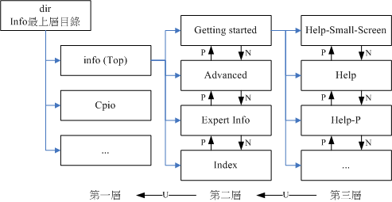

- 在Menu中，可见有4个节点

  通过将光标移动到对应行，再 *Enter* ，便可跳转到相应Page

- *Tab* 键，在各超链接间移动

**info page中的快捷键**

> Page切换快捷键：N（下一节点），P（上一结点），U（上一层节点）

> info page 中，按 *h* 能提供一些基本按键功能的介绍

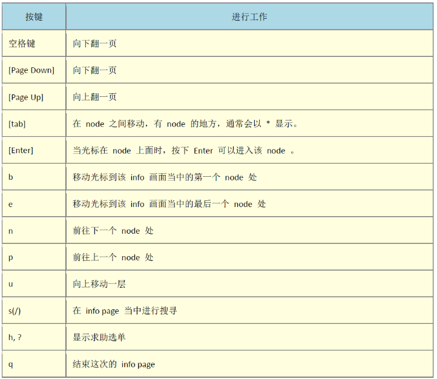

#### doc

*/usr/share/doc/* 目录下，会存放一些软件的说明文档

> 这些软件如何使用，原理说明，未来规划等

## 2.2 文本编辑器nano

`nano [文件名].txt`

**快捷键**

> *^+[按键]* 表示 CTRL，*M+[按键]* 表示 ALT

- CTRL+G：帮助信息
- [ctrl]-X：离开naon 软件，若有修改过文件会提示是否需要储存喔！
- [ctrl]-O：储存文件，若你有权限的话就能够储存文件了；
- [ctrl]-R：从其他文件读入资料，可以将某个文件的内容贴在本文件中；
- [ctrl]-W：搜寻字符串，这个也是很有帮助的指令喔！
- [ctrl]-C：说明目前光标所在处的行数与列数等信息；
- [ctrl]-_：可以直接输入行号，让光标快速移动到该行；
- [alt]-Y：校正语法功能开启或关闭(单击开、再单击关)
- [alt]-M：可以支持鼠标来移动光标的功能

## 2.3 关机

1. 确定无其他在线用户

   `who` 指令可查看本机在线的用户

   `netstat -a` 查看网络的联机状态

   `ps -aux` 查看启动的进程

2. 数据同步到硬盘

   切换到root用户，一般用户仅能更新当前硬盘的数据，root用户可以更新整个系统的数据

   `su -`

   `sync` 

3. 关机/重启

   关机：

   - `shutdown` 、
   - `halt`（系统停止，屏幕可能会保留系统已经停止的讯息！）
   - `poweroff` （系统关机，所以没有提供额外的电力，屏幕空白）

   重启：`reboot`

**shutdown**

```shell
[root@study ~]# /sbin/shutdown [-krhc] [时间]
```

|      | 选项 | 参数            |                                    |
| ---- | ---- | --------------- | ---------------------------------- |
|      | -k   |                 | 不要真的关机，只是发送警告讯息出去 |
|      | -r   | 默认 1 分钟     | 重启(常用)                         |
|      | -h   | now、或指定时间 | 立即关机(常用)                     |
|      | -c   |                 | 取消已经在进行的 shutdown 指令内容 |

```shell
[root@study ~]# /sbin/shutdown -h 10 'I will shutdown after 10 mins'
Broadcast message from root@study.centos.vbird (Tue 2015-06-02 10:51:34 CST):
I will shutdown after 10 mins
The system is going down for power-off at Tue 2015-06-02 11:01:34 CST!

[root@study ~]# shutdown -h now
立刻关机，其中 now 相当于时间为 0 的状态
[root@study ~]# shutdown -h 20:25
系统在今天的 20:25 分会关机，若在21:25 才下达此指令，则隔天才关机
[root@study ~]# shutdown -h +10
系统再过十分钟后自动关机
[root@study ~]# shutdown -r now
系统立刻重新启动
```

- `shutdown -c` 取消关机计划

**实际上，调用管理工具systemctl关机**

 ```shell
 [root@study ~]# systemctl [指令]
 指令项目包括如下：
 halt 进入系统停止的模式，屏幕可能会保留一些讯息，这与你的电源管理模式有关
 poweroff 进入系统关机模式，直接关机没有提供电力喔！
 reboot 直接重新启动
 suspend 进入休眠模式
 [root@study ~]# systemctl reboot # 系统重新启动
 [root@study ~]# systemctl poweroff # 系统关机
 ```


## 2.4 查看或配置网卡信息

|    命令     |           对应英文            | 作用                              |
| :---------: | :---------------------------: | :-------------------------------- |
|  ifconfig   | configure a network interface | 查看/配置计算机当前的网卡配置信息 |
| ping ip地址 |             ping              | 检测到目标ip地址的连接是否正常    |

### ifconfig

> 查看/配置计算机当前的网卡配置信息

```shell
ifconfig

ifconfig|grep inet
```

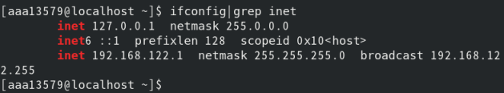

### ping

> 测试网卡是否可用

`ping 目标ip` ：检测目标ip主机

- 环回地址：127.0.0.1，指向本机的ip地址

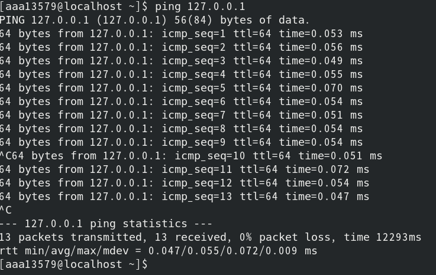

- Ctrl + C 停止ping 
