>- 基本的文件权限与目录配置（Linux是多用户多任务的环境，文件权限的管理很重要）
>- Linux文件与目录管理
>- 用户身份
>- 磁盘与文件系统管理
>- 挂载、虚拟内存容量扩充
>- 文件的压缩与打包

<!--more-->

## 2.1 文件信息、权限、操作

### 2.1.1 文件信息查看

`ls -al` ：列出所有的文件详细权限与属性

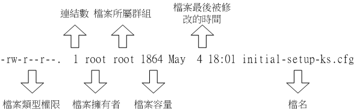

> `ls` 指令的选项， `-a` 表示显示隐藏文件

#### 第一栏：文件类型+不同用户身份的权限

第一个字符表示文件类型

- `d` ：表示目录（directory）
- `-`：表示文件，包括：
  - 纯文本文件（ASCII）
  - 二进制文件——指令或可执行程序
  - 数据格式文件：特殊的编码格式
- `l` ：表示链接文件
- 设备与装置文件（device）
  - `b`（block，区块设备文件） ：表示设备文件中的可随机存取设备
  - `c`（character，字符设备文件） ：表示设备文件中的串口设备（一次性读取设备）
- `s`（sockets，数据接口文件）：服务端可以将一个文件配置为socket来监听客户端要求，客户端通过socket文件便可进行数据沟通
- `p`（FIFO.pipe，数据输送文件）：解决多个程序同时存取一个文件

之后的9个字符，三个一组，表示不同身份的用户对当前文件的权限，若没有相应权限，则会用 `-` 占位

- 第一组：文件拥有者具有的权限
- 第二组：同群组拥有的权限
- 第三组：others身份的用户拥有的权限

#### 第二栏：链接数

> 表示多少文件被链接到此文件的 **i-node** 中

每个文件都会将其权限与属性记录到文件系统的 **inode** 中

目录树采用文件名标识

每个文件名都会有链接到一个元数据文件（inode）

```shell
# 可仅查看目标目录的链接数
ls -ld 目标目录
```

#### 第三栏：文件拥有者与所属群组

> 文件与目录的可存取身份分为三个类别：owner、group、others
>
> 每个身份有read/write/excute等权限

#### 第五栏：文件大小

默认单位为bytes

#### 第六栏：文件最近的修改日期

> 文件创建日期或最近的修改日期

显示完整的时间格式：`ls -l --full-time` 

#### Linux文件的其他属性

**扩展名**：Linux下的文件是否可被执行由 `x` 权限确定，与文件扩展名无关

- 但具体是否可被执行成功由文件内容决定

- 常用扩展名：

  ```shell
  *.sh：脚本或批处理文件
  *.Z 、*.tar、 *.tar.gz、 *.tgz：压缩包
  ```

**文件名的限制**：

- 长度限制：传统的EXT2/EXT3/EXT4文件系统，以及XFS文件系统

  - 单一文件或目录的文件名最多占用255B（ASCII的英文，最多255个字符）

- 命名限制：

  - 避免特殊字符

    ```
    * ? > < ; & ! [ ] | \ ' " ` ( ) { }
    ```

### 2.1.2 文件类型

#### 普通文件

普通文件是存放数据、程序等信息的文件，包括：文本文件、数据文件、可执行的二进制程序文件等

通过 `file [文件名]` 指令查看指定文件的类型。

- 支持通配符 `file *` 查看目录下所有文件的类型

#### 目录文件

目录是一种特殊的文件

仅root权限的用户可修改目录文件，用户进程可以读取目录内容，但不允许修改

#### 设备文件

在Unix/Linux中，每个设备都被映射为一个文件，即设备文件。

用于向I/O设备提供连接的文件，分为：字符设备和块设备文件

- 字符设备：以字节为单位存取数据
- 块设备：以字符块为单位，

每种I/O设备对应一种设备文件

#### 管道文件

用于进程间的通信

#### 链接文件

软链接（符号链接）

硬链接

### 2.1.3 文件权限

> 文件权限是文件的访问控制权限，即哪些用户和群组可以访问文件以及可以进行什么样的操作
>
> - 每个文件或目录都包含访问权限

> 文件权限的最大作用体现在 **数据安全性** 上
>
> - 系统文件保护
> - 团队开发软件或数据共享的功能

#### 访问用户

owner——文件拥有者

- 具有该文件的所有权限
- root用户具有最高权限，即使不是文件拥有者

group——群组

- 群组内成员，具有对某个文件相同的权限
- 一个用户可属于多个群组

others——其他

- 对一个文件而言，除上述两种身份，则都为others身份

> 用户信息记录文件：包括一般身份使用者与root用户，都记录在 */etc/passwd* 文件内
>
> 用户密码：记录在 */etc/shadow* 文件内
>
> 群组名：记录在 */etc/group* 文件内

##### 用户与用户组修改

**chgrp**

```shell
# 递归低修改目录下所有文件
chgrp 群组名 -R dirname/filename
```

> 群组名 必须在 */etc/group* 文件内

**chown**

```shell
chown -R 用户名:群组名 dirname/filename
```

- 用户名与群组名之间用 `.` 或 `:` 分隔（用户名可包含 `.`，所以最好用 `:`）
- 缺省用户名可仅修改群组，`chown .群组名 filename`

> 复制行为，会将执行者的属性与权限都拷贝，所以会涉及到文件权限的修改

#### 普通权限——rwx

|      | 内容                               | r                  | w                                    | x                |                                  |
| ---- | ---------------------------------- | ------------------ | ------------------------------------ | ---------------- | -------------------------------- |
| 文件 | 文本、数据内容、二进制可执行文件等 | 读取文件的实际内容 | 修改文件内容<br />（不包括删除文件） | 执行文件内容     | 针对文件内容的权限               |
| 目录 | 文件名列表                         | 读取文件名         | 修改文件名                           | 进入该目录的权限 | 操作目录文件就是操作目录中的文件 |

目录的权限：

- **r** ：具有读取目录结构的权限，返回文件名列表
- **w**
  - 建立新的文件与目录
  - 删除已存在的文件与目录
  - 将已存在的文件或目录更名
  - 移动目录内的文件
  - 移动目录的位置
- **x**：进入该目录的权限

> 浏览目录下的文件，至少需要 *rx* 权限

> **w** 权限，谨慎赋予
>
> 用户dmtsai，root用户在其根目录下，新建 */home/dmtsai/the_root.data* ，并且将其权限修改为 `rwx------`。尽管dmtsai用户不能读取和修改文件内容，但由于具有家目录权限 `rwx`，所以可以删除该文件
>
> ```shell
> ## 首先，使用root用户创建示例
> [root@study ~]# cd /tmp <==切换工作目录到/tmp
> [root@study tmp]# mkdir testing <==建立新目录
> [root@study tmp]# chmod 744 testing <==变更权限
> [root@study tmp]# touch testing/testing <==建立空的文件
> [root@study tmp]# chmod 600 testing/testing <==变更权限
> [root@study tmp]# ls -ald testing testing/testing
> drwxr--r--. 2 root root 20 Jun 3 01:00 testing
> -rw-------. 1 root root 0 Jun 3 01:00 testing/testing
> 
> ## 然后，切换dmtsai用户，访问该目录
> [dmtsai@study ~]$ cd /tmp
> [dmtsai@study tmp]$ ls -l testing/
> ls: cannot access testing/testing: Permission denied
> total 0
> ?????????? ? ? ? ? ? testing
> # 虽然有告知权限不足，但因为具有 r 的权限可以查询档名。由于权限不足(没有x)，所以会有一堆问号。
> [dmtsai@study tmp]$ cd testing/
> -bash: cd: testing/: Permission denied
> # 因为不具有 x ，所以当然没有进入的权限啦！有没有呼应前面的权限说明啊！
> 
> ## 最后，修改目录拥有者为 dmtsai
> # 1. 先用 root 的身份来搞定 /tmp/testing 的属性、权限设定：
> [root@study tmp]# chown dmtsai /tmp/testing
> [root@study tmp]# ls -ld /tmp/testing
> drwxr--r--. 2 dmtsai root 20 6 月 3 01:00 /tmp/testing # dmtsai 是具有全部权限的！
> # 2. 再用 dmtsai 的账号来处理一下 /tmp/testing/testing 这个文件看看：
> [dmtsai@study tmp]$ cd /tmp/testing
> [dmtsai@study testing]$ ls -l <==确实是可以进入目录
> -rw-------. 1 root root 0 Jun 3 01:00 testing <==文件不是vbird 的！
> [dmtsai@study testing]$ rm testing <==尝试杀掉这个文件看看！
> rm: remove write-protected regular empty file `testing'? y
> ```

#### 特殊权限

##### SUID权限

> Set UID：执行者通过可执行文件（指令）对其他文件操作时，执行者将具有可执行文件的拥有者权限

条件：

- 仅对二进制可执行文件有效
- 执行者对可执行文件，具有x可执行权限
- 仅在指令运行期间有效

> 如：/etc/shadow记录所有用户与密码信息，且权限为"---------- 1 root root"，表明仅root用户可修改
>
> 但任意用户，可使用/usr/bin/passwd指令可修改任意用户的密码
>
> - */usr/bin/passwd* 的文件权限为 "-rwsr-xr-x"，即所有用户具有该指令的可执行权限
> - passwd的拥有者为root
> - 用户dmtsai执行passwd指令时，将暂时具有root用户的权限
> - dmtsai用户可通过 passwd指令对 */etc/shadow* 进行修改
>
> 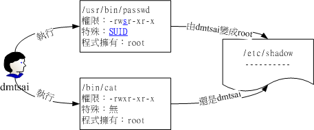

##### SGID权限

**作用于可执行文件**：

- 执行者通过可执行文件（指令）对其他文件操作时，执行者将具有可执行文件的群组权限

- 条件：

  - SGID仅作用于可执行文件

  - 程序执行者对可执行文件，具有x可执行权限‘

- >[root@study ~]# ll /usr/bin/locate /var/lib/mlocate/mlocate.db
  >-rwx--s--x. 1 root slocate 40496 Jun 10 2014 /usr/bin/locate
  >-rw-r-----. 1 root slocate 2349055 Jun 15 03:44 /var/lib/mlocate/mlocate.db
  >
  >可见，所有用户拥有对locate指令的执行权限，但mlocate.db文件非root用户及slocate用户不可查看
  >
  >因为locate有SGID权限，所以任何执行locate指令时，将被赋予slocate群组权限

**作用于目录**：

- 对目录赋予SGID权限，新建文件的群组将与执行者一致

```shell
# 0. 创建用户及群组
[root@study ~]# groupadd project <==增加新的群组
[root@study ~]# useradd -G project alex <==建立 alex 账号，且支持 project
[root@study ~]# useradd -G project arod <==建立 arod 账号，且支持 project
[root@study ~]# id alex <==查阅 alex 账号的属性
uid=1001(alex) gid=1002(alex) groups=1002(alex),1001(project) <==确实有支持！
[root@study ~]# id arod
uid=1002(arod) gid=1003(arod) groups=1003(arod),1001(project) <==确实有支持！

# 1. 创建目录
[root@study ~]# mkdir /srv/ahome
[root@study ~]# chgrp project /srv/ahome
[root@study ~]# chmod 770 /srv/ahome
## 可见，目录群组为project
[root@study ~]# ll -d /srv/ahome
drwxrwx---. 2 root project 6 Jun 17 00:22 /srv/ahome

# 2. 一个用户创建文件
[root@study ~]# su - alex <==先切换身份成为 alex 来处理
[alex@www ~]$ cd /srv/ahome <==切换到群组的工作目录去
[alex@www ahome]$ touch abcd <==建立一个空的文件出来！
[alex@www ahome]$ ll abcd
-rw-rw-r--. 1 alex alex 0 Jun 17 00:23 abcd
## 由于群组是 alex ，arod 并不可访问alex创建的abcd文件
## alex具有ahome目录的xw权限，所以可以删除abcd

# 3. 为目录设置SGID权限
[root@study ~]# chmod 2770 /srv/ahome
[root@study ~]# su - alex
[alex@www ~]$ cd /srv/ahome
[alex@www ahome]$ touch 1234
[alex@www ahome]$ ll 1234
-rw-rw-r--. 1 alex project 0 Jun 17 00:25 1234
## alex所属群组为project，执行touch指令创建的文件，会属于project群组
```

##### SBIT权限

> Set Stricky Bit：当目录被赋予SBIT权限后，用户仅能对自己建立的文件/目录进行操作，无法修改其他人的文件
>
> root仍拥有该目录的最高操作权限

条件：

- 用户对当前目录具有w，x权限，即具有进入与写入的权限

> */tmp* 目录的权限为 "drwxrwxrwt"，任何人都可在 */tmp* 内新增、修改文件，但仅文件拥有者与root用户可删除自建的文件或目录

#### 权限的修改——chmod

##### 数字类型改变文件权限

```shell
chmod -R sxyz/xyz 文件名
# s表示特殊权限
# x表示拥有者的权限值
# y表示群组的权限值
# z表示others群组的权限值
```

普通权限：每种身份的权限为三种权限的累加，如赋予读、写、执行权限，则为7

| 权限占位 | 拥有者权限 | 群组权限 | 其他人权限 |
| -------- | ---------- | -------- | ---------- |
| 1        | r：4       | r：4     | r：4       |
| 2        | w：2       | w：2     | w：2       |
| 3        | x：1       | x：1     | x：1       |

```shell
chmod 775 文件名
```

特殊权限：拥有的特殊权限累加

| 权限占位 | 拥有者权限 | 群组权限   | 其他人权限 |
| -------- | ---------- | ---------- | ---------- |
| 3        | s(SUID)：4 | s(SGID)：2 | t(SBIT)：1 |

```shell
[root@study ~]# cd /tmp
[root@study tmp]# touch test <==建立一个测试用空档
[root@study tmp]# chmod 4755 test; ls -l test <==加入具有 SUID 的权限
-rwsr-xr-x 1 root root 0 Jun 16 02:53 test

[root@study tmp]# chmod 6755 test; ls -l test <==加入具有 SUID/SGID 的权限
-rwsr-sr-x 1 root root 0 Jun 16 02:53 test
```

对于不具有特殊权限条件，但设定特殊权限，会以S,T占位

```shell
[root@study tmp]# chmod 7666 test; ls -l test <==具有空的 SUID/SGID 权限
-rwSrwSrwT 1 root root 0 Jun 16 02:53 test
```

- 首先赋予test文件rw权限，但不具有x权限，所以实际上不具备所有特殊权限，故用S和T占位

##### 符号类型修改文件权限

指令格式

| chmod | u：用户<br />g：群组<br />o：其他群组<br />a：全部 | +：赋予权限<br />-：解除权限<br />=：设定权限 | s<br />r<br />w<br />x | 文件或目录 |
| ----- | -------------------------------------------------- | --------------------------------------------- | ---------------------- | ---------- |

```shell
# 例子
chmod u=rwxs,go=rx 文件名

# 赋予所有用户写权限
chmod a+w 文件名
# 解除所有用户的写权限
chmod a-w 文件名

# 设定权限成为 -rws--x--x 的模样：
[root@study tmp]# chmod u=rwxs,go=x test; ls -l test
-rws--x--x 1 root root 0 Jun 16 02:53 test
# 承上，加上 SGID 与 SBIT 在上述的文件权限中！
[root@study tmp]# chmod g+s,o+t test; ls -l test
-rws--s--t 1 root root 0 Jun 16 02:53 test
```

#### 默认权限

系统的预设权限

- 对于文件，默认不开放执行权限，预设权限为666，即 **-rw-rw-rw-**
- 对于目录，默认开放执行权限，预设权限为777，即 **drwxrwxrwx**

`umask` 为系统预设权限的掩码，进而指定当前用户在创建文件或目录时的默认权限

> 当设定 `umask 003`
>
> - 对于文件：(-rw-rw-rw-) - (-------wx) ==> -rw-rw-r--
> - 对于目录：(drwxrwxrwx) - (d-------wx) = drwxrwxr--
>
> 计算方式：掩码二进制取反，和预设权限的二进制相与，得出修改后的默认权限

### 2.1.4 文件隐藏属性

在Linux传统的Ext2/Ext3/Ext4文件系统下，可以为文件设定其他隐藏属性

#### 查看隐藏属性——lsattr

```shell
lsattr [-选项] 文件/目录
```

| 选项 | 参数 | 含义                                             |
| ---- | ---- | ------------------------------------------------ |
| -a   |      | 显示隐藏的属性                                   |
| -d   |      | 若是目录，仅列与目录本身的属性，不显示目录内文件 |
| -R   |      | 连同目录内文件的隐藏属性也显示                   |

#### 配置隐藏属性——chattr

```shell
chattr [+-=][属性] 文件/目录
```

| 操作 | 选项 | 含义                                                         |
| ---- | ---- | ------------------------------------------------------------ |
| +    |      | 添加权限                                                     |
| -    |      | 移除权限                                                     |
| =    |      | 设定权限                                                     |
|      | A    | 存取当前文件，访问时间atime不会被改变                        |
|      | S    | 对文件的修改，同步下刷到磁盘                                 |
|      | c    | 自动压缩文件<br />写入时，自动压缩再落盘；读取时，自动解压缩 |
|      | d    | 不会被dump程序备份                                           |
|      | i    | 文件不可被删除、更名、设定链接等，同时也无法写入数据         |
|      | a    | 文件仅能追加数据，仅root用户可设定                           |
|      | s    | 若文件删除，直接移除硬盘，无法撤回                           |
|      | u    | 若文件删除，则数据内容仍存在硬盘                             |

- XFS文件系统仅支持 AadiS

### 2.1.5 对文件的操作

`cat` ：由第一行开始显示文件内容

`tac`：由文件最后一行显示文件内容

`nl`：显示文件内容时，输出行号

`more`：按页显示文件内容

`less`：按页显示文件内容，可以向前翻页

`head` ：仅显示前几行

`tail` ：显示尾行

`od` ：以二进制形式读取文件内容

#### 查看文件基本数据——file

> 判断文件属于文本文件，还是二进制文件

```shell
file 文件名
```

#### 查看文本文件内容

##### 直接查看文件内容

###### cat

```shell
cat -AbEnTv
```

con**cat**enat（连续）

| 选项 | 含义                                                        |                             |
| ---- | ----------------------------------------------------------- | --------------------------- |
| -A   | 显示所有字符，包括换行符、Tab符、不可打印的特殊字符（-vET） |                             |
|      | -v                                                          | 列出不可打印的特殊字符      |
|      | -E                                                          | 显示结尾换行符，用 `$` 代替 |
|      | -T                                                          | 显示Tab符，以 `^I` 代替     |
| -b   | 对内容列出行号，但空白行不标注                              |                             |
| -n   | 对内容列出行号，空白行也会标注                              |                             |

###### nl

> 添加行号打印

| 选项 | 含义                     |                               |
| ---- | ------------------------ | ----------------------------- |
| -b   | 空白行是否显示行号       |                               |
|      | -b a                     | 空白行也显示行号，同 `cat -n` |
|      | -b t                     | 空白行不显示行号              |
| -n   | 行号表示方法             |                               |
|      | -n ln                    | 行号在行最左侧显示            |
|      | -n rn                    | 行号在行最右侧显示，不用0占位 |
|      | -n rz                    | 行号在行最右侧显示，用0占位   |
| -w   | 指定行号字段的占用字符数 |                               |

```shell
root@tzj-virtual-machine:~# nl -b a -n rz -w 3 /etc/issue
001	Ubuntu 22.04.5 LTS \n \l
002	
```

##### 翻页查看文件内容

> 适用于查看大量内容的文件，每次只显示一页

```shell
more/less 路径
```

more的操作键

- 翻页与跳转
  - 空格 `space`：向下翻一**页**
  - 回车 `Enter`：向下翻一**行**
  - `b` 或 `CTRL+b`：向前翻一页，但仅可单行执行，管道输出的内容无效
  - `p` 查看下一屏
- 查找
  - `/[字符串]`：在当前显示的内容中，向下搜索[字符串]这个关键词
- `:f`：立即显示文件名及目前显示的行数
- `q`：离开more输出的内容

less的操作键

- 翻页与跳转
  - 空格 `space`：下翻一**页**
  - `pagedown`：向下翻一**页**
  - `pageup`：向上翻一**页**
  - 回车 `Enter`：向下翻一**行**
  - `g`：跳转到首行
  - `G`：跳转到末行
  - `p` 查看下一屏
- 查找
  - `/[字符串]`：在当前显示的内容中，向**下**搜索[字符串]
  - `?[字符串]`：在当前显示的内容中，向**上**搜索[字符串]
  - `n`（next）：向后搜索下一个
  - `N`：向前搜索下一个
- `:f`：立即显示文件名及目前显示的行数
- `q`：离开more输出的内容
- `b` 或 `CTRL+b`：向前翻一页，但仅可单行执行，管道输出的内容无效

##### 内容截取

###### 从前截取head

```shell
head -n 数字 文件名

# 截取前20行内容
head -n 20 /root/.bashrc

# 截取除后100行的前面所有内容
head -n -100 /root/.bashrc
```

###### 从后截取tail

```shell
tail -n 数字 文件名

# 截取后20行内容
tail -n 20 /root/.bashrc

# 截取除前100行外的后面所有聂荣
tail -n +100 /root/.bashrc
```

```shell
# 持续检测文件内容，直至 CTRL+C后，才离开tail的输出页面 
tail -f 文件名
```

#### 查看非文本文档内容——od

```shell
od -t TYPE 文件名
```

| 选项 | 参数    | 含义                                 |
| ---- | ------- | ------------------------------------ |
| -t   |         | 调整非文本文档输出的格式             |
|      | a       | 利用默认的字符输出                   |
|      | c       | 使用ASCII字符输出                    |
|      | d[size] | 十进制输出数据，每个整数占size字节   |
|      | f[size] | 浮点数输出数据，每个数占size字节     |
|      | o[size] | 八进制输出数据，每个整数占size字节   |
|      | x[size] | 十六进制输出数据，每个整数占size字节 |

```shell
# 输出问价内容，以八进制列出值与其ASCII的对照表
od -t oCc 文件名
```

#### 创建文件或修改文件时间——touch

> 如果文件不存在，创建空白文件
>
> 如果文件存在，则修改时间

一个文件有三种时间

- modification time（mtime）：文件内容数据最近的修改时间
- status time（ctime）：文件状态修改时间，如权限或属性
- access time（atime）：文件内容被读取，会更新该时间

```shell
touch [-选项] 文件名
```

| 选项 | 含义                                 |      |
| ---- | ------------------------------------ | ---- |
| -a   | 修改access time                      |      |
| -m   | 修改mtime                            |      |
| -c   | 修改文件的时间，不存在，则建立新文件 |      |
| -d   | 修改为指定的日期                     |      |
| -t   | 修改为指定的时间，格式为YYYYMMDDhhmm |      |

```shell
touch -d 时间 文件名
atime 和mtime会被修改，由于文件的时间属性是当前修改的，所以ctime为当前时间

touch -d "2 days ago" bashrc
touch -t 201406150202 bashrc
```

#### 文件搜索

##### 指令搜索

```shell
which -a 指令
```

根据PATH环境变量规定的路径搜索可执行文件名，并输出文件路径

```shell
[root@study ~]# which ifconfig
/sbin/ifconfig
```

---

```shell
type
```

`history` 是bash支持的指令，并不在PATH环境变量的路径中

## 2.2 目录管理

### 2.2.1 目录与路径

> 在确定文件、目录位置时，DOS和Unix/Linux都采用 **路径名+文件名** 的方式。
>
> - 绝对路径：由根目录（*/*）开始写起的文件名或目录名
>
>   正确性更高
>
> - 相对路径：相对当前目录的路径
>
>   使用更灵活

#### 特殊目录

- *.*：当前目录
- *..*：上一层目录
- *-*：前一个工作目录
- *~*：当前用户的家目录
- *~[用户名]*：[用户名]的家目录

> 根目录下，也会存在 *.*与 *..* 这两个目录，其上层目录为根目录本身

#### 获取路径/文件名

```shell
root@tzj-virtual-machine:~# basename /usr/bin/ls
ls
root@tzj-virtual-machine:~# dirname /usr/bin/ls
/usr/bin
```

#### 环境变量

> 环境变量  `$PATH`：保存执行文件路径的系统变量

- 系统会按照 `$PATH` 环境变量的设定去搜索目标可执行文件
- 环境变量下存在多个同名目标可执行文件时，执行排序更靠前的
- 不同的用户环境变量不同
- 环境变量的每个目录中间，用 `:` 分隔

```shell
root@tzj-virtual-machine:~# echo $PATH
/usr/local/sbin:/usr/local/bin:/usr/sbin:/usr/bin:/sbin:/bin:/usr/games:/usr/local/games:/snap/bin
```

以`ls` 指令为例，了解 `$PATH` 的重要性：

```shell
# 0. 由目录树可见，ls可执行文件所在的路径为/usr/bin
root@tzj-virtual-machine:~# cd /usr/bin && ls -al ls
-rwxr-xr-x 1 root root 138216  2月  8  2024 ls

# 1. 将ls可执行文件移动位置
root@tzj-virtual-machine:/usr/bin# mv /usr/bin/ls /root
root@tzj-virtual-machine:/usr/bin# ls
-bash: /usr/bin/ls: 没有那个文件或目录

# 2. 使用绝对路径执行ls指令
root@tzj-virtual-machine:~# /root/ls -a
.   .bash_history  .cache    ls        snap  .viminfo
..  .bashrc	   .lesshst  .profile  .vim  .Xauthority

# 3. 将/root路径加入环境变量，再执行ls指令
root@tzj-virtual-machine:~# PATH="${PATH}:/root"
root@tzj-virtual-machine:~# ls -a
.   .bash_history  .cache    ls        snap  .viminfo
..  .bashrc        .lesshst  .profile  .vim  .Xauthority

# 移动回原目录
mv /root/ls /usr/bin
## 即使ls移动回原目录，可能无法执行
## 可能是指令被缓存，只需注销（`exit`） 再登入即可（`su -`）
```

### 2.2.2 目录配置

> Linux 于1994年对根目录做了统一的规范，推出 FHS ( Filesystem Hierarchy Standard ) 的 *文件系统层次结构标准*
>
> - FHS 标准规定了 Linux 根目录各文件夹的名称及作用
>
> - 每套Linux distributions的目录配置都遵循FHS标准（Filesystem Hierarchy Standard）

FHS规定了根目录各目录的名称及每个特定目录下放置的数据文件类型

- */* （root，根目录）：与开机系统有关
- */usr* （unix software resource）：与软件安装/执行有关
- */var* （variable）：与系统运行过程有关

FHS对目录的分类：

- 可分享的（shareable）：能够分享给网络上其他主机挂载的目录
- 不可分享的：本机相关的文件，如设备文件或与程序相关的socket文件
- 不变的（static）：即使distributions变化，一些数据是变动不大，如依赖库，文件说明文件、系统配置文件
- 可变的（variable）：经常变化的文件

|          | shareable                                  | unshareable               |
| -------- | ------------------------------------------ | ------------------------- |
| static   | */usr* （distributions提供的软件放置目录） | */etc* （配置文件）       |
|          | */opt*（非distribution提供的第三方软件）   | */boot*（开机与内核文件） |
| variable |                                            | */var/run*（程序相关）    |
|          |                                            | */var/lock*（程序相关）   |

#### 目录配置规范——FHS

##### 根目录（*/*）

> 系统开机相关的文件：特定的开机软件、核心文件、开机所需程序、依赖库等
>
> 与文件系统修复相关的程序

**根目录的分区槽小越好，且应用程序安装的软件不要与根目录放在一个分区** ，避免频繁读写系统分区，降低出错概率

**根目录下的次目录**

> 单人维护模式：以root用户登录，对系统进行维护
>
> 救援模式：从安装介质启动，以拷贝硬盘系统受损或丢失的文件，支持挂载本机文件系统
>
> - 早期的Linux，救援模式仅挂载根目录，所以重要目录必须放置在同一个分区（*/etc*，*/bin*，*/dev*，*/sbin*，*/lib*）
> - 现代Linux distributions，已将许多非必要的文件移出 */usr* 目录，因此，也建议挂载 */usr* （该目录即使挂载为只读，系统也可以正常运行）

###### 必需目录

| 目录    | 目录内容                                                     |
| ------- | ------------------------------------------------------------ |
| */boot* | 在启动过程用到的文件，包括Linux核心文件（vmlinuz）、系统引导程序、开机选单与开机所需的配置文件等<br />若开机管理程序使用grub\*，还会存在 */boot/grub\** 这个目录 |
| */dev*  | 各设备以文件形式保存在该目录中，存取文件相当于存取设备<br />*/dev/null* ，*/dev/zero*，*/dev/tty*，*/dev/loop\**，*/dev/sd\** |
| */bin*  | 在单人维护模式下也可使用的指令（可执行的二进制文件）<br />这些指令可被root与一般用户使用 |
| */sbin* | 用于系统设定的指令，仅root用户可执行，一般用户仅可查看<br />包括开机、修复、还原系统所需的指令<br />服务器软件程序的可执行文件，放置于*/usr/sbin*中，<br />本机自行安装产生的可执行文件，放置于*/usr/local/sbin* |
| */etc*  | 系统的配置文件，一般用户可以查看，仅root用户可修改<br />建议不要放置可执行文件<br />FHS规范的次级目录<br />- */etc/opt*： */opt*中第三方软件的配置文件 |
| */lib*  | 开机过程会使用的函数库，以及在 */bin*或*/sbin*下的指令会调用的函数库<br />- */lib/modules*：可替换的核心相关模块（驱动程序） |
| */opt*  | 第三方软件的安装目录                                         |
| */run*  | 系统开机后产生的各项信息<br />旧版的FHS规定放置于*/var/run*，新版直接放置于根目录下 |
| */tmp*  | 临时文件目录                                                 |
| */srv*  | 网络服务启动后，这些服务的数据目录<br />如：WWW服务器需要的网页资料放置在 */srv/www*中 |
| */usr*  |                                                              |
| *var*   |                                                              |

###### 建议目录

| 目录    | 目录内容                                                     |
| ------- | ------------------------------------------------------------ |
| */home* | 系统默认的用户家目录<br />多用户模式下，每个用户都在 home 目录下创建专属的用户目录 |
| */root* | root用户家目录，如果进入单人维护模式，仅挂载根目录，root用户的家目录也会被挂载 |

###### 非FHS规定，但重要的目录

| 目录          | 目录内容                                                     |
| ------------- | ------------------------------------------------------------ |
| */lost+found* | 使用ex2/ex3/ex4文件系统才会产生的目录<br />当文件系统发生错误，放置遗失的片段<br />xfs文件系统不会存在该目录 |
| */proc*       | 虚拟文件系统，数据实际放置于内存<br />包括系统内核、进程信息、外围设备及网络状态信息<br />*/proc/cpuinfo*，*/proc/dma*、*/proc/interrupts*、*/proc/ioports*、*/proc/net/\**等 |
| */sys*        | 虚拟文件系统，数据实际放置于内存<br />记录内核与系统硬件的相关信息，包括目前已加载的内核模块与侦测到的硬件设备信息 |

##### */usr* 目录

> Unix Software Resource，Unix软件资源所放置的目录

FHS建议所有软件开发者将其数据放置于该目录的次级目录，不要创建独立的软件目录

因此，通常在安装时就会占用较大硬盘空间

###### 必需目录

| 目录         | 目录内容                                                     |
| ------------ | ------------------------------------------------------------ |
| */usr/bin*   | 放置所有用户能够使用的可执行文件（指令），<br />CentOS7将*/bin* 链接到该目录 |
| */usr/lib*   | 依赖库，*/lib*也链接到该目录                                 |
| */usr/sbin*  | 非系统正常运行所需的系统指令，*/sbin*连接到此目录            |
| */usr/local* | 自行安装的第三方软件（非distributions默认提供）              |
| */usr/share* | 放置只读的数据文件，文本文件为主<br />- */usr/share/man*：联机帮助文件<br />- */usr/share/doc*：软件的文件说明<br />- */usr/share/zoneinfo*：时区相关的文件 |

###### 建议目录

| 目录           | 目录内容                                               |
| -------------- | ------------------------------------------------------ |
| */usr/src*     | 源码的放置目录，内核源码放置于 */usr/src/linux/*目录下 |
| */usr/libexec* | 某些不被普通用户使用的可执行文件或脚本                 |
| */usr/include* | 头文件的放置目录                                       |

##### */var*目录

*/var*目录随系统运行逐渐占用硬盘容量，主要包含的文件为快取（cache）、登录文件（log file）以及某些软件运行产生的文件

> 根据FHS定义，最好将 */var* 独立出来

###### 必需目录

| 目录         | 目录内容                                                     |
| ------------ | ------------------------------------------------------------ |
| */var/cache* | 应用程序运行过程产生的缓存文件                               |
| */var/lib*   | 程序本身执行过程，需要使用到的数据文件放置目录               |
| */var/lock*  | 同一时刻只能有一个应用程序使用的设备或文件，需要上锁<br />目前已被移动到 */run/lock*目录 |
| */var/log*   | 登录文件放置的目录，较为重要的文件为<br />- */var/log/messages*<br />- */var/log/wtmp* （记录登入者信息） |
| */var/mail*  | 电子邮件的目录，与*/var/spool/mail*互为链接文件              |
| */var/spool* | 放置队列数据，使用后会被删除                                 |
| */var/run*   | 某些程序或服务启动后，会将其PID放置在该目录下<br />目前已链接到*/run*目录中 |

#### 目录树

- 所有文件与目录都由根目录开始
- 每个目录可挂载到本地或网络文件系统
- 每个文件在此目录树中的文件名唯一（完整的绝对路径）

以ubuntu22.04的目录树为例，

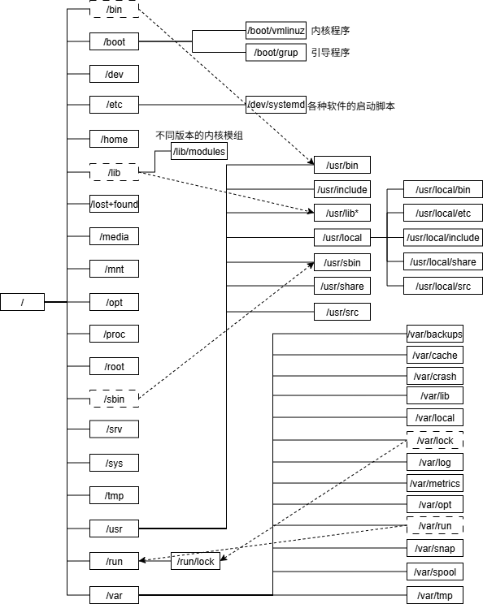

> Windows的文件系统，每个硬盘驱动器都有自己的目录树

#### LSB规范

> Linux Standard Base标准，、LSB标准查看方式

**LInux核心查看方式**

```shell
# 输出内核全部信息
root@tzj-virtual-machine:/# uname -a
Linux tzj-virtual-machine 6.8.0-65-generic #68~22.04.1-Ubuntu SMP PREEMPT_DYNAMIC Tue Jul 15 18:06:34 UTC 2 x86_64 x86_64 x86_64 GNU/Linux

# 输出内核版本
root@tzj-virtual-machine:/# uname -r
6.8.0-65-generic

# 输出内核平台
root@tzj-virtual-machine:/# uname -m
x86_64
```

**LSB版本查看方式**

```shell
# 安装lsb_release依赖
apt install lsb-core
yum install redhat-lsb

# 查看
root@tzj-virtual-machine:/etc/apt# lsb_release -a
LSB Version:	core-11.1.0ubuntu4-noarch:security-11.1.0ubuntu4-noarch
Distributor ID:	Ubuntu
Description:	Ubuntu 22.04.5 LTS
Release:	22.04
Codename:	jammy
```

### 对目录的操作

`cd`（change directory，切换目录）

```shell
cd 目标路径
```

|   命令    | 含义                   |
| :-------: | :--------------------- |
| cd 、cd ~ | 切换当前用户的主目录   |
|   cd .    | 当前目录               |
|   cd ..   | 上层目录               |
|   cd -    | 在最近两次目录之间切换 |

`pwd`（print working direcory，显示当前所在目录）

```shell
pwd -P
对于链接文件，显示真实路径
```

`mkdir`（make directory，创建新目录）

```shell
mkdir -mp 目录名
-m：配置目录权限
# 若不指定，则使用默认设定的权限——umask
mkdir -m 711 test2

-p：递归建立目录
mkdir -p test1/test2/test3/test4
```

`rmdir`（remove directory，删除目录）

```shell
rmdir -p 目录名
递归删除目录
```

`tree` （以树状图列出文件目录结构）

```shell
tree -d 只显示目录
```

### 2.2.3 对文件与目录的管理

- `ls` ：查看文件或目录属性
- `cp` ：复制文件或目录
- `rm`：删除文件或目录
- `mv`：移动文件或目录
- `basename` / `dirname`获取文件名或目录名

#### 输出信息ls

```shell
ls [-选项] [--参数] [文件名]

#windows 
dir 
```

| 分类         | 选项 | 参数                 | 含义                                                         |
| ------------ | ---- | -------------------- | ------------------------------------------------------------ |
| 显示特定文件 |      |                      |                                                              |
|              | -a   |                      | 全部文件，包括隐藏文件与  *.* 以及 *..*                      |
|              | -A   |                      | 全部文件，包括隐藏文件，不包括 *.* 与 *..*                   |
|              | -d   |                      | 仅列出目录                                                   |
| 输出格式     |      |                      |                                                              |
|              | -F   |                      | 根据文件、目录等信息，在文件名后添加标识<br />- [文件名]\*<br />- [目录名/]<br />- [socket文件名]=<br />- [FIFO文件名]\| |
|              | -h   |                      | 文件/目录容量表示为易读的方式（GB、KB等）                    |
|              | -l   |                      | 逐行显示每个文件的信息                                       |
|              | -R   |                      | 列出子目录内容                                               |
|              |      | --color=never        | 不依据文件类型显示不同颜色                                   |
|              |      | --color=always       | 依据文件类型显示不同颜色                                     |
|              |      | --color=auto         | 系统自行判断是否给予颜色                                     |
|              |      | --full-time          | 以完整时间模式输出                                           |
|              |      | --time=[atime,ctime] | 输出文件最近被获取(atime)或改变属性（ctime）的时间           |
| 文件名排序   |      |                      |                                                              |
|              | -f-  |                      | 直接列出结果，不进行排序（默认以文件名排序）                 |
|              | -r   |                      | 逆序输出文件列表                                             |
|              | -S   |                      | 以文件容量大小排序                                           |
|              | -t   |                      | 以时间顺序对文件排列                                         |
| 文件特殊属性 | -i   |                      | 列出文件的inode号                                            |
|              | -n   |                      | 列出UID与GID，而非字符名                                     |

```shell
root@tzj-virtual-machine:~# ls
snap

root@tzj-virtual-machine:~# ls -al
总计 44
drwx------  5 root root 4096  8月  6 14:54 .
drwxr-xr-x 20 root root 4096  8月  4 15:57 ..
-rw-------  1 root root 2229  8月  6 00:51 .bash_history
-rw-r--r--  1 root root 3106 10月 15  2021 .bashrc
drwx------  2 root root 4096  8月  4 21:27 .cache
-rw-------  1 root root   20  8月  6 00:11 .lesshst
-rw-r--r--  1 root root  161  7月  9  2019 .profile
drwx------  5 root root 4096  8月  4 16:04 snap
drwxr-xr-x  2 root root 4096  8月  4 16:24 .vim
-rw-------  1 root root 2513  8月  4 21:01 .viminfo
-rw-------  1 root root   65  8月  6 14:54 .Xauthority

root@tzj-virtual-machine:~# ls -alF
总计 44
drwx------  5 root root 4096  8月  6 14:54 ./
drwxr-xr-x 20 root root 4096  8月  4 15:57 ../
-rw-------  1 root root 2229  8月  6 00:51 .bash_history
-rw-r--r--  1 root root 3106 10月 15  2021 .bashrc
drwx------  2 root root 4096  8月  4 21:27 .cache/
-rw-------  1 root root   20  8月  6 00:11 .lesshst
-rw-r--r--  1 root root  161  7月  9  2019 .profile
drwx------  5 root root 4096  8月  4 16:04 snap/
drwxr-xr-x  2 root root 4096  8月  4 16:24 .vim/
-rw-------  1 root root 2513  8月  4 21:01 .viminfo
-rw-------  1 root root   65  8月  6 14:54 .Xauthority

root@tzj-virtual-machine:~# ls -al --full-time
总计 44
drwx------  5 root root 4096 2025-08-06 14:54:30.804000106 +0800 .
drwxr-xr-x 20 root root 4096 2025-08-04 15:57:22.783334996 +0800 ..
-rw-------  1 root root 2229 2025-08-06 00:51:58.600146220 +0800 .bash_history
-rw-r--r--  1 root root 3106 2021-10-15 18:06:05.000000000 +0800 .bashrc
drwx------  2 root root 4096 2025-08-04 21:27:51.256886989 +0800 .cache
-rw-------  1 root root   20 2025-08-06 00:11:48.507418817 +0800 .lesshst
-rw-r--r--  1 root root  161 2019-07-09 18:05:50.000000000 +0800 .profile
drwx------  5 root root 4096 2025-08-04 16:04:27.138000325 +0800 snap
drwxr-xr-x  2 root root 4096 2025-08-04 16:24:03.115327213 +0800 .vim
-rw-------  1 root root 2513 2025-08-04 21:01:31.093924724 +0800 .viminfo
-rw-------  1 root root   65 2025-08-06 14:54:30.804000106 +0800 .Xauthority
```

#### 复制cp

```shell
cp [-选项] [源文件1 源文件2 ...] 目标目录
```

| 选项 | 参数           | 含义                                                         |
| ---- | -------------- | ------------------------------------------------------------ |
| -a   |                | 同 -dr --preserve=all                                        |
| -d   |                | 若源文件为链接文件，复制链接文件的属性                       |
| -r   |                | 递归复制，用于复制目录                                       |
| -f   |                | 强制复制，若目标文件已经存在且无法开启，则移除后复制         |
| -i   |                | 若目标文件已存在，则覆盖前进行提示（information）            |
| -p   |                | 连同文件属性复制（权限、用户、时间），不使用默认属性         |
| -s   |                | 复制为符号链接文件（symbolic link）                          |
| -l   |                | 复制为硬链接文件（hard link）                                |
| -u   |                | （update）目标路径比源文件旧，或目标路径不存在，才会更新目标路径<br />仅当目标文件与源文件存在差异，才会复制 |
|      | --preserve=all | 所有属性，包括SELinux属性，links，xattr也会复制              |

```shell
# 直接复制，用户名、文件创建时间等属性会被改变
root@tzj-virtual-machine:~# cd /tmp/
root@tzj-virtual-machine:/tmp# cp /var/log/wtmp .
root@tzj-virtual-machine:/tmp# ls -l /var/log/wtmp wtmp 
-rw-rw-r-- 1 root utmp 12672  8月  6 14:54 /var/log/wtmp
-rw-r--r-- 1 root root 12672  8月  6 16:01 wtmp

# 全量复制
root@tzj-virtual-machine:/tmp# cp -a /var/log/wtmp wtmp1
root@tzj-virtual-machine:/tmp# ls -l /var/log/wtmp wtmp1 
-rw-rw-r-- 1 root utmp 12672  8月  6 14:54 /var/log/wtmp
-rw-rw-r-- 1 root utmp 12672  8月  6 14:54 wtmp1

# 切换用户，注意文件拥有者
tzj@tzj-virtual-machine:/tmp$ cp -a /var/log/wtmp wtmp2
tzj@tzj-virtual-machine:/tmp$ ls -l /var/log/wtmp wtmp2
-rw-rw-r-- 1 root utmp 12672  8月  6 14:54 /var/log/wtmp
-rw-rw-r-- 1 tzj  tzj  12672  8月  6 14:54 wtmp2
```

- 复制行为，目标文件的拥有者为指令操作者

---

```shell
# 链接文件
root@tzj-virtual-machine:~# ls -l .bashrc 
-rw-r--r-- 1 root root 3106 10月 15  2021 .bashrc

root@tzj-virtual-machine:~# cp -s .bashrc .bashrc_slink

root@tzj-virtual-machine:~# cp -l .bashrc .bashrc_hlink

root@tzj-virtual-machine:~# ls -l .bashrc .bashrc_slink .bashrc_hlink
-rw-r--r-- 2 root root 3106 10月 15  2021 .bashrc
-rw-r--r-- 2 root root 3106 10月 15  2021 .bashrc_hlink
lrwxrwxrwx 1 root root    7  8月  6 16:08 .bashrc_slink -> .bashrc
```

- 软链接，仅是新建符号链接文件，指向源文件
- 硬链接，创建新的文件名，与源文件指向同一inode

---

复制软链接文件

```shell
# 对于软链接文件，默认会复制源文件
root@tzj-virtual-machine:~# cp .bashrc_slink .bashrc_slink1
root@tzj-virtual-machine:~# ls -l .bashrc .bashrc_slink .bashrc_slink1
-rw-r--r-- 2 root root 3106 10月 15  2021 .bashrc
lrwxrwxrwx 1 root root    7  8月  6 16:08 .bashrc_slink -> .bashrc
-rw-r--r-- 1 root root 3106  8月  6 16:42 .bashrc_slink1

# 若仅复制链接文件，则需要加-d选项
root@tzj-virtual-machine:~# cp -d .bashrc_slink .bashrc_slink2
root@tzj-virtual-machine:~# ls -l .bashrc .bashrc_slink .bashrc_slink2
-rw-r--r-- 2 root root 3106 10月 15  2021 .bashrc
lrwxrwxrwx 1 root root    7  8月  6 16:08 .bashrc_slink -> .bashrc
lrwxrwxrwx 1 root root    7  8月  6 16:43 .bashrc_slink2 -> .bashrc
```

#### 删除rm

```shell
rm [-选项] 文件名
```

| 选项 | 参数 | 含义             |
| ---- | ---- | ---------------- |
| -f   |      | 强制移除，不询问 |
| -i   |      | 删除前询问       |
| -r   |      | 递归删除         |

```shell
# 若文件名以-开头，rm会将其识别为关键字，因此需要在其前加本目录
root@tzj-virtual-machine:~# touch ./-aaa
root@tzj-virtual-machine:~# ls -l
总计 4
-rw-r--r-- 1 root root    0  8月  6 16:48 -aaa
drwx------ 5 root root 4096  8月  4 16:04 snap
root@tzj-virtual-machine:~# rm -aaa
rm: 无效的选项 -- a
尝试使用 "rm ./-aaa" 删除文件 '-aaa'。
请尝试执行 "rm --help" 来获取更多信息。
root@tzj-virtual-machine:~# rm ./-aaa
```

#### 移动或更名mv

```shell
# 更名
mv [-选项] source destination
## rename可以同时对多个文件更名

# 移动
mv [-选项] source1 source2 source3 ... 目录
```

| 选项 | 参数 | 含义                                           |
| ---- | ---- | ---------------------------------------------- |
| -f   |      | 强制移动                                       |
| -i   |      | 移动前询问                                     |
| -u   |      | 若目标文件已存在，且源文件更新才覆盖（update） |
| -v   |      | 显示移动进度                                   |

#### 文件/目录搜索

##### whereis

```shell
whereis [-选项] 文件/目录名
```

> 局限性在于仅搜索特定的目录，速度虽然快，但一些文件可能找不到

| 选项 | 参数 | 含义                               |
| ---- | ---- | ---------------------------------- |
| -l   |      | 列出whereis主要查询的目录          |
| -b   |      | 只找二进制文件                     |
| -m   |      | 值找在manual路径下的文件           |
| -s   |      | 只找source文件                     |
| -u   |      | 搜索不在上述三个路径的其他特殊文件 |

```shell
范例一：请找出 ifconfig 这个档名
[root@study ~]# whereis ifconfig
ifconfig: /sbin/ifconfig /usr/share/man/man8/ifconfig.8.gz

范例二：只找出跟 passwd 有关的『说明文件』档名(man page)
[root@study ~]# whereis passwd # 全部的档名通通列出来！
passwd: /usr/bin/passwd /etc/passwd /usr/share/man/man1/passwd.1.gz
/usr/share/man/man5/passwd.5.gz
[root@study ~]# whereis -m passwd # 只有在 man 里面的档名才抓出来！
passwd: /usr/share/man/man1/passwd.1.gz /usr/share/man/man5/passwd.5.gz
```

##### locate/updatedb

```shell
locate -ir 文件名
```

| 选项 | 参数 | 含义                                                         |
| ---- | ---- | ------------------------------------------------------------ |
| -i   |      | 忽略大小写                                                   |
| -c   |      | 仅计算找到的文件数量                                         |
| -l n |      | 仅输出前n个文件                                              |
| -S   |      | 输出locate使用的数据库文件信息，包括该数据库记录的文件/目录数 |
| -r   |      | 正则查询                                                     |

> 局限性：locate在/var/lib/mlocate/数据库中搜索，因此，只有特定时间才会自动更新数据库信息，所以最近创建的文件并不会被收录
>
> - updatedb：手动更新locate数据库
>
>   updatedb读取 */etc/updatedb.conf* 配置文件的设定，再去硬盘进行文件搜索指令。

##### find

```shell
find 路径 [-选项] 参数
```

> find指令会搜索次目录
>
> find支持通配符
>
> ```shell
> # 查找包含httpd的文件名
> find /etc -name '*httpd*'
> 
> # 查找所有以大写字母为首字母的文件
> find ./ -name "[A-Z]*" 
> ```

**依时间搜索**：-mtime、-ctime、-atime

| 选项   | 参数 | 含义                                         |
| ------ | ---- | -------------------------------------------- |
| -mtime | n    | 在[n+1,n]天范围内改动过的文件                |
| -mtime | +n   | 在(,n+1)天范围内，改动过的文件               |
| -mtime | -n   | 在[n,0]天范围内，改动的文件                  |
| -newer | file | file作为已存在的文件，列出必file还要新的文件 |

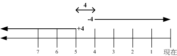

**依用户或群组搜索**

| 选项     | 参数 | 含义                                           |
| -------- | ---- | ---------------------------------------------- |
| -uid     | n    | 用户UID，表示搜索属于用户UID的文件             |
| -gid     | n    | 群组GID，表示搜索属于群组GID的文件             |
| -user    | name | 用户名，搜索用户名为name的文件                 |
| -group   | name |                                                |
| -nouser  |      | 搜索文件拥有者不存在于 */etc/passwd* 的文件    |
| -nogroup |      | 搜索文件的拥有群组不存在于 */etc/group* 的文件 |

**依权限搜索**

| 选项  | 参数      | 含义                                                         |
| ----- | --------- | ------------------------------------------------------------ |
| -name | filename  | 搜索文件名为filename的文件                                   |
| -size | [+/-]s[x] | 搜索文件容量比s还大(+)或小(-)的文件<br />x表示容量单位：<br />- c：字节<br />- k：KB |
| -type | t         | 文件类型为t的文件<br />- f：一般文件<br />- b/c：块设备/字符设备文件<br />- d：目录<br />- l：链接文件<br />- s：socket文件<br />- p：FIFO文件 |
| -perm | mode      | 文件权限恰好为mode的文件                                     |
| -perm | -mode     | 文件权限包括所有mode的文件                                   |
| -perm | /mode     | 文件权限包含任一mode的文件                                   |

```shell
搜寻 -rwxr--r-- ，亦即 0744 的文件，使用 -perm -0744，
当一个文件的权限为 -rwsr-xr-x ，亦即 4755 时，也会被列出来，

搜寻 -rwxr-xr-x ，亦即 -perm /755 时，但一个文件属性为 -rw-------
也会被列出来

如：想要找出来/usr/bin, /usr/sbin 这两个目录下，只要具有 SUID 或SGID 就列出来该文件
[root@study ~]# find /usr/bin /usr/sbin -perm /6000
```

| 选项 | 参数          | 含义                             |
| ---- | ------------- | -------------------------------- |
|      | -exec command | 利用其他指令，对搜索结果进行处理 |
|      | -print        | 将结果打印到屏幕上               |

```shell
find /usr/bin /usr/sbin -perm /7000 -exec ls -l {} \;
```

- `{}` 表示 `find /usr/bin /usr/sbin -perm /7000` 的搜索结果
- `;` 表示-exec的结束关键字
- 因为 `;` 为指令顺序执行关键字，所以需要转义字符 `\;`

## 2.3 文件系统

一组可被挂载到操作系统的数据称为 **文件系统** 

- 传统文件系统，一个分区仅能被格式化为一个文件系统
- 目前，可将一个分区格式化为多个文件系统（LVM），也可将多个分区合并为一个文件系统（LVM，RAID）

**所有Unix/Linux的数据都是由文件系统按照树型目录结构管理的**

- 数据内容会占据一定量的扇区，通过一个文件名指针指向这组扇区，这些数据扇区与文件名被组织为一个文件

  硬链接文件相当于为该数据区新增一个文件名指针

- 目录文件记录这些文件的层次结构

**文件系统可以挂载到目录树的某个挂载点，以该目录作为文件系统的访问入口**

### 2.3.1 文件系统概念

#### 硬件支持

**磁盘**

- 盘片——数据记录载体
- 磁盘读取头通过机械臂的移动擦写磁盘上的数据
- 主轴马达——驱动盘片转动

**磁盘分区**

- 扇区（sector）是最小的物理存储单元——512B与4KB两种
- 同一圆环上的扇区组成柱面（cylinder）
- 早期磁盘以柱面为单位分区（一个分区包含多个柱面），目前以扇区为单位分区（一个分区多个扇区）
- 磁盘分区表：早期MBR（限制多），目前GPT
  - MBR分区，第一个扇区（512B），前446B包含开机扇区（Master Boot record），后64B为分区表，最多4个主分区，更多的分区需要引入延伸分区，最大磁盘容量为2TB
  - GPT分区，支持的磁盘容量超2TB

**磁盘文件名**

- 物理磁盘设备的文件名 */dev/sd[a-p]*
- 虚拟机磁盘的文件名 */dev/vd[a-p]*
- 磁盘阵列的文件名 */dev/md[0-128]*

**格式化**——操作系统对分区中的数据格式进行约定

每种操作系统设定的文件属性/权限不尽相同，所以需要对分区进行格式化，成为操作系统支持的文件系统

- Win98前，主要的文件系统是FAT（FAT16）
- Win2000后，NTFS
- Linux为EXT家族及XFS

#### 文件系统的三种关键数据

文件系统中的所有数据记录在不同类型的数据块中，这些数据块本质上都是磁盘的扇区

- 超块（super block）：记录文件系统元数据（inode/block总量、使用量、剩余量）
- inode：文件元数据（文件权限与属性，数据块号）
  - 一个文件占用一个inode
- data block：实际记录文件的内容

每个inode与block都有编号

> 分类：
>
> - 索引式文件系统：inode中记录该文件所有的block编号
>
>   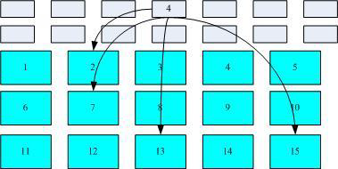
>
>   - EX2、EX3
>
> - 链式文件系统：每个block的编号记录在上一个block中
>
>   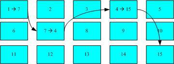
>
>   - FAT
>   - 碎片整理：将同一个文件所属的blocks整合在较近的扇区，便于数据的读写

### 2.3.2 文件系统的组成

#### EXT2文件系统的组成

EXT2文件系统的inode与block在格式化完成后，就固定不再变动

EXT2文件系统在格式化时，将整个磁盘分为多个扇区组（block group），每个扇区组都有独立的 inode/block/superblock 系统

- 每个文件系统前部都有一个启动扇区（boot sector），可以安装开机管理程序

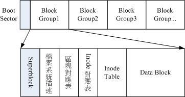

##### 数据块

用于放置文件内容，EXT2系统支持的block大小有1KB、2KB及4KB

- 块大小与块数量，在文件系统格式化后无法改变

  若block较小，一个大型文件会占用更多的block，inode也需要记录更多的block号，导致文件系统读写性能不佳

- 每个block都有编号

- 每个block最多放一个文件的数据，剩余容量不可被其他文件使用

##### inode表

inode记录的信息，至少包括

- 文件的存取权限（read、write、execute）
- 文件特殊权限标志（SUID等）
- 文件的拥有者与群组（owner/group）
- 文件的容量
- 文件的访问、内容与状态修改时间（atime、mtime、ctime）
- 文件的block号（指针）

inode特点

- inode的大小与数量在格式化时被固定
- 每个文件仅占用一个inode
- 每个inode大小固定为128B，EXT4与XFS可设置为256B
  - **文件系统能建立的文件数与inode数有关**

###### inode编号相关

```shell
[root@node1 ~]# ls -lid / /boot /home
128 dr-xr-xr-x. 19 root root  269  8月 25 15:25 /
128 dr-xr-xr-x.  7 root root 4096  8月 21 17:03 /boot
138 drwxr-xr-x   2 root root    6  4月  3  2021 /home

[root@node1 ~]# df -h
...
/dev/mapper/klas-root  422G   12G  410G    3% /
tmpfs                   63G   32M   63G    1% /tmp
/dev/sda2             1014M  164M  851M   17% /boot
...
```

- XFS文件系统最顶层目录的indoe为128
- 每个文件系统都有独立的inode编号空间。可见， */* 与 */boot*  是不同的文件系统

```shell
[root@node1 ~]# ls -ild / /. /..
128 dr-xr-xr-x. 19 root root 269  8月 25 15:25 /
128 dr-xr-xr-x. 19 root root 269  8月 25 15:25 /.
128 dr-xr-xr-x. 19 root root 269  8月 25 15:25 /..
```

- 对于同一个文件系统，一个inode只会对应到一个文件内容，所以可以通过inode号判断是否为同一个文件

###### inode数的计算

$$
\frac{\text{inode table占用块数}\times 块大小}{每个inode占用字节数}
$$

```shell
[root@study ~]# dumpe2fs /dev/vda5
....(中间省略)....
Block size: 4096 # 单个 block 的容量大小
....(中间省略)....
Inode size: 256 # inode 的容量大小！已经是 256 了喔！
....(中间省略)....
## 超块在0组的第0号block
Group 0: (Blocks 0-32767) # 第一块 block group 位置
Checksum 0x13be, unused inodes 8181
Primary superblock at 0, Group descriptors at 1-1 # 主要 superblock 的所在喔！
Reserved GDT blocks at 2-128
## bitmap占第2~128号block
Block bitmap at 129 (+129), Inode bitmap at 145 (+145)
## inode table占第161~672号block
Inode table at 161-672 (+161) # inode table 的所在喔！
....(中间省略)....
```

- 即共 $(672-161+1)$ 个block，bitmap $(672-161+1)*4KB/256B=8192$ 个inode

###### inode/block与文件大小的关系

不同块大小的文件系统支持，所支持的最大单一文件容量与磁盘容量不同

| 块大小               | 1KB  | 2KB   | 4KB  |
| -------------------- | ---- | ----- | ---- |
| 最大单一文件限制     | 16GB | 256GB | 2TB  |
| 最大文件系统容量限制 | 2TB  | 8TB   | 16TB |

某些应用程序只能捕捉小于2GB的文件，与文件系统无关

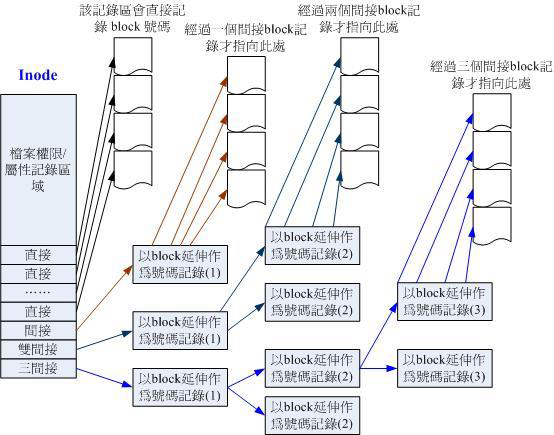

**inode记录block号需4B**

inode记录block号的区域为：12个直接地址、1个间接地址、一个二间接地址、一个三间接地址。每个间接地址用一个block记录block号

block大小为1KB：

- 12个直接地址记录的大小为12KB
- 1个间接地址记录的block数为 $\frac{1KB}{4B}=256$ 个，文件大小为256KB
- 2个间接地址记录的block数为 $256*256=2^{16}$个，文件大小为 $2^{26}B=64MB$
- 3个间接地址记录的block数为 $256*256*256=2^{24}$ 个，文件大小为 $2^{34}B=16GB$

因此，块大小为1KB时，一个文件最大容量为 $12KB+256KB+64MB+16GB\approx 16GB$

块大小为2KB时，一个block最多容纳约为 $\frac{2KB}{4B}=512$ 个block地址，文件最大容量约为 $512^3*2KB=2^{38}B=256GB$

块大小为4KB时，一个block最多容纳约为 $\frac{4KB}{4B}=1024$ 个block地址，文件最大容量约为 $1024^3*2KB=2^{41}B=2TB$

##### inode bitmap（inode对照表）

标记每个inode的使用情况

##### block bitmap（区块对照表）

标记每个block的使用情况

##### filesystem description（文件系统描述说明）

> `dumpe2fs` 会输出这部分信息

- 每个block group的开始与结束block号
- 每个区段（superblock、bitmap、inodemap、data block）分别位于哪个block间

##### superblock（超块）

superblock会位于第一个block group，其他block group中的超块均为其备份

- 超块一般记录在每个block group的第一个block

记录的信息

- block与inode的总数
- 未使用与已使用的inode/block数量
- block与inode的大小
- 文件系统相关信息：挂载时间、最近一次写入数据的时间、最近一次检验磁盘（fsck）的时间
- valid bit（可用标志），挂载为0，可被挂载为1

#### XFS文件系统组成

**EXT弊端**

- EXT文件系统对文件系统格式化：预先规划出所有的inode、block、元数据，不会动态调整

- 随着磁盘容量增大，格式化效率很低

- 虚拟化的应用越来越广泛，通常使用巨型文件作为虚拟化磁盘的来源

XFS是性能更好的，更适合高容量磁盘与巨型文件的文件系统

##### 数据区（data section）

数据区包含 inode、data block、superblock

与EXT家族与block group类似，分为多个存储区群组（allocation groups，AG）放置数据

每个存储组包含：

- 整个文件系统的super block
- 剩余空间的管理机制
- inode的分配机制

inode与block只有在系统需要用到时，才会动态配置产生，所以格式化操作很快

XFS的block与inode可设置多种容量

- block容量从 512B~64KB，但由于内容控制（页面文件pagesize的容量），block最高支持4KB

- inode容量可由256B到2MB

##### 文件系统活动日志区（log section）

日志区用于记录文件系统的更新，直至更新完整地写入数据区，相应的记录才会停止

日志区是磁盘区块活动相当频繁的，可以指定外部磁盘作为XFS文件系统的日志区

##### 实时运行区（realtime section）

文件系统要被建立时，XFS会在该区找若干个extent区

先将文件放置在该extent区块中，分配完毕后，再将这些数据写入到 数据区（data section）的 inode 与 block 中。

extent 区块的大小在文件系统格式化时就被指定，4KB~1GB

- 非磁盘阵列，设为64KB
- 磁盘阵列，extent区块设为与RAID的stripe大小一致

#### 其他Linux支持的系统与VFS

```shell
# 查看Linux支持的文件系统
ls -l /lib/modules/$(uname -r)/kernel/fs
```

- 传统文件系统：ext2 、minix、MS-DOS、FAT、iso
- 日志式文件系统：EXT3、EXT4、ReiserFS、Windows NTFS、ZFS、IBM JFS、SGI XFS
- 网络文件系统：NFS、SMBFS

```shell
# 系统目前已加载到内存中支持的文件系统
cat /proc/filesystems
```

##### VFS

Linux通过VFS（Virtual Filesystem Switch）对系统支持的文件系统进行管理

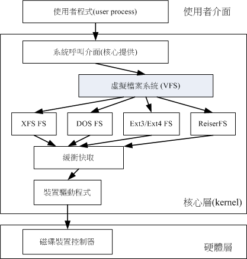

Linux并不需要知道每个分区上的文件系统时什么，VFS作为文件系统抽象层，封装了每种文件系统的存取操作

#### 查看文件系统

##### EXT文件系统

```shell
# 读取EXT家族的文件系统信息
dumpe2fs [-bfghimxV] [-o superblock=<超级块编号>] [-o blocksize=<块大小>] 设备
```

| 选项 | 参数 | 含义                                    |
| ---- | ---- | --------------------------------------- |
| -d   |      | 仅列出磁盘本身，不列出磁盘的分区数据    |
| -f   |      | 列出磁盘内的文件系统名称                |
| -i   |      | 以ASCII输出，不适用复杂编码             |
| -m   |      | 输出设备在 */dev* 底下的权限数据（rwx） |
| -p   |      | 列出该装置的完整文件名                  |
| -t   |      | 列出磁盘的详细数据                      |
| -h   |      | 仅列出超块的数据，不列出其他属性信息    |

##### XFS文件系统

```shell
xfs_info 挂载点|设备文件名
```

```shell
# 获取指定类型的文件系统
[root@node1 ~]# df -t xfs
文件系统                  1K-块     已用      可用 已用% 挂载点
/dev/mapper/klas-root 441603404 11910412 429692992    3% /
/dev/sda2               1038336   166936    871400   17% /boot

# 查看xfs文件系统的信息
[root@node1 ~]# xfs_info /
meta-data=/dev/mapper/klas-root  isize=512    agcount=4, agsize=27613696 blks
         =                       sectsz=512   attr=2, projid32bit=1
         =                       crc=1        finobt=1, sparse=1, rmapbt=0
         =                       reflink=1
data     =                       bsize=4096   blocks=110454784, imaxpct=25
         =                       sunit=0      swidth=0 blks
naming   =version 2              bsize=4096   ascii-ci=0, ftype=1
log      =internal log           bsize=4096   blocks=53933, version=2
         =                       sectsz=512   sunit=0 blks, lazy-count=1
realtime =none                   extsz=4096   blocks=0, rtextents=0

```

- isize：inode的容量，每个512B

  agcount为 AG 的数量，共4个

  agsize 为每个AG中包含的 block 数

  sectsz为逻辑扇区（sector）的容量为512B

- bsize：block容量，每个block为4KB，blocks为区块数

- sunit与swidth，与RAID的条带相关

- internal log指日志区位于文件系统内。并未使用外部存储

  bsize与blocks与上述含义一致

- realtime 为 realtime区，每个扩展区容量为4KB

### 2.3.3 文件读写与性能

#### 目录文件与目录树

在Linux下的文件系统建立目录时，文件系统会为该目录分配至少一个inode与一块block

- inode记录元数据

- block内的数据：当前目录下的文件名及其对应的inode编号

  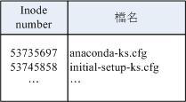

```shell
ls -i [路径]
# 查看路径下文件的inode号
total 8
53735697 -rw-------. 1 root root 1816 May 4 17:57 anaconda-ks.cfg
53745858 -rw-r--r--. 1 root root 1864 May 4 18:01 initial-setup-ks.cfg
```

- 文件：文件系统会为每个文件分配一个inode与相对于该文件大小的block数

  先计算改文件的block数，再确定inode结构

#### 文件的读取流程

- 通过目录inode中指示的block号，找到文件的inode号，进而定位目标block

目录树都是从根目录开始，系统通过挂载的信息可以找到挂载点的inode号，进而得到根目录inode内容，依据该inode读取根目录block内的文件名数据，再依次逐层读取正确的文件名

1. 根目录 */* 的inode：

   通过挂载点信息，找到根目录的inode号，验证inode中的读写权限后，才能从指定的block中读取内容

2. 根目录 */* 的block：

   从block保存的 **[文件名,inode号]** ，找到二级目录的inode号

3. 二级目录的 inode：

   读取二级目录inode中保存的信息，验证用户对该目录具有 r 和 x 权限，因此可以获取二级目录 block 的内容

4. 二级目录的block：

   获取二级目录内文件的inode号

5. 文件的inode：

   获取文件inode的信息，确定用户对该文件的权限，获取block号

6. 文件的block：

   将该block的内容返回或更新内容

#### EXT文件系统的写入

1. 确定用户对于新增文件所在的目录是否具有 w 和 x权限，若有才能新增
2. 根据 inode bitmap，获得一个可用的inode号，并向inode写入新文件元数据
3. 根据 block bitmap，获得一个可用的block号，并将数据写入block中，更新 inode 的block指向数据
4. 将刚写入的 inode 和 block 数据同步更新 inode bitmap 与 block bitmap ，并更新 super block 内容

##### 数据不一致状态

文件写入时，需要修改的元数据仅涉及 inode table 与 block table

若元数据未同步完成，则会发生元数据内容与实际数据存放区不一致的现象

系统在重新启动时，会通过超块中记录的 valid bit（是否有挂载）与 filesystem state（是否clean）等标志位，判断是否强制进行一致性检查

- 使用 `e2fsck` 进行检查：会对比元数据区域与实际的数据存放区，耗时长，后续使用日志式文件系统

##### 日志式文件系统

日志：文件系统中规划处一个区块，专门记录写入或修改文件的操作过程

日志式文件系统的基本写入过程：

1. 预备：当系统要写入文件时，会先在日志记录区块中记录某个文件准备写入的数据
2. 实际写入：写入文件的权限，写入数据，写入元数据
3. 结束：完成数据与元数据的更新后，在日志记录区中完成该文件的记录

在整个数据记录过程中发生故障，仅需要检查日志记录区块，不必针对整个文件系统检查

```shell
Journal inode: 8
Journal backup: inode blocks
Journal features: (none)
Journal size: 32M
Journal length: 8192
Journal sequence: 0x00000001
```

- 可见，日志文件元数据记录在inode 8中，实际的日志数据保存在inode记录的block中

#### 文件系统的读写性能

##### Linux文件系统的异步写入

系统会将常用的文件数据写入内存，加速文件的读写

- 当系统将一个文件加载到内存区段，若该文件并未被改动，则内存中的文件数据会被设为clean
- 当内存中的文件被改动后，则该数据会被设为 Dirty，所有数据保存在内存中，并不会立即写入硬盘，后续系统将择机将内存中的dirty数据写回硬盘

但物理内存空间有限，可以使用 `sync` 指令，将内存中被设为 Dirty 的数据强制下刷到硬盘

正常关机时，关机指令会主动调用 `sync` 指令

不正常关机，重启时会花费较长时间进行磁盘检验，若无法恢复则造成文件系统损毁

##### 文件系统大小与性能

文件数据离散问题：数据被填入式地放入未被使用的block中

磁盘读写头要在整个文件系统中频繁读取，若文件数据过于离散，会导致读写性能很低

- 可以将整个文件系统内的数据全部复制，然后重新格式化，再将数据复制回去

#### EXT2文件系统的空间浪费

由于一个block中仅可存放一个文件的内容，即使是一个小文件，也会占用一个Block

```shell'
root@tzj-virtual-machine:~# ll -sh
total 72K
4.0K drwx------  7 root root 4.0K  9月 12 10:04 ./
4.0K drwxr-xr-x 20 root root 4.0K  7月 30 19:05 ../
8.0K -rw-------  1 root root 7.1K  9月 12 09:46 .bash_history
4.0K -rw-r--r--  1 root root 3.1K 10月 15  2021 .bashrc
4.0K drwx------  2 root root 4.0K  8月  1 13:05 .cache/
4.0K -rw-r--r--  2 root root 1.2K  3月 23  2022 crontab
4.0K -rw-------  1 root root   20  9月 12 09:33 .lesshst
4.0K drwxr-xr-x  3 root root 4.0K  7月 30 12:12 .local/
4.0K -rw-r--r--  1 root root  161  7月  9  2019 .profile
4.0K drwx------  5 root root 4.0K  7月 30 19:25 snap/
4.0K drwxr-xr-x  3 root root 4.0K  9月 11 10:45 test/
4.0K drwxr-xr-x  2 root root 4.0K  9月  9 16:53 .vim/
 16K -rw-------  1 root root  14K  9月 12 10:04 .viminfo
4.0K -rw-------  1 root root  260  9月 12 09:48 .Xauthority
```

如 *.lesshst* 仅有20B，但仍会占用一个block

`ls -lh` 第一列的值为该文件占用的磁盘空间 $=占用的Block数\times Block大小$

### 2.3.4 文件系统的操作

#### 文件系统信息获取

##### 获取分区中的各文件系统信息

**df指令读取的信息在超块中**

```shell
root@tzj-virtual-machine:~# df
Filesystem                1K-blocks     Used Available Use% Mounted on
tmpfs                        808408     2064    806344   1% /run
/dev/mapper/vgubuntu-root  48753324 25519996  20724324  56% /
tmpfs                       4042036        0   4042036   0% /dev/shm
tmpfs                          5120        4      5116   1% /run/lock
/dev/sda2                    524252     6228    518024   2% /boot/efi
tmpfs                        808404      104    808300   1% /run/user/1000
tmpfs                        808404       64    808340   1% /run/user/0 
```

- Filesystem：代表文件系统所在的分区，列出设备名
- 1k-blocks：以1KB为单位列出块数
- Used：已使用的磁盘容量
- Available：当前分区剩余的容量
- Use%：磁盘空间使用率
- Mounted on：挂载点

| 选项 | 参数 | 含义                                   |                                                              |
| ---- | ---- | -------------------------------------- | ------------------------------------------------------------ |
| -a   |      | 列出所有的文件系统（包括内存文件系统） |                                                              |
| -k   |      | 显示文件系统分区容量（KB）             | 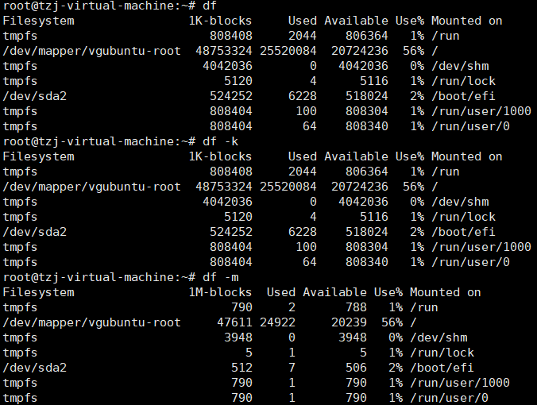 |
| -m   |      | 显示文件系统分区容量（MB）             |                                                              |
| -h   |      | 以人类易读的格式显示                   | 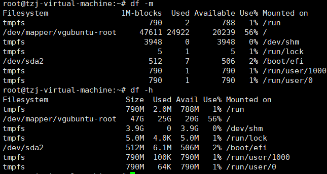 |
| -H   |      | 以M=1000K的进位方式显示                | 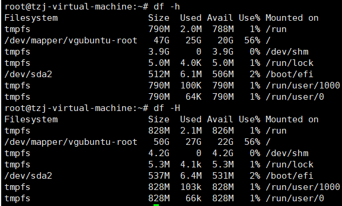 |
| -T   |      | 列出分区的文件系统类型                 | 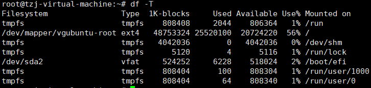 |
| -i   |      | 不显示磁盘容量，以inode的数量显示      | 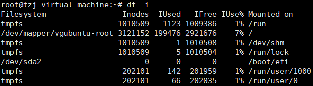 |

```shell
root@tzj-virtual-machine:~# df -a
df: /run/user/0/doc: Operation not permitted
Filesystem                1K-blocks     Used Available Use% Mounted on
sysfs                             0        0         0    - /sys
proc                              0        0         0    - /proc
udev                        4000964        0   4000964   0% /dev
devpts                            0        0         0    - /dev/pts
tmpfs                        808408     2060    806348   1% /run
/dev/mapper/vgubuntu-root  48753324 25520000  20724320  56% /
securityfs                        0        0         0    - /sys/kernel/security
tmpfs                       4042036        0   4042036   0% /dev/shm
```

*/dev/shm* 是利用内存虚拟出来的磁盘空间，通常是总物理内存的一半

- 通过内存仿真出来的磁盘，在该目录下创建的数据文件，访问速度非常快
- 但创建的内容下次开机就消失

##### 获取文件或目录的占用量

```shell
root@tzj-virtual-machine:~# mkdir test ; cd test ; echo "hello" >> test.txt | echo "hello aaaaa" >> test2.txt ; mkdir hello ; cd hello; echo "hello1" >> hello1.txt ; echo "hello2" >> hello2.txt

# du 默认情况，只会显示当前目录下，所有目录的容量
root@tzj-virtual-machine:~/test# du 
12	./hello
24	.

# du -a 会显示当前目录下，所有目录与文件的容量
root@tzj-virtual-machine:~/test# du -a
4	./hello/hello2.txt
4	./hello/hello1.txt
12	./hello
4	./test2.txt
4	./test.txt
24	.

# 仅列出当前目录下的总容量
root@tzj-virtual-machine:~/test# du -s
24	.

# 仅列出当前目录下的二级目录
root@tzj-virtual-machine:~/test# du -S
12	./hello
12	.

root@tzj-virtual-machine:~/test# rm -rf *
root@tzj-virtual-machine:~/test# du -a
4	.									<===空目录占用4KB
```

| 选项 | 参数 | 含义                                 |
| ---- | ---- | ------------------------------------ |
| -a   |      | 列出当前目录下，所有文件与目录的容量 |
| -h   |      | 以人类较易读懂的容量格式显示         |
| -s   |      | 列出总量，不列出各目录占用的容量     |
| -S   |      | 不包括子目录下的总计                 |
| -k   |      | 以KB列出容量显示                     |
| -m   |      | 以MB列出容量显示                     |

`du` 指令会直接搜索文件系统内所有的文件数据，搜索范围越大，执行时间越长

```shell
# 会输出当前目录下所有二级目录及文件的容量，可观察哪个此目录占用的容量大
du -s *
```

#### 创建文件链接

符号链接（Symbolic link）：创建快捷方式

- 创建新的文件，文件内容为源文件的文件名

硬链接（Hard link）：通过inode链接产生新的文件名（只是在某一目录下新增一个文件名）

- 由于链接到同一个indoe，所以该文件名对应的内容一致

##### 硬链接

```shell
root@tzj-virtual-machine:~# ll -i /etc/crontab 
655509 -rw-r--r-- 1 root root 1136  3月 23  2022 /etc/crontab
root@tzj-virtual-machine:~# ln /etc/crontab crontab
root@tzj-virtual-machine:~# ls
crontab  snap  test
root@tzj-virtual-machine:~# ll -i /etc/crontab crontab 
655509 -rw-r--r-- 2 root root 1136  3月 23  2022 crontab
655509 -rw-r--r-- 2 root root 1136  3月 23  2022 /etc/crontab
```

inode2 为目录的indoe，在该inode中记录 */rtc/* 目录文件所在的block，读取该block数据内容，可知 *crontab* 文件的inode号-real，real号指向文件内容实际所在的block

若 */root/crontab* 为硬链接文件，可见 */root* 目录中，文件名链接到同一个inode-real

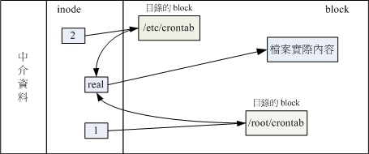

- 不管对哪个文件名进行编辑，最终结果都会写入相同的inode与block

- 如果将二者中的任一文件名删除，inode与block都存在

  删除操作只是将目录中的文件名删除，原始的inode与block没有变动
  
  ```shell
  root@dc_1214:~# mkdir test ; cd test ; echo "hello" >> test.txt | echo "hello aaaaa" >> test2.txt ; mkdir hello ; cd hello; echo "hello1" >> hello1.txt ; echo "hello2" >> hello2.txt
  root@dc_1214:~/test/hello# cd ..
  root@dc_1214:~/test# tree
  .
  ├── hello
  │   ├── hello1.txt
  │   └── hello2.txt
  ├── test2.txt
  └── test.txt
  
  1 directory, 4 files
  
  root@dc_1214:~/test# ll -i test.txt
  4866834 -rw-r--r-- 1 root root 6 Sep 11 09:02 test.txt
  
  # 创建硬链接文件
  root@dc_1214:~/test# ln test.txt ~/test/hello/test.txt
  root@dc_1214:~/test# ll -i test.txt ~/test/hello/test.txt
  4866834 -rw-r--r-- 2 root root 6 Sep 11 09:02 /root/test/hello/test.txt
  4866834 -rw-r--r-- 2 root root 6 Sep 11 09:02 test.txt
  root@dc_1214:~/test# tree
  .
  ├── hello
  │   ├── hello1.txt
  │   ├── hello2.txt
  │   └── test.txt
  ├── test2.txt
  └── test.txt
  
  1 directory, 5 files
  root@dc_1214:~/test# rm test.txt 
  root@dc_1214:~/test# ll -i ~/test/hello/test.txt 
  4866834 -rw-r--r-- 1 root root 6 Sep 11 09:02 /root/test/hello/test.txt
  ```

硬链接只是在某个目录的block中多写入一条关联记录，因此，磁盘的空间与inode的数目不变

硬链接需要在同一文件系统中进行，不能跨文件系统，也不能链接一个目录

- 若硬链接到目录，目录下的文件也需要被链接

  若此时在新链接目录下创建文件，则原目录下对该新文件也需要被建立链接，会增加系统的复杂度

##### 软链接

软链接（Symbolic link，符号链接）是建立一个独立的文件，对该数据的读取指向被链接的文件名

```shell
ln [-sf] 源文件 目标文件
```

| 选项 | 参数 | 含义                                                         |
| ---- | ---- | ------------------------------------------------------------ |
| -s   |      | 不加任何参数，创建的是硬链接，<br />使用-s参数，创建符号链接文件 |
| -f   |      | 如果目标文件存在，则将目标文件移除后再建立                   |

- 符号链接文件的inode中，读取到链接文件的内容为 原文件名 ，根据文件名去获取被链接文件的inode，进而读取到实际存储的内容

  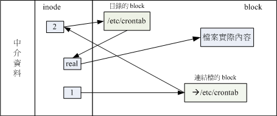

  ```shell
  root@tzj-virtual-machine:~/test# echo "aaaaa" > test.txt
  root@tzj-virtual-machine:~/test# ln -s ./test.txt softlink_test_relative
  root@tzj-virtual-machine:~/test# ln -s /root/test/test.txt softlink_test_absolute
  root@tzj-virtual-machine:~/test# cat softlink_test_absolute 
  aaaaa
  root@tzj-virtual-machine:~/test# cat softlink_test_relative 
  aaaaa
  
  # readlink读取链接文件实际存储的内容
  root@tzj-virtual-machine:~/test# readlink softlink_test_absolute 
  /root/test/test.txt
  root@tzj-virtual-machine:~/test# readlink softlink_test_relative 
  ./test.txt
  ```

  *softlink_test_absolute* 记录的内容是 /root/test/test.txt，所以文件大小为19B

  *softlink_test_relative* 记录的内容是 ./test.txt，所以文件大小为10B

  ```shell
  root@tzj-virtual-machine:~/test# ls -al
  total 12
  drwxr-xr-x  2 root root 4096 10月  9 19:39 .
  drwx------ 10 root root 4096 10月  9 19:34 ..
  lrwxrwxrwx  1 root root   19 10月  9 19:39 softlink_test_absolute -> /root/test/test.txt
  lrwxrwxrwx  1 root root   10 10月  9 19:38 softlink_test_relative -> ./test.txt
  -rw-r--r--  1 root root    6 10月  9 19:37 test.txt
  ```

- 源文件被删除或移动后，链接文件由于找不到原始的文件名，将打不开

- 移动链接文件

  - 由于使用相对路径建立的链接文件，记录的路径中找不到原文件，所以无法访问，
  - 但使用绝对路径建立的链接文件，可以找到原文件，所以有输出内容

  ```shell
  root@tzj-virtual-machine:~/test# tree
  .
  ├── softlink_test_absolute -> /root/test/test.txt
  ├── softlink_test_relative -> ./test.txt
  └── test.txt
  
  0 directories, 3 files
  root@tzj-virtual-machine:~/test# mkdir test_bak
  root@tzj-virtual-machine:~/test# mv softlink_test_* test_bak/
  root@tzj-virtual-machine:~/test# tree
  .
  ├── test_bak
  │   ├── softlink_test_absolute -> /root/test/test.txt
  │   └── softlink_test_relative -> ./test.txt
  └── test.txt
  
  1 directory, 3 files
  root@tzj-virtual-machine:~/test# cd test_bak/
  root@tzj-virtual-machine:~/test/test_bak# cat softlink_test_absolute 
  aaaaa
  root@tzj-virtual-machine:~/test/test_bak# cat softlink_test_relative 
  cat: softlink_test_relative: No such file or directory
  root@tzj-virtual-machine:~/test/test_bak# 
  ```

- 符号链接建立的文件是独立的新文件，会占用inode与block

```shell
root@tzj-virtual-machine:/tmp# cd /tmp/
root@tzj-virtual-machine:/tmp# cp -a /etc/passwd .
# 记录当前目录初始占用的容量，182443B，inode使用数量为204885
root@tzj-virtual-machine:/tmp# du -sb ; df -i .
182443	.
Filesystem                 Inodes  IUsed   IFree IUse% Mounted on
/dev/mapper/vgubuntu-root 3121152 !204885! 2916267    7% /

root@tzj-virtual-machine:/tmp# ln passwd passwd-hd
## 创建硬链接文件后，inode使用数量不变，目录占用的容量也不变
root@tzj-virtual-machine:/tmp# du -sb ; df -i .
182443	.
Filesystem                 Inodes  IUsed   IFree IUse% Mounted on
/dev/mapper/vgubuntu-root 3121152 !204885! 2916267    7% /
## 且indoe为同一个
root@tzj-virtual-machine:/tmp# ls -il passwd*
393220 -rw-r--r-- 2 root root 2927  7月 30 14:30 passwd
393220 -rw-r--r-- 2 root root 2927  7月 30 14:30 passwd-hd

# 创建软链接文件
root@tzj-virtual-machine:/tmp# ln -s passwd passwd-so
## 软链接文件的indoe为不同，表示其为一个新的文件，
root@tzj-virtual-machine:/tmp# ls -li passwd*
393220 -rw-r--r-- 2 root root 2927  7月 30 14:30 passwd
393220 -rw-r--r-- 2 root root 2927  7月 30 14:30 passwd-hd
393221 lrwxrwxrwx 1 root root    6  9月 11 17:52 passwd-so -> passwd
## 软链接文件中保存的内容为 passwd，
root@tzj-virtual-machine:/tmp# readlink passwd-so 
passwd
## 所以当前目录所占用的容量多6B，且多使用一个inode
root@tzj-virtual-machine:/tmp# du -sb ; df -i .
182449	.
Filesystem                 Inodes  IUsed   IFree IUse% Mounted on
/dev/mapper/vgubuntu-root 3121152 !204886! 2916266    7% /
```

#### 磁盘分区与挂载

> **挂载点**
>
> 每个文件系统都有独立的超块，inode、block等信息，这个文件系统需要链接到目录树，才可被操作系统所使用
>
> 文件系统与目录树的链接称为 **挂载**
>
> 挂载点一定是目录，以该目录作为该文件系统的入口
>
> ---
>
> **挂载流程**
>
> 1. 建立磁盘分区
> 2. 建立文件系统（格式化）
> 3. 文件系统校验
> 4. 建立挂载点（目录），并挂载文件系统

##### 确认磁盘状态

###### 列出磁盘列表

> `lsblk`：list block device

```shell
lsblk [-dfimpt] [device]
```

| 选项 | 参数 | 含义                                     |                                                              |
| ---- | ---- | ---------------------------------------- | ------------------------------------------------------------ |
| -d   |      | 列出磁盘本身，不会列该磁盘的分区数据     | 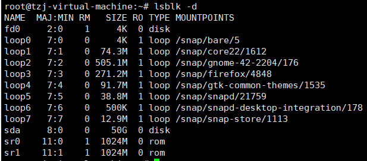 |
| -f   |      | 列出磁盘内文件系统类型                   | 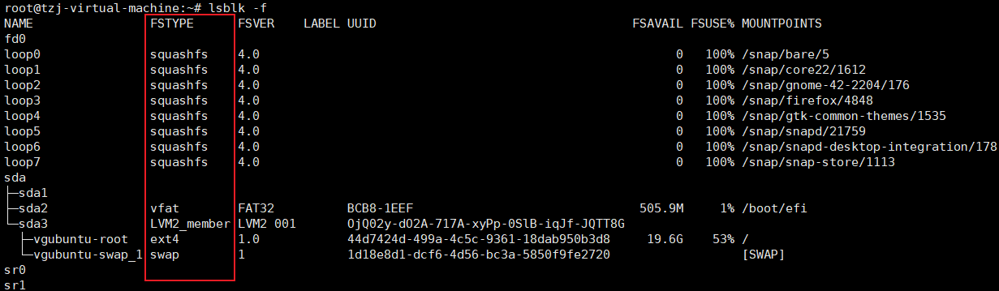 |
| -i   |      | 使用ASCII输出，不使用复杂编码            |                                                              |
| -m   |      | 输出设备在/dev下的权限数据               | 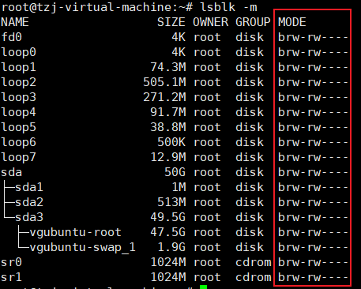 |
| -p   |      | 显示设备的完整文件名，不是仅列出最后名字 | 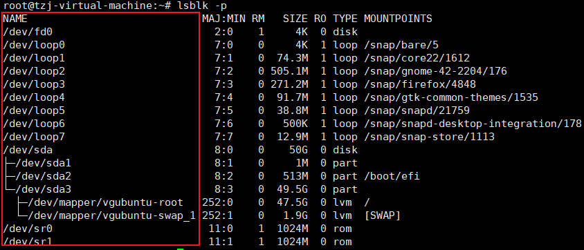 |
| -t   |      | 列出磁盘设备的详细数据                   | 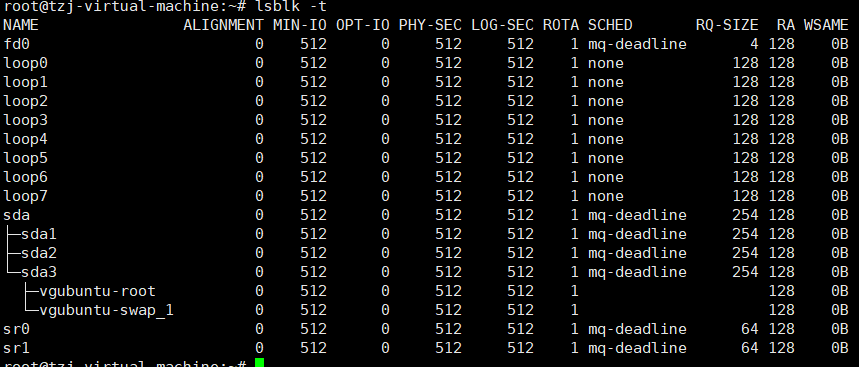 |

- NAME：设备名，默认忽略 */dev* 等目录前缀
- MAJ:MIN：主要：次要设备代码，内核使用该属性识别设备
- RM（removable device）：是否为可移除设备，如光盘、USB盘等
- SIZE：容量
- RO：是否为只读设备
- TYPE：磁盘（disk）、分区（partition）、只读存储器（rom）等
- MOUNTPOINT：挂载点

###### 获取设备UUID信息——blkid

Linux会为系统内每个设备设置唯一标识符UUID，用作挂载或使用这个装置/文件系统

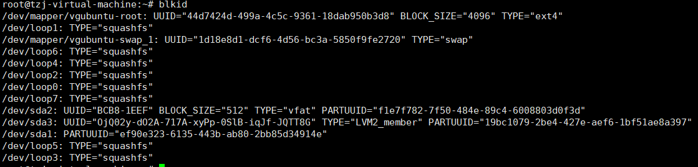

###### 获取磁盘分区信息——parted

```shell
parted device_name print
```

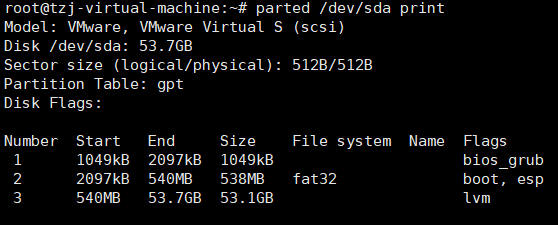

##### 磁盘分区

> `parted` 通用
>
> - `fdisk` 建立MBR分区
> - `gdisk` 建立GPT分区

###### fdisk

```shell
fdisk device_name

m：帮助
n：新建一个分区
d：删除一个分区
p：打印分区表
q：退出，不保存修改
w：将修改写入分区表
```

###### gdisk

```shell
gdisk device_name
```

- 首先，打印分区表，获取最后一个扇区号

- 输入创建分区后

  ```shell
  Partition number (4-128, default 4): 4 # 预设就是 4 号，所以也能 enter 即可！
  First sector (34-83886046, default = 65026048) or {+-}size{KMGTP}: 65026048 # 也能 enter
  Last sector (65026048-83886046, default = 83886046) or {+-}size{KMGTP}: +1G # 绝不要 enter
  ```

```shell
Command (? for help): p
Number Start (sector) End (sector) Size Code Name
1 2048 6143 2.0 MiB EF02
2 6144 2103295 1024.0 MiB 0700
3 2103296 65026047 30.0 GiB 8E00
4 65026048 67123199 1024.0 MiB 8300 Linux filesystem
5 67123200 69220351 1024.0 MiB 0700 Microsoft basic data
6 69220352 70244351 500.0 MiB 8200 Linux swap
```

- *Code* 属性：文件系统ID
- Linux 为8200、8300、8e00三种格式

上述 `fdisk` 与 `gdisk` 执行完后，需要重启系统

###### partprobe更新内核的分区表信息

```shell
partprobe [-s] # 你可以不要加 -s ！那么屏幕不会出现讯息！
partprobe -s # 不过还是建议加上 -s 比较清晰！

lsblk /dev/vda # 实际的磁盘分区状态

cat /proc/partitions # 获取内核识别到的分区信息
```

###### 删除分区的操作

1. 首先解除挂载
2. 然后再删除分区

直接删除分区，虽然磁盘会写入正确的分区信息，但内核无法更新分区表信息

###### 使用parted进行分区

```shell
parted 设备名 [指令 [参数]]
```

指令功能：

- 新增分区：`mkpart [primary | logical | extended] [ext4 | vfat | xfs]` 开始扇区号 结束扇区号

  ```shell
  parted /dev/vda mkpart primary fat32 36.0GB 36.5GB
  ```

- 显示分区：`print 设备名`

  `parted /dev/vda unit mb print` 固定单位

- 删除分区：`rm 分区名`

- 修改硬盘的分区表类型：

  `parted 设备名 mklabel gpt/mbr`

```shell
root@dc_1214:~# parted /dev/sdb print
Model: ABOSION 128G SSD (scsi)				# 硬盘接口与型号
Disk /dev/sdb: 128GB						# 扇区容量
Sector size (logical/physical): 512B/512B	# 分区表类型
Partition Table: msdos
Disk Flags: 

Number  Start   End     Size    Type     File system  Flags
 1      33.6MB  10.8GB  10.7GB  primary  ext4
 2      10.8GB  128GB   117GB   primary  ext4
```

- Number：分区号
- Start：分区起始位置在磁盘多少MB处
- End：分区结束位置在磁盘多少MB处
- Size：分区容量
- Type：分区类型
- File system：文件系统

##### 格式化——mkfs

```shell
root@tzj-virtual-machine:~# mkfs [Tab][Tab] # 查看支持的文件系统
mkfs         mkfs.bfs     mkfs.cramfs  mkfs.ext2    mkfs.ext3    mkfs.ext4    mkfs.fat     mkfs.minix   mkfs.msdos   mkfs.ntfs    mkfs.vfat
```

###### mkfs.xfs

```shell
mkfs.xfs -b bsize -d parms -i parms -l parms -L label -f \
-r parms 设备名
```

| 选项 | 参数                                                         | 含义                             |
| ---- | ------------------------------------------------------------ | -------------------------------- |
| -b   | 默认单位B，kmgtp为字节数，                                   | 块大小，Linux限制最大为4KB       |
| -d   | agcount=数值：需要几个存储组（AG），与CPU相关<br />agsize=数值：每个AG设定为多少容量（agcount/agsize直选设一个即可）<br />file：格式化的设备是个文件而不是设备<br />size=数值：指定格式化后文件系统的容量<br />su=数值：当有RAID时，标识stripe，<br />sw=数值：当有RAID时，用于存储数据的磁盘数<br />sunit=数值：与su相当，单位是使用几个扇区<br />swidth=数值：sw*sw的数值，但是以几个扇区来设定 | 数据分区相关的参数值             |
| -f   |                                                              | 若已有文件系统，则需要强制格式化 |
| -i   | size=数值：256B~2K<br />internal=[ 0 \| 1]：是否内置log设备（日志盘是否与数据盘同盘）<br />logdev=device：指定日志存放的设备<br />size=数值：指定日志盘的容量，2M以上 | 与inode相关的参数                |
| -L   |                                                              | 指定卷标                         |
| -r   | extsize=数值：有RAID时，最好设定与swidth的数值相同，4K~1G    | 指定realtime 分区的相关设置      |

- xfs可使用多个数据流来读写系统，以增加速度。因此 **agcount** 可以与CPU内核数搭配

  ```shell
  grep 'processor' /proc/cpuinfo
  ```

- RAID相关操作

  磁盘阵列，将多个硬盘组为一个大硬盘，同步写入这些硬盘，并支持容错机制（一个磁盘故障，整个文件系统可持续运行）

  RAID将文件细分为多个小的条带（stripe），将众多条带分别放在RAID的物理硬盘

  为确保高可用，一个文件会被同时写入到多个磁盘中，同时会保留多个备份盘（parity disk），而且还会保留一个备用盘（spare disk）

  分区条带界于4K~1M间，条带与文件数据容量与读写效率相关

  - 当系统多为大型文件，建议条带设置大一些，可以降低RAID的读/写频率
  - 当系统多为小型文件，条件设置小一些

  一些常见设置

  - agcount设置为CPU数量

  - RAID条带为256K时，su设为256K

  - 磁盘阵列含8个磁盘，且为RAID5，因此有1个备份盘，sw设置7

  - 数据宽度256K*7=1792K，则extsize为1792K

    换算为扇区，$sunit=256KB/512B=512$ 个扇区

    $swidth=7*sunit=3584$ 个扇区

###### mkfs.ext4

```shell
mkfs.ext4-b size -L label 装置名称

[root@study ~]# mkfs.ext4 /dev/vda5
mke2fs 1.42.9 (28-Dec-2013)
Filesystem label= # 显示 Label name
OS type: Linux
Block size=4096 (log=2) # 每一个 block 的大小
Fragment size=4096 (log=2)
Stride=0 blocks, Stripe width=0 blocks # 跟 RAID 相关性较高
65536 inodes, 262144 blocks # 总计 inode/block 的数量
13107 blocks (5.00%) reserved for the super user
First data block=0
Maximum filesystem blocks=268435456
8 block groups # 共有 8 个 block groups 喔！
```

文件系统默认值写入系统的 */etc/mke2fs.conf* 文件

##### 文件系统检验

- 仅root用户，且文件系统确实存在问题，才可使用文件系统的修复指令
- 修复文件系统时，分区不可被挂载

###### EXT4文件系统检验

```shell
fsck.ext4 -pf -b superblock 装置名称
```

| 选项 | 参数 | 含义                                                         |
| ---- | ---- | ------------------------------------------------------------ |
| -p   |      | 自动回复y，继续进行修复动作                                  |
| -f   |      | 强制检查，若fsck发现没有unclean标志，不会主动进行细部检查，若想强制fsck进行细部检查，需-f |
| -D   |      | 仅针对文件系统下的目录进行优化配置                           |
| -b   |      | 接备份超块的位置，若超块损坏，则可以通过该参数指定的备份超块进行恢复 |

```shell
root@tzj-virtual-machine:~# dumpe2fs -h /dev/mapper/vgubuntu-root  | grep "Blocks per group"
dumpe2fs 1.46.5 (30-Dec-2021)
Blocks per group:         32768

## 每个group的块数记录在文件系统描述说明中，第二个超块备份就放置在32768号块中
fsck.ext4 -b 32768 /dev/vda5
```

###### xfs文件系统的检验

Linux的根目录 *\\* 不可被解除挂载，若修复根目录，需要进入单人维护模式或救援模式，通过 `-d` 来处理，系统强制检查该设备，检验完毕后自动重启系统

```shell
xfs_repair -fnd 装置名称
```

| 选项 | 参数 | 含义                                           |
| ---- | ---- | ---------------------------------------------- |
| -f   |      | 设备实际为文件，不是实体设备                   |
| -n   |      | 单纯检查，并不修改文件系统的数据               |
| -d   |      | 在担任维护模式下，仅针对根目录进行检查与修复、 |

##### 文件系统挂载与解除

> 文件系统挂载实质上，是设置进入磁盘分区槽的目录

- 一个文件系统仅可被挂载到一个挂载点
- 一个挂载点仅可挂载一个文件系统
- 根目录 */* 必须被挂载，且先与其他文件系统被挂载
- 其他挂载点必须为已建立的目录
- 解除挂载，需先将工作目录移出到挂载点外

文件系统挂载后，原目录下的内容会暂时被分区中的文件系统替换

```shell
mount [选项] [参数]
```

| 选项 | 参数                                                         | 含义                                                         |
| ---- | ------------------------------------------------------------ | ------------------------------------------------------------ |
| -a   |                                                              | 依据 */fstab* 的记录，挂载所有文件系统                       |
| -l   |                                                              | `mount` 会显示目前挂载信息<br />`mount -l` 会增加Label名称   |
| -t   |                                                              | 指定待挂载的文件系统类型（xfs、ext3、ext4等）                |
| -n   |                                                              | 默认情况下，实际挂载信息会被实时写入 */etc/mtab* 中，便于其他程序使用<br />特殊情况（单人维护模式）下，为避免出错，会禁止写入该文件 |
| -o   | async、sync：是否使用同步写入与异步的内存机制<br />atime、noatime：是否更新文件系统的读取时间<br />ro, rw：文件系统为只读（ro）或可读写（rw）<br />auto，noauto：是否允许文件系统被 `mount -a` 自动挂载<br />dev，nodev：是否允许此文件系统设置为设备文件<br />suid，nosuid：是否允许此文件系统含suid/sgid格式的文件<br />exec，noexec：是否允许此文件系统执行可执行文件<br />user，nouser：是否允许此文件系统被任一用户挂载，默认为nouser，即仅root用户可挂载，设为user可使普通用户也有权限挂载分区<br />defaults：默认值async，rw，suid，dev，exec，auto，nouser<br />remount：重新挂载 | 指定额外参数                                                 |

###### 文件系统的自动挂载原理

当前文件系统的所有信息都被记录到超块中

Linux可以分析超块中的文件系统类型，与驱动程序是否搭配

若二者一致，则可自动地挂载该文件系统

- Linux系统已加载的文件系统类型，记录在 */proc/filesystems* 下
- 自动挂载文件系统的测试顺序，记录在 */etc/filesystems* 

Linux系统支持的文件系统驱动程序记录在 */lib/modules/$(uname -r)/kernel/fs/* 目录下

###### 挂载xfs/ext4/vfat等文件系统

```shell
# 1. 获取分区的UUID
blkid /dev/xxx

# 2. 创建挂载目录
mkdir 挂载点

# 3. 利用UUID挂载文件系统
mount UUID="xxxx"  挂载点

# 4. 显示挂载点信息
root@tzj-virtual-machine:~# df /
Filesystem                1K-blocks     Used Available Use% Mounted on
/dev/mapper/vgubuntu-root  48753324 25458168  20786152  56% /
```

###### 挂载CD或DVD光盘

- 光驱挂载的特殊之处在于，一旦挂载，只能手动解除

```shell
# 获取分区UUID
blkid
通常会以 /dev/srx开始

# 创建目录
mkdir /data/cdrom

# 挂载
mount 设备名 挂载点

# 显示挂载点信息
df 挂载点
```

###### 挂载中文USB设备

```shell
[root@study ~]# blkid
/dev/sda1: UUID="35BC-6D6B" TYPE="vfat"

[root@study ~]# mkdir /data/usb

[root@study ~]# mount -o codepage=950,iocharset=utf8 UUID="35BC-6D6B" /data/usb

[root@study ~]# df /data/usb
```

- 若磁盘内含有中文文件名的数据，则需要在挂载时，指定文件系统所使用的语种及文字编码
  - 语种：vfat文件格式，使用codepage处理
  - 编码：iocharset（utf8或big5、unicode等）

- 若磁盘格式为NTFS，则需要安装NTFS文件系统的驱动程序

###### 修改挂载参数

> 适用于：修改挂载参数或根目录变为只读状态
>
> - 在单人维护模式下，根目录通常被系统挂载为只读

```shell
mount -o [参数] 挂载点

# 将根目录重新挂载，并指定挂载参数为 rw与auto
[root@study ~]# mount -o remount,rw,auto /
```

###### 解除挂载

将设备文件解除挂载

```shell
umount [选项] 设备文件名/挂载点
```

| 选项 | 参数 | 含义                                    |
| ---- | ---- | --------------------------------------- |
| -f   |      | 强制解除挂载（NFS无法读取的情况下使用） |
| -l   |      | 立即解除文件系统                        |
| -n   |      | 不更新 */etc/mtab* 的情况下卸载         |

```shell
# 设备文件名
umount /dev/vda4

# 挂载点
umount /data/ext4
umount /data/cdrom
```

##### 设置开机挂载

*/etc/fstab* （filesystem table），在利用  `mount` 指令进行挂载时，会将所有的参数、选项写入到该配置文件

```shell
设备文件名/UUID 挂载点 文件系统类型 [文件系统选项/参数] dump fsck
```

- 设备文件名/UUID/LABEL名：

  指定待挂载的设备

  ```shell
  /dev/sda
  UUID=xxx
  LABEL=xxx
  ```

  LVM文件名在系统中也是唯一的 */dev/mapper/xxx*

- **loop设备的挂载不能使用UUID，因为系统仅查询块设备的UUID，不会查询文件**

- 挂载点（目录）

- 磁盘分区的文件系统类型

  xfs/ext4/vfat等

- 文件系统参数

  与 `mount -o [选项/参数]` 中指定的参数相同

  | 参数        | 含义                                                        |
  | ----------- | ----------------------------------------------------------- |
  | async/sync  | 设定磁盘是否异步，异步读写性能较好                          |
  | auto/noauto | 执行`mount -a` 指令时，文件系统是否可被自动挂载             |
  | rw/ro       | 分区以只读还是可读写的方式挂载                              |
  | exec/noexec | 限制文件系统内是否可进行执行操作                            |
  | user/nouser | 是否允许用户使用mount指令挂载，普通用户也有挂载权限比较危险 |
  | suid/nosuid | 是否允许文件系统内有SUID类型的文件存在                      |
  | defaults    | 默认参数为rw,suid,dev,exec,auto,nouser,async                |

- 是否可被dump指令备份

  `dump` 是一个用于备份的指令，现在有更好的备份方案，默认为0即可

- 是否以fsck检验扇区

  早期开机程序，会间隔一段时间检验本机的文件系统是否clean，主要通过fsck执行，但现在XFS文件系统会自行检验，因此，直接填0即可

*/etc/fstab* 仅是开机时的配置文件，实际的文件系统挂载被记录到 */etc/mtab* 与 */proc/monts* 中

当 */etc/fstab* 编写错误，导致无法正常开机，需要进入单人维护模式，但处于只读模式，因此需要将根目录重新挂载 `mount -n -o remount,rw /` 

- 重新挂载根目录，且本次挂载不会被记录到文件

##### loop设备的挂载（镜像文件直接使用）

> 不需要将镜像刻录到硬盘，即可以镜像文件形式被挂载使用
>
> 用于制作离线镜像源

```shell
# 1. 获取iso镜像文件
[root@study ~]# ll -h /tmp/CentOS-7.0-1406-x86_64-DVD.iso

# 2. 创建挂载点
mkdir /data/cdrom

# 3. 挂载镜像文件
mount -o loop /path/to/iso /path/to/mount_point

# 4. 查看与解除挂载
df /path/to/mount_point
umount /path/to/mount_point
```

###### 挂载ubuntu离线镜像源

```shell
# 挂载指令
/usr/bin/mount -o loop -t iso9660 /media/ubuntu-22.04.5-desktop-amd64.iso /mnt/iso

# 1. 启动开机自动挂载服务
vim /etc/systemd/system/mount_iso.service

[Unit]
Description=Mount iso service
After=network.target auditd.service
ConditionPathExists=!/etc/ssh/sshd_not_to_be_run

[Service]
ExecStart=/usr/bin/mount -o loop /media/ubuntu-22.04.5-desktop-amd64.iso /mnt/iso

[Install]
WantedBy=multi-user.target
Alias=mount_iso.service

# 设置开机自动启动
systemctl enable mount.service

# 2.修改apt源配置文件
vim /etc/apt/sources.list

deb [trusted=yes] file:///mnt/iso jammy main restricte

# 更新本地源
apt clean all
apt update
```

###### 挂载centos离线镜像源

```shell
# 将系统的安装镜像放到 /media/下

# 创建挂载点
[root@node205 ~]# mkdir /mnt/iso

# 将镜像挂载到挂载点
[root@node205 ~]# mount -o loop /media/Kylin-Sever-V10-GFB-RC5-030-arm64.iso /mnt/iso

# 设置开机自动挂载
[root@node205 ~]# vim /etc/fstab
/media/Kylin-Sever-V10-GFB-RC5-030-arm64.iso /mnt/iso iso9660 loop,defaults 0 0

# 修改yum源配置
[root@node205 ~]# cd /etc/yum.repos.d/
[root@node205 yum.repos.d]# cp kylin_aarch64.repo kylin_aarch64.repo.bak
[ks10-adv-os]
name = Kylin Linux Advanced Server 10 - Os 
baseurl = file:///mnt/iso/
gpgcheck = 0
enabled = 1

[root@node205 yum.repos.d]# yum clean all
[root@node205 yum.repos.d]# yum makecacke
```


###### 制作loop设备文件以挂载

当分区中有多余空间，可用于存储其他数据，可将该空间制作为loop设备文件，以供挂载使用

1. 建立大文件

   ```shell
   # 建立块大小为1MB，512MB的大文件
   dd if=/dev/zero of=/srv/loopdev bs=1M count=512
   ```

   - if：input file，输入文件， */dev/zero* 是会一直输出0的设备、
   - of：outfile，待写入的目标文件
   - bs：块大小
   - count：块数量

2. 对大文件格式化

   XFS不能被格式化，需要对其强制格式化

   ```shell
   mkfs.xfs -f /srv/loopdev
   
   # blkid 也可列出在大文件内部的文件系统
   blkid /srv/loopdev
   /srv/loopdev: UUID="7dd97bd2-4446-48fd-9d23-a8b03ffdd5ee" TYPE="xfs"
   ```

3. 挂载

   ```shell
   mount -o loop UUID="7dd97bd2-4446-48fd-9d23-a8b03ffdd5ee" /mnt
   ```

##### 目录挂载

利用 `mount --bind 原目录 新目录挂载点` 将某个目录挂载到另一个目录

相当于符号链接，进入新目录相当于进入原目录

```shell
[root@study ~]# mkdir /data/var
# 将原目录挂载到新目录挂载点
[root@study ~]# mount --bind /var /data/var
[root@study ~]# ls -lid /var /data/var
16777346 drwxr-xr-x. 22 root root 4096 Jun 15 23:43 /data/var
16777346 drwxr-xr-x. 22 root root 4096 Jun 15 23:43 /var
```

目录卸载

```shell
umount 新目录挂载点
```

#### 修改文件系统参数

##### mknod指定设备文件的MAJ与MIN

设备文件通过major（主要设备代码）与minor（次要设备代码）表示某个设备

| 磁盘设备文件名 | Major | Minor |
| -------------- | ----- | ----- |
| */dev/sda*     | 8     | 0~15  |
| */dev/sdb*     | 8     | 16~31 |
| */dev/loop0*   | 7     | 0     |
| */dev/loop1*   | 7     | 1     |

Linux内核2.6之后，硬件文件名由系统自动的实时产生

```shell
mknod 设备文件名 [参数] Major Minor
```

| 选项 | 参数 | 含义                         |
| ---- | ---- | ---------------------------- |
|      | b    | 指定为块设备（磁盘等）       |
|      | c    | 指定为字符设备（鼠标、键盘） |
|      | p    | 指定为FIFO文件               |

##### xfs_admin修改XFS文件系统的UUID与Label name

```shell
xfs_admin [选项]
xfs_admin -L label_name -U uuid_值	设备文件名
```

| 选项 | 参数 | 含义                 |
| ---- | ---- | -------------------- |
| -l   |      | 列出设备的label name |
| -u   |      | 列出设备的UUID       |
| -L   |      | 指定设备的label      |
| -U   |      | 指定设备的UUID       |

##### tune2fs修改ext4文件系统的UUID与label name

```shell
tune2fs -l # 类似 dumoe2fs -h，读取文件系统超块内的信息
tune2fs -L label名 -U UUID值
```

#### 内存置换空间的构建

> 内存置换空间（swap）：硬盘中暂时放置内存中数据的区域

早期操作系统的安装，必须划分的两个分区是根目录（*/*）与内存置换分区

- 若物理内存的资源足够，则swap分区不会被系统所使用
- 仅当物理内存资源不足的情况下，swap分区才会被使用
- 若主机支持休眠，运行中的程序状态也会被记录到swap分区中

流程：

1. 设置一个swap分区
2. 建立虚拟内存文件

##### 使用分区构建swap分区

1. 分区：gdisk在磁盘中划分一个分区槽，作为swap分区
2. 格式化：将分区格式化为swap格式，`mkswap 设备文件名`
3. 使用：启动该swap分区， `swapon 设备文件名`
4. 通过free与 `swapon -s` 就可观察内存的使用量

**分区**

```shell
root@tzj-virtual-machine:~# gdisk /dev/sdb
GPT fdisk (gdisk) version 1.0.8

Partition table scan:
  MBR: not present
  BSD: not present
  APM: not present
  GPT: not present

Creating new GPT entries in memory.

Command (? for help): n
Partition number (1-128, default 1): 
First sector (34-41943006, default = 2048) or {+-}size{KMGTP}: 
Last sector (2048-41943006, default = 41943006) or {+-}size{KMGTP}: 
Current type is 8300 (Linux filesystem)
Hex code or GUID (L to show codes, Enter = 8300): 
Changed type of partition to 'Linux filesystem'

Command (? for help): w

Final checks complete. About to write GPT data. THIS WILL OVERWRITE EXISTING
PARTITIONS!!

Do you want to proceed? (Y/N): y
OK; writing new GUID partition table (GPT) to /dev/sdb.
The operation has completed successfully.
root@tzj-virtual-machine:~# partprobe
root@tzj-virtual-machine:~# lsblk
```

**构建swap格式**

```shell
root@tzj-virtual-machine:~# mkswap /dev/sdb1
Setting up swapspace version 1, size = 20 GiB (21473763328 bytes)
no label, UUID=2578e2ef-ca15-4054-a91a-674fce1db3cc
[root@study ~]# blkid /dev/vda6
```

**使用swap分区以及观察**

```shell
root@tzj-virtual-machine:~# free
               total        used        free      shared  buff/cache   available
Mem:         8084036      918184     6423360       29564      742492     6890316
Swap:        1998844           0     1998844

root@tzj-virtual-machine:~# swapon /dev/sdb1
root@tzj-virtual-machine:~# free
               total        used        free      shared  buff/cache   available
Mem:         8084036      937368     6401772       29564      744896     6871048
Swap:       22969316           0    22969316

root@tzj-virtual-machine:~# swapon -s
Filename				Type		Size		Used		Priority
/dev/dm-1                               partition	1998844		0		-2
/dev/sdb1                               partition	20970472	0		-3
```

**开机自动挂载**

```shell
vim /etc/fstab

# 文件系统类型为swap，由于没有挂载点，所以挂载点写swap
UUID=2578e2ef-ca15-4054-a91a-674fce1db3cc swap swap defaults 0 0
```

**解除swap分区**

```shell
root@tzj-virtual-machine:~# swapoff /dev/sdb1
root@tzj-virtual-machine:~# free
               total        used        free      shared  buff/cache   available
Mem:         8084036      892560     6438656       23256      752820     6921896
Swap:        1998844           0     1998844

root@tzj-virtual-machine:~# swapon -s
Filename				Type		Size		Used		Priority
/dev/dm-1                               partition	1998844		0		-2
```

##### 使用文件构建swap

将文件设为loop设备，后续步骤与分区构建swap一致

1. 初始化文件
2. 将文件格式化为swap格式
3. 使用 `swapon` 启动swap分区

**初始化文件**

```shell
root@tzj-virtual-machine:~# dd if=/dev/zero of=/tmp/swap bs=1M count=128
128+0 records in
128+0 records out
134217728 bytes (134 MB, 128 MiB) copied, 0.0676459 s, 2.0 GB/s
```

**将swap文件格式化为swap的文件格式**

```shell
root@tzj-virtual-machine:~# mkswap /tmp/swap
mkswap: /tmp/swap: insecure permissions 0644, fix with: chmod 0600 /tmp/swap
Setting up swapspace version 1, size = 128 MiB (134213632 bytes)
no label, UUID=c3402139-8cf7-46b0-bb23-799c7c11a0cf
```

**启动swap分区**

```shell
root@tzj-virtual-machine:~# swapon /tmp/swap
swapon: /tmp/swap: insecure permissions 0644, 0600 suggested.
root@tzj-virtual-machine:~# swapon -s
Filename				Type		Size		Used		Priority
/dev/dm-1                               partition	1998844		0		-2
/tmp/swap                               file		131068		0		-3
```

**开机自动挂载**

```shell
root@tzj-virtual-machine:~# vim /etc/fstab

# loop设备的挂载不能使用UUID，因为系统仅查询块设备的UUID，不会查询文件
/tmp/swap swap swap defaults 0 0
```

## 2.4 文件与文件系统的压缩、打包、备份

由于计算机以字节为单位记录数据，而有效的信息以bit为单位存储，所以难免会有空间浪费

两种文件压缩思路：

- 利用压缩算法，将未使用的空间丢弃，再使用相应的解压算法，填充原始数据
- 将重复的数据进行统计记录

压缩文件无法直接被操作系统使用，若要使用这些压缩过的文件数据，需要将这些数据解压缩（还原为未压缩的状态）

- $压缩比=\frac{压缩后文件大小}{压缩前文件大小}$

### 2.4.1 文件压缩指指令

不同的压缩算法需要使用不同的压缩指令

Linux上常用的压缩指令为gzip、bzip2、xz，compress已被淘汰

- gzip算法由GNU计划开发，后续的bzip2与xz指令压缩比更高

Windows常用zip，所以Linux也支持zip指令

这些压缩指令，通常仅支持对一个文件进行压缩与解压缩，利用 **打包软件（tar）** ，可以将多个文件打包为一个文件

| 压缩指令     | 压缩文件名    |                  |
| -------- | -------- | ---------------- |
| compress | *.Z      |                  |
| zip      | *.zip    |                  |
| gzip     | *.gz     |                  |
| bzip2    | *.bz2    |                  |
| xz       | *.xz     |                  |
| tar      | *.tar    | 经tar打包，并未被压缩     |
|          | *.tar.gz | 经tar打包，并由gzip压缩  |
|          | *tar.bz2 | 经tar打包，并由bzip2压缩 |
|          | *.tar.xz | 经tar打包，并由xz压缩    |

#### gzip、zcat/zmore/zless/zgrep

> gzip可以解压缩compress，zip与gzip等压缩的文件

```shell
gzip [-cdtv#] 文件名
```

| 选项  | 参数     | 含义                                                         |
| --- | ------ | ---------------------------------------------------------- |
| -c  |        | 将压缩后的数据显示在屏幕上                                              |
| -d  |        | 删除原压缩文件，并解压缩                                               |
| -t  |        | 检验压缩文件的一致性                                                 |
| -v  |        | 显示原始文件/压缩文件的压缩比等信息                                         |
| -#  | # 表示数字 | 代表压缩等级<br />-1：压缩速度最快，压缩比最差<br />-9：压缩速度最慢，压缩比最高<br />默认为6 |

默认情况，使用gzip压缩文件，原始文件会被压缩为.gz，且原始文件就不存在了

使用gzip压缩的文件，在Windows中，可被WinRAR或7Zip解压

```shell
root@tzj-virtual-machine:~/test# ls
test.txt
root@tzj-virtual-machine:~/test# cat test.txt 
aaaaa
# 显示压缩过程
root@tzj-virtual-machine:~/test# gzip -v test.txt 
test.txt:	  0.0% -- replaced with test.txt.gz

root@tzj-virtual-machine:~/test# ls
test.txt.gz

root@tzj-virtual-machine:~/test# cat test.txt.gz                                                                                                                                                              榃test.txtKL.(¡

# 解压缩
root@tzj-virtual-machine:~/test# gzip -d test.txt.gz

# gzip -c 可以预先查看压缩后的内容
root@tzj-virtual-machine:~/test# gzip -c test.txt                                                                                                                                                             榃test.txtKL.(¡

# 若想保留原文件，可使用gzip -c将压缩后的内容重定向到新的文件
root@tzj-virtual-machine:~/test# gzip -c test.txt > test.txt.gz
root@tzj-virtual-machine:~/test# ls
test.txt  test.txt.gz
root@tzj-virtual-machine:~/test# zcat test.txt.gz 
aaaaa
```

zcat、zmore、zless用法类似于cat、more、less，用于读取纯文本文件压缩文件的原始内容

zgrep 可以在不解压的情况下，搜索原始文件中的关键字

```shell
[dmtsai@study tmp]$ zgrep -n 'http' services.gz
14:# http://www.iana.org/assignments/port-numbers
89:http 80/tcp www www-http # WorldWideWeb HTTP
90:http 80/udp www www-http # HyperText Transfer Protocol
```

#### bzip2、bzcat/bzmore/bzless

bzip2相较gzip有更高的压缩比

```0
bzip2 -[选项] 文件名
```

| 选项  | 参数     | 含义                                                         |
| --- | ------ | ---------------------------------------------------------- |
| -c  |        | 将压缩后的数据输出到屏幕上                                              |
| -d  |        | 解压缩                                                        |
| -k  |        | 保留源文件，不删除原始文件                                              |
| -z  |        | 压缩参数                                                       |
| -v  |        | 显示原始文件/压缩文件的压缩比等信息                                         |
| -#  | # 表示数字 | 代表压缩等级<br />-1：压缩速度最快，压缩比最差<br />-9：压缩速度最慢，压缩比最高<br />默认为6 |

#### xz、xzcat/xzmore/xzless/xzgrep

```shell
xz -[选项] 文件名
```

| 选项  | 参数     | 含义                                                         |
| --- | ------ | ---------------------------------------------------------- |
| -d  |        | 解压缩                                                        |
| -t  |        | 测试文件完整性                                                    |
| -l  |        | 列出压缩文件的相关信息                                                |
| -k  |        | 保留原始文件                                                     |
| -c  |        | 将压缩后的数据显示在屏幕上                                              |
| -#  | # 表示数字 | 代表压缩等级<br />-1：压缩速度最快，压缩比最差<br />-9：压缩速度最慢，压缩比最高<br />默认为6 |

可对比压缩时长

```shell
time [gzip|bzip2|xz] -c services > services.[gz|bz2|xz]
```

xz指令压缩效果最好，但压缩耗时非常多

### 2.4.2 打包指令

tar将多个目录或文件打包为一个大文件，支持通过参数将打包后的文件进行压缩与解压缩

```shell
tar -[z|j|J][c|x|t][v][f] 文件名 -C
```

| 分类   | 选项                     | 参数         | 含义                                                 |
| :--- | ---------------------- | ---------- | -------------------------------------------------- |
| 压缩算法 | -z                     |            | 使用gzip压缩算法，压缩后文件为 \*.tar.gz                        |
|      | -j                     |            | 使用bzip2压缩算法，压缩后文件为 \*.tar.bz2                      |
|      | -J                     |            | 使用xz压缩算法，压缩后文件为\*.tar.xz                           |
| 操作类型 | -c                     |            | 压缩                                                 |
|      | -x                     |            | 解压缩，会在执行tar指令的当前路径下                                |
|      | -t                     |            | 查询压缩文件中的文件名                                        |
| 其他   | -v                     |            | 打印压缩/解压缩过程中的文件名                                    |
|      | -f                     | [待处理的文件路径] | 指定待处理的文件，**注意：f选项后，必须紧跟路径**                        |
|      | -C                     | [文件解压后的路径] | 指定解压缩后的文件路径                                        |
|      | -p                     |            | 保留文件原本属性与权限<br>**注意：在备份系统数据等文件时，保留文件原始的权限和属性相当重要** |
|      | -P                     |            | 保留绝对路径                                             |
|      | --exclude=FILE         |            | 在压缩过程，指定不压缩的文件                                     |
|      | --newer=\<time\>       | 参数为时间      | 仅压缩mtime与ctime在仅\<time\>之后的文件                      |
|      | --newer-mtime=\<time\> |            | 仅压缩mtime在\<time\>之后的文件                             |

压缩指令与解压指令
```shell
# 压缩
tar -c -f <tarball_name> 待压缩的文件、目录列表

# 解压
tar -x -f <tarball_name> -C 解压后文件保存的目录
```

关于绝对路径：
- 最好拿掉绝对路径，即少用-P，避免覆盖原始文件
- 一种场景，若备份系统配置文件，使用-P选项，解压后，会直接覆盖系统当前的配置文件，没有选择余地

若不对文件夹中某个文件打包，需使用--exclude指定，但好在支持正则匹配
```shell
root@study ~]# tar -jcv -f /root/system.tar.bz2 --exclude=/root/etc* \
--exclude=/root/system.tar.bz2 /etc /root
```

若仅对压缩文件中的某个文件进行解压
```shell
tar -xf 压缩文件名 待解压的某个目标文件名

[root@study ~]# tar -jtv -f /root/etc.tar.bz2 | grep 'shadow'
---------- root/root 721 2015-06-17 00:20 etc/gshadow
---------- root/root 1183 2015-06-17 00:20 etc/shadow-
---------- root/root 1210 2015-06-17 00:20 etc/shadow <==这是我们要的！
---------- root/root 707 2015-06-17 00:20 etc/gshadow-

tar -jxv -f /root/etc.tar.bz2 etc/shadow
```

tar指令可将数据打包到某些特殊设备
- 磁带为一次性读/写设备哦，因此不能使用cp指令复制
```shell
# 将/home /root /etc目录下的所有文件备份到指令设备
tar -cvf /dev/st0 /home /root /etc
```

#### 利用tar进行复制

```shell
[root@study ~]# cd /tmp
[root@study tmp]# tar -cvf - /etc | tar -xvf -
```

在bash shell中，`-` 表示标准输入/输出（某块内存），所以，上述指令表示，将/etc打包到标准输出，然后，从标准输入解压文件

### 2.4.3 文件系统备份与还原

#### XFS文件系统的备份与还原

##### 文件系统备份

`xfsdump` 可以对文件系统进行完整的备份，也可以进行累积备份

> 类似git，`xfsdump` 的累积备份只会记录与第一次完整备份有差异的文件

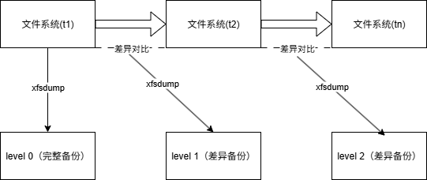

```shell
root@tzj:/home/tzj/tmp_test# touch aaa ; touch bbb ; touch ccc

# 初始备份，aaa bbb ccc 都为空
root@tzj:/home/tzj/tmp_test# xfsdump -l 0 -L tmp_test_0 -M tmp_test_0 -f /tmp/tmp_test0.dump /
xfsdump: using file dump (drive_simple) strategy
xfsdump: version 3.1.9 (dump format 3.0) - type ^C for status and control
xfsdump: level 0 dump of tzj:/home/tzj/tmp_test
xfsdump: dump date: Thu Dec 18 20:44:25 2025
xfsdump: session id: a8df2a67-54ec-49c2-9d69-64b7a05e759b
xfsdump: session label: "tmp_test_0"
xfsdump: ino map phase 1: constructing initial dump list
xfsdump: ino map phase 2: skipping (no pruning necessary)
xfsdump: ino map phase 3: skipping (only one dump stream)
xfsdump: ino map construction complete
xfsdump: estimated dump size: 21760 bytes
xfsdump: creating dump session media file 0 (media 0, file 0)
xfsdump: dumping ino map
xfsdump: dumping directories
xfsdump: dumping non-directory files
xfsdump: ending media file
xfsdump: media file size 21952 bytes
xfsdump: dump size (non-dir files) : 0 bytes
xfsdump: dump complete: 0 seconds elapsed
xfsdump: Dump Summary:
xfsdump:   stream 0 /tmp/tmp_test0.dump OK (success)
xfsdump: Dump Status: SUCCESS

# level 1备份，aaa有内容 "aaa" bbb 与 ccc都为空
root@tzj:/home/tzj/tmp_test# echo "aaa" >> aaa
root@tzj:/home/tzj/tmp_test# xfsdump -l 1 -L tmp_test_1 -M tmp_test_1 -f /tmp/tmp_test1.dump /
xfsdump: using file dump (drive_simple) strategy
xfsdump: version 3.1.9 (dump format 3.0) - type ^C for status and control
xfsdump: level 1 incremental dump of tzj:/home/tzj/tmp_test based on level 0 dump begun Thu De
xfsdump: dump date: Thu Dec 18 20:45:31 2025
xfsdump: session id: 7dc1bd13-ce49-4e37-8110-38a179540861
xfsdump: session label: "tmp_test_1"
xfsdump: ino map phase 1: constructing initial dump list
xfsdump: ino map phase 2: pruning unneeded subtrees
xfsdump: ino map phase 3: skipping (only one dump stream)
xfsdump: ino map construction complete
xfsdump: estimated dump size: 25216 bytes
xfsdump: creating dump session media file 0 (media 0, file 0)
xfsdump: dumping ino map
xfsdump: dumping directories
xfsdump: dumping non-directory files
xfsdump: ending media file
xfsdump: media file size 21920 bytes
xfsdump: dump size (non-dir files) : 544 bytes
xfsdump: dump complete: 0 seconds elapsed
xfsdump: Dump Summary:
xfsdump:   stream 0 /tmp/tmp_test1.dump OK (success)
xfsdump: Dump Status: SUCCESS

root@tzj:/home/tzj/tmp_test# xfsdump -I
file system 0:
	fs id:		d7539cdb-fe1e-42b3-945d-5cfaef3a6068
	session 0:
		mount point:	tzj:/home/tzj/tmp_test
		device:		tzj:/dev/sdb1
		time:		Thu Dec 18 20:44:25 2025
		session label:	"tmp_test_0"
		session id:	a8df2a67-54ec-49c2-9d69-64b7a05e759b
		level:		0
		resumed:	NO
		subtree:	NO
		streams:	1
		stream 0:
			pathname:	/tmp/tmp_test0.dump
			start:		ino 131 offset 0
			end:		ino 134 offset 0
			interrupted:	NO
			media files:	1
			media file 0:
				mfile index:	0
				mfile type:	data
				mfile size:	21952
				mfile start:	ino 131 offset 0
				mfile end:	ino 134 offset 0
				media label:	"tmp_test_0"
				media id:	0dd32408-6f29-464f-91a4-583f4a4793ec
	session 1:
		mount point:	tzj:/home/tzj/tmp_test
		device:		tzj:/dev/sdb1
		time:		Thu Dec 18 20:45:31 2025
		session label:	"tmp_test_1"
		session id:	7dc1bd13-ce49-4e37-8110-38a179540861
		level:		1
		resumed:	NO
		subtree:	NO
		streams:	1
		stream 0:
			pathname:	/tmp/tmp_test1.dump
			start:		ino 131 offset 0
			end:		ino 132 offset 0
			interrupted:	NO
			media files:	1
			media file 0:
				mfile index:	0
				mfile type:	data
				mfile size:	21920
				mfile start:	ino 131 offset 0
				mfile end:	ino 132 offset 0
				media label:	"tmp_test_1"
				media id:	ddb5bc96-fde1-47a0-97d1-fc492b3da4b4
xfsdump: Dump Status: SUCCESS

# level 2备份，aaa为空，bbb有内容 "bbb"，ccc内容为空
root@tzj:/home/tzj/tmp_test# vim aaa 
root@tzj:/home/tzj/tmp_test# echo "bbb" >> bbb
root@tzj:/home/tzj/tmp_test# xfsdump -l 2 -L tmp_test_2 -M tmp_test_2 -f /tmp/tmp_test2.dump /
xfsdump: using file dump (drive_simple) strategy
xfsdump: version 3.1.9 (dump format 3.0) - type ^C for status and control
xfsdump: level 2 incremental dump of tzj:/home/tzj/tmp_test based on level 1 dump begun Thu De
xfsdump: dump date: Thu Dec 18 20:46:49 2025
xfsdump: session id: 729c3fa9-e37e-4530-b226-800b6b8b8b6a
xfsdump: session label: "tmp_test_2"
xfsdump: ino map phase 1: constructing initial dump list
xfsdump: ino map phase 2: skipping (no pruning necessary)
xfsdump: ino map phase 3: skipping (only one dump stream)
xfsdump: ino map construction complete
xfsdump: estimated dump size: 25536 bytes
xfsdump: creating dump session media file 0 (media 0, file 0)
xfsdump: dumping ino map
xfsdump: dumping directories
xfsdump: dumping non-directory files
xfsdump: ending media file
xfsdump: media file size 22208 bytes
xfsdump: dump size (non-dir files) : 544 bytes
xfsdump: dump complete: 0 seconds elapsed
xfsdump: Dump Summary:
xfsdump:   stream 0 /tmp/tmp_test2.dump OK (success)
xfsdump: Dump Status: SUCCESS


root@tzj:/home/tzj/tmp_test# xfsrestore -I
file system 0:
	fs id:		d7539cdb-fe1e-42b3-945d-5cfaef3a6068
	session 0:
		mount point:	tzj:/home/tzj/tmp_test
		device:		tzj:/dev/sdb1
		time:		Thu Dec 18 20:44:25 2025
		session label:	"tmp_test_0"
		session id:	a8df2a67-54ec-49c2-9d69-64b7a05e759b
		level:		0
		resumed:	NO
		subtree:	NO
		streams:	1
		stream 0:
			pathname:	/tmp/tmp_test0.dump
			start:		ino 131 offset 0
			end:		ino 134 offset 0
			interrupted:	NO
			media files:	1
			media file 0:
				mfile index:	0
				mfile type:	data
				mfile size:	21952
				mfile start:	ino 131 offset 0
				mfile end:	ino 134 offset 0
				media label:	"tmp_test_0"
				media id:	0dd32408-6f29-464f-91a4-583f4a4793ec
	session 1:
		mount point:	tzj:/home/tzj/tmp_test
		device:		tzj:/dev/sdb1
		time:		Thu Dec 18 20:45:31 2025
		session label:	"tmp_test_1"
		session id:	7dc1bd13-ce49-4e37-8110-38a179540861
		level:		1
		resumed:	NO
		subtree:	NO
		streams:	1
		stream 0:
			pathname:	/tmp/tmp_test1.dump
			start:		ino 131 offset 0
			end:		ino 132 offset 0
			interrupted:	NO
			media files:	1
			media file 0:
				mfile index:	0
				mfile type:	data
				mfile size:	21920
				mfile start:	ino 131 offset 0
				mfile end:	ino 132 offset 0
				media label:	"tmp_test_1"
				media id:	ddb5bc96-fde1-47a0-97d1-fc492b3da4b4
	session 2:
		mount point:	tzj:/home/tzj/tmp_test
		device:		tzj:/dev/sdb1
		time:		Thu Dec 18 20:46:49 2025
		session label:	"tmp_test_2"
		session id:	729c3fa9-e37e-4530-b226-800b6b8b8b6a
		level:		2
		resumed:	NO
		subtree:	NO
		streams:	1
		stream 0:
			pathname:	/tmp/tmp_test2.dump
			start:		ino 132 offset 0
			end:		ino 136 offset 0
			interrupted:	NO
			media files:	1
			media file 0:
				mfile index:	0
				mfile type:	data
				mfile size:	22208
				mfile start:	ino 132 offset 0
				mfile end:	ino 136 offset 0
				media label:	"tmp_test_2"
				media id:	f971f07d-e8da-4f00-bda6-bf8d20e315d3
xfsrestore: Restore Status: SUCCESS

root@tzj:/home/tzj/tmp_test# xfsrestore -f /tmp/tmp_test
tmp_test0.dump  tmp_test1.dump  tmp_test2.dump  

root@tzj:/home/tzj/tmp_test# mkdir -p /tmp/dump

# 还原level 0备份，可见还原目录中 aaa bbb ccc均为空
root@tzj:/home/tzj/tmp_test# xfsrestore -f /tmp/tmp_test0.dump -L tmp_test_0 /tmp/dump/
xfsrestore: using file dump (drive_simple) strategy
xfsrestore: version 3.1.9 (dump format 3.0) - type ^C for status and control
xfsrestore: using online session inventory
xfsrestore: searching media for directory dump
xfsrestore: examining media file 0
xfsrestore: reading directories
xfsrestore: 1 directories and 3 entries processed
xfsrestore: directory post-processing
xfsrestore: restoring non-directory files
xfsrestore: restore complete: 0 seconds elapsed
xfsrestore: Restore Summary:
xfsrestore:   stream 0 /tmp/tmp_test0.dump OK (success)
xfsrestore: Restore Status: SUCCESS
root@tzj:/home/tzj/tmp_test# cd /tmp/dump/
root@tzj:/tmp/dump# ls
aaa  bbb  ccc
root@tzj:/tmp/dump# cat aaa 
root@tzj:/tmp/dump# cat bbb 
root@tzj:/tmp/dump# cat ccc 

# 还原level 1 备份，aaa中内容为 "aaa" bbb，ccc内容为空
root@tzj:/tmp/dump# xfsrestore -f /tmp/tmp_test1.dump -L tmp_test_1 /tmp/dump/
xfsrestore: using file dump (drive_simple) strategy
xfsrestore: version 3.1.9 (dump format 3.0) - type ^C for status and control
xfsrestore: using online session inventory
xfsrestore: searching media for directory dump
xfsrestore: examining media file 0
xfsrestore: reading directories
xfsrestore: 1 directories and 3 entries processed
xfsrestore: directory post-processing
xfsrestore: restoring non-directory files
xfsrestore: restore complete: 0 seconds elapsed
xfsrestore: Restore Summary:
xfsrestore:   stream 0 /tmp/tmp_test1.dump OK (success)
xfsrestore: Restore Status: SUCCESS
root@tzj:/tmp/dump# ls
aaa  bbb  ccc
root@tzj:/tmp/dump# cat aaa 
aaa
root@tzj:/tmp/dump# cat bbb
root@tzj:/tmp/dump# cat ccc 

# level 2 内容，aaa ccc 为空，bbb 有内容 "bbb" ，与原始目录一致
root@tzj:/tmp/dump# xfsrestore -f /tmp/tmp_test2.dump -L tmp_test_2 /tmp/dump/
xfsrestore: using file dump (drive_simple) strategy
xfsrestore: version 3.1.9 (dump format 3.0) - type ^C for status and control
xfsrestore: using online session inventory
xfsrestore: searching media for directory dump
xfsrestore: examining media file 0
xfsrestore: reading directories
xfsrestore: 1 directories and 3 entries processed
xfsrestore: directory post-processing
xfsrestore: restoring non-directory files
xfsrestore: restore complete: 0 seconds elapsed
xfsrestore: Restore Summary:
xfsrestore:   stream 0 /tmp/tmp_test2.dump OK (success)
xfsrestore: Restore Status: SUCCESS
root@tzj:/tmp/dump# cat aaa 
root@tzj:/tmp/dump# cat bbb 
bbb
root@tzj:/tmp/dump# cd /home/tzj/tmp_test/
root@tzj:/home/tzj/tmp_test# cat aaa 
root@tzj:/home/tzj/tmp_test# cat bbb 
bbb
root@tzj:/home/tzj/tmp_test# cat ccc 
```

#### 操作系统备份的还原问题

tar解压备份文件

将备份的系统数据还原到系统时，SELinux的权限问题，可能导致系统无法读写某些文件的内容，造成系统无法使用

- 通过各种可行的救援方式登入系统，然后修改/etc/selinux/config 文件，将SELinux 改成permissive 模式，重新启动后系统就正常了；
- 在第一次复原系统后，不要立即重新启动！先使用restorecon -Rv /etc 自动修复一下SELinux 的类型即可。
- 透过各种可行的方式登入系统，建立/.autorelabel 文件，重新启动后系统会自动修复SELinux 的类型，并且又会再次重新启动

### 2.4.4 光盘文件系统的读写

- 利用 `mkisofs` 将数据写入到镜像文件
- 利用 `cdrecord` ，将镜像文件刻录至光盘

#### 创建镜像文件

光盘文件的格式一般为 *iso9660*，仅支持旧版的DOS文件名（只能以8.3的形式存在，文件名8个字符，扩展名3个字符）。

##### 一般的镜像文件

```shell
mkisofs [-o 镜像文件名.img] [-Jrv] [-V vol] [-m file] 待备份文件列表(空格分隔) -graft-point [isodir=systemdir, isodir=systemdir,...]
```

| 选项         | 参数                                              | 含义                                                         |
| ------------ | ------------------------------------------------- | ------------------------------------------------------------ |
| -o           |                                                   | mkisofs执行后，产生的镜像文件名                              |
| -r           |                                                   | 通过Rock Ridge产生支持Unix/Linux的文件数据，可记录较多的信息，包括UID/GID与权限等 |
| -J           |                                                   | 较兼容Windows系统的文件名结构，文件名长度到64个unicode字符   |
| -v           |                                                   | 显示iso文件的创建过程                                        |
| -V           | iso名                                             | 指定iso文件的卷名                                            |
| -m           | file                                              | 排除文件，后续的文件不会打包到iso文件，支持 `*` 等通配符     |
| -graft-point | isodir=systemdir<br />镜像文件中的目录=实际的目录 | 默认情况下，所有被打包的文件会被放到镜像文件的根目录，使用该选项，定义镜像文件的目录层级<br /> |

- 对于graft-point选项
  - */movies=/srv/movies*：在Linux中 */srv/movies* 内的文件，添加到镜像文件的 */movies* 目录
  - */linux/etc=/etc*在Linux */etc* 内的文件，添加到镜像文件 */linux/etc* 目录

- 若打包的原始目录中，在不同目录层级下有同名子目录，在不指定 `-graft-point` 目录层级的前提下，无法打包，会提示重名

```shell
[root@study ~]# mkisofs -r -V 'linux_file' -o /tmp/system.img -m /root/etc -graft-point /root=/root /home=/home /etc=/etc
[root@study ~]# ll -h /tmp/system.img
-rw-r--r--. 1 root root 92M Jul 2 19:00 /tmp/system.img

[root@study ~]# mount -o loop /tmp/system.img /mnt
[root@study ~]# ll /mnt
dr-xr-xr-x. 131 root root 34816 Jun 26 22:14 etc
dr-xr-xr-x. 5 root root 2048 Jun 17 00:20 home
dr-xr-xr-x. 8 root root 4096 Jul 2 18:48 root

[root@study ~]# umount /mnt
```

创建iso文件的最佳实践是：将所有所有待写入的子文件cp到一个父目录，进入父目录，再使用 `mkisofs -r -v -o /tmp/system.img .` 的方式创建iso文件

##### 系统镜像盘

1. 获取初始系统iso镜像文件
2. 将iso文件挂载到指定目录，将iso目录中的数据拷贝到自定义目录
3. 在自定义目录中编辑镜像内容
4. 将自定义目录打包为iso镜像文件

```shell
# 获取初始的iso镜像文件
isoinfo -d -i [iso文件路径]
Volume id就是mkisofs -V指定的卷名

tzj@LAPTOP-070162A7:~$ isoinfo -d -i /home/tzj/ubuntu-22.04.5-desktop-amd64.iso
CD-ROM is in ISO 9660 format
System id:
Volume id: Ubuntu 22.04.5 LTS amd64
Volume set id:
Publisher id:
Data preparer id: XORRISO-1.5.4 2021.01.30.150001, LIBISOBURN-1.5.4, LIBISOFS-1.5.4, LIBBURN-1.5.4
Application id:
Copyright File id:
Abstract File id:
Bibliographic File id:
Volume set size is: 1
Volume set sequence number is: 1
Logical block size is: 2048
Volume size is: 2325541
El Torito VD version 1 found, boot catalog is in sector 1044
Joliet with UCS level 3 found
Rock Ridge signatures version 1 found
Eltorito validation header:
    Hid 1
    Arch 0 (x86)
    ID ''
    Key 55 AA
    Eltorito defaultboot header:
        Bootid 88 (bootable)
        Boot media 0 (No Emulation Boot)
        Load segment 0
        Sys type 0
        Nsect 4
        Bootoff 415 1045

# 将初始iso镜像挂载到/mnt目录， 将初始文件拷贝到副本目录
[root@study ~]# mount /home/CentOS-7-x86_64-Minimal-1503-01.iso /mnt
[root@study ~]# mkdir /srv/newcd
[root@study ~]# rsync -a /mnt/ /srv/newcd
rsync指令，可完整复制文件所有数据，包括权限属性等

# 在/src/newcd 中，将内容镜像文件处理完成后，创建iso文件
[root@study ~]# cd /srv/newcd
[root@study newcd]# mkisofs -o /custom.iso -b isolinux/isolinux.bin -c isolinux/boot.cat -no-emul-boot -V 'Ubuntu 22.04.5 LTS amd64' -boot-load-size 4 -boot-info-table -R -J -v -T .
```

#### 将iso文件刻录到光盘

- `wodim`，也可以使用 `cdrecord`

刻录的必要条件是准备光驱，通过 `wodim --devices dev=/dev/sr0` 查找光驱bus名

```shell
# 虚拟机内的虚拟光驱（QEMU DVD-ROM）
[root@study ~]# wodim --devices dev=/dev/sr0
-------------------------------------------------------------------------
0 dev='/dev/sr0' rwrw-- : 'QEMU' 'QEMU DVD-ROM'
-------------------------------------------------------------------------

[root@demo ~]# wodim --devices dev=/dev/sr0
wodim: Overview of accessible drives (1 found) :
-------------------------------------------------------------------------
0 dev='/dev/sr0' rwrw-- : 'ASUS' 'DRW-24D1ST'
-------------------------------------------------------------------------
```

```shell
[root@study ~]# wodim -v dev=/dev/sr0 blank=[fast|all] <==抹除重复读写片
[root@study ~]# wodim -v dev=/dev/sr0 -format <==格式化DVD+RW
[root@study ~]# wodim -v dev=/dev/sr0 [可用选项功能] file.iso

wodim -v dev=/dev/sr0 speed=4 -dummy -eject /tmp/system.img
```

| 选项       | 参数           | 含义                                                         |
| ---------- | -------------- | ------------------------------------------------------------ |
| --devices  |                | 扫描硬盘总线，找到可用的刻录机                               |
| --v        |                | 显示刻录过程                                                 |
| dev        | =/dev/sr0      | 找出光驱/dev/sr0的bus地址                                    |
| blank      | =[fast \| all] | 擦除可复写的CD / DVD-RW ，fast较快，all较完整                |
| -format    |                | 将DVD-rw格式的光盘格式化                                     |
| -data      | 文件列表       | 指定文件以数据格式写入，不以audio格式写入                    |
| speed      | =X             | 指定刻录速度，CD可用speed=40，DVD可用speed=4                 |
| -eject     |                | 刻录完后自动退出光盘                                         |
| fs         | =Ym            | 以MB为单位，指定缓冲区大小，将镜像文件暂存到缓冲区<br />预设为4MB |
| driveropts |                | 打开Buffer Underrun Free 模式的写入功能                      |
| -sao       |                | 支持DVD-RW的格式                                             |

### 2.4.5 dd

`dd` 指令直接读取扇区，然后将整个设备备份

```shell
dd if="input_file" of="output_file" bs="block_size" count="number"
```

| 选项  | 参数          | 含义                           |
| ----- | ------------- | ------------------------------ |
| if    | =[输入文件名] | input file，也可以是一个设备名 |
| of    | =[输出文件名] | outfile，也可以是一个设备名    |
| bs    | =[块大小]     | 指定一个块的大小，默认是512B   |
| count | =[块数量]     | 指定块数                       |

```shell
# 从文件备份到文件
[root@study ~]# dd if=/etc/passwd of=/tmp/passwd.back
4+1 records in
4+1 records out
2092 bytes (2.1 kB) copied, 0.000111657 s, 18.7 MB/s
[root@

/etc/passwd 文件为2092B，默认一个块为512B，所以占用4个完整扇区，最后一个块未满
```

```shell
# 从设备备份到文件
[root@study ~]# dd if=/dev/sr0 of=/tmp/system.iso
```

```shell
# 从文件备份到设备
[root@study ~]# dd if=/tmp/system.iso of=/dev/sda
```

`dd` 指令的缺陷是逐扇区读/写，即使没有用到的扇区也会写入到备份文件，这个文件会变得与if一样大，测试如下

```shell
# 将/dev/vda2完整复制到另一个分区/dev/sda1，若要挂载/dev/sda1这个文件系统，需要按照每种文件系统的挂载要求进行处理
## 如对于XFS文件系统，需要清除XFS文件系统内的log后，重新赋予一个新的UUID才能够正常挂载，若要使用后续未使用磁盘，需使用xfs_growfs处理

# 1. 对/dev/sda格式化
fdisk /dev/sda
partprobe

# 2. 直接进行扇区层面的复制
[root@study ~]# dd if=/dev/vda2 of=/dev/sda1

# 3. 清除xfslog
xfs_repair -L /dev/sda1

# 4. 为XFS文件系统生成并赋予新的uuid
[root@study ~]# uuidgen # 底下两行在给予一个新的 UUID
896c38d1-bcb5-475f-83f1-172ab38c9a0c
[root@study ~]# xfs_admin -U 896c38d1-bcb5-475f-83f1-172ab38c9a0c /dev/sda1

# 5. 对比，可见与原始分区大小一致
[root@study ~]# df -h /boot /mnt
Filesystem Size Used Avail Use% Mounted on
/dev/vda2 1014M 149M 866M 15% /boot
/dev/sda1 1014M 149M 866M 15% /mnt

# 6. 若要使用/dev/sda1后续的空间，使用xfs_growfs处理
[root@study ~]# xfs_growfs /mnt
[root@study ~]# df -h /boot /mnt
Filesystem Size Used Avail Use% Mounted on
/dev/vda2 1014M 149M 866M 15% /boot
/dev/sda1 2.0G 149M 1.9G 8% /mnt
```

### 2.4.6 cpio

cpio可备份包括设备文件内的所有文件，但不会主动找文件备份，涉及到与find及重定向指令的配合，以告知需要备份的文件在哪

```shell
[root@study ~]# cpio -ovcB > [file|device] <==备份
[root@study ~]# cpio -ivcdu < [file|device] <==还原
[root@study ~]# cpio -ivct < [file|device] <==查看
```

备份用到的参数

| 选项 | 参数 | 含义                                                  |
| ---- | ---- | ----------------------------------------------------- |
| -o   |      | 将参数copy到文件或设备                                |
| -B   |      | 将预设的Blocks增加值5120B，默认为512B，加快大文件存储 |

还原用到的参数

| 选项 | 参数 | 含义                                     |
| ---- | ---- | ---------------------------------------- |
| -i   |      | 将数据从文件或设备中， 还原到当前系统    |
| -d   |      | 让cpio自动创建目录                       |
| -u   |      | 自动将较新的文件覆盖较旧的文件           |
| -t   |      | 配合-i，查看以cpio创建的文件或设备的内容 |

通用参数

| 选项 | 参数 | 含义                              |
| ---- | ---- | --------------------------------- |
| -v   |      | 展示存储过程                      |
| -c   |      | 以较新的portable format的形式转存 |

```shell
# 找出 /boot 底下的所有文件，然后将他备份到 /tmp/boot.cpio

[root@study ~]# cd /
[root@study /]# find boot -print
boot
boot/grub
boot/grub/splash.xpm.gz
....(以下省略)....

使用find boot 可以找出文件名，不要使用绝对路径，cpio在打包时，文件名会包含绝对路径的 / ，所以未来解压时，若文件名包含/，会放到根目录下，可能覆盖重要文件
[root@study /]# find boot | cpio -ocvB > /tmp/boot.cpio

[root@study ~]# file /tmp/boot.cpio
/tmp/boot.cpio: ASCII cpio archive (SVR4 with no CRC)
```

在系统中，*/boot/initramfs-xxx* 为使用cpio创建的文件

```shell
[root@study ~]# file /boot/initramfs-3.10.0-229.el7.x86_64.img
/boot/initramfs-3.10.0-229.el7.x86_64.img: ASCII cpio archive (SVR4 with no CRC)

[root@study ~]# mkdir /tmp/initramfs ； cd /tmp/initramfs

# 将initramfs解压，
[root@study initramfs]# cpio -idvc < /boot/initramfs-3.10.0-229.el7.x86_64.img
.
kernel
kernel/x86
kernel/x86/microcode
kernel/x86/microcode/GenuineIntel.bin
early_cpio
```


