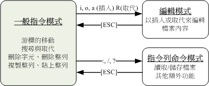

> - Vim编辑器
> - GNU（第二代Shell）——BASH Shell
> - Bash功能：指令管理、记录、文件或命令补全、环境变量的使用
> - 数据流重导向——正则表达式与文件格式化处理
> - Shell脚本

<!--more-->

## 3.1 Vim

> 在Linux不同的发行版中，有不同的系统管理工具
>
> - Red Hat Enterprise Linux 与Fedora 的ntsysv 与setup 等
> - SuSE 则有YAST 管理工具

Linux中，绝大部分的配置文件都是以ASCII纯文本的形式保存，因此使用文本编辑工具也可以完成系统配置与管理等工作

常见的文本编辑工具有：emacs、pico、nano、joe与vim等

- 通用性：所有类Unix的系统都会内置vi文本编辑器，其他编辑器不一定存在
- 支持编程：vim具有程序编辑能力，能通过字体颜色辨识语法正确性

vim为vi编辑器的进阶版，vim会依据文件扩展名或文件开头的信息，识别程序的类型，进而调用相应的语法判断程序，再以颜色来区分程序代码

### 3.1.1 Vi的使用



- 一般指令模式（command mode）：

  **内容调整模式**

  使用vi打开一个文件，默认为一般模式

  可以进行跳转、搜索与取代、删除（单个字符、整行）、复制、粘贴等功能

- 编辑模式：

  在一般模式中，键入 `i`（`I`）、`a`（`A`）、`o`（`O`）、`r`（`R`）

  插入或取代文件的内容

- 指令行模式（command-line mode）：

  **文件编辑**

  在一般模式中，键入 `:`、`/`、`?` 
  
  读取或删除文件内容，支持其他额外的功能

编辑模式与指令行模式不能互相切换

```shell
/bin/vi [文件名]
```

### 3.1.2 按键说明

数字，通常表示重复做几次操作，也代表去到第几个

#### 一般指令模式（内容调整模式）

##### 跳转

| 分类         | 按键     | 结果                           |
| ------------ | -------- | ------------------------------ |
| 光标移一字符 | |              |
|  | \<h\> 或 \<←\> | 光标左移一字符                 |
|              | \<j\>  或 \<↓\> | 光标下移一字符                 |
|              | \<k\> 或\<↑\> | 光标上移一字符                 |
|              | \<l\> 或\<→\> | 光标右移一字符                 |
| 光标移动多字符 |                 |                                  |
|                | n \<space\>     | n表示数字，表示向右移动n个字符   |
|                | \<0\>或\<Home\> | 移动到当前行的最前面一个字符     |
|                | \<$\>或\<End\>  | 移动到当前行的最后一个字符       |
| 移动一行   |                 |                                  |
|                | +               | 光标移动到非空格符的下一行       |
|                | -               | 光标移动到非空格符的上一行       |
|                | n \<Enter\>     | n表示数字， 光标向下移动n行      |
| 移动到一屏内指定行 |                 |                                          |
|                    | \<H\>           | 移动到当前一屏的最上方一个行的第一个字符 |
|                    | \<M\>           | 移动到当前一屏的中央一个行的第一个字符   |
|                    | \<L\>           | 移动到当前一屏的最下方一个行的第一个字符 |
| 移动到指定行       |                 |                                          |
|                    | \<g\>\<g\>      | 移动到本文件的第一行，相当于1G           |
|                    | n\<G\>          | n为数字，表示移动到这个文件的第n行       |
|                    | \<G\>           | 移动到当前文件的最后一行                 |
| 光标跳转一屏       |                 |                                          |
|                    | \<Ctrl\>+\<f\>  | 向下移一屏，相当于 \<Page down\>         |
|                    | \<Ctrl\>+\<b\>  | 向上移一屏，相当于 \<Page up\>           |
|                    | \<Ctrl\>+\<d\>  | 向下移半屏                               |
|                    | \<Ctrl\>+\<u\>  | 向上移半屏                               |

##### 搜索与替换

| 分类 | 按键                                                         | 说明                                                         |
| ---- | ------------------------------------------------------------ | ------------------------------------------------------------ |
| 搜索 |                                                              |                                                              |
|      | \</\>[word]                                                  | 在光标之下搜索关键词word                                     |
|      | \<?\>[word]                                                  | 在光标之上搜索关键词word                                     |
|      | \<n\>                                                        | 在搜索完成后，按\<n\>，重复前一个搜索动作                    |
|      | \<N\>                                                        | 反方向重复前一个搜索动作                                     |
| 替换 |                                                              |                                                              |
|      | \<:\>[n1]\<,\>[n2]\<s\>\</\>[word1]\</\>[word2]\</\>\<g\>    | 在n1行与n2行之间，搜索word1，并将其替换为word2               |
|      | \<:\>\<1\>\<,\>\<$\>\<s\>\</\>[word1]\</\>[word2]\</\>\<g\>  | 从第1行到最后一行，搜索word1，并将其替换为word2              |
|      | \<:\>\<1\>\<,\>\<$\>\<s\>\</\>[word1]\</\>[word2]\</\>\<g\>\<c\> | 从第1行到最后一行，搜索word1，并将其替换为word2，在替换前让用户确认 |

##### 删除、复制、粘贴

| 分类 | 按键            | 说明                                                         |
| ---- | --------------- | ------------------------------------------------------------ |
| 删除 |                 |                                                              |
|      | \<x\>或 \<X\>   | x为向后删除一字符，相当于\<del\><br />X为向前删除一字符，相当于\<backspace\> |
|      | [n]\<x\>        | 向后连续删除n个字符                                          |
|      | \<d\>\<$\>      | 删除光标所在位置，到该行最后一个字符                         |
|      | \<d\>\<0\>      | 删除光标所在位置，到该行第一个字符                           |
|      | \<dd\>          | 删除光标所在行                                               |
|      | [n]\<dd\>       | 删除光标所在行的向下n行                                      |
|      | \<d\>\<1\>\<G\> | 删除光标所在行，到第一行的所有数据                           |
|      | \<d\>\<G\>      | 删除光标所在行，到最后一行的所有数据                         |
| 复制 |                 |                                                              |
|      | \<y\>\<0\>      | 复制光标处字符到当前行的第一个字符                           |
|      | \<y\>\<$\>      | 复制光标处字符到当前行的最后一个字符                         |
|      | \<y\>\<y\>      | 复制光标所在的行                                             |
|      | [n]\<y\>\<y\>   | 复制光标所在的向下几行                                       |
|      | \<y\>\<1\>\<G\> | 复制光标所在到第一行的所有数据                               |
|      | \<y\>\<G\>      | 复制光标所在行到最后一行的所有数据                           |
| 粘贴 |                 |                                                              |
|      | \<p\>           | 将已复制的数据粘贴到光标的下一行                             |
|      | \<P\>           | 将已复制的数据粘贴到光标的上一行                             |
| 合并 |                 |                                                              |
|      | \<J\>           | 将光标所在行与下一行的数据合并到同一行                       |
|      | \<c\>           | 重复删除多个数据，10\<c\>\<j\>，向下删除10行                 |

##### 重复与撤销的操作

|      | 按键           | 说明           |
| ---- | -------------- | -------------- |
|      | \<u\>          | 撤销上一个操作 |
|      | \<Ctrl\>+\<r\> | 重复上一个操作 |
|      | \<.\>          | 重复上一个操作 |

#### 内容调整模式切换到内容编辑模式

| 模式               | 按键        | 说明                                                         |
| ------------------ | ----------- | ------------------------------------------------------------ |
| 进入插入模式       |             |                                                              |
|                    | \<i\>,\<I\> | i表示从当前光标所在处插入<br />I表示从当前光标所在的第一个非空格字符插入 |
|                    | \<a\>,\<A\> | a表示从当前光标所在的下一个字符处追加<br />A表示从当前光标所在行的最后一个处追加 |
|                    | \<o\>,\<O\> | o表示在当前光标所在的下一行插入新的一行<br />O表示在当前光标所在的上一行插入新的一行 |
| 进入取代模式       |             |                                                              |
|                    | \<r\>,\<R\> | r表示只会取代光标所在的那个字符<br />R表示一直取代光标所在的字符，直至按下ESC |
| 退出到内容调整模式 |             |                                                              |
|                    | ESC         |                                                              |

#### 内容调整模式切换到文件编辑模式

| 分类             | 按键                  | 说明                                                   |
| ---------------- | --------------------- | ------------------------------------------------------ |
| 退出             |                       |                                                        |
|                  | \<:\>\<w\>            | 将文件内容写入硬盘                                     |
|                  | \<:\>\<w!\>           | 强制写入                                               |
|                  | \<:\>\<q\>            | 退出                                                   |
|                  | \<:\>\<q!\>           | 修改过文件，不保存，强制退出                           |
|                  | \<:\>\<w\>\<q\>       | 保存后离开                                             |
|                  | \<:\>\<w\>\<q!\>      | 强制保存后离开                                         |
|                  | ZZ                    | 若未修改文件，则不保存退出；若修改过文件，则保存后退出 |
|                  | \<Ctrl\>+\<z\>        | 退出，vim放到后台执行                                  |
| 另存为           |                       |                                                        |
|                  | \<:\>\<w\> [文件名]   | 将数据另存为一个文档                                   |
|                  | \<:\>n1,n2 w [文件名] | 将n1到n2的内容保存为文件名指定的文件                   |
| 从其他文件读入   |                       |                                                        |
|                  | \<:\>\<r\> [文件名]   | 将文件名指定的数据添加到光标所在行的后面               |
| 离开文件执行指令 |                       |                                                        |
|                  | \<:\> command         | 暂时退出vim，显示command的执行结果                     |
| 行号             |                       |                                                        |
|                  | :set nu               | 显示行号                                               |
|                  | :set nonu             | 取消行号                                               |

### 3.1.3 Vim的功能说明 

#### vim的暂存文件

vim在被编辑文件的同级目录下，新建 *.filename.swp* 的临时文件

出现暂存文件的两种情况：

- 其他人也在编辑当前文件
- vim 异常退出

存在暂存文件情况下，有六个可用按键

- [O]pen Read-Only：以只读文件的形式打开文件
- [E]dit anyway：以读写形式打开，不载入暂存文件
- [R]ecover：加载暂存文件内容，退出后，还需要手动删除暂存文件
- [D]elete：删除暂存文件
- [Q]uit：退出vim，不进行任何操作
- [A]bort：忽略编辑

#### 颜色显示功能

相较vi，vim具有颜色显示功能，且支持许多的程序语法，便于进行调试

```shell
[dmtsai@study ~]$ alias
....其他省略....
alias vi='vim'

# 表示当使用vi指令时，其实是在执行vim
```

#### 区块选择

分区块选择与对区块操作两部分

| 分类         | 按键   | 说明                          |
| ------------ | ------ | ----------------------------- |
| 区块选择     |        |                               |
|              | v      | 按下v后，选择将光标经过的地方 |
|              | V      | 按下V后，将光标经过的地方反选 |
|              | Ctrl+v | 随光标移动，以矩形方式选择    |
| 对区块的操作 |        |                               |
|              | y      | 复制选中的区块                |
|              | d      | 删除选中的区块                |
|              | p      | 在光标处，粘贴选中的区块      |

#### 多文件编辑

vim是独立的，不支持跨vim窗口进行复制与粘贴，即不能再A文件nyy，再到B文件p

利用vim跨文件复制、粘贴：

```shell
# 1. 利用vim 打开需要使用的两个文件
vim hosts /etc/hosts

# 2. 使用:files列出vim开启的所有文件
:files

# 3. 按任意键返回vim的一般模式

# 4. 在文件A按下复制键，4yy复制4行

# 5. 使用:n转到vim打开的第二个文件
:n
:N表示前一个文件

# 6. 在第二个文件粘贴
```

#### 多窗口

| 按键                                    | 说明                                                         |
| --------------------------------------- | ------------------------------------------------------------ |
| :sp [文件名]                            | 开启新窗口，若不加文件名，则新窗口打开同名文件               |
| \<Ctrl+w\> \<j\> <br />\<Ctrl+w\> \<↓\> | 先按下 [ctrl] 不放， 再按下 w 后放开所有的按键，然后再按下 j (或向下箭头键)，则光标可移动到下方的窗口。 |
| \<Ctrl+w\> \<k\> <br />\<Ctrl+w\> \<↑\> | 先按下 [ctrl] 不放， 再按下 w 后放开所有的按键，然后再按下 k (或向上箭头键)，则光标可移动到下方的窗口。 |
| \<Ctrl+w\> \<q\>                        | 关闭当前窗口                                                 |

