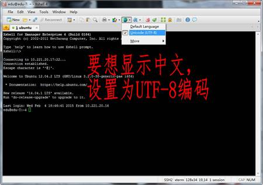
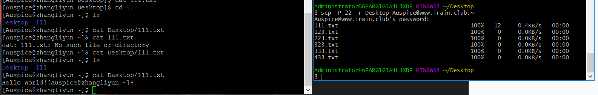
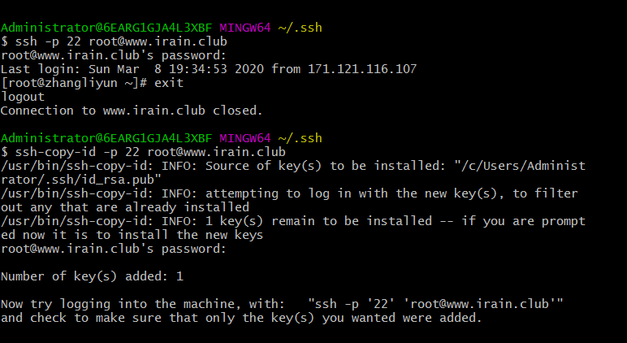
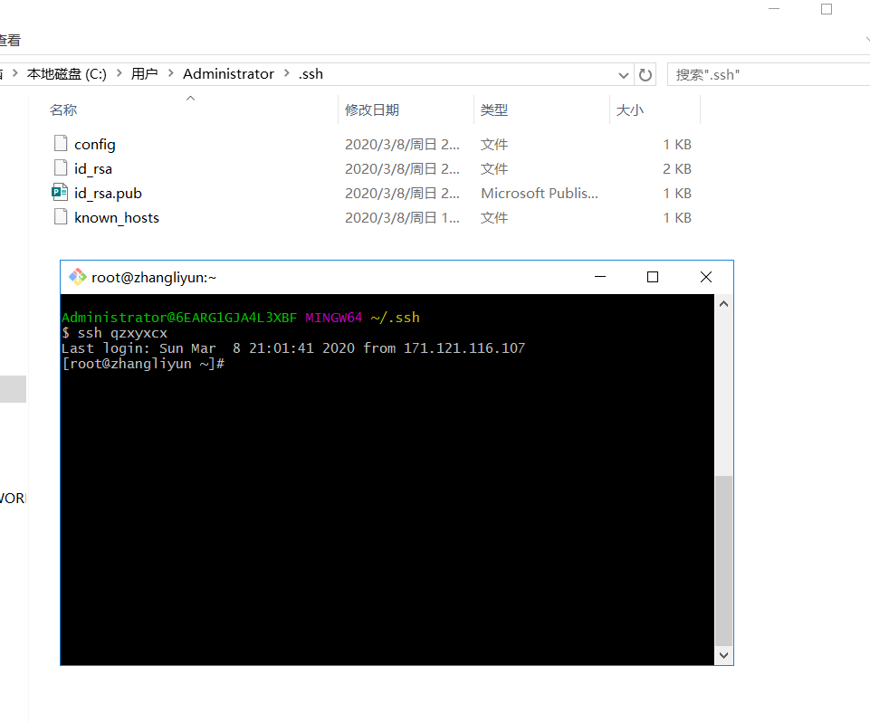
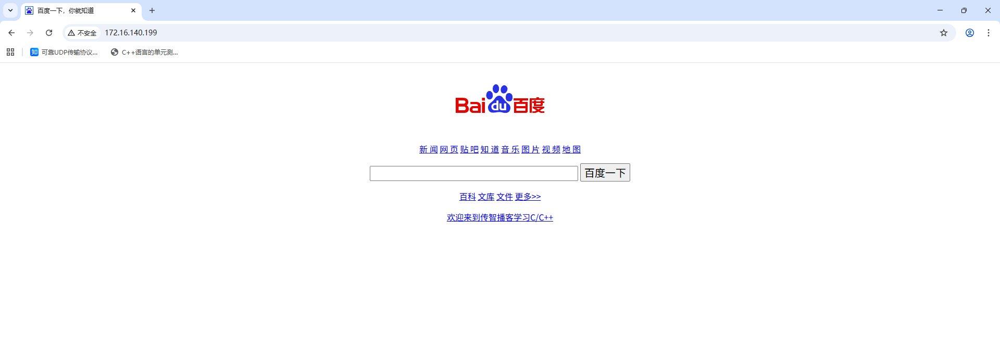
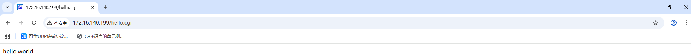
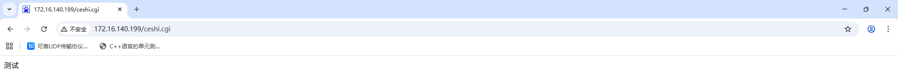
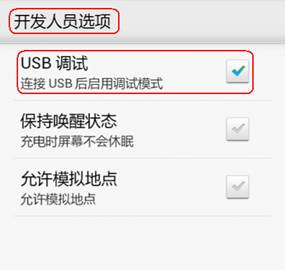

## SSH

> SSH客户端 可连接运行了 SSH服务器 的远程主机

SSH协议：专为远程登录会话和其他网络服务提供安全性的协议。建立在应用层和传输层基础上的安全协议

### 连接

- 通过SSH协议防止远程登录过程的信息泄露

  |            命令            |   对应英文   | 作用         |
  | :------------------------: | :----------: | :----------- |
  |       ssh 用户名@ip        | secure shell | 远程bash     |
  | scp 用户名@ip:文件名或录用 | secure copy  | 远程复制文件 |

  ```shell
  ssh [-p port] user@remote Ip
  # user:远程机器上的用户名，不指定的话默认当前用户
  # remote：远程机器ip，可以是 ip/域名，或者别名
  # port：SSH 服务器进程监听的端口，不指定，默认是22
  
  ssh -p 22 Amos@172.16.140.133
  
  exit #退出当前用户
  ```

  Windows若想ssh连接到Linux，则需要安装相应的客户端

  - Linux默认采用的编码格式是UTF-8，Windows默认采用的编码格式是ANSI(GB2312、GBK)，所以需要设置一下相应编码：

    

- 对所有传输的数据进行加密，防止DNS与IP欺骗

  | 选项 | 含义                                                         |
  | :--: | :----------------------------------------------------------- |
  |  -r  | 给出的源文件是目录文件，将递归赋值该目下的所有子目录和文件，目标文件必须为一目录名 |
  |  -P  | 若远程SSH服务器的端口不是22,需要用大写字母 P 来指定端口      |

  ```shell
  # 将本地当前目录下的 01.py 复制到远程家目录下的 Desktop/01.py
  scp -P port 01.py user@remote:Desktop/01.py
  
  # 把远程家目录下的 Desktop/01.py 文件复制到本地当前目录下的 01.py
  scp -P port user@remote:Desktop/01.py 01.py
  
  # 加上-r 传输文件夹
  scp -r demo user@remote:Desktop
  ```

  

### 免密登录

在本地 `.ssh` 文件夹下登录远程服务器，保存SSH相关的配置信息

生成本地当前用户公钥

- 执行 `ssh-keygen` 即可生成SSH公钥，全部回车
- `id_rsa.pub` ：即本机公钥
- `id_rsa` ：即本机私钥

将公钥上传到服务器

- 执行 `ssh-copy-id -p port user@remote` ，让远程服务器记住公钥



**工作原理**：非对称加密算法

> 使用 **公钥** 加密的数据，需要私钥解密
> 使用 **私钥** 加密的数据，需要公钥解密

- 本地发送的数据，用私钥加密
- 服务器若保存有公钥，会对数据解密
- 数据处理完后用公钥加密，回传给本地

### ssh配置别名

输入 `ssh username@ipaddress` 很繁琐
在 `~/.ssh/config` 里追加以下内容

```
Host newName
	HostName ip_address
	User username
	Port port
```

保存之后，就可使用别名登录



## Webserver

**http.tar.gz** 是用C语言编程的一个简单版webserver

```shell
# 将http.tar.gz拷贝到服务端，并解压
root@tzj-virtual-machine:/opt# tar -xzvf http.tar.gz 
http/
http/success.html
http/images/
http/images/MC_icon_white.png
http/images/tit.jpg
http/images/logo.jpg
http/images/11.jpg
http/images/mail.jpg
http/images/MC_icon.png
http/images/pop_close.png
http/images/conterpic3.jpg
http/images/bdlogo.gif
http/images/QR1.jpg
http/images/QR2.jpg
http/default.html
http/data.txt
http/makefile
http/jquery-1.11.1.min.js
http/myhttp
http/css/
http/css/style.css
http/src/
http/src/useradd.c
http/src/work.h
http/src/pub.c
http/src/s.c
http/src/server.c
http/src/work.c
http/src/pub.h
http/src/pass.c
http/index.html
http/favicon.ico
http/error.html
http/templet.zhujy
http/postfile.html

# 进入解压目录，编译源码
root@tzj-virtual-machine:/opt# cd http/
root@tzj-virtual-machine:/opt/http# ls
css       default.html  favicon.ico  index.html            makefile  postfile.html  success.html
data.txt  error.html    images       jquery-1.11.1.min.js  myhttp    src            templet.zhujy
root@tzj-virtual-machine:/opt/http# make

# 关闭防火墙
root@tzj-virtual-machine:/opt/http# systemctl status ufw
● ufw.service - Uncomplicated firewall
     Loaded: loaded (/lib/systemd/system/ufw.service; enabled; vendor preset: enabled)
     Active: active (exited) since Sun 2025-09-28 18:24:44 CST; 1 week 4 days ago
       Docs: man:ufw(8)
   Main PID: 676 (code=exited, status=0/SUCCESS)
        CPU: 72ms

9月 28 18:24:42 tzj-virtual-machine systemd[1]: Starting Uncomplicated firewall...
9月 28 18:24:44 tzj-virtual-machine systemd[1]: Finished Uncomplicated firewall.
root@tzj-virtual-machine:/opt/http# systemctl stop ufw
root@tzj-virtual-machine:/opt/http# systemctl disable ufw
Synchronizing state of ufw.service with SysV service script with /lib/systemd/systemd-sysv-install.
Executing: /lib/systemd/systemd-sysv-install disable ufw
Removed /etc/systemd/system/multi-user.target.wants/ufw.service.

# root用户启动或关闭web服务
root@tzj-virtual-machine:/opt/http# ./myhttp stop
signal SIGTERM
myhttp end

root@tzj-virtual-machine:/opt/http# ./myhttp start
listen 80 success
myhttp begin

root@tzj-virtual-machine:/opt/http# ./myhttp start
listen 80 success
myhttp begin
root@tzj-virtual-machine:/opt/http# ifconfig
ens33: flags=4163<UP,BROADCAST,RUNNING,MULTICAST>  mtu 1500
        inet 172.16.140.199  netmask 255.255.255.0  broadcast 172.16.140.255
        ether 00:0c:29:e5:2a:4c  txqueuelen 1000  (Ethernet)
        RX packets 86878  bytes 82336775 (82.3 MB)
        RX errors 0  dropped 0  overruns 0  frame 0
        TX packets 42514  bytes 11662099 (11.6 MB)
        TX errors 0  dropped 0 overruns 0  carrier 0  collisions 0

lo: flags=73<UP,LOOPBACK,RUNNING>  mtu 65536
        inet 127.0.0.1  netmask 255.0.0.0
        inet6 ::1  prefixlen 128  scopeid 0x10<host>
        loop  txqueuelen 1000  (Local Loopback)
        RX packets 62266  bytes 14774523 (14.7 MB)
        RX errors 0  dropped 0  overruns 0  frame 0
        TX packets 62266  bytes 14774523 (14.7 MB)
        TX errors 0  dropped 0 overruns 0  carrier 0  collisions 0
# 访问，启动成功
```



**修改输出内容**

```shell
root@tzj-virtual-machine:/opt/http# vim hello.c

#include <stdio.h>

int main()
{
        printf("hello world\n");

        return 0;
}

# 编译
root@tzj-virtual-machine:/opt/http# gcc hello.c -o hello.cgi

# 启动http
root@tzj-virtual-machine:/opt/http# ./myhttp start
listen 80 success
myhttp begin

## 此时，访问http://172.16.140.199/hello.cgi
root@tzj-virtual-machine:/opt/http# ./myhttp start
listen 80 success
myhttp begin
root@tzj-virtual-machine:/opt/http# accept by 172.16.140.1
thread is begin
recv:
GET /hello.cgi HTTP/1.1
Host: 172.16.140.199
Connection: keep-alive
Cache-Control: max-age=0
Upgrade-Insecure-Requests: 1
User-Agent: Mozilla/5.0 (Windows NT 10.0; Win64; x64) AppleWebKit/537.36 (KHTML, like Gecko) Chrome/140.0.0.0 Safari/537.36
Accept: text/html,application/xhtml+xml,application/xml;q=0.9,image/avif,image/webp,image/apng,*/*;q=0.8,application/signed-exchange;v=b3;q=0.7
Accept-Encoding: gzip, deflate
Accept-Language: zh-CN,zh;q=0.9

accept by 172.16.140.1
thread is begin
headbuf:
HTTP/1.1 200 OK
Content-Type: text/html
Content-Length:12

thread_is end
recv:
GET /favicon.ico HTTP/1.1
Host: 172.16.140.199
Connection: keep-alive
User-Agent: Mozilla/5.0 (Windows NT 10.0; Win64; x64) AppleWebKit/537.36 (KHTML, like Gecko) Chrome/140.0.0.0 Safari/537.36
Accept: image/avif,image/webp,image/apng,image/svg+xml,image/*,*/*;q=0.8
Referer: http://172.16.140.199/hello.cgi
Accept-Encoding: gzip, deflate
Accept-Language: zh-CN,zh;q=0.9

headbuf:
HTTP/1.1 200 OK
Content-Type: image/x-icon
Content-Length:2550

thread_is end
```



**中文乱码** ：Linux默认采用的编码格式是UTF-8，浏览器显示默认采用的编码格式是GBK


直接修改浏览器编码

在输头部信息中指定编码格式，

```shell
root@tzj-virtual-machine:/opt/http# vim ceshi.c

#include <stdio.h>

int main()
{
        printf("<head>");
        printf("<meta http-equiv=\"content-type\" content=\"text/html;charset=utf-8\">");
        printf("</head>");
        printf("<html>");
        printf("测试\n");
        printf("</html>");

        return 0;
}

root@tzj-virtual-machine:/opt/http# gcc ceshi.c -o ceshi.cgi
```




## ADB

安卓调试工具（Android Debug Bridge，ADB），PC端与安卓手机的通道，管理手机设备或模拟器的状态

### Windows配置ADB环境

```shell
# 将abd.exe添加到环境变量
D:\deps\platform-tools

# 测试abd命令
C:\Users\tian_zj>adb
Android Debug Bridge version 1.0.31

 -a                            - directs adb to listen on all interfaces for a connection
 -d                            - directs command to the only connected USB device
                                 returns an error if more than one USB device is present.
 -e                            - directs command to the only running emulator.
                                 returns an error if more than one emulator is running.
 -s <specific device>          - directs command to the device or emulator with the given
                                 serial number or qualifier. Overrides ANDROID_SERIAL
                                 environment variable.
 -p <product name or path>     - simple product name like 'sooner', or
                                 a relative/absolute path to a product
                                 out directory like 'out/target/product/sooner'.
                                 If -p is not specified, the ANDROID_PRODUCT_OUT
                                 environment variable is used, which must
                                 be an absolute path.
 -H                            - Name of adb server host (default: localhost)
 -P                            - Port of adb server (default: 5037)
 devices [-l]                  - list all connected devices
                                 ('-l' will also list device qualifiers)
 connect <host>[:<port>]       - connect to a device via TCP/IP
                                 Port 5555 is used by default if no port number is specified.
 disconnect [<host>[:<port>]]  - disconnect from a TCP/IP device.
                                 Port 5555 is used by default if no port number is specified.
                                 Using this command with no additional arguments
                                 will disconnect from all connected TCP/IP devices.
```

将Android设备通过USB连接到PC

```shell
# 将Android设备通过USB连接到PC，安装相应驱动

# Android设备启动USB调试功能
```




```shell
C:\Users\tian_zj>adb devices
* daemon not running. starting it now on port 5037 *
* daemon started successfully *
List of devices attached
```


