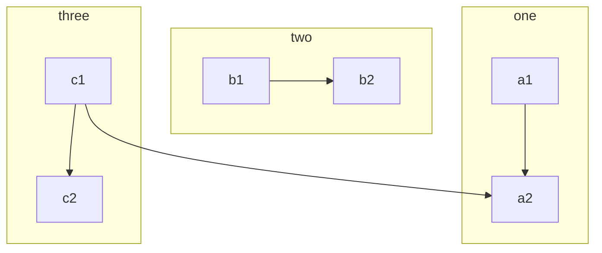
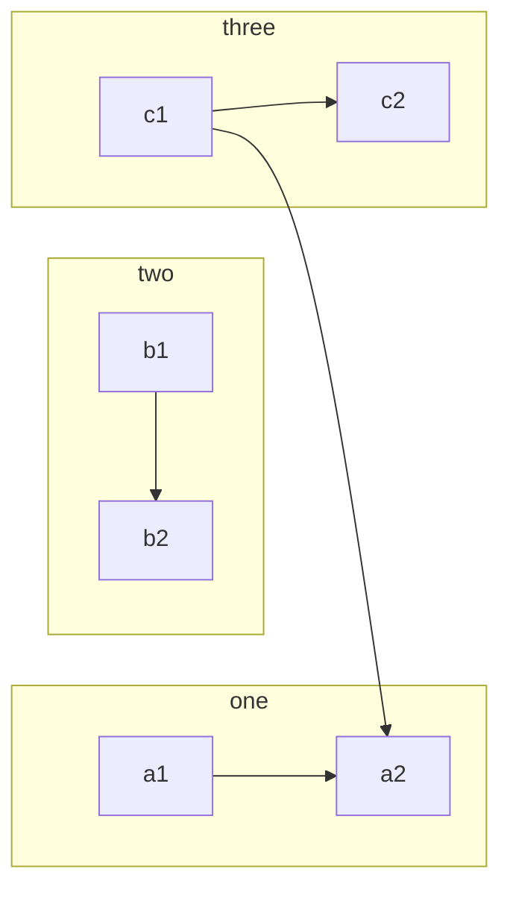
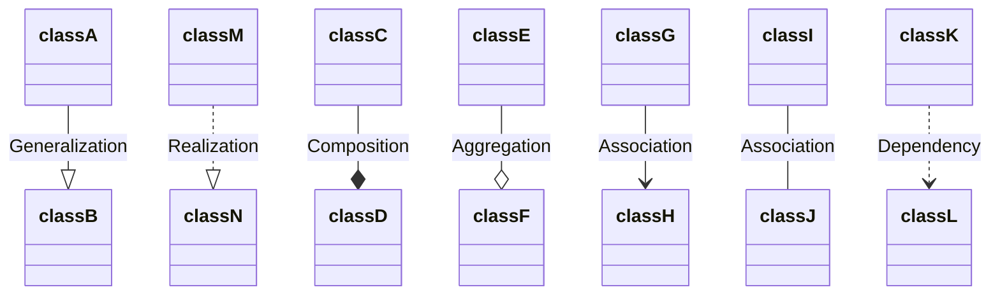
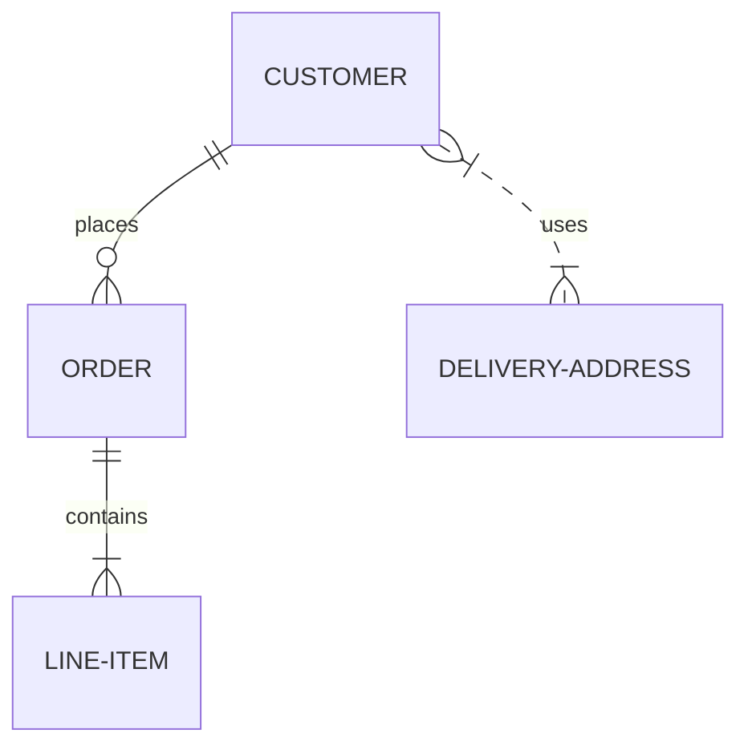

>   markdown常用语法归纳

<!--more-->

# 一级标题

这是标题下的一段正常段落。

## 二级标题

> 这是标题下的块引用.

### 三级标题

```
这是标题下的代码块。
```

#### 四级标题

- 这是无序列表项
- 这是无序列表项
- 这是无序列表项

##### 五级标题

1. 这是有序列表
2. 这是有序列表
3. 这是有序列表

###### 六级标题

| What    | Follows  |
| ------- | -------- |
| A table | A header |
| A table | A header |
| A table | A header |

---

水平分割线如上下

---

任务清单如下:

- [x] Create a sample markdown document
- [x] Add task lists to it
- [ ] Take a vacation

任务清单与列表的混合如下：

- [ ] Steal underpants
- 文本
- [ ] Profit!

嵌套的无序列表:

- Jackson 5
    - Michael
    - Tito
    - Jackie
    - Marlon
    - Jermaine
- TMNT
    - Leonardo
    - Michelangelo
    - Donatello
    - Raphael

Markdown内置了HTML解析器，可以直接使用HTML语法定义列表。
默认的样式为加粗和斜体。

```html
<dl>
    <dt>Name</dt>
    <dd>Godzilla</dd>
    <dt>Born</dt>
    <dd>1952</dd>
    <dt>Birthplace</dt>
    <dd>Japan</dd>
    <dt>Color</dt>
    <dd>Green</dd>
</dl>
```

<dl>
    <dt>Name</dt>
    <dd>Godzilla</dd>
    <dt>Born</dt>
    <dd>1952</dd>
    <dt>Birthplace</dt>
    <dd>Japan</dd>
    <dt>Color</dt>
    <dd>Green</dd>
</dl>

表格是粗体标题，表格体行之间阴影交替。

| Artist          | Album          | Year |
| --------------- | -------------- | ---- |
| Michael Jackson | Thriller       | 1982 |
| Prince          | Purple Rain    | 1984 |
| Beastie Boys    | License to Ill | 1986 |

如果某一数据行过多，它应该向下换行压缩和/或水平滚动。

```html
<!-- prettier-ignore-start -->
<!-- prettier-ignore-end -->
```

<!-- prettier-ignore-start -->

| Artist          | Album          | Year | Label                   | Awards                                                       | Songs                                                        |
| --------------- | -------------- | ---- | ----------------------- | ------------------------------------------------------------ | ------------------------------------------------------------ |
| Michael Jackson | Thriller       | 1982 | Epic Records            | Grammy Award for Album of the Year, American Music Award for Favorite Pop/Rock Album, American Music Award for Favorite Soul/R&B Album, Brit Award for Best Selling Album, Grammy Award for Best Engineered Album, Non-Classical | Wanna Be Startin' Somethin', Baby Be Mine, The Girl Is Mine, Thriller, Beat It, Billie Jean, Human Nature, P.Y.T. (Pretty Young Thing), The Lady in My Life |
| Prince          | Purple Rain    | 1984 | Warner Brothers Records | Grammy Award for Best Score Soundtrack for Visual Media, American Music Award for Favorite Pop/Rock Album, American Music Award for Favorite Soul/R&B Album, Brit Award for Best Soundtrack/Cast Recording, Grammy Award for Best Rock Performance by a Duo or Group with Vocal | Let's Go Crazy, Take Me With U, The Beautiful Ones, Computer Blue, Darling Nikki, When Doves Cry, I Would Die 4 U, Baby I'm a Star, Purple Rain |
| Beastie Boys    | License to Ill | 1986 | Mercury Records         | noawardsbutthistablecelliswide                               | Rhymin & Stealin, The New Style, She's Crafty, Posse in Effect, Slow Ride, Girls, (You Gotta) Fight for Your Right, No Sleep Till Brooklyn, Paul Revere, Hold It Now, Hit It, Brass Monkey, Slow and Low, Time to Get Ill |

<!-- prettier-ignore-end -->

---

像代码块 `var foo = "bar";` 应该在行内输入。

同样的，`this should vertically align` ~~`with this`~~ ~~and this~~.

代码片段应该放在代码块中。

```
var foo = "bar";
```

代码段也可以使用高亮语法，标注的语言和代码匹配就可以高亮

```js
var foo = "bar";
```

表格单元格内的内联代码仍然可以区分。

| Language   | Code               |
| ---------- | ------------------ |
| Javascript | `var foo = "bar";` |
| Ruby       | `foo = "bar"`      |

小图像应该显示在他们的实际大小。


大图片应该总是按比例缩小并适合内容容器。


## Mermaid Test

纵向TB



横向LR



简单图


类图



E-R图



## 表情文本

I give this theme two :+1:!

Set config `plugins: [jemoji]`, Emoji searcher, see: [https://emoji.muan.co/](https://emoji.muan.co/)

## font-awesome

```html
<i class="fa fa-check-circle text-green">checked</i>
<i class="fa fa-battery-quarter text-red">battery</i>
```

<i class="fa fa-check-circle text-green">checked</i>
<i class="fa fa-battery-quarter text-red">battery</i>

## 数学公式

$$
\begin{aligned}
  & \phi(x,y) = \phi \left(\sum_{i=1}^n x_ie_i, \sum_{j=1}^n y_je_j \right)
  = \sum_{i=1}^n \sum_{j=1}^n x_i y_j \phi(e_i, e_j) = \\
  & (x_1, \ldots, x_n) \left( \begin{array}{ccc}
      \phi(e_1, e_1) & \cdots & \phi(e_1, e_n) \\
      \vdots & \ddots & \vdots \\
      \phi(e_n, e_1) & \cdots & \phi(e_n, e_n)
    \end{array} \right)
  \left( \begin{array}{c}
      y_1 \\
      \vdots \\
      y_n
    \end{array} \right)
\end{aligned}
$$

