>   [【尚硅谷】Git与GitHub基础全套完整版教程（快速上手，一套搞定）_哔哩哔哩_bilibili](https://www.bilibili.com/video/BV1pW411A7a5?from=search&seid=6662384508146079512&spm_id_from=333.337.0.0)但是学完后感觉先会用了，再看原理才知道问什么这么做，所以笔记顺序是先使用再说原理

<!--more-->

# 1. 版本控制工具

##  1.1 应具备的功能

-   数据备份
-   版本控制
    -   SVN增量式：只保存修改部分
    -   git 快照流：每个文件的每次修改都会保存
-   协同修改
-   权限控制
-   分支管理——git特有

## 1.2 分类

>   集中式版本控制——SVN

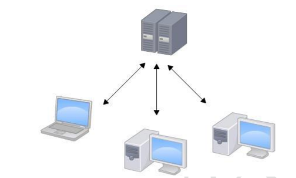

-   原始文件与修改都保存在服务器

>   分布式版本控制——git

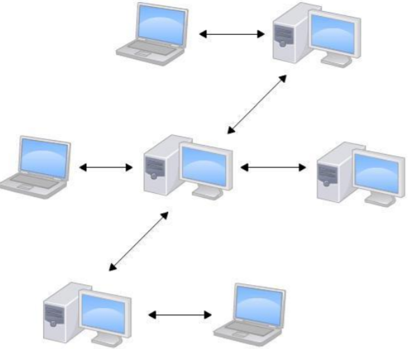

-   原始文件与版本信息在每台主机上都有保存

<div style="page-break-after:always"></div>

# 2. git结构

## 2.1 git 本地库

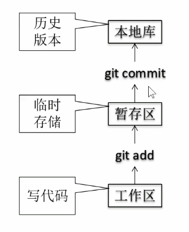

## 2.2 git 远程库——代码托管中心

>    通过远程库实现团队内协作

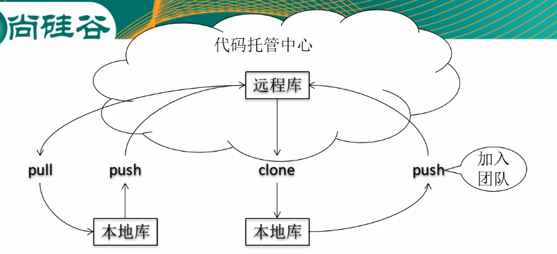

>    通过远程库实现跨团队协作

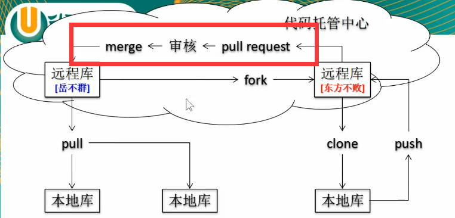

<div style="page-break-after:always"></div>

# 3. git命令行操作

## 3.1 本地库操作

### 3.1.1 查看git版本

```shell
git --version
```

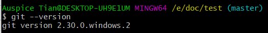

### 3.1.2 初始化

```shell
git init
```

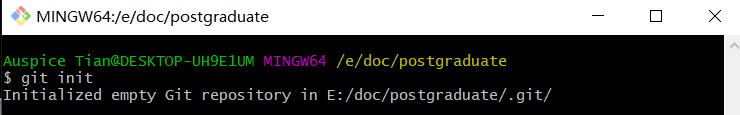

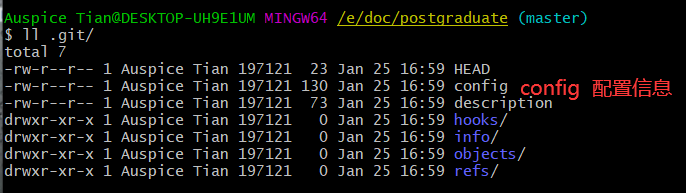

### 3.1.3 配置信息

```shell
git config [--global] xx #当前仓库配置 [全局配置]
```

-   --global：为OS本用户的所有本地库设置签名
-   配置信息保存位置：./git/config

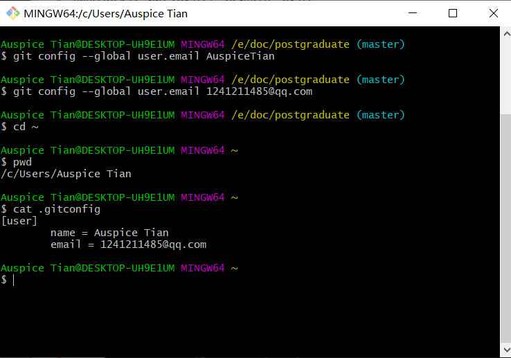

#### 1. 查看配置

```shell
git config --list
```

#### 2. 删除配置信息

```shell
git config --unset user.email
```

#### 3. 设置签名

>   为当前本地库配置签名，在上传到远程库时，作为主机的识别信息

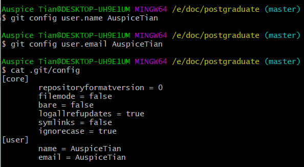

>   优先级

-   就近原则：项目优先级 > 系统优先级

#### 4. 配置别名

```shell
git config (--global) alias.[别名] "[命令]"
```

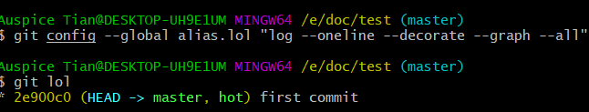

### 3.1.4 基本操作

| A区-操作->B区               | 未同步文件的颜色 |
| --------------------------- | ---------------- |
| 工作区-`git add`->暂存区    | 红色             |
| 暂存区-`git commit`->本地库 | 绿色             |

-   只有暂存区中有的文件才能提交到本地库

#### 1. 状态查看

```shell
git status
```

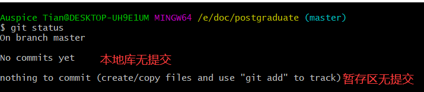

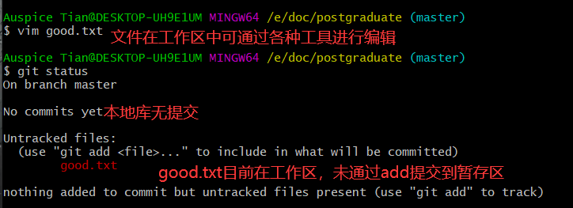

#### 2. 添加到暂存区

```shell
git add xx #可指定文件，若 . 表示工作区的全部提交到暂存区
```


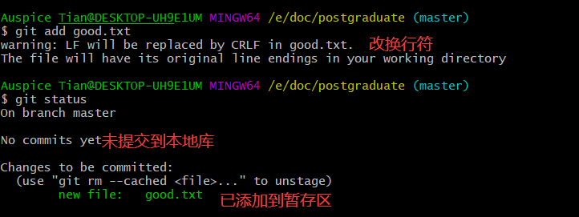

>   git add -A $$\iff$$ git add .

-   将工作区内的所有文件添加到暂存区

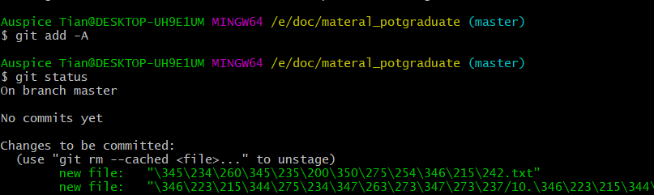

#### 3. 添加到本地库

```shell
git commit [--参数] xx
```

>    初次提交

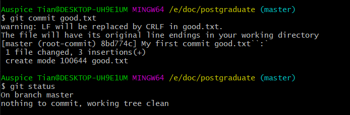

>   修改后提交

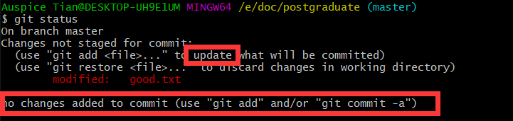

##### 参数：-a

>   将工作区的文件直接提交到本地库

-   跳过 `git add` 操作

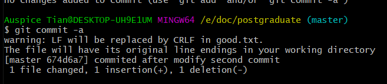

##### 参数：-m

>   `-m xx` ：添加本次修改的注释xx  

-   -m：命令行加注释提交，不进vim

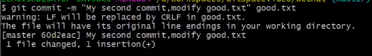

##### 参数：--amend

>   修改注释

将暂存区中的文件重新提交，相当于改注释

#### 4. 从本地库，暂存区移除

```shell
git rm xx
```

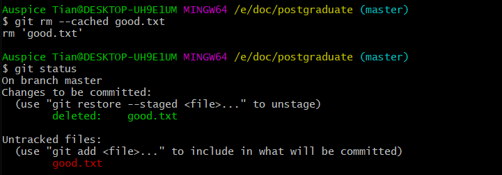

结果为只保留工作区文件。

**区别工作区删除** ：结果为保留暂存区、本地库记录

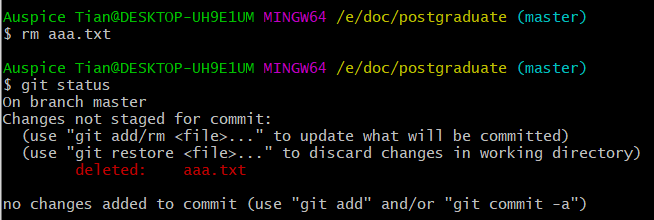

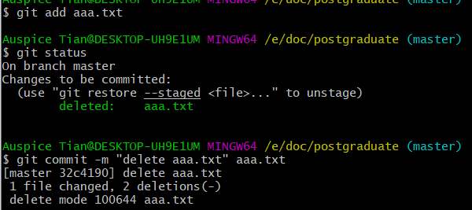

#### 5. 查看可追踪的版本记录

```shell
git log
```

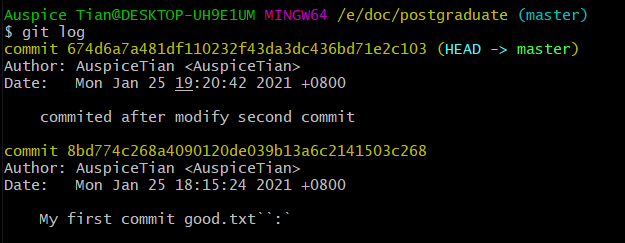

-   多屏显示

    空格：向下翻页

    b：向上翻页

    q：退出

-   只显示到有指针指向的最新版本

##### 参数：--prety=oneline

>   简化查看版本信息

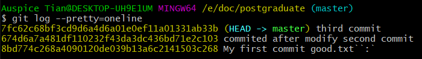

##### 参数：--oneline 

>   简化hash，查看版本信息

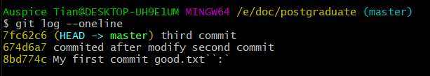

>   进一步优化

```shell
git log --oneline --decorate --graph --all
```

查看可追踪的所有分支的所有版本信息

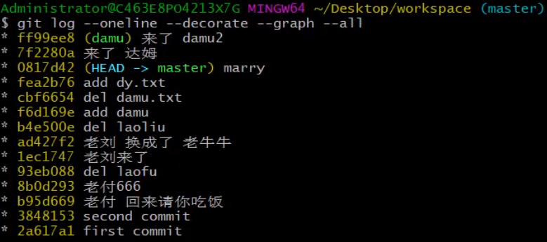

#### 6. 查看所有版本信息——git reflog

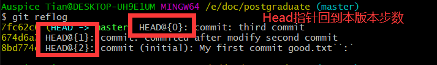

#### 7. 版本管理

```shell
git reset [--参数] hash索引值
```

##### 参数：--soft

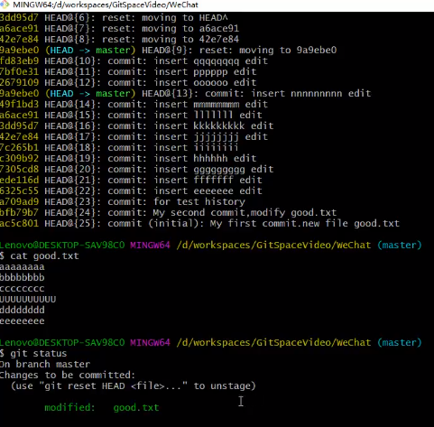

-   本地库移动HEAD指针

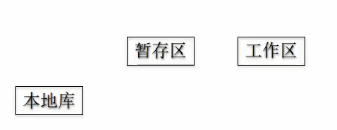

##### 参数：--mixed

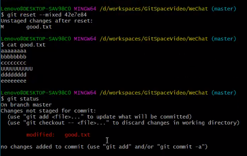

-   本地库移动HEAD指针
-   重置暂存区

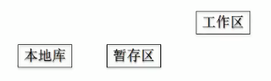

##### 参数：--hard

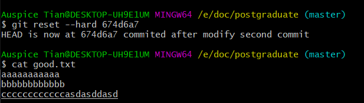

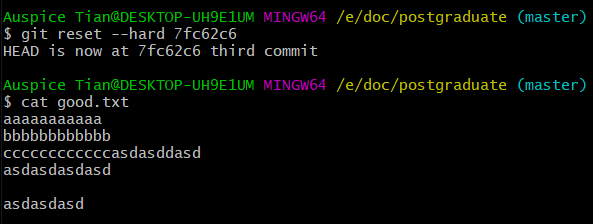

**修改HEAD指针的指向**

以HEAD指针为起点，回退

```shell
git reset --hard ^^^^...
```

-   有几个 `^` HEAD指针回退几次

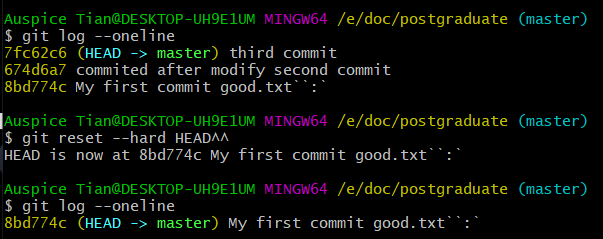

```shell
git reset hard ~[n]
```

-   以HEAD指针为起点，回退n个版本

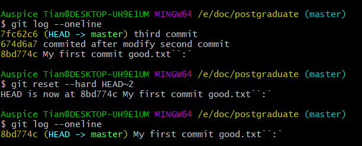

-   以HEAD指针为起点，回退n个版本

#### 8. 比较文件差异——git diff

```shell
git diff [文件名]
```

-   将工作区中的文件与暂存区进行比较

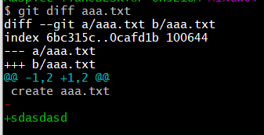

```shell
git diff [本地库历史版本] [文件名]
```

-   将工作区中文件和本地库历史记录比较  

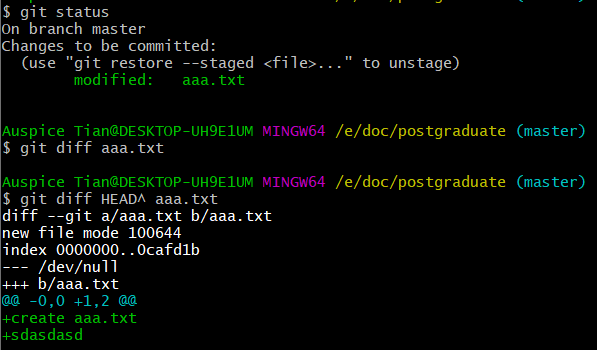

```shell
git diff
```

-   多个文件比较

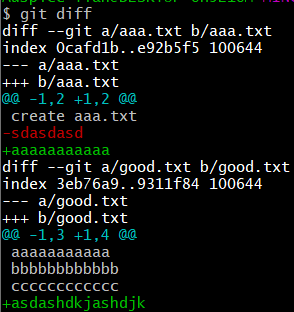

### 3.1.5 分支管理

>   用于实现 **多人协同工作及热部署** 

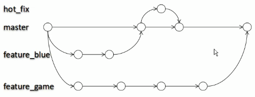

```shell
git branch
```

#### 1. 参数：-v

-   查看分支的最新状态

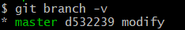

####  2. 新建分支

```shell
git branch [分支名]
```

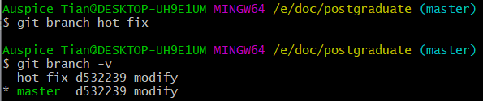

#### 3. 删除分支

```shell
git branch [参数] [分支名]
```

-   -d：删除以提交过的分支
-   -D：强制删除分支

#### 4. 切换分支

```shell
git checkout [分支名]
```

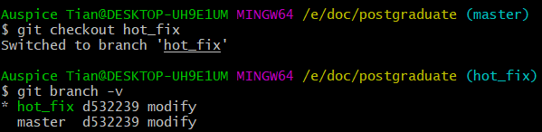

##### 参数：-b [分支名]

>   以当前分支的当前版本作为起点，新建分支并切换到新分支

-   会将工作区中的内容重置

    若 [原分支] 有未提交的文件，则会将未提交文件带至 [新分支]

`checkout` 前，先用 `git status` 确定有没有未提交文件

##### 跟踪分支

```shell
git checkout -b [branch] [remotename]/[branch]
```

-   创建新的分支[branch]与远程跟踪分支 [remotename]/[branch] 同步
    -   远程库必须是配置的签名用户有访问权限的库

```shell
git checkout --track origin/serverfix
```

-   创建与远程跟踪分支同名的本地分支

#### 5. 分支同步

```shell
git branch -u [branch] origin/serverfix
```

将本地分支与远程跟踪分支同步

#### 6. 合并分支

```shell
git merge [被合并的分支名]
```

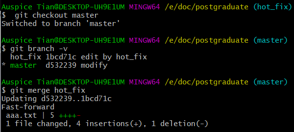

##### 冲突处理

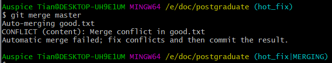

-   若合并分支时产生冲突，会进入 **分支冲突** 状态

    此时需要查看有冲突的文件

    

冲突处理完毕后，提交到本地库即可

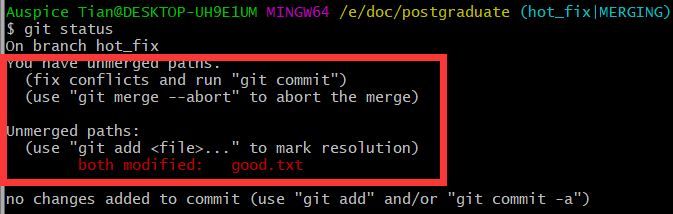

-   将冲突处理完毕的文件用 `git add` 提交到暂存区

    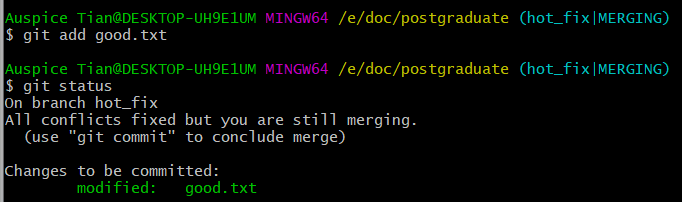

-   将冲突处理完毕的文件用 `git commot` 提交到本地库

    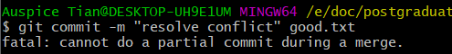

冲突处理完毕，且要退出 **分支冲突** 状态

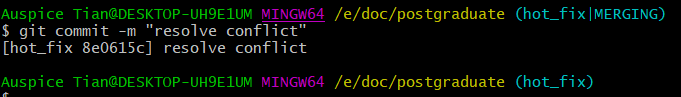

#### 7. git 存储——git stash

>   将未提交的修改保存到栈内，切换分支

```shell
git stash list #查看存储
git stash pop  #弹出存储，并删除
```

1.  git stash apply [stash@{2}]
    -   引用栈顶的文件

2.  git stash drop [stash@{2}]
    -   移除存储

#### 8. 分支工作流

>   协同开发的过程

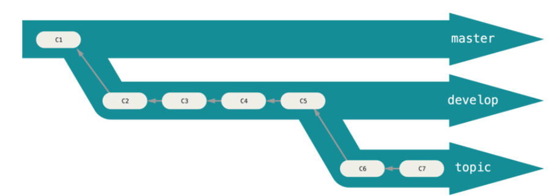

-   master为线上分支
-   develop为本地主分支
-   topic为本地就某一模块的开发的分支
-   develop开发完成后，合并回线上的master分

## 3.2 远程库操作

### 3.2.1 查看远程库配置

```shell
git remote -v
```

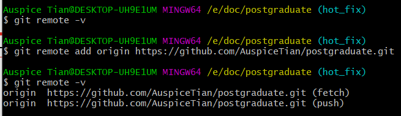

### 3.2.2 新增远程库

```shell
git remote add [远程库别名] [远程库URL]
```


### 3.2.3 向远程库推送

```shell
git push [远程库名] [远程分支名]
```


### 3.2.4 克隆远程库

```shell
git clone [远程库]
```


### 3.2.5 将远程库同步到本地库

```shell
git pull [远程库] [远程分支名]
```


-   远程分支
    -   远程库的分支
-   远程跟踪分支
    -   在本地的远程同步分支

#### 1. 从远程库抓取

```shell
git fetch [远程库] [远程分支]
```


#### 2. 本地库合并远程分支

```shell
git merge [远程跟踪分支]
```


### 3.2.6 团队外协作


<div style="page-break-after:always"></div>

## 3.3 git 版本&分支管理与协同开发实例


# 4. git实现机制

## 4.1 git版本生成机制

### 4.1.1 两类版本控制对比

#### 1. 增量式(SVN)

-   版本迭代的是原始文件基础上的修改部分


#### 2. 快照流(git)

-   版本迭代的是每个修改文件的副本

>   快照：同一文件的不同版本

-   有修改文件：生成快照
-   无修改文件：只保留一个链接指向之前存储的文件


### 4.1.2 高层命令的分解

#### 1. git add

1.  将修改的文件生成 数据对象`blob` ，并添加到本地库的对象目录 `.git/objects`

    -   将指定路径下的文件内容生成数据对象并存入本地库

        git hash-object -w [文件路径] => `blob` 

2.  将 数据对象`blob` 存入暂存区

    -   git update-index [参数] [文件模式] [hash] [文件名]

#### 2. git commit

1.  将暂存区中的 数据对象`blob` 与对应的文件名建立映射关系，即生成 目录树对象`tree`
    -   git write tree
2.  生成 提交对象`commit` ，然后提交到本地库，形成一个版本
    -   git commit-tree [`tree`的hash] -p [父`tree`的hash]

### 4.1.3 对象


#### 1. 数据对象(blob)

每个文件的每次修改都会生成一个 `blob` 数据对象

-   使用 **哈希算法** 生成 **数据对象(blob)** 解决文件内容的存储问题

##### 根据文件内容获取hash值

特点：

-   哈希算法确定、输入数据不变，hash值确定
    -   同一哈希算法，得到的加密结果长度固定
-   git 底层采用 **SHA-1** 算法

```shell
git hash-object [-w] --stdin|[文件路径] #计算管道命令输入内容的hash，并打印或存入本地库
```

若不加 `-w` 则只计算hash值

-w：将数据对象存入本地库

-   [文件路径]：将文件路径指定的文件内容转化为 `blob` 写入本地库
-   --stdin：将标准输入的文件内容进行哈希运算


##### 根据hash获取原始内容

```shell
git cat-file
```

-   -p：将hash值转化为文件内容


-   -t：输出hash值对应的git对象类型


#### 2. 目录树对象(tree)

>    将暂存区中的数据对象以树的形式存储

-   解决文件内容与文件名间的映射问题

-   `git commit` 时，才将暂存区中的数据对象构建为 `tree`——项目commit时的快照

##### 将数据对象存入暂存区

```shell
git update-index [参数] [文件模式] [blob] [文件名]
```

-   --add：该文件第一次提交需要带的参数
-   --cacheInfo：将已在本地库的数据对象添加到暂存区
-   [文件模式]
    -   100644，表明这是一个普通文件
    -   100755，表示一个可执行文件
    -   120000，表示一个符号链接  


##### 将目录树对象读入暂存区

```shell
git read-tree --prefix=bak [父tree的hash]
```

-   lib：保存子 **tree** 的目录


##### 将暂存区中的 `blob` 生成 `tree`

```shell
git write tree
```

##### 查看暂存区中内容

```shell
git ls-files -s
```


#### 3. 提交对象(commit)

```shell
git commit-tree [子tree的hash] -p [父tree的hash]
```

-   将目录树对象 `tree` 链接为一个版本对象 `commit`

#### 4. 版本链

>   提交对象先后链接形成版本链


## 4.2 git 分支管理机制

-   [分支名]：指向分支的最新版本(指向的是提交对象`commit` ，理解为分支指针)
-   HEAD：指向当前活动分支的最新版本(指向的是分支指针，理解为分支指针的指针)


>   HEAD指针带动分支版本移动


>   HEAD指针指向活动分支的最新版本


## 4.4 git文件结构


### 4.4.1 HEAD

保存当前分支的文件路径


符号引用

### 4.4.2 config

当前项目的配置

### 4.4.2 description

当前本地库的描述信息

### 4.4.3 hooks

钩子：联系高层命令与底层命令的程序

### 4.4.4 index

暂存区

### 4.4.5 info

.gitignore标注的全局性排除文件

### 4.4.6 log

git 日志

### 4.4.7 object

保存 数据对象、目录树对象、提交对象的hash

### 4.4.8 refs

保存提交对象的指针

-   heads：各个分支当前版本对应的提交对象的hash

    、
-   remotes：远程库的当前分支最新版本的hash
-   tags：分支的别名

