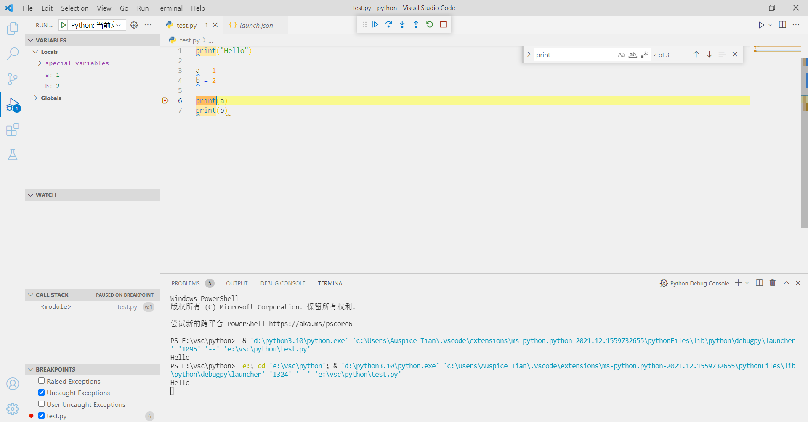
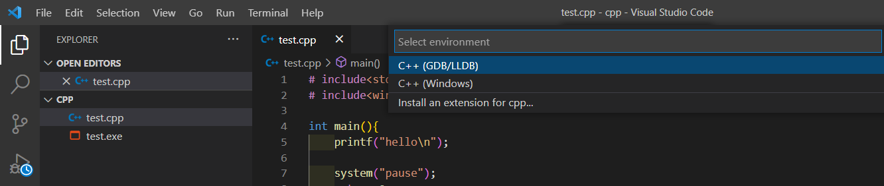

>   配置vscode的 `Python` , `C++` 的编译环境

<!--more-->

# 1. 环境变量

## 1.1 程序的启动方式


-   程序调用是OS根据输入的程序名调用路径下对应的可运行文件 (.exe)


`cmd` 命令在任何文件夹下可用的原因是 **环境变量**

## 环境变量 `Path` 的作用

>   程序调用时，不仅在当前文件夹下进行，也会去配置好的环境变量下寻找。
>
>   配置 `Path` 实质上就是将常用的文件夹路径添加到系统的扫描路径中


# 2. Python

## 2.1 Python解释器

### 2.1.1 安装python环境


### 2.1.2 创建vscode-python文件夹


#### 裸配置


如图，与在命令行运行无区别

### 2.1.2 安装vscode-python插件

### 2.1.3 code插件运行.py


#### 添加配置文件


##### program

>   设置启动文件

```
"program": "${file}",
```

code宏定义：选中那个文件 *F5* 运行那个文件

#### code调试功能

-   设置断点后， *F5* 运行至断点处



-   *F10* 从断点处逐行执行

    

    

## 2.2 跨文件夹调用


```python
import sys
sys.path.append("./") # 将当前文件夹添加到系统目录中
```


## 2.3 conda管理python环境

### 2.3.1 查看已有环境

```shell
conda info -e
```


### 2.3.2 新建环境conda

```shell
conda create -n [env_name] python=3.xx
```


### 2.3.3 使用conda环境

```shell
conda activate [env_name]
```


# 3. C++

## 3.1 单文件编译

### 3.1.1 下载vsc扩展

### 3.1.2 下载C++编译器

https://winlibs.com/

1.  查看版本


2.  配置环境变量


3.  编写程序，测试编译器

    ```c++
    # include<stdio.h>
    # include<windows.h>
    
    int main(){
        printf("hello\n");
    
        system("pause");
        return 0;
    }
    ```

    

### 3.1.3 vsc使用自己下载的编译器



-   GDB为自己下载的编译器


-   此时，生成 *launch.json* 和 *tasks.json* 两个配置文件


#### launch.json


#### task.json


## 3.2 多文件编译


```shell
g++ test.cpp -o test.exe //用g++编译器将 test.cpp 链接成 test.exe
```

报错：没有找得到 `PrintHello()` 的定义


```c
g++ test.cpp hello.cpp -o test.exe //用g++编译器将test.cpp和hello.cpp链接成一个可执行文件
```

### 3.2.1 C/C++编译过程


### 3.2.2 cmake构建工具

1.  [cmake下载地址](https://cmake.org/download/)

2.  vscode 安装 cmake 插件

    -   cmake：命令提示
    -   cmaketools：核心工具

3.  将cmake添加到环境变量或修改 cmaketools的配置文件

    

4.  目录下新建 `CMakeLists.txt` 

    ```
    project(#项目名)
    
    aux_source_directory(目录 定义为变量名)
    
    add_executable(#项目名 #目标目录)
    ```

    ```
    project(test)
    
    aux_source_directory(./src SRCS)
    
    add_executable(${PROJECT_NAME} ${SRCS})
    ```

5.  不再需要编译配置文件 task.json及删除launch.json文件中的 `      "preLaunchTask": "C/C++: g++.exe 生成活动文件"` 配置项

### 3.2.3 cmake构建项目

1.  选择 cmake 的编译器

    

2.  使用cmake调试

    

    

3.  修改配置文件，使 F5 调用cmake调试

    ```json
    {
        "configurations" : [
            ...
    	    "program":"${command:cmake.launchTargetPath}"
        	...
        ]
    }
    ```

    

**注**

新增文件，需要变动重新保存一下CMakeLists.txt文件，刷新缓冲

