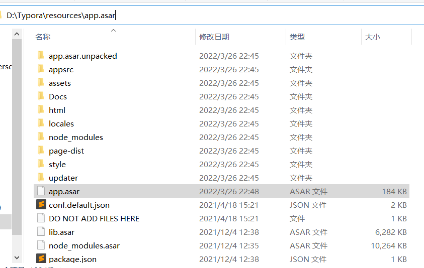
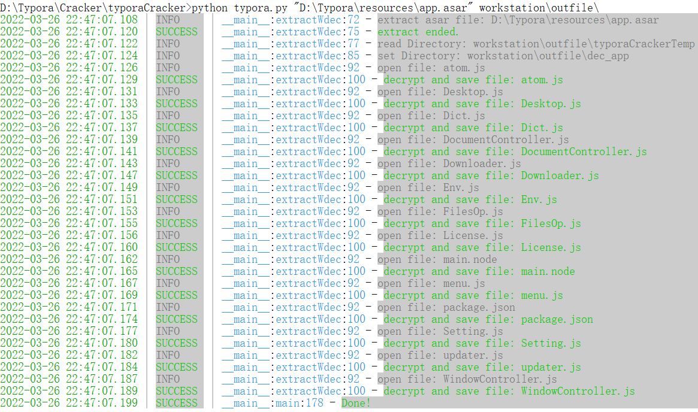
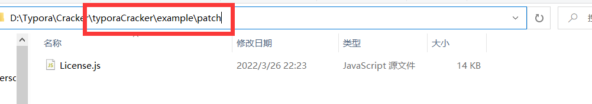
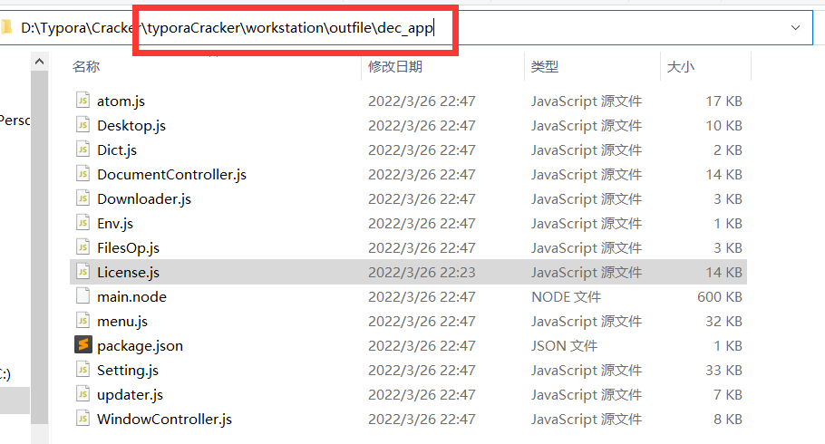
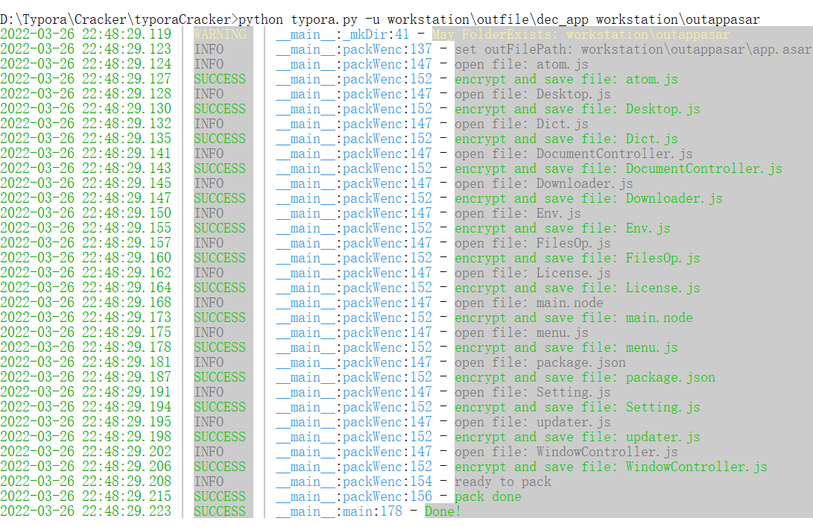
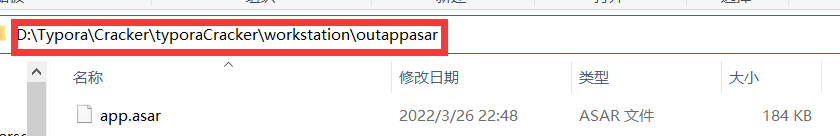
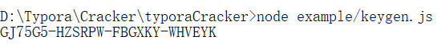

> typora 1.0.x 的破解，高版本的破解不了

<!--more-->

# 下载

https://typora.io/releases/all

能进去的话用这个，下载1.0.3的，1.1.x的我没试过，但1.2.x及以上的一定会失败

## 下载完成后**不要打开**

# 破解

## 1. 将破解需要的脚本克隆到本地

新建一个空文件夹，然后点击进入文件夹

```shell
# 初始化git仓库
git init
# 克隆文件
git clone git@github.com:Mas0nShi/typoraCracker.git
```

克隆到本地后，打开typoraCracker文件夹，使用其中的requirements.txt安装依赖，语句如下：

```shell
pip install -r requirements.txt
```

## 2. 找到typora的安装地址，找到resources的app.asar文件




## 3. 对app.asar解压

在typoraCracker文件夹打开命令行窗口，输入解包命令。

```shell
python typora.py "D:\Typora\resources\app.asar" workstation\outfile\
```



## 4. 替换解压缩出来的许可证

用克隆下来的typoraCracker文件中的example\patch\License.js替换workstation\outfile\dec_app\License.js






## 5. 打包app.asar

先在 **typoraCracker\workstation** 文件夹中新建一个文件夹，名为 **outappasar**
打包命令如下：

```shell
python typora.py -u workstation\outfile\dec_app workstation\outappasar
```

打包完后，在 **typoraCracker\workstation\outappasar** 会出现一个 **app.asar** 文件。





## 6. 将打包好的app.asar替换到resources文件夹

## 7. 授权码生成

切换到typoraCracker文件夹，输入以下命令生成授权码：

```shell
#切换地址命令：
cd "你的typoraCracker文件夹所在地址"
#如：cd "D:\git\typoraCracker"

#生成授权码命令：
node example/keygen.js
```



## 8. 打开typro激活

在typora授权码栏输入生成的授权码，邮箱输入crack@example.com即可

---

# 资源

链接：https://pan.baidu.com/s/1NdF5ms01SvnQozKkCAB7IA 
提取码：o6ir 