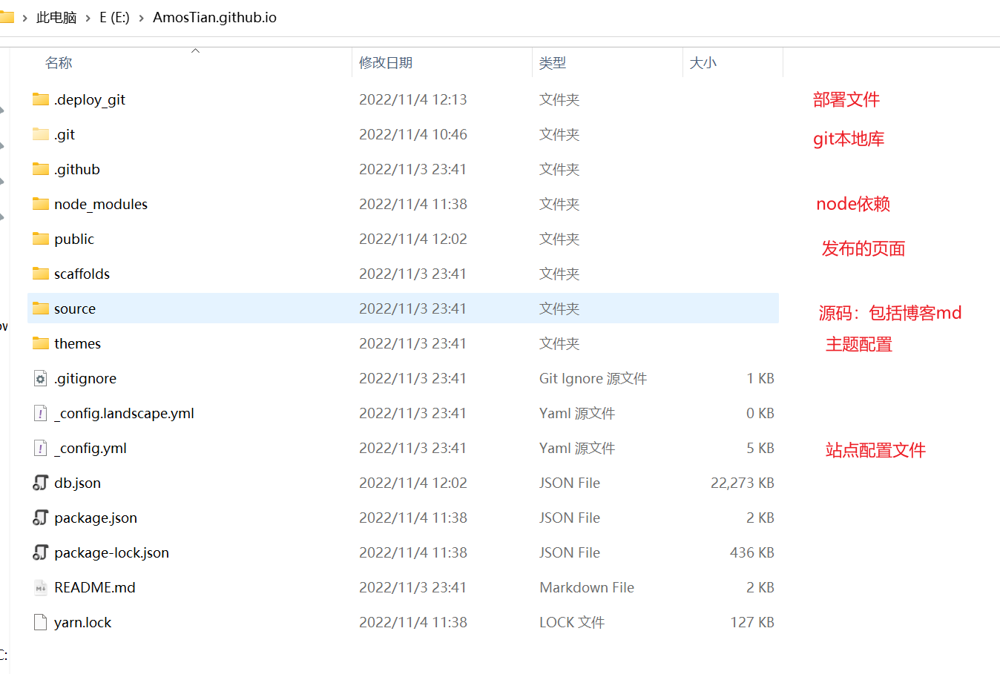
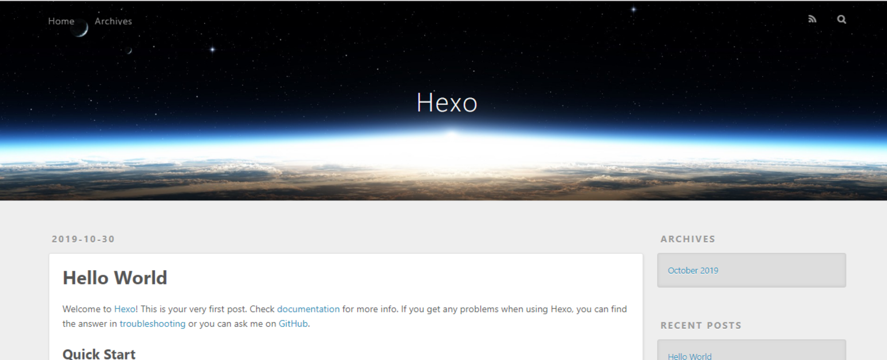
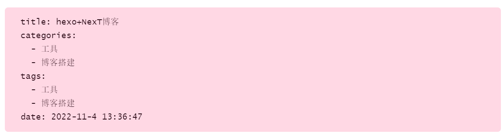
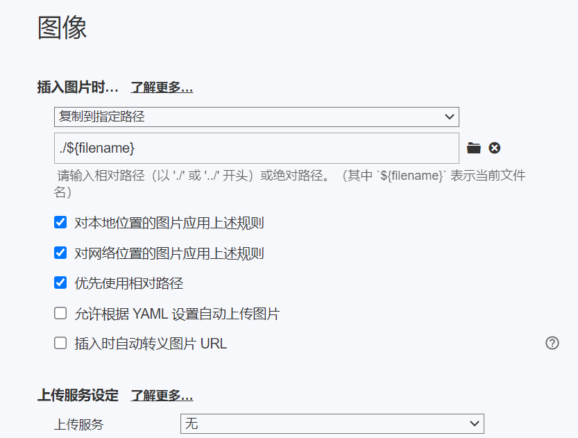
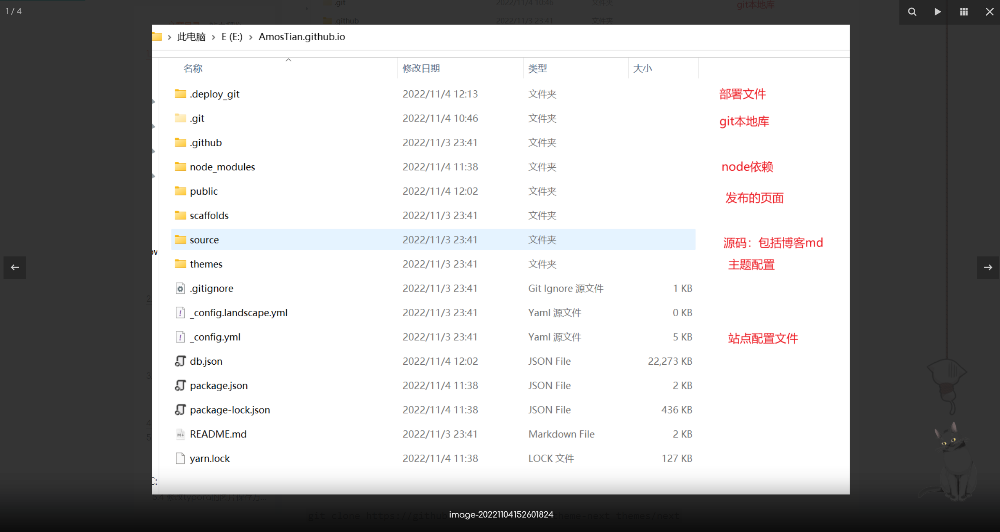
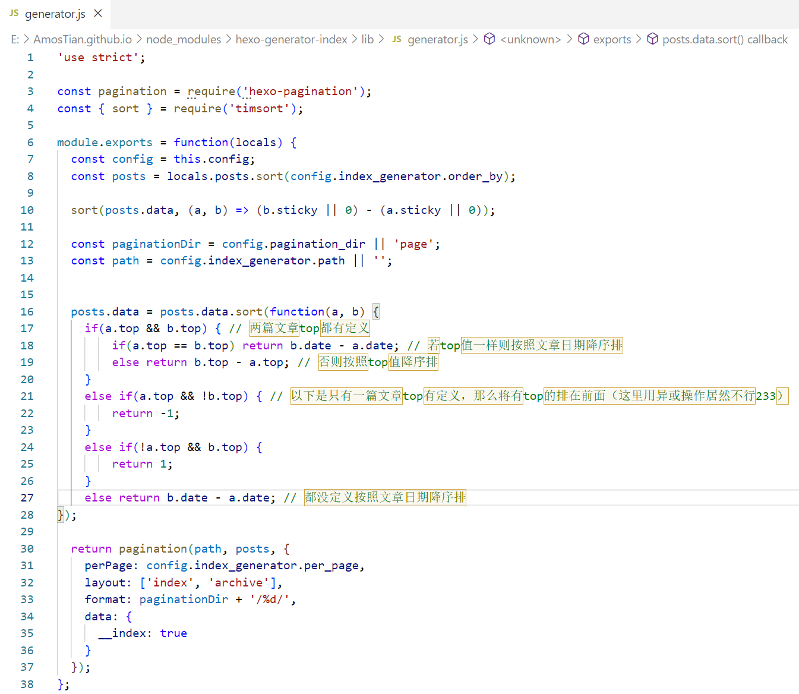
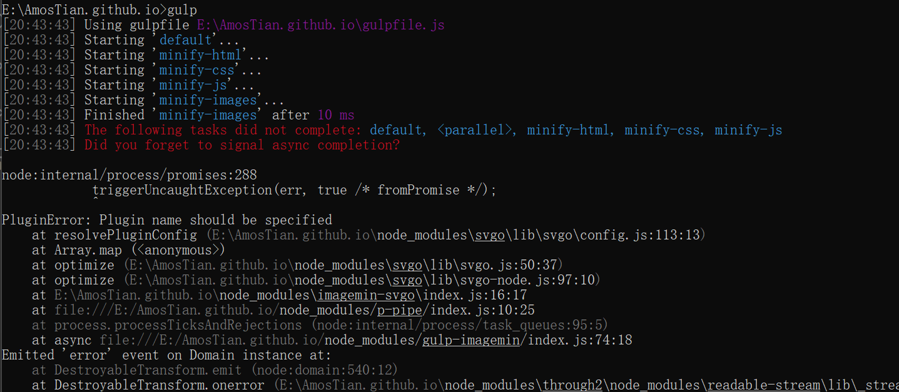
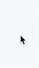
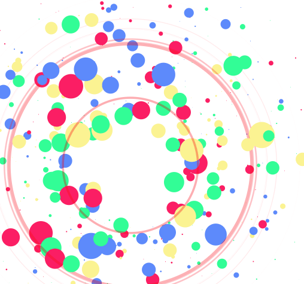
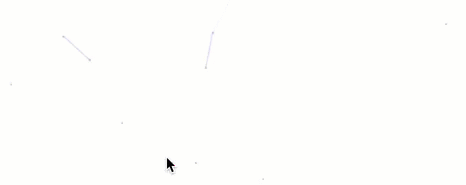

> hexo + NexT搭建博客——环境准备

<!--more-->

# 1. 环境准备

[参考链接](https://www.jianshu.com/p/3f0d2d907ea0)

## 1.1 在github创建Git仓库

> 在github托管的GithubPage，也可以托管到Gitee，但是GiteePage好像有一些限制具体看自己选择

仓库名一定要输入 `username.github.io`

- 一个账号只能用创建一个同名的博客

## 1.2 安装Git

## 1.3 安装node管理工具

> `nvm` 在github官网下载，解压后直接运行 `.exe` 安装程序  

### 1.3.1 安装node

在命令行中输入 `nvm install 版本号 32/64`

如：

```shell
nvm install 6.10.2  64
```

### 1.3.2 设置node的版本

```shell
nvm use 6.10.2
```

## 1.4 修改镜像源

> `npm` 默认的镜像源在国外，安装包时会卡在 `sill idealTree buildDeps` ，最好改成国内

```shell
npm config set registry https://registry.npm.taobao.org 
```

##  1.5 安装hexo

`npm install hexo-cli -g`

## 1.6 创建本地博客

初始化本地博客仓库

```shell
hexo init 你的用户名.github.io
```



## 1.7 安装NexT主题

> Hexo有两份主要的配置文件，都是 `_config.yml` 
>
> - 一份位于 本地博客目录下，主要包含Hexo本身配置
> - 另一份位于主题目录下 `xx.github.io/themes/next` 下

### 1.7.1 切换到本地博客目录下 `xx.github.io` 目录下

### 1.7.2 安装NexT主题

`git clone https://github.com/iissnan/hexo-theme-next themes/next`

### 1.7.3 使用 NexT主题

找到本地博客目录下的 `_config.yml` 将 `theme` 键值对修改为 `theme: next` 

### 1.7.4 **站点配置文件基本信息修改**

```yaml
title: xxx # 博客的名字，也称站点名称
author: xxx # 作者名字
description: xxx # 对站点的描述，搜索引擎会抓取，可以自定义（这个还是加上比较好）
language: zh-Hans # 语言 简体中文
theme: next # 配置主题
deploy: # 部署相关配置 
type: git # 使用 Git 提交 
repo: https://github.com/xxx/xxx.github.io.git # 就是存放博客的仓库地址
```

---

站点配置文件示例

```yaml
# Hexo Configuration
## Docs: https://hexo.io/docs/configuration.html
## Source: https://github.com/hexojs/hexo/

# Site 这里的配置，哪项配置反映在哪里，可以参考我的博客
title: xxx # 博客的名字，也称站点名称
subtitle: xxx # 副标题
description: xxx # 对站点的描述，搜索引擎会抓取，可以自定义
author: xxx # 作者名字
language: zh-Hans # 语言 简体中文
timezone:  # 用默认的即可

# URL 
# 这项暂时不需要配置，绑定域名后，要创建 sitemap.xml 时再配置该项
## If your site is put in a subdirectory, set url as 'http://yoursite.com/child' and root as '/child/'
url: # http://xxx.com
root: /
permalink: :year/:month/:day/:title/
permalink_defaults:

# Directory
# 目录，不要修改
source_dir: source
public_dir: public
tag_dir: tags
archive_dir: archives
category_dir: categories
code_dir: downloads/code
i18n_dir: :lang
skip_render:

# Writing 
# 文章布局、写作格式的定义，不修改
new_post_name: :title.md # File name of new posts
default_layout: post
titlecase: false # Transform title into titlecase
external_link: true # Open external links in new tab
filename_case: 0
render_drafts: false
post_asset_folder: false
relative_link: false
future: true
highlight:
  enable: true
  line_number: true
  auto_detect: false
  tab_replace:

# Category & Tag
default_category: uncategorized
category_map:
tag_map:

# Date / Time format 
# 日期 / 时间 格式，不要修改
## Hexo uses Moment.js to parse and display date
## You can customize the date format as defined in
## http://momentjs.com/docs/#/displaying/format/
date_format: MMM D YYYY
time_format: H:mm:ss

# Pagination 
# 每页显示文章数，可以自定义
## Set per_page to 0 to disable pagination
per_page: 10
pagination_dir: page

# Extensions 
# 配置站点所用主题和插件，这里将默认主题注释，修改为 next
## Plugins: https://hexo.io/plugins/
## Themes: https://hexo.io/themes/
theme: next
#theme: landscape

# 头像
# 注意：是 xxx.github.io/source 下的开始的相对路径，如果 source 文件夹下面没有 uploads 文件夹，那么新建一个。考虑到会博客中用很多图片，在 uploads 文件夹下请分好类，避免混乱
avatar: /uploads/images/avatar.jpg

# Deployment 
# 本地博客部署到 github 上要配置这里
## Docs: https://hexo.io/docs/deployment.html
deploy:
  type: git # 使用 Git 提交
  repository: https://github.com/xxx/xxx.github.io.git # 就是存放博客的仓库地址 
```

### 1.7.5 本地测试

- 定位到 `xxx.github.io` 目录
- 输入命令：`hexo s` 相当于 启动hexo服务预览

启动成功，默认在 `http://localhost:4000` 就能打开博客



### 1.7.6 NexT主题个性化

```yaml
# 挑一些有必要的属性列一下
# 网站的favicon
favicon:
  small: /images/favicon.png
  medium: /images/favicon.png
  apple_touch_icon: /images/favicon.png
  safari_pinned_tab: /images/favicon.png
  #android_manifest: /images/manifest.json
  #ms_browserconfig: /images/browserconfig.xml

# Show multilingual switcher in footer.
language_switcher: true

# 底部栏的配置
footer:
  # Specify the date when the site was setup. If not defined, current year will be used.

  # Icon between year and copyright info.
  # 备选的icon可以在下列网址选择与复制
  icon:
    # Icon name in Font Awesome. See: https://fontawesome.com/v4.7.0/icons/
    # `heart` is recommended with animation in red (#ff0000).
    name: grav
    # If you want to animate the icon, set it to true.
    animated: true #闪动效果
    # Change the color of icon, using Hex Code.
    color: "#808080"

  # If not defined, `author` from Hexo `_config.yml` will be used.
  copyright: AmosTian

  # 是否显示Powered by Hexo & NexT
  powered: false

  # Beian ICP and gongan information for Chinese users. See: http://www.beian.miit.gov.cn, http://www.beian.gov.cn
  beian:
    enable: false
    icp:
    # The digit in the num of gongan beian.
    gongan_id:
    # The full num of gongan beian.
    gongan_num:
    # The icon for gongan beian. See: http://www.beian.gov.cn/portal/download
    gongan_icon_url:

# ---------------------------------------------------------------
# Scheme Settings
# ---------------------------------------------------------------
# 这部分设置nexT的风格
# Schemes
#scheme: Muse
#scheme: Mist
scheme: Pisces
#scheme: Gemini

# Dark Mode
darkmode: false

# ---------------------------------------------------------------
# Menu Settings
# ---------------------------------------------------------------

# Usage: `Key: /link/ || icon`
# Key is the name of menu item. If the translation for this item is available, the translated text will be loaded, otherwise the Key name will be used. Key is case-senstive.
# Value before `||` delimiter is the target link, value after `||` delimiter is the name of Font Awesome icon.
# When running the site in a subdirectory (e.g. yoursite.com/blog), remove the leading slash from link value (/archives -> archives).
# External url should start with http:// or https://
menu:
  home: / || home
  categories: /categories/ || th
  tags: /tags/ || tags
  archives: /archives/ || archive
  #about: /about/ || user
  essay: /categories/随笔// || pied-piper
  # 这个是我自己做的动态简历，会直接跳转到 \public\dynamic-resume\index.html
  # 自定义的js或者css文件需要插入到 \themes\next\source下对应的文件夹中
  # hexo在生成网页时，会将这些文件夹中的文件复制到\public中
  dynamic-resume: /dynamic-resume/ || cog     
  #schedule: /schedule/ || calendar
  #sitemap: /sitemap.xml || sitemap
  #commonweal: /404/ || heartbeat

# Enable / Disable menu icons / item badges.
menu_settings:
  icons: true
  badges: true


# ---------------------------------------------------------------
# Sidebar Settings
# See: https://theme-next.org/docs/theme-settings/sidebar
# ---------------------------------------------------------------

sidebar:
  # Sidebar Position.
  position: left
  #position: right

  # Manual define the sidebar width. If commented, will be default for:
  # Muse | Mist: 320
  # Pisces | Gemini: 240
  #width: 300

  # Sidebar Display (only for Muse | Mist), available values:
  #  - post    expand on posts automatically. Default.
  #  - always  expand for all pages automatically.
  #  - hide    expand only when click on the sidebar toggle icon.
  #  - remove  totally remove sidebar including sidebar toggle.
  display: post

  # Sidebar padding in pixels.
  padding: 18
  # Sidebar offset from top menubar in pixels (only for Pisces | Gemini).
  offset: 12
  # Enable sidebar on narrow view (only for Muse | Mist).
  onmobile: false

# Sidebar Avatar
avatar:
  # Replace the default image and set the url here.
  url: /images/avatar.png
  # If true, the avatar will be dispalyed in circle.
  rounded: true
  opacity: 1
  # If true, the avatar will be rotated with the cursor.
  rotated: false

# Posts / Categories / Tags in sidebar.
site_state: true

# Social Links
# Usage: `Key: permalink || icon`
# Key is the link label showing to end users.
# Value before `||` delimiter is the target permalink, value after `||` delimiter is the name of Font Awesome icon.
social:
  GitHub: https://github.com/AmosTian || github
  CSDN: https://blog.csdn.net/qq_40479037?type=blog || crosshairs 
  E-Mail: mailto:17636679561@163.com || envelope
  #Weibo: https://weibo.com/yourname || weibo
  #Google: https://plus.google.com/yourname || google
  #Twitter: https://twitter.com/yourname || twitter
  #FB Page: https://www.facebook.com/yourname || facebook
  #StackOverflow: https://stackoverflow.com/yourname || stack-overflow
  #YouTube: https://youtube.com/yourname || youtube
  #Instagram: https://instagram.com/yourname || instagram
  #Skype: skype:yourname?call|chat || skype

# Table of Contents in the Sidebar
# Front-matter variable (unsupport wrap expand_all).
toc: #目录配置
  enable: true #是否自动生成目录
  # Automatically add list number to toc.
  number: false #目录自动编号
  # If true, all words will placed on next lines if header width longer then sidebar width.
  wrap: false #标题过长是否换行
  # If true, all level of TOC in a post will be displayed, rather than the activated part of it.
  expand_all: true
  # Maximum heading depth of generated toc.
  max_depth: 6 #最大标题深度

# ---------------------------------------------------------------
# Post Settings
# See: https://theme-next.org/docs/theme-settings/posts
# ---------------------------------------------------------------

# Automatically excerpt description in homepage as preamble text.
excerpt_description: true #自动截取more

# Read more button
# If true, the read more button will be displayed in excerpt section.
read_more_btn: true #添加阅读更多按钮

# Post meta display settings
post_meta:
  item_text: true
  created_at: true
  updated_at:
    enable: true
    another_day: true
  categories: true
# 文章结尾标志
passage_end_tag:
  enabled: true

# ---------------------------------------------------------------
# Misc Theme Settings
# ---------------------------------------------------------------

# Set the text alignment in posts / pages.
text_align:
  # Available values: start | end | left | right | center | justify | justify-all | match-parent
  desktop: justify
  mobile: justify

# Reduce padding / margin indents on devices with narrow width.
mobile_layout_economy: false

# Android Chrome header panel color ($brand-bg / $headband-bg => $black-deep).
android_chrome_color: "#222"

# Custom Logo (Do not support scheme Mist)
custom_logo: #/uploads/custom-logo.jpg

#代码块
codeblock:
  # Code Highlight theme
  # Available values: normal | night | night eighties | night blue | night bright | solarized | solarized dark | galactic
  # See: https://github.com/chriskempson/tomorrow-theme
  highlight_theme: normal
  # Add copy button on codeblock
  copy_button:
    enable: true
    # Show text copy result.
    show_result: true
    # Available values: default | flat | mac
    style: mac

back2top:
  enable: true
  # Back to top in sidebar.
  sidebar: false
  # Scroll percent label in b2t button.
  scrollpercent: true

# Reading progress bar
reading_progress:
  enable: true #顶部显示阅读进度
  # Available values: top | bottom
  position: top
  color: "#37c6c0"
  height: 3px

# Bookmark Support
bookmark:
  enable: false
  # Customize the color of the bookmark.
  color: "#222"
  # If auto, save the reading progress when closing the page or clicking the bookmark-icon.
  # If manual, only save it by clicking the bookmark-icon.
  save: auto

# `Follow me on GitHub` banner in the top-right corner.
github_banner:
  enable: true
  permalink: https://github.com/AmosTian
  title: Follow me on GitHub


# ---------------------------------------------------------------
# Font Settings
# See: https://theme-next.org/docs/theme-settings/#Fonts-Customization
# ---------------------------------------------------------------
# Find fonts on Google Fonts (https://www.google.com/fonts)
# All fonts set here will have the following styles:
#   light | light italic | normal | normal italic | bold | bold italic
# Be aware that setting too much fonts will cause site running slowly
# ---------------------------------------------------------------
# To avoid space between header and sidebar in scheme Pisces / Gemini, Web Safe fonts are recommended for `global` (and `title`):
# Arial | Tahoma | Helvetica | Times New Roman | Courier New | Verdana | Georgia | Palatino | Garamond | Comic Sans MS | Trebuchet MS
# ---------------------------------------------------------------

font:
  enable: true

  # Uri of fonts host, e.g. https://fonts.googleapis.com (Default).
  host: https://fonts.googleapis.com

  # Font options:
  # `external: true` will load this font family from `host` above.
  # `family: Times New Roman`. Without any quotes.
  # `size: x.x`. Use `em` as unit. Default: 1 (16px)

  # Global font settings used for all elements inside <body>.
  global:
    external: false
    family: Comfortaa
    size:

  # Font settings for site title (.site-title).
  title: #网站抬头
    external: true
    family: Comfortaa
    size:

  # Font settings for headlines (<h1> to <h6>).
  headings: #标题字体
    external: true
    family: Ma Shan Zheng
    size:

  # Font settings for posts (.post-body).
  posts: #文章字体
    external: false
    family: ZCOOL KuaiLe

  # Font settings for <code> and code blocks.
  codes:
    external: false
    family: consolas


# ---------------------------------------------------------------
# Statistics and Analytics
# See: https://theme-next.org/docs/third-party-services/statistics-and-analytics
# ---------------------------------------------------------------
# 统计
# Show Views / Visitors of the website / page with busuanzi.
# Get more information on http://ibruce.info/2015/04/04/busuanzi
busuanzi_count:
  enable: false
  total_visitors: true
  total_visitors_icon: user
  total_views: true
  total_views_icon: eye
  post_views: true
  post_views_icon: eye

# Post wordcount display settings
# Dependencies: https://github.com/theme-next/hexo-symbols-count-time
symbols_count_time:
  separated_meta: true #分隔符|
  item_text_post: true #是否统计站点总字数
  item_text_total: true #是否同级文章总字数
  awl: 2 #平均每个字符的长度
  wpm: 150 #words per minute

```

### 1.7.7 创建分类与标签

1. 命令行定位到 `xxx.github.io` 目录，输入 `hexo new page categories`

   这样在 `\source` 目录下创建新建对应的目录，找到目录对应的 `index.md` 文件

   ```yaml
   title: 分类
   date: 2022-02-22 08:05:53
   type: "categories"

2. 命令行定位到 `xxx.github.io` 目录，输入 `hexo new page "tags"` ，这样在 `source` 目录下新建对应的目录

   ```yaml
   title: 标签
   date: 2022-02-22 08:05:42
   type: "tags"
   ```

上述两个操作相当于创建了给所有博客添加了两个分类依据 `categories` 以及 `tags` ，用于文章的归类管理

某一篇文章要归类或者打标签，只需要在抬头配置对应属性即可，如本篇文章所述：



这两个页面是NexT自动维护的，只要文章按照规矩来就不会报错

# 2. 写文章与上传

## 2.1 写文章

## 2.2 本地运行测试

命令行定位到 `xxx.github.io` 目录中，输入命令 `hexo s`

## 2.3 在浏览器中查看效果

在浏览器地址栏输入 `http://localhost:4000` 访问本地博客

## 2.4 安装自动部署发布工具

为了自动部署到 GithubPage，这里我们需要 `hexo-deployer-git` 工具，将 **md文件** 转化为 **静态网页文件** ，并保存在 `/public` 文件夹中，文件夹上传到 github的相应仓库 `xxx.github.io` ，等待github部署完成之后，就可以访问 `http://xxx.github.io`  查看部署完成的博客了

```
hexo clean #清楚缓存，网页正常情况可以忽略这条命令
hexo g #生成静态网页
hexo d #开始部署
```

# 3. 文章链接

[参考链接](https://mculover666.blog.csdn.net/article/details/103137719)

Hexo默认使用的文章链接是 

```
year/:month/:day/:title/
```

但分享之后会使一堆转义字符，而且一旦修改文章发布日期或者标题，则立马失效，所以需要生成真正的永久链接 

 `abbrlink` 工具 https://github.com/rozbo/hexo-abbrlink

## 3.1 安装abbrlink插件

在博客根目录安装插件

```shell
npm install hexo-abbrlink --save
```

## 3.2 编辑站点配置文件

```yaml
# 默认的永久链接
permalink: :year/:month/:day/:title/

# 使用abbrlink
permalink: posts/:abbrlink/
abbrlink:
  alg: crc32 #support crc16(default) and crc32 # 链接生成算法
  rep: dec   #support dec(default) and hex #十进制/十六进制
```

---

设置的示例：

```shell
crc16 & hex
https://post.zz173.com/posts/66c8.html

crc16 & dec
https://post.zz173.com/posts/65535.html'

crc32 & hex
https://post.zz173.com/posts/8ddf18fb.html

crc32 & dec
https://post.zz173.com/posts/1690090958.html
```

# 4. 自动化构建 

[参考链接](https://mculover666.blog.csdn.net/article/details/103137865)


# 4. 图片问题

[参考链接](https://blog.csdn.net/xjm850552586/article/details/84101345)

## 4.1 安装插件

```shell
npm install hexo-asset-image --save
```

## 4.2 站点配置文件修改 `post_asset_folder` 为 `true`

## 4.3 打开替换内容

```shell
/node_modules/hexo-asset-image/index.js
```

替换为以下内容

```js
'use strict';
var cheerio = require('cheerio');

// http://stackoverflow.com/questions/14480345/how-to-get-the-nth-occurrence-in-a-string
function getPosition(str, m, i) {
  return str.split(m, i).join(m).length;
}

var version = String(hexo.version).split('.');
hexo.extend.filter.register('after_post_render', function(data){
  var config = hexo.config;
  if(config.post_asset_folder){
        var link = data.permalink;
    if(version.length > 0 && Number(version[0]) == 3)
       var beginPos = getPosition(link, '/', 1) + 1;
    else
       var beginPos = getPosition(link, '/', 3) + 1;
    // In hexo 3.1.1, the permalink of "about" page is like ".../about/index.html".
    var endPos = link.lastIndexOf('/') + 1;
    link = link.substring(beginPos, endPos);

    var toprocess = ['excerpt', 'more', 'content'];
    for(var i = 0; i < toprocess.length; i++){
      var key = toprocess[i];
 
      var $ = cheerio.load(data[key], {
        ignoreWhitespace: false,
        xmlMode: false,
        lowerCaseTags: false,
        decodeEntities: false
      });

      $('img').each(function(){
        if ($(this).attr('src')){
            // For windows style path, we replace '\' to '/'.
            var src = $(this).attr('src').replace('\\', '/');
            if(!/http[s]*.*|\/\/.*/.test(src) &&
               !/^\s*\//.test(src)) {
              // For "about" page, the first part of "src" can't be removed.
              // In addition, to support multi-level local directory.
              var linkArray = link.split('/').filter(function(elem){
                return elem != '';
              });
              var srcArray = src.split('/').filter(function(elem){
                return elem != '' && elem != '.';
              });
              if(srcArray.length > 1)
                srcArray.shift();
              src = srcArray.join('/');
              $(this).attr('src', config.root + link + src);
              console.info&&console.info("update link as:-->"+config.root + link + src);
            }
        }else{
            console.info&&console.info("no src attr, skipped...");
            console.info&&console.info($(this));
        }
      });
      data[key] = $.html();
    }
  }
});
```

## 4.4 **修改typora的图片保存方式**

> 一定要记得修改为相对路径，否则无法正常显示图片



# 5. 点击图片放大

[参考链接](https://blog.csdn.net/wugenqiang/article/details/89057323)

效果如图：



## 5.1 切换到lib目录

```shell
cd xxx.github.io\themes\next\source\lib
```

## 5.2 下载插件

```shell
git clone https://github.com/theme-next/theme-next-fancybox3 fancybox
```

## 5.3 更换主题配置文件

```shell
fancybox: true
```

# 6. 数学公式

[参考链接](https://yangxudong.github.io/math-in-hexo/)

## 6.1 hexo转化错误

Hexo默认使用 `hexo-render-marked` 引擎渲染网页（将一些特殊的makrdown语法转化为html标签），如markdown中的 `_` 代表斜体，会被渲染引擎处理为 `<em>`

MathJax引擎在渲染数学公式的时候就会出错。例如，$x_i$在开始被渲染的时候，处理为$x`<em>`i`</em>`$，这样MathJax引擎就认为该公式有语法错误，因为不会渲染。

类似的语义冲突的符号还有 `*` ，`{`，`}`，`\\`

## 6.2 解决方法

Hexo渲染主题的两个重要因素：mathjax和kramed，前者是数学公式渲染引擎，后者是Hexo的markdown渲染引擎，hexo默认渲染引擎是marked，但是它不支持mathjax，因此需要替换为 `kramed` 引擎。

### 6.2.1 Hexo添加数学公式解析插件mathjax

1. 如果hexo安装有 `hexo-math` ，需要先卸载它

   ```shell
   npm uninstall hexo-math --save
   ```

2. 安装 `mathjax` 

   ```shell
   npm install hexo-renderer-mathjax --save
   ```

3. hexo主题开启mathjax

   进入主题目录，编辑 `_config.yml` ，开启mathjax

   ```yaml
   # MathJax Support
   mathjax:
     enable: true
     per_page: true
   ```

4. 在博客文章的开头加入 `mathjax: true` 即可使用 `mathjax`

### 6.2.2 hexo渲染引擎切换为 `kramed`

1. 卸载 marked 引擎

   ```shell
   npm uninstall hexo-renderer-marked --save
   ```

2. 安装kramed引擎

   ```shell
   npm install hexo-renderer-kramed --save
   ```

3. 修改引擎bug

   修改文件 `node_modules\kramed\lib\rules\inline.js` 中 `escape` 和 `em` 两行

   ```js
   //  escape: /^\\([\\`*{}\[\]()#$+\-.!_>])/,
     escape: /^\\([`*\[\]()#$+\-.!_>])/,
         
   //  em: /^\b_((?:__|[\s\S])+?)_\b|^\*((?:\*\*|[\s\S])+?)\*(?!\*)/,
     em: /^\*((?:\*\*|[\s\S])+?)\*(?!\*)/,
   ```

4. 重启hexo

   ```shell
   hexo clean && hexo g -d
   ```

# 7. 侧边栏目录


# 8. mermaid

## 8.1安装hexo插件

在博客的根目录下，安装 `hexo-filter-mermaid-diagrams` 插件

[官方文档](https://github.com/webappdevelp/hexo-filter-mermaid-diagrams)

```shell
$ npm install hexo-filter-mermaid-diagrams --save
```

## 8.2 NexT启用Mermaid

打开NexT主题的 `_config.xml` 配置文件，找到 `mermaid` 的配置项，设置 `enable: true`

```yaml
# Mermaid tag
mermaid:
  enable: true
  # Available themes: default | dark | forest | neutral
  theme:
   	light: default
    dark: dark
```

# 9. 文章置顶

[参考链接](https://zhwhong.cn/2017/03/23/deal-with-hexo-article-top-problem/)

## 使用

Hexo只提供了按发布日期的排序，所以需要修改依赖文件，在每篇文章的配置项设置 `top: 数字` 赋权（升序）

## 修改

在 `node_modules/hexo-generator-index/lib/generator.js` 目录下新增

```js
posts.data = posts.data.sort(function(a, b) {
    if(a.top && b.top) { // 两篇文章top都有定义
        if(a.top == b.top) return b.date - a.date; // 若top值一样则按照文章日期降序排
        else return b.top - a.top; // 否则按照top值降序排
    }
    else if(a.top && !b.top) { // 以下是只有一篇文章top有定义，那么将有top的排在前面（这里用异或操作居然不行233）
        return -1;
    }
    else if(!a.top && b.top) {
        return 1;
    }
    else return b.date - a.date; // 都没定义按照文章日期降序排
});
```

如图：



# 10. Hexo添加helper-live2d动态模型插件

[参考链接](https://zhousiwei.gitee.io/2019/05/05/Hexo%E5%8D%9A%E5%AE%A2%E6%B7%BB%E5%8A%A0helper-live2d%E5%8A%A8%E6%80%81%E6%A8%A1%E5%9E%8B%E6%8F%92%E4%BB%B6/)

## 10.1 安装模块

在hexo根目录执行命令

```shell
# npm install --save hexo-helper-live2d
```

## 10.2 下载模型

[live2d模型仓库](https://github.com/xiazeyu/live2d-widget-models)

需要哪个模型就安装哪个

```shell
# npm install live2d-widget-model-hibiki
```

## 10.3 配置

在主题配置文件或者博客配置文件的 `_config.xml` 都可以

如：

```yaml
# Live2D
## https://github.com/EYHN/hexo-helper-live2d
## https://l2dwidget.js.org/docs/class/src/index.js~L2Dwidget.html#instance-method-init
live2d:
  enable: true
  #enable: false
  scriptFrom: local # 默认
  pluginRootPath: live2dw/ # 插件在站点上的根目录(相对路径)
  pluginJsPath: lib/ # 脚本文件相对与插件根目录路径
  pluginModelPath: assets/ # 模型文件相对与插件根目录路径
  # scriptFrom: jsdelivr # jsdelivr CDN
  # scriptFrom: unpkg # unpkg CDN
  # scriptFrom: https://cdn.jsdelivr.net/npm/live2d-widget@3.x/lib/L2Dwidget.min.js # 你的自定义 url
  tagMode: false # 标签模式, 是否仅替换 live2d tag标签而非插入到所有页面中
  debug: false # 调试, 是否在控制台输出日志
  model:
    use: live2d-widget-model-hibiki
    # use: live2d-widget-model-wanko # npm-module package name
    # use: wanko # 博客根目录/live2d_models/ 下的目录名
    # use: ./wives/wanko # 相对于博客根目录的路径
    # use: https://cdn.jsdelivr.net/npm/live2d-widget-model-wanko@1.0.5/assets/wanko.model.json # 你的自定义 url
  display:
    position: right
    width: 145
    height: 315
  mobile:
    show: true # 是否在移动设备上显示
    scale: 0.5 # 移动设备上的缩放
  react:
    opacityDefault: 0.7
    opacityOnHover: 0.8
```

# 11 压缩静态资源

[参考链接](https://www.jianshu.com/p/5e48e532ae58/)

## 11.1 全局安装gulp

```shell
npm install glup -g
gulp -v #查看版本
```

## 11.2 在站点目录下安装

```shell
npm install gulp-minify-css --save
```

## 11.3 安装gulp插件

```shell
npm install gulp --save
npm install gulp-minify-css --save
npm install gulp-uglify --save
npm install gulp-htmlmin --save
npm install gulp-htmlclean --save
npm install gulp-imagemin --save
# 解决【Gulp打包问题】 GulpUglifyError: unable to minify JavaScript
# 解决 gulp-uglify 压缩JavaScript 不兼容 es5 语法的问题
npm install babel-core@6.26.3 --save
npm install gulp-babel@7.0.1 --save
npm install babel-preset-es2015@6.24.1 --save
# gulp-babel 取消严格模式方法("use strict")
npm install babel-plugin-transform-remove-strict-mode --save
```

## 11.4 创建 `gulp.js` 文件

在 `Hexo` 站点下创建 `gulpfile.js` 文件

相关问题与解决参考：

[ERR_REQUIRE_ESM](https://www.jianshu.com/p/74ab77047b52)

[imagemin.jpegtran is not a function](https://blog.csdn.net/qq_33521184/article/details/106130601)

**注意：**

- 图片压缩：由于我使用了图片插件 `hexo-asset-image` ，所以不适合用这种方式压缩，仅做记录

```js
import gulp from 'gulp';
import minifycss from 'gulp-minify-css';
import uglify from 'gulp-uglify';
import htmlmin from 'gulp-htmlmin';
import htmlclean from 'gulp-htmlclean';
import imagemin from 'gulp-imagemin';
import babel from 'gulp-babel';
import imageminGifsicle from 'imagemin-gifsicle';
import mozjpeg from 'imagemin-mozjpeg';
import optipng from 'imagemin-optipng';
import svgo from 'imagemin-svgo';

// 压缩css文件
gulp.task('minify-css', function (done) {
    return gulp.src('./public/**/*.css')
        .pipe(minifycss())
        .pipe(gulp.dest('./public'));
    done();
});

// 压缩html文件
gulp.task('minify-html', function (done) {
    return gulp.src('./public/**/*.html')
        .pipe(htmlclean())
        .pipe(htmlmin({
            removeComments: true,
            minifyJS: true,
            minifyCSS: true,
            minifyURLs: true,
        }))
        .pipe(gulp.dest('./public'));
    done();
});

// 压缩js文件
gulp.task('minify-js', function (done) {
    return gulp.src(['./public/**/*.js', '!./public/**/*.min.js'])
        .pipe(babel({
            //将ES6代码转译为可执行的JS代码
            presets: ['es2015'] // es5检查机制
        }))
        .pipe(uglify())
        .pipe(gulp.dest('./public'));
    done();
});

// 压缩 public/images 目录内图片(Version<3)
// gulp.task('minify-images', function () {
//     gulp.src('./public/images/**/*.*')
//         .pipe(imagemin({
//             optimizationLevel: 5, //类型：Number  默认：3  取值范围：0-7（优化等级）
//             progressive: true, //类型：Boolean 默认：false 无损压缩jpg图片
//             interlaced: false, //类型：Boolean 默认：false 隔行扫描gif进行渲染
//             multipass: false, //类型：Boolean 默认：false 多次优化svg直到完全优化
//         }))
//         .pipe(gulp.dest('./public/images'));
// });

// 压缩 public/images 目录内图片(Version>3)
gulp.task('minify-images', function (done) {
    gulp.src('./public/images/**/*.*')
        .pipe(imagemin([
            imageminGifsicle({interlaced: true}),
            mozjpeg({progressive: true}),
            optipng({optimizationLevel: 5}),
            svgo({
                plugins: [
                    {removeViewBox: true},
                    {cleanupIDs: false}
                ]
            })
        ]))
        .pipe(gulp.dest('./public/images'));
    done();
});

//4.0以前的写法 
//gulp.task('default', [
//  'minify-html', 'minify-css', 'minify-js', 'minify-images'
//]);
//4.0以后的写法
// 执行 gulp 命令时执行的任务
gulp.task('default', gulp.series(gulp.parallel('minify-html', 'minify-css', 'minify-js', 'minify-images')), function (cb) {
    console.log("----------gulp Finished----------");
    // Do something after a, b, and c are finished.
    cb();
});
```

## 11.4 创建 `.babelrc` 文件

```json
{
    'presets': ['es2015'],
    "plugins": ["transform-remove-strict-mode"]
}
```

目前问题：




# NexT主题优化

## 统计功能

1. 安装插件，在hexo根目录下执行

   ```shell
   npm install hexo-wordcount --save

2. 在主题配置文件 `_coinfig.xml` 下搜索 `Post wordcount` ，并配置以下参数：

   `wordcount` ：字数统计

   `min2read` ：阅读时长统计

   `totalcount` ：总子树统计


## 7.1 鼠标点击特效



1. 在`/themes/next/source/js/src`下新建文件 clicklove.js ，接着把下面的代码拷贝粘贴到 clicklove.js 文件中：

   ```js
   !function(e,t,a){function n(){c(".heart{width: 10px;height: 10px;position: fixed;background: #f00;transform: rotate(45deg);-webkit-transform: rotate(45deg);-moz-transform: rotate(45deg);}.heart:after,.heart:before{content: '';width: inherit;height: inherit;background: inherit;border-radius: 50%;-webkit-border-radius: 50%;-moz-border-radius: 50%;position: fixed;}.heart:after{top: -5px;}.heart:before{left: -5px;}"),o(),r()}function r(){for(var e=0;e<d.length;e++)d[e].alpha<=0?(t.body.removeChild(d[e].el),d.splice(e,1)):(d[e].y--,d[e].scale+=.004,d[e].alpha-=.013,d[e].el.style.cssText="left:"+d[e].x+"px;top:"+d[e].y+"px;opacity:"+d[e].alpha+";transform:scale("+d[e].scale+","+d[e].scale+") rotate(45deg);background:"+d[e].color+";z-index:99999");requestAnimationFrame(r)}function o(){var t="function"==typeof e.onclick&&e.onclick;e.onclick=function(e){t&&t(),i(e)}}function i(e){var a=t.createElement("div");a.className="heart",d.push({el:a,x:e.clientX-5,y:e.clientY-5,scale:1,alpha:1,color:s()}),t.body.appendChild(a)}function c(e){var a=t.createElement("style");a.type="text/css";try{a.appendChild(t.createTextNode(e))}catch(t){a.styleSheet.cssText=e}t.getElementsByTagName("head")[0].appendChild(a)}function s(){return"rgb("+~~(255*Math.random())+","+~~(255*Math.random())+","+~~(255*Math.random())+")"}var d=[];e.requestAnimationFrame=function(){return e.requestAnimationFrame||e.webkitRequestAnimationFrame||e.mozRequestAnimationFrame||e.oRequestAnimationFrame||e.msRequestAnimationFrame||function(e){setTimeout(e,1e3/60)}}(),n()}(window,document);
   ```

2. 在`\themes\next\layout\_layout.swig`文件末尾添加

   ```js
   <!-- 页面点击小红心 -->
   <script type="text/javascript" src="/js/src/clicklove.js"></script>
   ```



1. 跟那个红心是差不多的，首先在`themes/next/source/js/src`里面建一个叫`fireworks.js`的文件，代码如下：

   ```js
   "use strict";function updateCoords(e){pointerX=(e.clientX||e.touches[0].clientX)-canvasEl.getBoundingClientRect().left,pointerY=e.clientY||e.touches[0].clientY-canvasEl.getBoundingClientRect().top}function setParticuleDirection(e){var t=anime.random(0,360)*Math.PI/180,a=anime.random(50,180),n=[-1,1][anime.random(0,1)]*a;return{x:e.x+n*Math.cos(t),y:e.y+n*Math.sin(t)}}function createParticule(e,t){var a={};return a.x=e,a.y=t,a.color=colors[anime.random(0,colors.length-1)],a.radius=anime.random(16,32),a.endPos=setParticuleDirection(a),a.draw=function(){ctx.beginPath(),ctx.arc(a.x,a.y,a.radius,0,2*Math.PI,!0),ctx.fillStyle=a.color,ctx.fill()},a}function createCircle(e,t){var a={};return a.x=e,a.y=t,a.color="#F00",a.radius=0.1,a.alpha=0.5,a.lineWidth=6,a.draw=function(){ctx.globalAlpha=a.alpha,ctx.beginPath(),ctx.arc(a.x,a.y,a.radius,0,2*Math.PI,!0),ctx.lineWidth=a.lineWidth,ctx.strokeStyle=a.color,ctx.stroke(),ctx.globalAlpha=1},a}function renderParticule(e){for(var t=0;t<e.animatables.length;t++){e.animatables[t].target.draw()}}function animateParticules(e,t){for(var a=createCircle(e,t),n=[],i=0;i<numberOfParticules;i++){n.push(createParticule(e,t))}anime.timeline().add({targets:n,x:function(e){return e.endPos.x},y:function(e){return e.endPos.y},radius:0.1,duration:anime.random(1200,1800),easing:"easeOutExpo",update:renderParticule}).add({targets:a,radius:anime.random(80,160),lineWidth:0,alpha:{value:0,easing:"linear",duration:anime.random(600,800)},duration:anime.random(1200,1800),easing:"easeOutExpo",update:renderParticule,offset:0})}function debounce(e,t){var a;return function(){var n=this,i=arguments;clearTimeout(a),a=setTimeout(function(){e.apply(n,i)},t)}}var canvasEl=document.querySelector(".fireworks");if(canvasEl){var ctx=canvasEl.getContext("2d"),numberOfParticules=30,pointerX=0,pointerY=0,tap="mousedown",colors=["#FF1461","#18FF92","#5A87FF","#FBF38C"],setCanvasSize=debounce(function(){canvasEl.width=2*window.innerWidth,canvasEl.height=2*window.innerHeight,canvasEl.style.width=window.innerWidth+"px",canvasEl.style.height=window.innerHeight+"px",canvasEl.getContext("2d").scale(2,2)},500),render=anime({duration:1/0,update:function(){ctx.clearRect(0,0,canvasEl.width,canvasEl.height)}});document.addEventListener(tap,function(e){"sidebar"!==e.target.id&&"toggle-sidebar"!==e.target.id&&"A"!==e.target.nodeName&&"IMG"!==e.target.nodeName&&(render.play(),updateCoords(e),animateParticules(pointerX,pointerY))},!1),setCanvasSize(),window.addEventListener("resize",setCanvasSize,!1)}"use strict";function updateCoords(e){pointerX=(e.clientX||e.touches[0].clientX)-canvasEl.getBoundingClientRect().left,pointerY=e.clientY||e.touches[0].clientY-canvasEl.getBoundingClientRect().top}function setParticuleDirection(e){var t=anime.random(0,360)*Math.PI/180,a=anime.random(50,180),n=[-1,1][anime.random(0,1)]*a;return{x:e.x+n*Math.cos(t),y:e.y+n*Math.sin(t)}}function createParticule(e,t){var a={};return a.x=e,a.y=t,a.color=colors[anime.random(0,colors.length-1)],a.radius=anime.random(16,32),a.endPos=setParticuleDirection(a),a.draw=function(){ctx.beginPath(),ctx.arc(a.x,a.y,a.radius,0,2*Math.PI,!0),ctx.fillStyle=a.color,ctx.fill()},a}function createCircle(e,t){var a={};return a.x=e,a.y=t,a.color="#F00",a.radius=0.1,a.alpha=0.5,a.lineWidth=6,a.draw=function(){ctx.globalAlpha=a.alpha,ctx.beginPath(),ctx.arc(a.x,a.y,a.radius,0,2*Math.PI,!0),ctx.lineWidth=a.lineWidth,ctx.strokeStyle=a.color,ctx.stroke(),ctx.globalAlpha=1},a}function renderParticule(e){for(var t=0;t<e.animatables.length;t++){e.animatables[t].target.draw()}}function animateParticules(e,t){for(var a=createCircle(e,t),n=[],i=0;i<numberOfParticules;i++){n.push(createParticule(e,t))}anime.timeline().add({targets:n,x:function(e){return e.endPos.x},y:function(e){return e.endPos.y},radius:0.1,duration:anime.random(1200,1800),easing:"easeOutExpo",update:renderParticule}).add({targets:a,radius:anime.random(80,160),lineWidth:0,alpha:{value:0,easing:"linear",duration:anime.random(600,800)},duration:anime.random(1200,1800),easing:"easeOutExpo",update:renderParticule,offset:0})}function debounce(e,t){var a;return function(){var n=this,i=arguments;clearTimeout(a),a=setTimeout(function(){e.apply(n,i)},t)}}var canvasEl=document.querySelector(".fireworks");if(canvasEl){var ctx=canvasEl.getContext("2d"),numberOfParticules=30,pointerX=0,pointerY=0,tap="mousedown",colors=["#FF1461","#18FF92","#5A87FF","#FBF38C"],setCanvasSize=debounce(function(){canvasEl.width=2*window.innerWidth,canvasEl.height=2*window.innerHeight,canvasEl.style.width=window.innerWidth+"px",canvasEl.style.height=window.innerHeight+"px",canvasEl.getContext("2d").scale(2,2)},500),render=anime({duration:1/0,update:function(){ctx.clearRect(0,0,canvasEl.width,canvasEl.height)}});document.addEventListener(tap,function(e){"sidebar"!==e.target.id&&"toggle-sidebar"!==e.target.id&&"A"!==e.target.nodeName&&"IMG"!==e.target.nodeName&&(render.play(),updateCoords(e),animateParticules(pointerX,pointerY))},!1),setCanvasSize(),window.addEventListener("resize",setCanvasSize,!1)};
   ```

2. 打开`themes/next/layout/_layout.swig`,在`</body>`上面写下如下代码：

   ```
   
      <canvas class="fireworks" style="position: fixed;left: 0;top: 0;z-index: 1; pointer-events: none;" ></canvas> 
      <script type="text/javascript" src="//cdn.bootcss.com/animejs/2.2.0/anime.min.js"></script> 
      <script type="text/javascript" src="/js/src/fireworks.js"></script>
   
   ```

3. 打开主题配置文件，在里面最后写下：

   ```yaml
   # Fireworks
   fireworks: true
   ```

## 7.2 添加动态背景



上面这种只是其中一种动态背景，新版的Next主题集成了该功能，只需要在主题配置中设置如下即可

```yaml
# Canvas-nest
# Dependencies: https://github.com/theme-next/theme-next-canvas-nest
canvas_nest: # 网络背景
  enable: true
  onmobile: true # display on mobile or not
  color: '0,0,0' # RGB values, use ',' to separate
  opacity: 0.5 # the opacity of line: 0~1
  zIndex: -1 # z-index property of the background
  count: 150 # the number of lines

# JavaScript 3D library.
# Dependencies: https://github.com/theme-next/theme-next-three
# three_waves
three_waves: false
# canvas_lines
canvas_lines: false
# canvas_sphere
canvas_sphere: false

# Canvas-ribbon
# Dependencies: https://github.com/theme-next/theme-next-canvas-ribbon
# size: The width of the ribbon.
# alpha: The transparency of the ribbon.
# zIndex: The display level of the ribbon.
canvas_ribbon:
  enable: false
  size: 300
  alpha: 0.6
  zIndex: -1
```

另外需要在blog中下载相应资源包

```js
git clone https://github.com/theme-next/theme-next-canvas-nest themes/next/source/lib/canvas-nest
```


