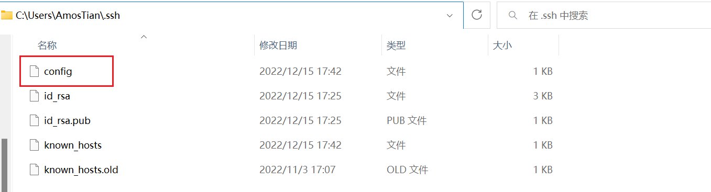
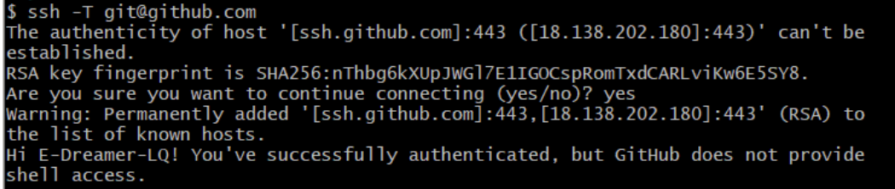
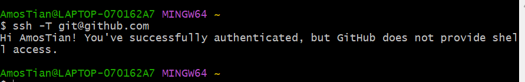

> ssh: connect to host github.com port 22: Connection timed out

<!--more-->

```shell
ssh: connect to host github.com port 22: Connection timed out
fatal: Could not read from remote repository.

Please make sure you have the correct access rights
and the repository exists.
```

## 1. 检查SSH是否连接成功

```shell
ssh -T git@github.com
# 报错
ssh: connect to host github.com port 22: Connection timed out
```

## 2. 配置文件

1. 新建 `config` 文件

   

2. 编辑配置文件

   ```shell
   Host github.com
   User YourEmail@163.com #只需要改邮箱
   Hostname ssh.github.com
   PreferredAuthentications publickey
   IdentityFile ~/.ssh/id_rsa
   Port 443 
   ```

3. 执行 `ssh -T git@github.com` ，输入 `yes` 即可。

   

   

之后就能上传代码了。