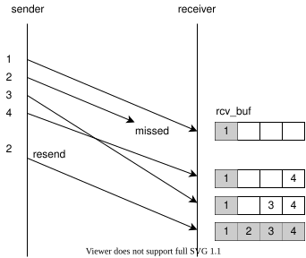
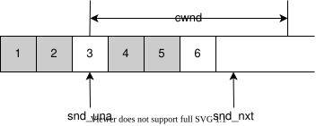
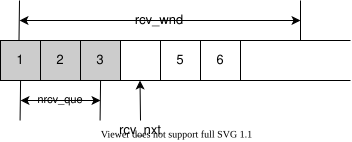
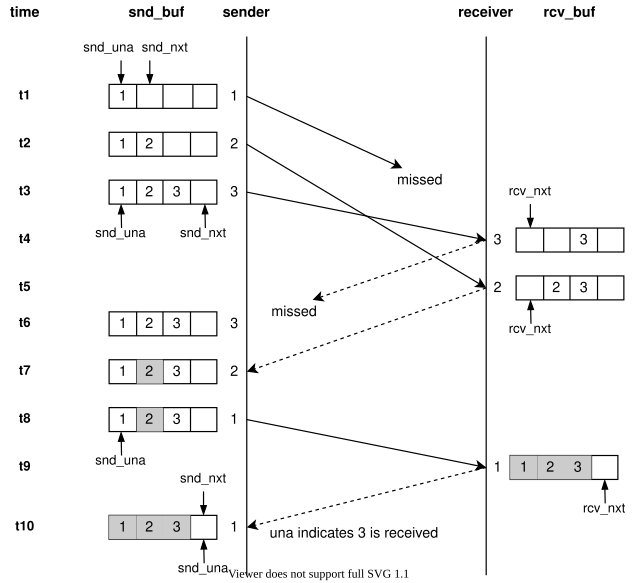
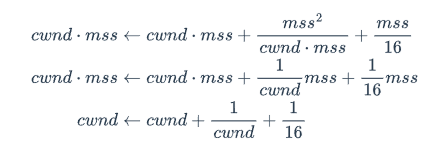

https://luyuhuang.tech/2020/12/09/kcp.html

https://zhuanlan.zhihu.com/p/10153049382

<!--more-->

## KCP整体流程

1. 调用 `ikcp_send` 发送数据，创建报文段实例，加入 `snd_queue` 中

2. `ikcp_update` 会在合适的时刻调用 `ikcp_flush`。

   在 `ikcp_flush` 中：

   - 发送ACK列表中所有的ACK
   - 检查是否需要发送窗口探测和通知报文，若需要，则发送相应的报文
   - 根据发送窗口大小，将适量报文段从 发送队列`snd_queue` 移入 发送缓冲`snd_buf` 中
   - 将 发送缓冲区 `snd_buf` 中满足条件的报文段发送出去：
     - 新加入 `snd_buf` 中，从未被发送过的报文
     - 发送过，但在RTO内未收到ACK 的报文，进行重传
     - 发送过得，但是ACK时序若干次的报文，执行快速重传
   - 根据丢包情况，计算 sshresh 和 cwnd

3. 对端收到报文后，`icp_input` 会被调用，解析收到的数据

   所有的报文都有 una 字段，根据una将相应的报文标为送达

   - 如果是 ACK 报文, 就将相应的报文标记为已送达

   - 如果是数据报文, 就将它放入 `rcv_buf`, 然后将 `rcv_buf` 中顺序正确的报文移入 `rcv_queue`

     接着将相关信息插入 ACK 列表, 在稍后的 `ikcp_flush` 调用中会发送相应的 ACK;

   - 如果是窗口探测报文, 就标记 “需要发送窗口通知”. 在稍后的 `ikcp_flush` 调用中会发送窗口通知报文;

   包括窗口通知报文在内的所有报文都有 wnd 字段, 据此更新 `rmt_wnd`;（对端窗口大小）

   根据 ACK 失序情况决定快速重传

   计算cwnd

4. 调用 `ikcp_recv` 接收数据，从 `rcv_queue` 中读取数据

5. 对端发送ACK报文给发送方

6. 发送方在 `ikcp_input` 中解析到ACK，将相应报文标为已送达

**队列中的报文都是有序的**（发送队列与接收队列都是）




### 缓冲区

缓冲区与滑动窗口相关

#### 发送

`snd_buf` 是一个链表，链表中的报文段编号始终递增

- 发送队列中的报文段插入到链表尾
- 收到ACK的报文从链表中删除



 两个指针

- `snd_una` 指针指向第一个已经发出但未收到ACK的报文段

  小于该una的报文，均已收到ACK，

  在发送缓冲区 `snd_buf` 中，已经收到ACK的报文段会被删除

- `snd_nxt` 指向缓冲区的下一个插入位置

发送窗口 `cwnd` 的起始位置是 `snd_una` 指针指向的位置，大小为 `cwnd`

flush时，会从 `snd_queue` 中取出报文，并从 `snd_nxt` 指向的位置开始插入 `snd_buf` ，然后 `snd_nxt` 向右移动

当 `snd_nxt - snd_una >= cwnd` 时，不允许新的报文加入 `snd_buf` ，

发送窗口中未确认到达的报文何时重传，取决于这个报文的RTO，报文在一个RTO时间内仍未被确认，则重传

- RTO初始值被赋为 `rx_rto` 
- 每次超时重传，RTO都会以某种方式增长（取决于重传机制，可以翻倍或翻0.5倍，或快速重传）

#### 接收

在 KCP 的实现中， `rcv_buf` 是一个报文段链表，链表中报文段编号始终递增。当收到新的报文时，会根据编号插入到链表中相应的位置中。顺序正确的报文会从链表头部弹出, 移动到 `rcv_queue` 中。

- `nrcv_que` 为接收队列的长度，`rcv_buf` 中在 `rcv_nxt` 之前的报文段都将移入 `rcv_queue` 中
- 接收方及时读取前 `nrcv_que` 个报文，读取后删除该报文，接收窗口向右滑动




指针 `rcv_nxt` ：指向编号最小的未收到报文应插入的位置，即已收到最小编号的报文之前

- 每收到一个数据报文，都会根据报文编号，将其插入 `rcv_buf` 对应的位置。然后，检查 `rcv_nxt` 是否可向右移动，仅当报文顺序正确且连续才能移动

KCP会通知发送方，剩余的接收窗口大小 `rcv_wnd-nrcv_queue`

- 发送方根据 这个值调整发送窗口的大小

如果收到的数据报文编号大于 `rcv_nxt+rcv_wnd` ，远超接收窗口，这个报文会被丢弃

报文中，会携带报文发送者的接收缓冲区 `rcv_buf` 中还未收到的最小报文编号——`rcv_nxt` 

- 因此，KCP发送的每个报文都会将una字段赋值为 `rcv_nxt`

具有ACK+UNA的双重确认机制


### 实例



t1：发送una=1的报文，该报文被加入发送缓冲区

- `snd_una` 指向1，`snd_nxt` 指向2

t2-t3：依次发送2至3号报文，`snd_nxt` 依次后移

t4：对端收到3号报文，放入 `rcv_buf` 中，发送3号报文的ACK报文

t5：对端收到2号报文，放入`rcv_buf` 中，发送2号报文的ACK报文

t7：收到2号报文的ACK报文，将2号报文标为已送达，送 `snd_buf` 中移除

- ACK报文的una为1，标识rcv_nxt指向1，对端还未收到una=1的报文，因此发送方知道需要重发

  `snd_una` 仍为1

t8：重发1号报文，

t9：1号报文到达对端，对端发送1号报文的ACK

- 由于已收到3号报文，所以该ACK报文的una=4

t10：发送方收到1号报文的ACK报文，将1号报文标为发送成功，同时una=4，所以也将3号报文标为已收到，`snd_una` 移动到4

## 重传机制

每个报文的RTO会随着重传次数的增加而增加

初始值保存在 `rx_rto` 中，

KCP计算RTO初始值的方法是TCP的标准方法，在RFC 6298中

- 标准方式通过RTT计算RTO：报文从发出到收到ACK经过的时间为一个RTT，如果某个报文在一个RTT内未收到ACK，说明可能丢包了
- RTO与RTT正相关，且应高于RTT，以容忍一定程度的抖动

计算所依赖的两个中间量，$srtt$ （对一段时间内RTT均值的估计）与 $rttvar$ （对 RTT 平均偏差的估计）

- 每收到一个ACK都能得到一个RTT，然后更新中间变量，得出RTO
  $$
  srtt\leftarrow (1-g)\cdot srtt + g\cdot rtt\\
  rttvar\leftarrow (1-h)\cdot rttvar+ h\vert rtt-srtt\vert\\
  RTO=\max{(interval,srtt+4\cdot rttvar)}
  $$

- 其中，$g=\frac{1}{8}$ 与 $h=\frac{1}{4}$ 为常数，$interval$ 为计时器粒度（调用 `ikcp_flush` 的时间间隔）
- 指数加权移动平均
- RTO至少为一个时钟间隔

- 初始值，测得第一个RTT时对srtt和rttvar初始化
  $$
  srtt\leftarrow rtt\\
  rttvar\leftarrow \frac{rtt}{2}
  $$

## 拥塞控制

- 网络带宽有限
- 接收方接收队列、接收缓冲有限

发送方不能无限制地发送数据，否则必然会导致网络与缓冲区无法容纳发送的数据，导致大量丢包

拥塞控制，实际上是动态计算发送窗口大小的过程

- 慢启动（Slow start）
- 拥塞避免（Congestion Avoidance）
- 快速恢复（Fast Recovery）

### 拥塞控制策略


慢启动：理想情况下, 发送数据的速率正好等于网路的容量, 然而我们并不知道网路的实际容量. 我们的做法是先将 cwnd 设为 1, 随后平均每经过一个 RTT 时间 cwnd 都翻一倍, 以探测到何时会出现丢包. 这种方法便是慢启动.

在慢启动中 cwnd 会指数增长, 这个过程显然不能一直持续下去. 当 cwnd 超过一个阈值之后, 便会进入拥塞避免阶段. 这个阈值我们称为**慢启动阈值(Slow Start Threshold)**, 通常记作 ssthresh

在拥塞避免阶段, cwnd 会近似于线性增长.

随着 cwnd 的增长, 网路容量会被逐步填满

网络容量填满之后, 就会不可避免地出现丢包. 这就意味着我们的发送速率过大, cwnd 应该减小了. KCP 称之为**丢包退让**。此时有两种策略：

- 一种是将 ssthresh 置为当前 cwnd 的一半, 然后 cwnd 置为 1, 重新执行慢启动

- 将 ssthresh 置为当前 cwnd 的一半, 但 cwnd 置为比 ssthresh 稍高的值, 然后进入快速恢复阶段

  快速恢复阶段中, cwnd 会以与拥塞避免相同的方式线性增长

**KCP 采用的策略是, 如果发生超时重传, 就进入慢启动; 如果发生快速重传, 就进入快速恢复.**

- 接收方会不断地向对端汇报接收窗口的剩余大小, 发送方会限制 cwnd 不超过 `rmt_wnd`.

#### 慢启动

慢启动时, 平均每经过一个 RTT 时间 cwnd 都翻一倍

- 每收到一个 ACK cwnd 都加一


#### 拥塞避免和快速恢复

在拥塞避免阶段, 差不多要等当前发送窗口发的报文都确认到达之后, cwnd 才增加 1.


在 KCP 的实现中, 拥塞避免阶段的 cwnd 仍然会在每收到一个 ACK 的时候增长, 只不过不是增加 1, 而是增加零点几.

KCP 的做法是维护一个中间变量 incr，计算方式为诶
$$
incr\leftarrow incr+\frac{mss^2}{incr}+\frac{mss}{16}
$$
当 incr 累计增加的值超过一个 mss 时, cwnd 增加 1



实际上相当于每收到一个 ACK, cwnd 都自增 $\frac{1}{cwnd}$ ，即要等当前发送窗口发的报文都确认到达之后, cwnd 才增加 1.

去掉 $\frac{mss}{16}$ 即为TCP拥塞避免阶段cwnd的增长方式

## 特性

- 快速重传：KCP 可以根据接收方返回的确认信息快速判断哪些数据包已经丢失，并迅速进行重传。
- 选择性确认：允许接收端告知发送端哪些包已收到，仅重传未被确认接收的包
- 无连接操作：基于UDP，不需要像TCP进行三次握手建立连接，减少初始的延迟
- 拥塞控制：类似TCP的拥塞控制
- 流量控制：可以调整发送和接收窗口的大小，使发送方根据对端处理能力和网络条件调整数据发送速率
- 可配置的传输策略：允许用户根据应用需求调整内部参数，
- 前向错误修正（Forward Error Correction，FEC）：结合FEC技术，通过发送额外的冗余数据来恢复丢失的包

| 特性类别       | 协议 | 描述                                                         |
| -------------- | ---- | ------------------------------------------------------------ |
| 拥塞控制机制   | TCP  | 固定算法（慢启动、拥塞避免等），保守的调整策略（指数和线性增长） |
|                | KCP  | 灵活算法，动态调整策略，快速调整窗口大小                     |
| 重传机制的延迟 | TCP  | 固定重传间隔（RTO），多次确认触发重传，需要主动开启选择性重传（SACK） |
|                | KCP  | 快速重传，选择性重传，减少重传延迟                           |
| 流量控制       | TCP  | 固定流量控制（依赖接收窗口和发送窗口），通用性设计           |
|                | KCP  | 自适应流量控制，应用层反馈调整发送窗口和重传策略             |
| 应用场景       | TCP  | 广泛应用于各种网络环境，标准化要求高                         |
|                | KCP  | 优化特定场景（如高丢包率和高延迟网络），灵活实现             |

TCP 作为一种成熟且广泛使用的传输协议，在设计上注重可靠性和通用性，因此在拥塞控制和流量控制方面相对保守，以确保在各种网络条件下都能稳定运行。

**拥塞控制机制**

- TCP
  - 固定算法：TCP的拥塞算法（慢启动（Slow Start）、拥塞避免（Congestion Avoidance）、快速重传（Fast Retransmit）和快速恢复（Fast Recovery）），考虑了兼容性与可靠性，但调整机制固定，相应速度慢
  - 保守的调整策略：采用指数增长和线性增长，在高丢包率或高延迟的网络中，会导致拥塞窗口增长速度慢，影响传输效率
- KCP
  - 灵活算法：拥塞机制根据网络实况进行快速调整
  - 动态的调整策略

**重传机制的延迟**

- TCP
  - 固定重传间隔：使用固定的重传超时（RTO），随着每次重传逐渐增加（指数回避）。在高延迟与高丢包率的网络环境中重传延迟长
  - 多次确认触发重传：TCP的快速重传需要等待三个重复ACK才会触发，延迟高
- KCP
  - 快速重传：KCP在检测到丢包后，立即重传，不需要等待多个重复的ACK
  - 选择性重传：KCP只重传丢失的数据包，不是所有未确认的数据包

**应用场景的差异**

- TCP

  - 广泛应用：TCP 设计用于广泛的网络环境，包括稳定的有线网络和不稳定的无线网络，因此其机制必须足够通用和保守，保证在各种情况下的可靠性。

  - 标准化要求：作为互联网的基础协议，TCP 的各项机制经过严格标准化，任何修改都需要广泛测试和验证，以确保不会影响现有网络的稳定性。

- KCP

  - 特定优化：KCP 设计初衷是优化特定场景下的传输性能，特别是高丢包率和高延迟网络，因此在设计上更加灵活，能够根据实时网络状况进行调整。

  - 灵活实现：KCP 可以根据具体应用需求进行优化，例如在实时通信和在线游戏等场景中，灵活的流量控制和快速重传机制显著提升了传输效率。


### KCP check

可以利用这个函数构建高效的事件驱动网络程序

1. 避免轮询：不需要定期遍历所有连接调用[irudp_update](javascript:void(0))
2. 精确调度：每个连接都知道自己何时需要被更新
3. 资源节约：只在必要时处理连接，减少CPU使用
4. 可扩展性：即使连接数增加，调度算法依然高效

```c
// 示例：管理多个RUDP连接的调度器
typedef struct {
    irudpcb **connections;  // RUDP连接数组
    int count;              // 连接数量
} rudp_scheduler_t;

void efficient_rudp_loop(rudp_scheduler_t *scheduler) {
    while (running) {
        IUINT32 current_time = get_current_millis();
        IUINT32 next_update_time = 0xffffffff;
        
        // 找到所有连接中最早需要更新的时间
        for (int i = 0; i < scheduler->count; i++) {
            IUINT32 check_time = irudp_check(scheduler->connections[i], current_time);
            if (check_time < next_update_time) {
                next_update_time = check_time;
            }
        }
        
        // 等待到最近的更新时间点或直到有网络事件
        int timeout = (next_update_time > current_time) ? 
                      (next_update_time - current_time) : 0;
        
        // 使用epoll/select等待网络事件，超时时间为timeout
        int events = epoll_wait(epoll_fd, events_buffer, max_events, timeout);
        
        // 处理网络事件
        for (int i = 0; i < events; i++) {
            irudpcb *rudp = get_rudp_from_event(events_buffer[i]);
            // 处理输入数据
            irudp_input(rudp, received_data, data_len);
        }
        
        // 更新到期的连接
        current_time = get_current_millis();
        for (int i = 0; i < scheduler->count; i++) {
            if (irudp_check(scheduler->connections[i], current_time) <= current_time) {
                irudp_update(scheduler->connections[i], current_time);
            }
        }
    }
}
```

