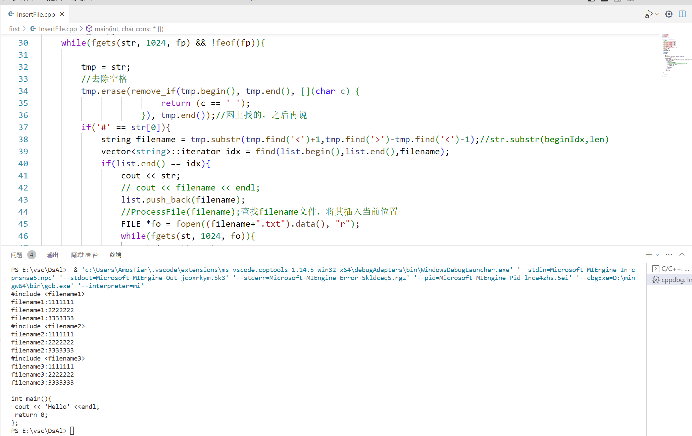

---
categories:
  - 读书
  - DS and Algorithm Analysis in C
tags:
  - 读书
  - DS and Algorithm Analysis in C
title: 第一章
mathjax: true
abbrlink: 2986614720
date: 2023-04-10 13:37:00
---
[TOC]

<!--more-->

数据结构研究组织大量数据的方法，算法分析是对算法运行时间的评估

# 1. 第一章

> 在程序正确运行前提下，保证在大量数据集或者特殊情况下能够运行并得出正确结果

## 1.1 进行算法分析目的

### 1.1.1 适应大量数据情况

由于简单选择排序，冒泡排序，插入排序的时间复杂度都是 $O(n^2)$ 。只要基于此思想，时间复杂度都不会低，如后例：

#### 从 $N$ 个数中选择第 $k$ 大的数

##### 递减排序，取第K大的数

冒泡排序

```c
//对全部数据进行冒泡排序
void Bubble_Sort(int a[],int n){
	bool flag = false;
	for(int i = 1;i <= n;++i){
		for(int j = 1;j <= n-i;++j){
			if(a[j] < a[j+1]){
				swap(a[j],a[j+1]);
				flag = true;
			}
		}
	
	if(flag == false)
		return ;
	}
}

void Select_Sort(int a[],int n){
	for(int i = 1;i <= n;i++){
		int maxIdx = i;
		for(int j = i+1;j <= n;++j){
			if(a[j] > a[maxIdx])
				maxIdx = j;
		}
		if(maxIdx != i)
			swap(a[maxIdx],a[i]);
	}	
}

void KBig(int a[],int n,int k){

	//先排序
	Bubble_Sort(a,n);
	Select_Sort(a,n);

	return a[k];
}
```


##### 插入排序思想

取前 $K$个数递减排序。再取新数 $x_i$ ，从第一个数开始比较

- $x_i \ge a_i$ ：则将该数插入
- $x_i < a_k$ ：则不做操作

```c
//从小到大排序
void Direct_InsertSort(ElemType A[], int k){
	int i,j;
    for(i = 2;i <= k;++i){
        if(A[i] > A[i-1]){
            //若待插入元素A[i] > A[i-1] ，从后向前找插入位置
            A[0] = A[i];
            //A为一固定序列，且数据存储已定，所以需要哨兵记录待插入元素      
            for(j = i-1;j >= 0 && A[0] > A[j];--j)
                A[j+1] = A[j];
           	A[j+1] = A[0];
        }
    }
}

int KBig_Insert(int a[],int n,int k){
	///sort(a,k);//将前k个数据降序排序
	Direct_InsertSort(a,k);
	for(int i = k+1;i <= n;++i){
		if(a[i] > a[k]){
			a[0] = a[i];
			for(int j = k;j >= 0 && a[0] > a[j];--j)
				a[j+1] = a[j];
			a[j+1] = a[0];
		}
	}

	return a[k];//处理完全部数据后，第k个数据为所求
}

int main(){
	int n;//输入n省略
	int a = (int *)malloc(sizeof(int)*(n+1));
	for(int i = 1;i <= n;++i){
		//初始化n个数据
		...
	}
	KBig_Insert(a,n,k);

	return 0;
}
```

### 1.1.2 边界条件正确

## 2.1 数学知识复习

### 2.1.1 指数

$$
X^AX^B=X^{A+B}
$$
$$
\frac{X^A}{X^B}=X^{A-B}
$$
$$
(X^{A})^B=X^{AB}
$$
$$
X^N+X^N=2X^N
$$

### 2.1.2 对数

在计算机中，除非特别声明，所有对数都是以2为底的

$$
log_AB=\frac{log_CB}{log_CA};C>0
$$
$$
logAB=logA+logB
$$
$$
log\frac{A}{B}=logA-logB
$$
$$
log(A^B)=BlogA
$$
$$
logX<X,X>0
$$
$$
log1=0,log2=1,log1024=10
$$
### 2.1.3 级数

#### 几何级数

> 有是否收敛的区别

由等比数列求和 

$$
\sum_{i=0}^NA^i=\frac{1-A^{N+1}}{1-A}，0<A<1，当 N\rightarrow \infty 时，收敛于 \frac{1}{1-A}
$$
证明：

$$
\begin{aligned}
&S=1+A+A^2+\cdots\\
&AS=A+A^2+A^3+\cdots\\
&S-AS=1\Rightarrow S=\frac{1}{1-A}
\end{aligned}
$$
---
$$
\sum_{i=1}^\infty \frac{i}{2^i}=2
$$
证明：
$$
\begin{aligned}
&S=\frac{1}{2}+\frac{2}{2^2}+\frac{3}{2^3}+\cdots\\
&2S=1+\frac{2}{2}+\frac{2}{2^2}+\cdots\\
&2S-S=1+1\Rightarrow S=2
\end{aligned}
$$

#### 算术级数

> 可以通过基本公式计算值

$$
\begin{aligned}
&\sum_{i=1}^N i=\frac{(1+N) N}{2}\approx\frac{N}{2}\\
&\sum_{i=1}^Ni^2=\frac{N(N+1)(2N+1)}{6}\approx\frac{N^3}{3}\\
&\vdots\\
&\sum_{i=1}^ni^k=\frac{N^{k+1}}{\vert k+1\vert},k\neq -1\\
&对于k=-1,调和数H_N=\sum_{i=1}^N\frac{1}{i}=log_eN
\end{aligned}
$$
SP：
$$
\begin{aligned}
&\sum_{i=1}^Nf(N)=N f(N)\\
&\sum_{i=n_0}^N f(i)= \sum_{i=1}^{N}f(i)-\sum_{i=n_1}^{n_0-1}f(i)
\end{aligned}
$$
### 2.1.4 模运算

A与B模N同余，记为 $$A\equiv B(mod\quad N)$$ 如： $$81\equiv 61\equiv 1(mod\quad 10)$$
#### 性质
$$
\begin{aligned}
A\equiv B(mod N)&\Rightarrow (A+C)\equiv(B+C)(mod\quad N)\\
&\Rightarrow AD\equiv BD(mod\quad N)
\end{aligned}
$$
### 2.1.5 证明方法

#### 归纳法

1. 证明基准情形
2. 归纳假设：假设定力对直到某个有限数k的所有情况都成立，在通过这个假设证明后续值成立。

##### 斐波那契

$$
\begin{cases}
&F_0=1,F_1=1\\
&F_i=F_{i-1}+F_{i-2},i\ge 2
\end{cases}
$$
证明：$$F_{k+1}< \left(\frac{5}{3}\right)^{k+1}$$ **证明：**
$$
\begin{aligned}
&当k=0时，F_1=1<\frac{5}{3}，则在k=0时成立\\
&假设k=m-1时，有F_{m}< \left(\frac{5}{3}\right)^{m}成立\\
&则当k=m时，F_{m+1}< \left(\frac{5}{3}\right)^{m}+\left(\frac{5}{3}\right)^{m-1}<\left(\frac{3}{5}\right)\left(\frac{5}{3}\right)^{m+1}+\left(\frac{3}{5}\right)^2\left(\frac{5}{3}\right)^{m+1}\\
&<\left(\frac{3}{5}+\frac{9}{25}\right)\left(\frac{5}{3}\right)^{m+1}=\frac{24}{25}\left(\frac{5}{3}\right)^{m+1}<\left(\frac{5}{3}\right)^{m+1}
\end{aligned}
$$
#### 反证法

## 1.3 递归简论

四条基本法则

- 基准情形：某些基准情形，无需递归就能解出
- 不断推进：每次递归调用，必须向基准情形推进（不能出现循环定义）
- 设计法则：假设所有递归调用都能运行
- 合成效益法则：不同递归调用做不同的工作

```c
void printOut(unsigned int N){
	if(N >= 10)
		printOut(N/10);
	// printDight(n)表示将单个数字输出到显示终端
	printDigit(N-(N/10)*10);//printDigit(N%10);	
}
```
- 取模运算耗费很大？

## 练习题

**1.3 只使用处理IO的 `PrintDigit` 函数，编写一个可以输出任意实数的函数** 

由于实数用计算机表示会存在舍入误差(RoundUp)，所以在输出前，需按照舍入策略进行舍入。

- 事前指定小数点后保留 `DecPlaces` 位

- 舍入策略为四舍五入

  小数点后第 `DecPlace+1` 位加 $0.5\times 10^{-DecPlaces}$ 

```c++
# include<iostream>

using namespace std;

//四舍五入
double RoundUp(double N,int DecPlaces){
    int i;
    double AmountToAdd = 0.5;

    //小数点后移 DecPlaces 位
    for(i = 0;i < DecPlaces;++i)
        AmountToAdd /= 10;

    return N+AmountToAdd;
}

//输出小数部分
void PrintFractionPart(double FractionPart,int DecPlaces){
    int i,ADigit;

    for(i = 0;i < DecPlaces;++i){
        FractionPart *= 10;//小数点后第一位移到个位
        ADigit = (int)FractionPart;//输出个位，即小数点后第一位
        cout << ADigit;
        FractionPart = FractionPart - ADigit;//递归输出后续小数部分
    }
}

void PrintReal(double N,int DecPlaces){
    int IntPart;
    double FractionPart;

    if(N < 0){
        putchar('-');
        N = -N;
    }

    N = RoundUp(N,DecPlaces);//四舍五入

    IntPart = (int)N;
    FractionPart = N-IntPart;//获取小数部分
    cout << IntPart;
    if(DecPlaces > 0)
        putchar('.');

    PrintFractionPart(FractionPart,DecPlaces);
}

int main(){
    cout << "输入需要输出的实数:";
    double N;
    cin >> N;
    cout << "输入小数点后位数:";
    int DecPlaces;//精度
    cin >> DecPlaces;

    PrintReal(N,DecPlaces);

    return 0;
}
```

**1.4 语言提供 `#include filename` 的语句，用于读入 `filename` ，并将它插入到 `include` 语句处**

- 文件本身还可以包含 `#include` 语句
  - 不能 `include` 自身(self-referential)

思路：

1. 逐行检测源代码，是否存在 `#include SomeFile`

2. 检查 `list` 中，是否有文件名 `SomeFile`

   - 有，则 `continue ` 
   - 无：
     - 调用 `ProcessFile(SomeFile);` ，将文件内容插入当前位置；
     - 将 `SomeFile` 入 `list` 
   
   `list` 列表，维护由 `ProcessFile` 处理过的文件，避免重复调用

```c++
# include<iostream>
# include<cstdio>
#include<algorithm>
#include<vector>

using namespace std;

int main(int argc, char const *argv[]){
    /* code */
    FILE *fp = fopen("source.txt", "w+");

    fputs("#include <filename1>\n", fp);
    fputs("#include <filename1>\n", fp);
    fputs("#include <filename2>\n", fp);
    fputs("#include <filename3>\n", fp);
    fputs("#include <filename3>\n", fp);
    fputs("\n", fp);
    fputs("int main(){\n", fp);
    fputs(" cout << 'Hello' <<endl;\n", fp);
    fputs(" return 0;\n", fp);
    fputs("};\n", fp);
    rewind(fp);

    vector<string> list;

    char str[1024];
    char st[1024];
    string tmp;
    while(fgets(str, 1024, fp) && !feof(fp)){
        
        tmp = str;
        //去除空格
        tmp.erase(remove_if(tmp.begin(), tmp.end(), [](char c) {
                        return (c == ' ');
                    }), tmp.end());//网上找的，之后再说
        if('#' == str[0]){
            string filename = tmp.substr(tmp.find('<')+1,tmp.find('>')-tmp.find('<')-1);//str.substr(beginIdx,len)
            vector<string>::iterator idx = find(list.begin(),list.end(),filename);
            if(list.end() == idx){
                cout << str;
                // cout << filename << endl;
                list.push_back(filename);
                //ProcessFile(filename);查找filename文件，将其插入当前位置
                FILE *fo = fopen((filename+".txt").data(), "r");
                while(fgets(st, 1024, fo)){
                    string stt = st;
                    cout << stt;
                }
                cout << endl;
            }else{
                continue;
            }
        }else{
            cout << str;
        }
    }
    
    fclose(fp);

    return 0;
}
```




**1.5 证明公式**

$log_2X<X$ 对所有 $X>0$ 成立
证明：
| | $logX$ | $X$ |
|:---:|:---:|:---:|
|$(0,1]$|$\le 0$ | $>0$ |
| $(1,2]$ | $\le 1$ | >1 |
|$(2,4]$| $\le 2$ | $>2$ |
| $(p,2p]$ | $\le p$ | $>p$ |

$$
\begin{aligned}
&对于logY=log(2\times \frac{Y}{2})=1+log\frac{Y}{2}<1+\frac{Y}{2}\le \frac{Y}{2}+\frac{Y}{2}=Y\Rightarrow log_2Y<Y
\end{aligned}
$$
**1.6 级数求和**

$\sum_{i=0}^{\infty}\limits \frac{1}{4^i}$ 
$$
\begin{aligned}
&S=\sum_{i=0}^{\infty}\limits \frac{1}{4^i}=1+\frac{1}{4}+\frac{1}{4^2}+\cdots,
4S=\sum_{i=0}^{\infty}\limits \frac{4}{4^i}=4+1+\frac{4}{4^2}+\cdots=4+1+\frac{1}{4}+\cdots\\
&3S=4S-S=4\Rightarrow S=\frac{4}{3}
\end{aligned}
$$
---

$\sum_{i=0}^{\infty}\limits \frac{i}{4^i}$
$$
\begin{aligned}
&S=\sum_{i=0}^{\infty}\limits \frac{i}{4^i}=\frac{1}{4}+\frac{2}{4^2}+\frac{3}{4^3}+\cdots,4S=\sum_{i=0}^{\infty}\limits \frac{i}{4^i}=1+\frac{2}{4}+\frac{3}{4^2}+\cdots\\
&3S=1+\frac{1}{4}+\frac{1}{4^2}+\cdots=\frac{4}{3}\Rightarrow S=\frac{4}{9}
\end{aligned}
$$
---

$\sum_{i=0}^{\infty}\limits \frac{i^2}{4^i}$
$$
\begin{aligned}
&S=\sum_{i=0}^{\infty}\limits \frac{i^2}{4^i}=\frac{1}{4}+\frac{4}{4^2}+\frac{9}{4^3}+\cdots,4S=1+1+\frac{9}{4^2}+\cdots\\
&3S=1+\frac{3}{4}+\frac{5}{4^2}+\cdots+\frac{2i+1}{4^i}+\cdots=\sum_{i=0}^{\infty}\limits\frac{1}{4^i}+2\sum_{i=0}^{\infty}\frac{i}{4^2}=\frac{4}{3}+\frac{8}{9}=\frac{20}{9}
\end{aligned}
$$
d. 太复杂，思路就是上述解法不断迭代

**1.7 估计$\sum_{i=\lfloor\frac{N}{2}\rfloor}^N\limits\frac{1}{i}$**  

$S=\sum_{i=1}^N-\sum_1^{i=\lfloor\frac{N}{2}\rfloor-1}\limits\frac{1}{i}=lnN-ln\frac{N}{2}\approx ln2$

**1.8 $2^{100}\left(mod\quad5\right)$** 
$$
\begin{aligned}
&2^1\left(mod\quad5\right)=2,\quad2^2\left(mod\quad5\right)=4,
\quad 2^3\left(mod\quad5\right)=3,\quad2^4\left(mod\quad5\right)=1,\quad 2^5\left(mod\quad5\right)=2\\
&2^{100}\left(mod\quad 5\right)=\left(2^{4}\right)^{25}\left(mod\quad 5\right)=1
\end{aligned}
$$

**1.9 令 $F_i$ 为斐波那契数，证明**

$F_0=1,F_1=1,F_2=2,F_m=F_{m-1}+F_{m-2}$

$\sum_{i=1}^{N-2}\limits F_i=F_N-2$
归纳法：
$$
\begin{aligned}
&N=3时，F_1=1，F_3-2=1=F_1,等式成立\\
&假设N=m时，有\sum_{i=1}^{m-2}\limits F_i=F_m-2\\
&当N=m+1时，\sum_{i=1}^{m-1}\limits F_i=F_{m-1}+\sum_{i=1}^{m-2}F_i=F_{m-1}+F_m-2=F_{m+1}-2,等式成立
\end{aligned}
$$

---

$F_N<\phi^N,其中\phi=\frac{1+\sqrt{5}}{2}$
$$
\begin{aligned}
&\phi^2=\frac{1+5+2\sqrt{5}}{4}=\frac{3+\sqrt{5}}{2}=1+\phi\Rightarrow 1=\frac{1}{\phi}+\frac{1}{\phi^2}\\
&当N=1时，F_1=1,\phi>F_1\\
&假设，当N<k,有F_N<\phi^N成立，\\
&当N=k+1时，F_{k+1}=F_{k}+F_{k-1}<\phi^{k}+\phi^{k-1}=\phi^{k+1}\left(\frac{1}{\phi}+\frac{1}{\phi^2}\right)=\phi^{k+1}\\
&等式成立
\end{aligned}
$$
**1.10 证明公式**

$\sum_{i=1}^{N}\limits(2i-1)=N^2$
$$
\begin{aligned}
&\sum_{i=1}^{N}\limits(2i-1)=2\sum_{i=1}^{N}\limits i-\sum_{i=1}^{N}\limits1=N(N+1)-N=N^2
\end{aligned}
$$

---

$\sum_{i=1}^{N}\limits i^3=\left(\sum_{i=1}^N\limits i\right)^2$
归纳法证明：
$$
\begin{aligned}
&N=1时，等式成立\\
&假设N=N时，有等式\sum_{i=1}^{N}\limits i^3=\left(\sum_{i=1}^N\limits i\right)^2 成立\\
&\sum_{i=1}^{N+1}i^3=(N+1)^3+\sum_{i=1}^Ni^{3}=(N+1)^3+\frac{N^2(N+1)^2}{4}=\left[\frac{(N+1)(N+2)}{2}\right]^2=\left[\sum_{i=1}^{N+1}i\right]^2\\
&可知N=N+1时，等式成立，故上述等式成立
\end{aligned}
$$
