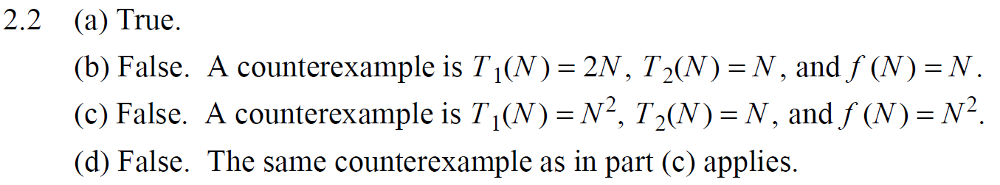
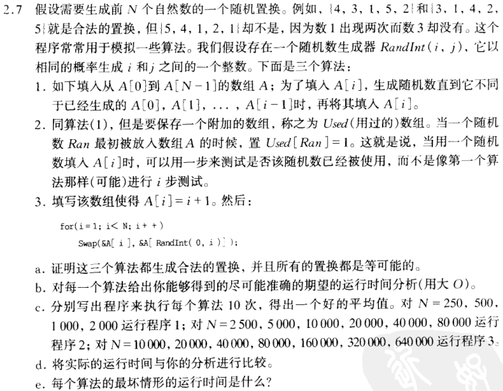

---
categories:
  - 读书
  - DS and Algorithm Analysis in C
tags:
  - 读书
  - DS and Algorithm Analysis in C
title: 【数据结构与算法分析inC-MarkAllen】第二章-算法分析
mathjax: true
abbrlink: 3812897384
date: 2023-05-09 21:23:23
---

[TOC]

<!--more-->

> 算法是为求解一个问题需要遵循的、被清楚指定的简单指令的集合

# 第二章——算法分析

- 如何估计一个程序的运行时间
- 如何降低程序运行时间
  - 一些经典案例

## 2.1 算法评价的量化理论

估计算法所需的资源消耗分析一般来说是理论问题——需要一套数学基础提供理论支撑

**将核心操作的次数与输入规模关联**

### 2.1.1 函数渐进增长

算法分析是衡量对象：某个算法的时间复杂度随输入规模增大的变化率

需要约定一个通用基准，才能通过对比，直观的判断变化率的大小

- 上界
- 下界
- 等价

#### 四种渐进增长定义

函数渐进增长是要在函数间建立一种相对的级别——相对增长率

> 给定两个函数 $f(N)$ 和 $g(N)$ ,如果存在一个整数 $N_0$ 使得对于所有 $N >N_0$ , $f(N)$ 总是比 $g(N)$ 大，那么称 $f(N)$ 的渐进增长快于 $g(N)$

1. 上界：如果存在正常数 $c$ 和 $N_0$ 使得 当 $N\ge N_0$ 时，$T(N)\le cf(N)$ ，则记为 $T(N)=O(f(N))$

   

   - $T(N)$ 的增长率小于等于($\le$) $f(N)$ ——$f(N)$ 是 $T(N)$ 的一个上界

2. 如果存在正常数 $c$ 和 $N_0$ 使得当 $N\ge N_0$ 时，$T(N)\ge cg(N)$ ，则记为 $T(N)=\Omega(g(N))$

   

   - $T(N)$ 的增长率大于等于($\ge$) $g(N)$ 的增长率——$g(N)$ 是 $T(N)$ 的一个下界

3. 如果存在正常数 $c_1$ 、$c_2$ 、$N_0$ 、$N_1$ ，使得当 $N\ge N_0$ 时，有 $T(N)\ge c_0h(N_0)$ 且当 $N\ge N_1$ 时，有 $T(N)\ge c_1h(N_1)$ ，则记为 $T(N)=\Theta(h(N))$ 

   - $T(N)=\Theta(h(N))$ 当且仅当 $T(N)=O(h(N))$ 且 $T(N)=\Omega(h(N))$ 

   

   - $T(N)$ 的增长率等于($=$) $h(N)$ 的增长率

4. 如果 $T(n)=O(p(N))$ 且 $T(N)\neq \Theta(N)$ ，则 $T(N)=o(p(N))$
   - $T(N)$ 的增长率大于 (>) $p(N)$ 的增长率

#### 运算法则

1. 如果 $T_1(N)=O(f(N))$ 且 $T_2(N)=\Omega(g(N))$ ，则
   - 并列结构： $T_1(N)+T_2(N)=max(O(f(N)),O(g(N)))$ 
   - 嵌套结构：$T_1(N)*T_2(N)=O(f(N)*g(N))$  

2. 如果 $T(N)$ 是一个 $k$ 次多项式，则 $T(N)=\Theta(N^k)$

3. 对任意常数 $k$ ，$log^k(N)=O(N)$ ——对数增长很缓慢

4. **几种典型的增长率排序**

   

   - $O(1) < O(logn) < O(n) < O(nlogn) < O(n^2) < O(n^3) < O(2^n) < O(n!) < O(n^n)$

5. 在渐进增长函数中省略所有的常数，系数

   修改后的次数中，只保留高阶项

#### 两个函数相对增长率判断

**洛必达**

通过 $\lim_{n\rightarrow\infty}\limits \frac{f(N)}{g(N)}$ 确定两个函数 $f(N)$ 和 $g(N)$ 的相对增长率

- $0$ ：$f(N)=o(g(N))$ 
- $c\neq 0$ ：$f(N)=\Theta(N)$ 
- $\infty$ ：$g(N)=o(f(N))$ 

### 2.1.2 算法分析的计算机模型

有一个简单的指令系统：加法、乘法、比较和赋值

模型机做任何一个简单的工作，都花费一个时间单元

模型机有无限内存

### 2.1.3 要分析的目标

算法分析的最重要的资源一般来说是运行时间

事前分析：

- **算法采用的策略和方案**
- 编译产生代码质量
- **问题的输入规模**
- 机器执行指令的速度

编译器和计算机执行速度超过了理论分析范畴，所以在算法分析中，重点考虑 **算法采用的策略** 以及 **输入规模**

输入的大小是主要的考虑方面，$T_{avg}(N)$ 和 $T_{worst}(N)$ 分别表示算法花费的平均运行时间和最坏情况下运行时间

而算法的平均情况的界计算起来通常很困难，所以一般情况算法分析的是 **最坏情况下的运行时间**

所以实际上计算的是 **大O运行时间** ，该分析结果为程序在一定的时间范围内能够终止运行提供了保障。程序可能提前结束，但绝不可能拖后

**$\sum_{i=1}\limits^{N}i^3$** 

```cpp
# 累加
int main(){
	int sum = 0;//执行一次
	int n = 100;//执行一次
	for(int i = 0; i < n;++i){
        //赋值1次，比较语句执行n+1次，自增执行n+1次
		sum += i*i*i;
        //加法执行n次,乘法执行2n次，赋值n次
	}	

	printf("sum=%d",sum);//执行一次
}
# 执行 6n+4 次
# 大O记法 O(n)
```

####  最坏情况

直接查找

```cpp
int search(int num){
	int arr[] = [11,10,8,9,7,22,23,0];
	
	for(int i = 0;i < arr.length;++i){
		if(num == arr[i])
			return i;
	}

	return -1;
}
```

**最好情况:**

- 查找的第一个数字就是期望数字—— $O(1)$

**最坏情况:**

- 查找的最后一个数字，才是期望数字——$O(n)$

**平均情况:**

- 任何数字查找的平均代价为 ——$O(n)$

### 2.1.4 一般法则

#### for循环

```cpp
for(int i=0;i < N;++i){}
```

$T(N)=O(T(\{\})\times N)$

#### 嵌套for循环

```cpp
for(int i=0;i < N1;++i){
    for(int j=0;j < N2;++j){
    	...
	}
}
```

$T(N)=O(T(\{\})\times N1\times N2\times...)$

#### 顺序语句

将各个语句的运行时间求和——最大值就是整体的运行时间

```cpp
for(int i = 0;i < N;++i){
    A[i] = 0;
}
for(int i = 0;i < N;++i){
    for(int j = 0;j < N;++j){
        A[i] += A[j]+i+j;
    }
}
```

$T(N)=max\{O(N),O(N^2)\}=O(N^2)$

#### 分支语句

```cpp
if(condition)	S1;
else	S2;
```

$T(N)=O(T\{condition\}+max\{T(S1),T(S2)\})$

#### 二分

对数阶，由于输入规模n的增大，不管底数多少，增长率都相同，所以忽略底数

```cpp
int i=1,n=100;
while(i < n){
	i = i*2;
}
```

循环次数：$x = log_2n$

- 时间复杂度：$O(logn)$

#### 函数调用

先分析被调用的函数，再分析回调函数

```cpp
void main(){
    int n = 100;
    for(int i = 0;i < n;++i){
	    show(i);	// O(n)
    }
}

void show(int i){
    printf("%d",i);
}
```

```cpp
void main(){
	int n = 100;
	for(int i = 0;i < n;++i){
		show(i);	//O(n^2)
	}
}

void show(int i){
	for(int j = 0;j < i;++j){		
		printf("%d",i);
	}	
}
```

## 2.2 计算方法

### 2.2.1 循环主体中的变量参与循环条件的判断

找出主体语句中与 $T(n)$ 成正比的循环变量，将之代入条件运算

```cpp
int i = 1;
while(i <= n){
	i = i*2;
}
```

-   执行次数 $t$ ，有 $2^t \leq n$ ,得 $T(n) = O(log_2n)$

```cpp
int y = 5;
while((y+1)*(y+1)<=n){
	y = y+1;
}
```

-   当 $(y+1)^2=\lfloor\sqrt{n}\rfloor$ 时，得到执行次数 $t = \lfloor\sqrt{n}\rfloor-6$ ,即 T(n) = O($\sqrt{n}$)

#### 模拟法优化递归

斐波那契数列与阶乘的计算

- 输入 $N$ 作为计算的终止条件
	- $fun(N)$ 的计算依赖于 $fun(N-1)...fun(N-k)$ 
- 不适用分治

##### 斐波那契数列
$$
\begin{aligned}
\left\{
\begin{aligned}
&F(0)=0,F(1)=1\\
&F(N)=F(N-1)+F(N-2),N\ge 2
\end{aligned}
\right.
\end{aligned}
$$
```cpp
long int Fib(int N){
	if(N <= 1)
		return N;
	else
		return Fib(N-1)+Fib(N-2);
}
```
- 如果 $N=0$ 或 $N=1$ ，运行时间是常数值——$O(1)$
- 如果 $N\ge 2$ ，则 $T(N)=T(N-1)+T(N-2)+2$
	$Fib(N)=Fib(N-1)+Fib(N-2)$ ，由归纳法可知 $Ｔ(N)\ge Fib(N)$ 
	由归纳法可以证明：$Fib(N)<(\frac{5}{3})^N$   ，同样可得 $(\frac{3}{2})^N\le Fib(N),(N>4)$ 
	可见，$(\frac{3}{2})^N\le Fib(N)\le T(N)$ 

故通过递归程序计算斐波那契数列，时间复杂度为 $O(2^N)$

之所以是指数时间，是因为存在大量重复计算——**计算任何事物不要超过一次**

---
**优化斐波那契数列求解**

```cpp
//记忆搜索
long int memo[MAX_N+1];

long int Fib1(int N){
	if(N <= 1)
		return N;
	//此时有未计算和已经计算好并存储到数据中的两种情况
	if(memo[N] != 0)//等于0的情况在Fib数列中只有第一项
		return memo[N]
	else{
		return memo[N]=Fib1(N-1)+Fib(N-2);
	}
}
```
对于规模较小的输入可以得到输出，单对于大规模的输入，仍相当于指数阶

---
```cpp
long int Fib2(long int N){
	if(N <= 1)
		return N;
	long int first = 0,second = 1;
	for(int i = 2;i <= N;==i){
		third = first + second;
		first = second;
		second = third;
	}
	return third;
}
```

- 时间复杂度为 $O(N)$ 

##### 阶乘计算

$n!=1\times 2\times 3\times\cdots$

```cpp
//计算阶乘 ,递归定义 
long long fac0(int n){
	//计算到25 
	if(n <= 1)
		return 1;
	return n*fac0(n-1);
}
```

优化算法相当于模拟乘法的手算过程，用数组元素代表数位。将计算结果按位依次存储到数组中，然后逆序输出

例如：求 $5!$

```
i = 2
a[1]=1
tmp=a[1]*2+0=2;
a[1]=2;
===================
i=3
a[1]=2
tmp=a[1]*3+0=6;
a[1]=6;
===================
i=4
a[1]=6

tmp=a[1]*4+0=24;
a[1]=24%10=4;
carry=24/10=2;
length++;

a[2]=0
tmp=a[2]*4+2=2;
a[2]=2;
===================
i=5
a[1]=4
a[2]=2

tmp=a[1]*5=20;
a[1]=20%10=0;
carry=20/10=2;
length = 2;

tmp=a[2]*5+carry=12;
a[2]=12%10=2;
carry=20/10=1;
length = 3;

tmp=a[3]*5+carry=1;
a[2]=1;
=====================
print(a[3],a[2],a[1]);120
```

```cpp
void print_fac(int n){
	if(n <= 1)
		cout << "1" << endl;
	else{
		int a[500000] = {0,1};//a[0]用不上，将其他初始化为1
		int carry,length = 1,tmp;
		//carry：若有进位，则存储；若无，0 
		//length:若有进位，则继续计算；若无默认计算一次
		//tmp:存储当前位的计算结果
		for(int i = 2;i <= n;++i){
			carry = 0;
			for(int j = 1;j <= length;++j){
				tmp = a[j] * i + carry;
				a[j] = tmp % 10;
				carry = tmp / 10;
				
				if(j == length && carry)
					length++;
			}	
		}
		
		for(int i = length;i >= 1;--i)
			cout << a[i];
	 } 
	 
} 
 
int main(){
	int n;
	
	cin >> n;
	print_fac(n);
 
 return 0;
}
```

- 时间复杂度为 $O(N)$

通过运行结果，可以看到按定义（即递归），最多只能算到25

而改进之后的算法，可以看到算到70000都没有崩，对于一般的竞赛来说已经足够了


#### 运算时间中的对数

- 如果一个算法用常数时间 $\left(O(1)\right)$ 将问题的规模削减为原来的一部分（一般为一半），那么该算法就是 $O(logN)$
- 如果用常数时间把问题规模削减为一个常数，那么这种算法就是 $O(N)$ 

##### 折半查找

> 更定一个目标元素 `X` 和 **有序** 整数序列 $A_0$ 、$A_1$、...、$A_{N-1}$ ，求得使 $A_i=X$ 的下标 $i$ ；如果 `X` 不存在与序列，则返回 $i=-1$

```cpp
int BinarySearch(const ElementType A[],ElementType X,int N){
	int Low,Mid,High;
	Low = 0,High = N-1;
	while(Low <= High){
		Mid = (Low+High)/2;
		if(A[Mid] < X){
			Low = Mid + 1;
		}else{
			if(A[Mid] > X){
				High = Mid-1;
			else
				return Mid; //Found
		}
	}
	return NotFound; //NotFound is defined as -1
}
```

在 `while` 循环体中，时间复杂度为 $O(1)$ ——$T(N)=O(1)$

循环次数最多为 $\lceil log(N-1)\rceil+2$ 

- 若 $high-low=128$ ，迭代过程中，$high-low$ 最大值是 64,32,16,8,4,2,1,0,-1

故二分查找时间复杂度为 $T(N)=O(T(\{\})\times (\lceil log(N-1)\rceil+2))=O(logN)$

**适用于静态数据的查找**——不允许数据的插入和删除

##### 欧几里得算法——求最大公约数

定理：如果 $M\ge N\ge 1$ ,则 $M \mbox{ mod N} < \frac{M}{2}$

- 如果 $N\le\frac{M}{2}$ ，则由于余数小于 $N$ ，有 $M\%N < N\le \frac{M}{2}\Rightarrow M \mbox{ mod N} < \frac{M}{2}$ 
- 如果 $N>\frac{M}{2}$ ，则 $M\%N=M-N<\frac{M}{2}$ 

```cpp
unsigned int Gcd(unsigned int M,unsigned int N){
    if(N>M)
        swap(M,N);
    
    unSigned int Rem;
    
	while(N > 0){
		Rem = M % N;
		M = N;
		N = Rem;
	}
	return M;
}
```

在循环体中，时间复杂度为 $T(\{\})=O(1)$

接下来重点是计算迭代次数

---

可以根据定理，粗略的认为：每次迭代可以在常数时间内使 $M$ 减少一半，故迭代次数为 $O(logN)$

---

令 $Rem_0=M,Rem_1=N$ 
$$
\begin{equation}
\left.
\begin{aligned}
Rem_2=Rem_0\% Rem_1\\
Rem_3=Rem_1\% Rem_2\\
\cdots\\
Rem_{n+1}=Rem_{n-1}\% Rem_{n}
\end{aligned}
\right\}\Rightarrow Rem_{k+1}+Rem_{k+2}\le Rem_k
\end{equation}
$$
迭代 $n$ 次后，$Rem_{n+1}=0$ ，$Rem_{n}\ge 0$ 即为最大公约数

观察斐波那契数列
$$
\begin{aligned}
\left\{
\begin{aligned}
&Fb_0=0\\
&Fb_1=1\\
&Fb_{k}=Fb_{k-1}+Fb_{k-2}
\end{aligned}
\right.
\end{aligned}
$$
可知：
$$
\begin{aligned}
&Fb_0=0\le Rem_n\\
&Fb_1=1\le Rem_{n-1}\\
\end{aligned}
$$

不妨假设：$Fb_{k}\le Rem_{n-k}$ ，由归纳法
$$
\begin{aligned}
&n=0和n=1成立\\
&假设Fb_{k}\le Fb_{n-k}\\
&Fb_{k+1}=Fb_{k}+Fb_{k-1}\le Rem_{n-k}+Rem_{n-k+1}\le Rem_{n-k-1}\\
&k=k+1时，有 Fb_{k+1}\le Rem_{n-k-1}成立\\
&\therefore Fb_{k}\le Rem_{n-k}
\end{aligned}
$$
由于 $Rem_1=N\ge Fb_{n-1}=\frac{1}{\sqrt{5}}\left[\left(\frac{1+\sqrt{5}}{2}\right)^{n-1}-\left(\frac{1-\sqrt{5}}{2}\right)^{n-1}\right]\Rightarrow n=O(logN)$

---

- 故其时间复杂度为 $T(N)=O(T\{\}\times log(N))=O(logN)$

##### 快速幂

计算 $x^n$ 

```cpp
long int Pow(long int x,unsigned int n){
    long int res = 1;
    for(int i = 0;i < n;++i){
        res *= x;
    }
    
    return res;
}

long int Pow(long int x,unsigned int n){
    if(n == 1)
        return x;
    
    return x*Pow(x,n-1);
}
```

- 时间复杂度为 $O(N)$ 

---


```cpp
long int Pow(long int X,unsigned int N){
	if(N == 0)
		return 1;
	if(N == 1)
		return X;
	if(isEven(N))
		return Pow(X*X,N/2);
	else 
		return Pow(X*X,N/2) * X;
}
```

- 若 $N$ 是偶数，则 $X^N=X^{\frac{N}{2}}\cdot X^{\frac{N}{2}}$
- 若 $N$ 是奇数，则 $X^N=X\cdot X^{\frac{N-1}{2}}\cdot X^{\frac{N-1}{2}}$

将问题对半分，每个子问题最多需要两次乘法

$T\{\}=2$ ，函数调用次数为 $logN$，故时间复杂度 $T\{N\}=O(T\{\}\times logN)=O(2logN)=O(logN)$

---

**快速幂非递归形式**

**原理**：

1. 计算 $X$ 不大于 $N$ 的二次幂序列 $X,X^2,X^4,\cdots,X^{2^{\lfloor logN\rfloor}}$ 

   时间复杂度为 $O(logN)$ 

2. 将 $X$ 用二进制表示，将 `1` 位对应的二次幂相乘就是 $X$ 的 $N$ 次幂

   通过取余求1的个数，最多计算 ${\lfloor logN\rfloor}+1$ 次 

   通过 [popcount](https://zhuanlan.zhihu.com/p/341488123)，时间复杂度会更少

两个计算步骤是并列的，所以时间复杂度为 $O(logN)$

例：计算 $X^{62}$

1. 计算并保存序列：$X,X^2,X^4,X^8,X^{16},X^{32}$ 

   计算 $\lfloor log62\rfloor=5$ 次

2. $62$ 的二进制表示为 `11 1110` 

   通过 $\lfloor log62\rfloor=5$ 次计算得到1的个数

   同时计算 $X^{62}=X^{32}\cdot X^{16}\cdot X^{8}\cdot X^{4}\cdot X^{2}$ 

   进行5次乘法

```cpp
int pow(int X,int n){
    //X 底数
    //n 幂次
    
    int res = 1;
    while (n != 0) {
        if ((n & 1) == 1) {//如果满足条件，则相乘
            res = res * X;
        }
        //无论如何，X都要不断倍增，n都要不断右移
        X *= X;
        n = n >> 1;
    }

    return res;
}
```

---

```cpp
int pow(int X,int n){
    //X 底数
    //n 幂次
    int res = 1;
    int tmp = X;
    while (n != 0) {
        if ((n & 1) == 1) {//如果满足条件，则相乘
            res = res * tmp;
        }
        tmp = tmp * tmp;
        n = n >> 1;
    }

    return res;
}
```

---

**快速幂时间复杂度为一个上界，实际执行次数不一定等于上界**

例：分析计算 $X^{62}$ 需要的乘法次数

按照快速幂的思想：$2log(62)=10$
$$
\begin{aligned}
X^{62}=X^{31}\cdot X^{31}\\
x^{31}=X\cdot X^{15}\cdot X^{15}\\
x^{15}=X\cdot X^{7}\cdot X^{7}\\
x^{7}=X\cdot X^{3}\cdot X^{3}\\
x^{3}=X\cdot X^{1}\cdot X^{1}
\end{aligned}
$$
需要9次乘法

也可以通过
$$
X^2=X\cdot X\\
X^4=X^2\cdot X^2\\
X^8=X^4\cdot X^4\\
X^{10}=X^{8}\cdot X^2\\
X^{20}=X^{10}\cdot X^{10}\\
X^{40}=X^{20}\cdot X^{20}\\
X^{60}=X^{40}\cdot X^{20}\\
X^{62}=X^{60}\cdot X^{2}
$$
可见通过8次乘法也是能计算出 $X^{62}$ 

### 2.2.2 循环主体中的变量与循环条件无关

> 采用 **归纳法** 或 **累计循环次数**

多层循环从内到外分析，忽略单步语句、条件判断语句，只关注主体语句的执行次数

#### 暴力法分析

```cpp
Sum = 0;
for(int i = 0;i < N;++i)
    Sum++;
```

$$
i\rightarrow N
$$

- 时间复杂度为 $O(N)$

---

```cpp
Sum = 0;
for(int i = 0;i < N;++i)
    for(int j = 0;j < N;++j)
        Sum++;
```

$$
\begin{aligned}
i\rightarrow N\\
j\rightarrow N
\end{aligned}
$$

- 时间复杂度为 $O(N^2)$

---

```cpp
Sum = 0;
for(int i = 0;i < N;++i)
    for(int j = 0;j < N*N;++j)
        Sum++;
```

$$
\begin{aligned}
i\rightarrow N\\
j\rightarrow N^2
\end{aligned}
$$

- 时间复杂度为 $O(N^3)$

---

```cpp
Sum = 0;
for(int i = 0;i < N;++i)
    for(int j = 0;j < i;++j)
        Sum++;
```

$$
\begin{aligned}
i\rightarrow N\\
j\rightarrow i\rightarrow N
\end{aligned}
$$

- 时间复杂度为 $O(N^2)$

---

```cpp
Sum = 0;
for(int i = 0;i < N;++i)
    for(int j = 0;j < i*i;++j)
        for(int k = 0;k < j;++k)
	        Sum++;
```

$$
\begin{aligned}
i\rightarrow N\\
j\rightarrow i*i\rightarrow N*N\\
k\rightarrow j\rightarrow N*N
\end{aligned}
$$

- 时间复杂度为 $O(N^5)$

---

```cpp
Sum = 0;
for(int i = 0;i < N;++i)
    for(int j = 0;j < i*i;++j)
        if(j % i==0)
        	for(int k = 0;k < j;++k)
	        	Sum++;
```

$$
\begin{aligned}
i\rightarrow N\\
j\rightarrow i*i\rightarrow N*N\\
k\rightarrow j(j\%i==0) \rightarrow i\rightarrow N 
\end{aligned}
$$

- 时间复杂度为 $O(N^4)$

#### 分治法

##### 策略

- ”分“：将大问题大致分为两大致相等的 *幂次阶* 子问题，用递归求解
- “治”：将两个子问题的解合并到一起并可能再做些少量的附加工作（*幂次阶*），得到整个问题的解

**主方法** ：大小为 $N$ 的原问题分成若干个大小为 $\frac{N}{b}$ 的子问题，其中 $a$ 个子问题需要求解，而 $cN^k$ 是合并各个子问题需要的工作量。此时问题可表示为：
$$
T(N)=\begin{cases} 
a_0  & N=1\\
aT(\frac{N}{b}) + cN^k & N>1
\end{cases}
$$
则其时间复杂度可相应的表示为：
$$
T(N)=\begin{cases}
O(N^{log_ba}) &a>b^k \\
O(N^klog_bN) &a=b^k \\
O(N^k)	&a<b^k
\end{cases}
$$
##### *推导*

已知

$$
\begin{cases} 
T(1) = 1 \\
T(N) = 2T(\frac{N}{2}) + O(N)
\end{cases}
$$

**1. 等号右边连续代入递归关系** 
$$
\begin{align}
T(N) & = 2T(\frac{N}{2})+N \notag \\
	&= 2[2T(\frac{N}{4})+\frac{N}{2}]+N \notag \\
	& =2\{2[2T(\frac{N}{8})+\frac{N}{4}]+\frac{N}{2}\}+N \notag \\
	& = ... \notag \\
	& = 2^kT(\frac{N}{2^k}) + kN \notag
\end{align}
$$

由 $k = logN$ 得

$$
T(n) = NT(1)+NlogN = Nlog(N) + N
$$

**2. 叠缩求和**

> 用 *N* 去除递归关系中的两边，不断替换

$$
\begin{align}
\frac{T(N)}{N}  &= \frac{T(\frac{N}{2})}{\frac{N}{2}} + 1  \notag \\ \notag \\ 
\frac{T(\frac{N}{2})}{\frac{N}{2}} &= \frac{T(\frac{N}{4})}{\frac{N}{4}} + 1  \notag \\ \notag \\ 
\frac{T(\frac{N}{4})}{\frac{N}{4}} &= \frac{T(\frac{N}{8})}{\frac{N}{8}} + 1  \notag \\ \notag \\ 
\vdots \notag \\ 
\vdots \notag \\ \notag \\ 
\frac{T(2)}{2} &= \frac{T(1)}{1} + 1\notag \\ \notag \\ 
\end{align}
$$

将等号左边的所有相相加等于右边所有项的和，结果为

$$
\begin{align}
\frac{T(N)}{N} &= \frac{T(1)}{1} + logN \notag \\ \notag \\ 
&=Nlog(N) + N \notag
\end{align}
$$

**3. 主方法**

两个规模为 $\frac{N}{2}$ 的子问题，用 $N^1$ 的代价合并子问题

$k=1,a=2,b=2$ ，$2=2^1,a=b^k$ 

故由主定理，$T(N)=O(NlogN)$

### 2.2.3 常见算法时间复杂度

| 描述       | 增长的数量级 | 说明     | 举例           |
| :--------- | :----------- | :------- | -------------- |
| 常数级     | 1            | 普通语句 | 将两个数相加   |
| 对数级     | $logN$       | 二分策略 | 二分查找       |
| 线性级     | $N$          | 单层循环 | 找出最大元素   |
| 线性对数级 | $NlogN$      | 分治思想 | 归并排序       |
| 平方级     | $N^2$        | 双层循环 | 检查所有元素对 |
| 立方级     | $N^3$        | 三层循环 | 检查所有三元组 |
| 指数级     | $2^N$        | 穷举查找 | 检查所有子集   |

## 2.3 最大子序列和问题求解

### 2.3.1 遍历所有子串，对子串的子序列依次求和

```cpp
int MaxSubSequenceSum(const int A[],int N){
	int ThisSum,MaxSum,i,j,k;
	MaxSum = 0;
	for(i = 0;i < N;++i){
		for(j = 0;j <= i;++j){//遍历所有子串
			ThisSum = 0;
			for(k = 0;k <= j;++k)//当前子串的所有子序列求和
				ThisSum += A[k];
				if(ThisSum > MaxSum)
					MaxSum = ThisSum;	
		}
	}
	return MaxSum;
}
```

$$
\begin{aligned}
i\rightarrow N\\
j\rightarrow i\rightarrow N\\
k\rightarrow j\rightarrow N
\end{aligned}
$$

- 时间复杂度为 $O(N^3)$

---

$$
\begin{align}
\sum_{i = 0}^{N-1}{\sum_{j = 0}^{i}{\sum_{k = 0}^{j}{1}}} \notag  \\ 
\sum_{k = 0}^{j}{1} &= j+1 \notag \\ 
\sum_{j = 0}^{i}{ j+1} &= \frac{(i+2)(i+1)}{2} \notag \\  \\
\sum_{i = 0}^{N-1}{ \frac{(i+2)(i+1)}{2}} & = \sum_{i = 1}^{N}{ \frac{(i+1)i}{2}} \notag \\ \notag \\
&= \frac{1}{2}\left(\sum_{i=1}^{N}i^2+ \sum_{i=1}^{N}i\right)\\ \\
&= \frac{N^3+3N^2+2N}{6} \notag
\end{align}
$$

- 时间复杂度为 $O(N^3)$

### 2.3.2 记录中间累加量

$$
\sum_{k = i}^{j}{A_k} = A_j+\sum_{k = i}^{j-1}{A_k}
$$

```cpp
int MaxSubSequenceSum(const int A[],int N){
	int ThisSum,MaxSum,i,j,k;
	
	MaxSum = 0;
	for(i = 0;i < N;++i){
		ThisSum = 0;
		for(j = 0;j <= i;++j){//遍历所有子串
			ThisSum += A[k];

			if(ThisSum > MaxSum){
				MaxSum = ThisSum;
			}				
	}
	return MaxSum;
}
```

- 时间复杂度为 $O(N^2)$

### 2.3.3 分治法

> 将序列分成大致相等的两部分。

最大子序列和可能在三处出现：

数据的左半部分；
 - 递归求解
数据的右半部分；
 - 递归求解
中间部分
 - 分别求出前、后部分的最大和，相加中间部分最大和

```cpp
int MaxSubSum(const int A[],int Left,int Right){
	int MaxLeftSum,MaxRightSum;
	int MaxLeftBorderSum,MaxRightBorderSum;
	int LeftBorderSum,RightBorderSum;
	int Center,i;

	if(Left == Right){//只有一个元素
		if(A[Left] > 0)//该元素非负即为最大和
			return A[Left];
		else{
			return 0;
		}
	}
	
	Center = (Left+Right) / 2;
	MaxLeftSum = MaxSubSum(A,Left,Center);
	MaxRightSum = MaxSubSum(A,Center,Right);

	MaxLeftBorderSum = 0,LeftBorderSum = 0;
	for(i = Center;i >= Left;i--){
		LeftBorderSum += A[i];
		if(LeftBorderSum > MaxLeftBorderSum)
			MaxLeftBorderSum = LeftBorderSum;
	}

	MaxRightBorderSum = 0,RightBorderSum = 0;
	for(i = Center;i >= Left;i--){
		RightBorderSum += A[i];
		if(RightBorderSum > MaxRightBorderSum)
			MaxRightBorderSum = RightBorderSum;
	}

	return Max3(MaxLeftSum,MaxRightSum,MaxLeftBorderSum+MaxRightBorderSum);
}

int MaxSubSequenceSum(Const A[],int N){
	return MaxSubSum(A,0,N-1);
}
```

$$
\begin{cases} 
T(1) = 1 \\
T(N) = 2T(N/2) + O(N)
\end{cases}
$$

- 时间复杂度为 $O(NlogN)$

> **分治法** 时间复杂度一般都是若干个代价为 $logN$ 的子问题与一个处理函数的代价和

### 2.3.4 最简

```cpp
int MaxSubSequenceSum(const int A[],int N){
	int ThisSum,MaxSum,j;	
	ThisSum = MaxSum = 0;
		for(j = 0;j < N;++j){
			ThisSum += A[k];

			if(ThisSum > MaxSum){
				MaxSum = ThisSum;
			}else if(ThisSum < 0){
				ThisSum = 0;
			}				
	}
	return MaxSum;
}
```

- 时间复杂度为 $O(N)$

## 2.4 空间复杂度

>   算法所需的辅助空间数量级

-   运行过程中变量占用的空间	*辅助数组*
-   递归工作栈                           *递归深度*

### 原地工作

>   算法所需的辅助空间为常量

## 2.5 习题

**2.1** 


**2.2** 




$T(N)=O(N)$ ，$O(N)$ 是上界，但不是上确界，即 $T(N)=aN+b=O(N^2)=O(N^3)$ 

即 $\lim_{n\rightarrow \infty}\limits \frac{f(N)}{T_1(N)}=\infty$ ，且 $\lim_{n\rightarrow \infty}\limits \frac{f(N)}{T_2(N)}=\infty$ ，无法判断 $T_1(N)$ 与 $T_2(N)$ 的关系

**2.3**


定理：$log^kN$ 的增长率远小于 $N^\epsilon$ 的增长率，$log^kN=o(N)$

---

实际上是比较 $logN$ 与 $N^{\frac{\epsilon}{\sqrt{logN}}}$ 
$$
\begin{aligned}
&loglogN与\frac{\epsilon}{\sqrt{logN}}logN=\epsilon\sqrt{logN}的比较，令L=\sqrt{logN}\\
&logL^2=2logL与\epsilon L,可见 L的增长率大于logL的增长率\\
&即 NlogN的增长率小于 N^{1+\frac{\epsilon}{\sqrt{logN}}} 
\end{aligned}
$$
**2.5** 


可以理解为 $f(N)$ 的增长率不大于 $g(N)$ 的增长率，$g(N)$ 的增长率也不大于 $f(N)$ 的增长率

即 $f(N)$ 的增长率与 $g(N)$ 的增长率相等即可 $f(N)=\Theta(g(N))$

**2.6** 在前面已经应用举例

### 2.5.7 随机数序列生成算法 



**alg1**
```cpp
void randSeq(int A[],int N){
	int i = 0;
	while(i < N){
		int ran = randInt(0,N);
		for(k = 0;k < i;k++){
			if(A[k] == ran)
				break;
		}
		if(k == i){
			A[i] = ran;
			i++;
		}
	}
}
```

生成第 $i$ 个不重复随机数的概率为 $\frac{N-i}{N}$ ，所以理论上经过 $\frac{N}{N-i}$ 次生成得到不重复随机数的概率为 $1$ ，对于每个随机数需要经过 $i$ 次验证，所以总耗时 
$$
\begin{aligned}
\sum_{i=0}^{N-1}\frac{N}{N-i}i<\sum_{i=0}^{N-1}\frac{N^2}{N-i}=N^2\sum_{i=0}^{N-1}\frac{1}{N-i}=N^2\sum_{j=1}^{N}\frac{1}{j}<N^2log_\epsilon N=O(N^2logN)
\end{aligned}
$$
**alg2**

```cpp
void ranSeq(int A[],int N){
	int used[MAX_INT] = {0};
	int i = 0;
	while(i < N){
		ran = ranInt(0,N);
		if(used[ran] == 0){
			A[i] = ran;
			used[ran] = 1;
			i++;
		}
	}
}
```

省去了对每个随机生成的数进行 $i$ 次验证，总的时间复杂度为
$$
\begin{aligned}
\sum_{i=0}^{N-1}\frac{N}{N-i}<\sum_{i=0}^{N-1}\frac{N}{N-i}=N\sum_{i=0}^{N-1}\frac{1}{N-i}=N\sum_{j=1}^{N}\frac{1}{j}<Nlog_\epsilon N=O(NlogN)
\end{aligned}
$$
**alg3**
```cpp
void ranSeq(int A[],int N){
	for(int i = 0;i < N;++i)
		A[i] = i+1;
	for(int i = 0;i < N;++i)
		swap(&A[i],&A[randInt(0,i)]);
}
```
时间复杂度是线性的 $O(N)$

### 2.5.9 多项式计算

计算多项式 $F(x)=\sum_{i=0}^{N}\limits A_iX^i$ 需要多长时间
**简单方法取幂**：

```cpp
void poly(int A[],int X,int N){
	int res = A[0];
	for(int i = 1;i <= N;++i){
		res += A[i]*pow(X,i);//时间复杂度为O(N)
	}
	return res;
}
```
**快速幂**
```cpp
void poly(int A[],int X,int N){
	int res = A[0];
	for(int i = 1;i <= N;++i){
		res += A[i]*pow(X,i);//快速幂，时间复杂度为O(logN)
	}
	return res;
}
```
- 时间复杂度为 $O(NlogN)$

**秦九韶算法(Horner算法)**

```cpp
void poly(int A[],int X,int N){
	int res = 0;
	for(int i = N;i >= 0;--i){
		res = A[i] + X*res;
	}
	return res;
}
```
- 时间复杂度为 $O(N)$

```cpp
oid poly(int A[],int X,int N){
	int res = A[0];
	for(int i = 1;i <= N;++i){
		res += A[i]*X;
	}
	return res;
}
```
- 时间复杂度为 $O(N)$

**2.5.11 在有序数组中查找是否存在整数——二分查找**

时间复杂度 $O(logN)$

### 2.5.13 判断一个正整数是否为素数

素数定义：在大于1的自然数中，除了1和他本身之外不再有其他因数的自然数

- 可见偶数一定不是素数——可被2整除

**alg1**

直接判断，对一个自然数 `k` 来说，需要判断 `k-2` 次，时间复杂度为 $O(n)$ 

```cpp
bool IsPrime(int n){
    if(n == 1)
        return false;
    for(int i = 2;i < n-1;++i){
        if(n % i == 0)
            return false;
    }
    
    return true;
}
```

**alg2**

除了1之外，任何合数最小的因子就是2，相应的最大因子就是 $\lceil \frac{n}{2}\rceil$ ，所以只需要从2开始遍历到 $\lceil \frac{n}{2}\rceil$ 就可以了

```cpp
bool IsPrime(int n){
    if(n == 1)
        return false;
    for(int i = 2;i < n/2+1;++i){
        if(n % i == 0)
            return false;
    }
    
    return true;
}
```

- 循环判断条件必须包含 $\frac{n}{2}$  ：如 $n=4$ 时，必须通过 $\%2$ 判断为素数，若 $<2$ 则会出现错误的结果
  - 可以是 `i <= n/2` 或 `i < n/2 + 1`

时间复杂度仍然为$O(n)$

**alg3**

根据素数定义，如果一个数不是素数，即合数一定是两个数的乘积

假设 $n=i*j$ ，则一定有一个 $\le \sqrt{n}$ ，另一个 $\sqrt{n}$ ，因此只看较小那个数存不存在就可以判断n是否为素数

```cpp
bool IsPrime(int n){
    if(n == 1)
        return false;
    for(int i = 2;i < n/2+1;++i){
        if(n % i == 0)
            return false;
    }
    
    return true;
}
```

时间复杂度降为 $O(\sqrt{N})$ 

- 当然，可以针对 **alg1,alg2,alg3** 做进一步改进，`i++` 改为 `i+=2` ，因为我们知道偶数一定不是素数

---

习题13是根据这种做法设问的

(b) $O(\sqrt{N})$

(c) 令B表示N的二进制中的位数，则B的值为多少
$$
\begin{aligned}
N=2^{B-1}x_{B-1}+2^{B-2}x_{B-2}+\cdots+2^0x_0，x_i=0,1表示是否取该位
\end{aligned}
$$
故 $N=O(2^B)$ ,$B=O(logN)$

(d)用B表示时间复杂度

$O(N^{\frac{1}{2}})=O(2^{B\frac{1}{2}})=O(2^{\frac{B}{2}})$

(e)比较确定20位二进制的数是否为素数与40位的运行时间

令 $T$ 表示确定20位二进制的数是否为素数的运行时间，有 $T=O(2^\frac{20}{2})$ ，有判断40位二进制数是否为二进制数的时间为 $T^2$

---

**alg4**

查表

表构造原理：**如果一个数不能整除比它小的任何素数，那么这个数就是素数**

等价于证明：“不能被素数整除则一定不能被合数整除”逆否“能被合数整除则一定能被素数整除”

- 合数要么是偶数，要么是奇合数

  - 对于奇合数，只能被 $>2$ 的素数整除（若有偶因数，则成为偶数）
  - 对于偶数，一定能分解为 $2\times p_1\times\cdots \times p_k$ ，p的取值为 $2,3,5,7,11,13,..$ 等一系列素数

  可见，如果一个数是合数，则一定能被素数整除，故不能被比他小的任何素数整除，一定是素数

```cpp
//n：输入的要查找的数
//count：当前已知的小于等于sqrt{n}的素数个数
//Prime：存放素数的数组
bool IsPrime(int n, int count, int* Prime) {
    int i = 0;
    for (i = 0;i < count;i++) {
        //只需要判断到sqrt{n}，上述定理适用
        if (n % Prime[i] == 0)
            return false;
    }

    return true;
}
```

**alg4——普通筛法（埃拉托斯特尼筛Eratosthenes法）构造素数数组**

只关注下标为 $2\sim n$ 的数组元素，如果该元素为1，则说明数组元素对应的下标为素数——桶思维

假设所有元素都是素数，初始化为1，遍历范围为 $2\sim \sqrt{n}$ ，将已知素数的整数倍下标赋值为0，

- 要得到自然数n以内的全部素数，必须把不大于n的所有素数的倍数剔除，剩下的就是素数

  

```cpp
//isprime:判断素数的数组  上限N  
//Prime[]元素为素数,count为Prime大小
void Eratprime(int* isprime, int n,int *Prime,int &count) {
    int i = 0;
    int j = 0;
    if(isprime != NULL){//确保isPrime不是空指针
        //初始化isprime
        for (i = 2; i <= (int)sqrt(n); i++)
            isprime[i] = 1;
    }

    for (i = 2;i <= (int)sqrt(n); i++) {
        for (j = 2; i * j <= n; j++) {//素数的n倍（n >= 2）不是素数
            isprime[i * j] = 0;
        }
    }
    count = 0;
    for(i = 0;i <= (int)sqrt(n);++i){
        if(isprime[i] == 1){
            Prime[count] = i;
            count++;
        }
    }
}

int main(){
    int n;
    cin >> n;

    int *Prime = (int *)malloc((sqrt(n)+1)*sizeof(int));
    int *isprime = (int *)malloc(n*sizeof(int));
    int count = 0;
    Eratprime(isprime,n,Prime,count);

    for(int p = 0;p < count;++p)
        cout << *(Prime+p) << endl;
    
    cout << boolalpha << IsPrime(n,count,Prime);

    return 0;
}
```

- 埃拉斯托拉斯筛法，确定小于n的所有素数，时间复杂度为 $O(NloglogN)$ 
  - 而判断n是否为素数，我们实际上之关心小于 $\sqrt{N}$ 的所有素数，所以可优化为 $O(N)$

**alg5——找n以内的所有素数线性筛法——欧拉筛法**

在提出非素数时，有些合数会重复，如：

- 2是素数，剔除”2 的倍数“，他们是：4，`6`， 8，10， `12`， 14， 16

- 3是素数，剔除”3 的倍数”，他们时，`6`，9，`12`，15

  6，12是重复的。

合数一定有一个最小的质因子，所以在埃氏筛法的基础上，让每个合数只被它的最小质因子筛选一次，以达到不重复的目的

```cpp
void Eulerprime(int* isprime, int n,int *Prime,int &count) {
    //从2遍历到范围上限N
    for(i = 2; i <= N; i++) {
        if(isPrime[i])//如果下标（下标对应着1 ~ 范围上限N）对应的isPrime值没有被置为false，说明这个数是素数，将下标放入素数数组
            Prime[count++] = i;
        //循环控制表达式的意义：j小于等于素数数组的个数 或 素数数组中的每一个素数与 i 的积小于范围上限N
        for(j = 0; j < count && Prime[j] * i <= N; j++){
            isPrime[i * Prime[j]] = false;//每一个素数的 i 倍（i >= 2）都不是素数，置为false

            //这个是欧拉筛法的核心，它可以减少非素数置false的重复率
            //通过这个最小质因子就可以判断什么时候不用继续筛下去了。
            if(i % Prime[j] == 0)
                break;
            //比如 i=6，prime[j]=2（这时候 prime已经有了2，3，5）,
            //i%prime[j]==0，所以就可以跳出循环。
        }
    }
}
```

- 欧拉筛获取n以内的所有素数，时间复杂度为 $O(N)$
  - 若只关心n是否为素数，可以只获取 $\sqrt{N}$ 内的素数，时间复杂度减少为 $O(\sqrt{N})$ 

**alg6——六素数法**

任何一个自然数都可以被写成
$$
\begin{aligned}
&x=6k=6\times k\\
&x=6k+1\\
&x=6k+2=2\times (3k+1)\\
&x=6k+3=3\times(2k+1)\\
&x=6k+4=2\times (3k+2)\\
&x=6k+5\\
\end{aligned}
$$
中的一个。

可见，在6的倍数附近，可能会出现两个素数 $6k-1$ 和 $6k+1$ 。故判断一个数是否为素数，取余即可

例外：

2,3，5,7，11,13 ，17,19，23，29,31，37，41,43，47，53，59,61

- 可见，有两种例外，25,35对5取余为0，39对3取余为0，49对7取余为0

所以对素数判断的改进思路为：

- 在 **alg1** 的基础上，将步长改为6

- 还是根据没有素因数则为素数的定理，只不过不需要构造素数表

  判断小于 $\sqrt{n}$ 范围内，能否被相邻两个可能的素数是否能整除n即可

```cpp
bool IsPrime(int n){
    if(n <= 1)
        return false;
    if(n == 2 || n == 3)
        return true;
    if(n % 2 == 0 || n % 3 == 0)
        return false;
    for(int i = 5; i < (int)sqrt(n)+1; i += 6 ){
        if( n % i == 0 || n % (i+2) == 0 ){
            return false;
        }
    }
    return true;
}
```

**2.15** 证明8次乘法可算出 $X^{62}$
$$
X^2=X\cdot X\\
X^4=X^2\cdot X^2\\
X^8=X^4\cdot X^4\\
X^{10}=X^{8}\cdot X^2\\
X^{20}=X^{10}\cdot X^{10}\\
X^{40}=X^{20}\cdot X^{20}\\
X^{60}=X^{40}\cdot X^{20}\\
X^{62}=X^{60}\cdot X^{2}
$$
**2.16** 非递归形式求快速幂

**2.17** 快速幂的乘法精确次数

见快速幂部分

**2.18**


d感觉是不能
