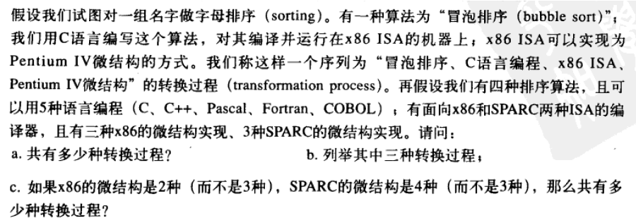

---
categories:
  - 读书
  - 计算机系统概论
tags:
  - 读书
  - 计算机系统概论
mathjax: true
title: 【计算机系统概论Yale.patt】1.计算机是简单部件的系统组合
abbrlink: 1466859026
date: 2023-04-08 16:15:16
---

[TOC]

<!--more-->

**计算机是非常确定的**

> 对于同样的问题，在任何时候、相同状态下，以相同的方法必然得到相同的结果

# 1. 计算机是简单部件的系统组合

## 1.1 计算机组成

### 1.1.1 编码体系

计算机由许多电子部件组成，这些部件通过导线相连。在任意时刻，导线上要么低电平，要么高电平

只关注“**相对于0v，是否足够大**

- 相差小，则定义为 $0V$
- 相差大，定义为 $逻辑1$

通过0和1的组合序列，可以表示任何信息。进而可以对这些信息进行算术或逻辑运算，并制成相应的门电路。

### 1.1.2 晶体管构建微处理器

- 运算部件
- 存储部件

### 1.1.3 冯·诺依曼机

> 一个描述计算机怎么工作的模型

### 1.1.4 LC-3机(冯·诺依曼机实现)

`Little Computer 3`

LC-3 具备现代微处理器（Intel8086，奔腾4）的重要特性，是真实处理器的简化版本，便于学习理解

### 1.1.5 LC-3编程

#### 机器语言编程

#### 汇编语言编程

#### 输入输出信息问题

#### 两个重要机制

- TRAP
- 子程序调用

#### 栈和数据转换

#### 示例：计算器

## 1.2 两个重要理念

- 抽象
- 硬件和软件等效

### 1.2.1 抽象与封装

抽象：对一些具体的问题进行概括，抽出一类描述这些问题的公共性质的过程

在计算机中，抽象思想体现在：一个系统是由相关联的部件封装而成，这些部件是系统各个方面的本质体现，当系统正常运行时，不需要关注部件的内部细节，只用到部件提供的服务；当系统异常时，才需要关注部件的内部细节

### 1.2.2 硬件和软件是等效的

硬件和软件是计算机系统的两个组成部分

具体将某个功能划分为哪部分实现，以及软硬之间如何协同工作，原则是：让计算机在特定场景下性能最佳

## 1.3 CPU与计算机系统

#### CPU——计算机

`Central Processing Unit` 中央处理器

**控制着信息的处理过程**

- 必须决策下一执行任务是什么

**同时也是信息处理过程的具体执行者**

- 必须具备运算能力（加，乘）以及产生执行结果

#### 计算机系统

`Computer System`

CPU及计算机的外部设备

## 1.4 两个重要思想

### 1.4.1 通用计算思想

> **所有计算机，只要给予足够的时间和内存，能完成的计算任务（所有可计算任务）都是相同的**

#### 计算机类型

- [ ] 模拟机：机器产生的结果用可测量的模拟量来表示（如：电压，距离等）
	- 模拟机很难提高精度
- [ ] 数字机：通过一组固定的，有限的数字和字符完成操作
	- 提高精度的方法是增加数字数目

---

专用机：只能做一种特定的计算任务。如：加法器，只能用于计算加减法，无法进行乘法运算

通用机：给机器提供 **任务** 和 **方法** 。
- 若新增计算任务，在原来的机器上新增指令(instruction)或程序(program)即可。

#### 通用计算思想

> Alan Turing假设：
> 	- 图灵论题：任何计算都可以通过某种图灵机完成
> 	- (哲学角度)计算是否具有可定义性质

根据计算时采用的方法和行为：
- 对计算任务做标记
- 按照一定的规则记录中间量
- 得出计算结果
将这些行为抽象出来，定义了一种能够表达它们的机制——`图灵机`

还需证明：任何对图灵机的改进，都需要通过图灵机实现
> 构建通用图灵机U（这个机器U必须能够仿真所有的图灵机），其所有计算任务都能通过其他图灵机实现

图灵证明......

对于通用图灵机U的描述，阐述了计算机能做什么

**一台通用计算机（拥有足够的内存）和一个通用图灵机之间，能完成的任务都是一样的**
**所有计算机，只要给予足够的时间和内存，能完成的计算任务（所有可计算任务）都是相同的**
计算是 `可编程的`

### 1.4.2 问题描述到电平
> 如何将用人类语言描述的问题转换成影响电子运转的电压

#### 问题
> 描述问题

采用 "自然语言" 。自然语言有很多二义性

- 自然语言也可以进行算法描述，前提是每个语句都是确定的，无二义性的

#### 算法
> 求解一个问题需要遵循的、被清楚地指定的简单指令的集合——**流程化**
- 确定性：每个操作步骤的描述是清晰的，可定义的（去除语言二义性）
- 可计算性：算法的每一步都可以通过计算机得出结果
- 有限性

#### 程序
用编程语言描述，让计算机顺序执行指令序列（去语言二义性）

#### 指令集结构
> 将程序转换成特定计算机的指令集(instruction set)

**指令集结构** (Instruction Set Architecture)：程序和计算机硬件之间接口的完整定义

ISA定义：
- 计算机可以执行的指令集合：计算机能执行的操作，操作码+操作数
- 数据类型——可接受的操作数表达方式
- 寻址模式——操作数的定位方法

在设计ISA时，需要折衷考虑计算机内存大小和存储单元的宽度

通过 **编译器** （compiler），将高级语言翻译为ISA指令

#### 微结构
> 将ISA转化为对应的实现——微结构microarchitecture（具体的组织）

对于同一种ISA，不同的处理器有不同的微结构
- 一整个CPU

ISA描述的是基本功能
微结构，是ISA的具体实现，反映了设计者在成本和性能之间的折衷

- 具体将某个功能划分为硬件还是软件实现，以及软硬之间如何协同工作，原则是：让计算机在特定场景下性能最佳

#### 逻辑电路
> 一个逻辑部件的具体实现
- 部件：加法器，内存，Cache...

#### 元器件
> 元器件

- MOS晶体管

## 练习题

**1.2 同汇编语言相比，高级语言是否能相地层计算机表述更多的计算方式**
否，高级语言与汇编语言都是对ISA定义的基本功能的具体应用，其所支持的计算方式，由ISA决定，即在统一ISA下，不管何种语言，能够表述的计算方式相同

**1.3 模拟计算机为什么难以实现**

计算的精度很难提高

**1.4 自然语言的二义性，使他不适合直接作为编程语言**

**1.5**

> 通用图灵机与图灵机

**1.6 自然语言二义性的例子**

- I ate my sandwich on a bed of lettuce. 

The sandwich might have been sitting on a bed of lettuce on the plate, or I might have been sitting on a bed of lettuce eating a sandwich.

**1.7 对于：底层运行良好，没必要理解这些部件的机制，只有运行不佳，才需要分解部件。这种方法，在什么情况下有效，什么情况下反作用**

> 对抽象的理解

If the taxi driver is honorable, he/she asks you whether time or money is more important to you, and then gets you to the airport as quickly or as cheaply as possible. You are freed from knowing anything about the various ways one can get to the airport. 
If the taxi driver is dishonorable, you get to the airport late enough to miss your flight and/or at a taxi fare far in excess of what it should have been, as the taxi driver takes a very circuitous route.

计算机设计过程中有很多的性能与成本的折衷。对于一项任务，可以设计不同的ISA，也可以采用不同的部件实现ISA。只要能够正确运行，都能完成计算任务，但不同的设计方案，其成本与性能不尽相同，只有了解部件的机制，才能在既定成本内完成任务。

**1.9 自然语言是否可以表达算法**
可以，前提是表述语句都是确定的，无二义性的

**1.12**

> 算法特性

**1.13 两台计算机A和B，除了具有减法指令外，其他指令完全相同。两者都具有对一个数求负值的指令。试问：哪一台能解决的问题更多**

> 通用计算思想

A和B能解决一样多的问题。

虽然A的ISA比B多，但B可以通过对加一个数的负值实现减法指令，所以二者的指令集相同，能解决的问题一样多

**1.14**

$4\times 5\times (3+3)=120$ 种转换过程

- $sort1\rightarrow C\rightarrow x86\rightarrow x86-microarchitecture1$
- $sort2\rightarrow C\rightarrow \rightarrow x86-microarchitecture2$

$4\times 5\times(2+4)=120$ 种转换过程

**1.15** 高级语言与底层语言对比

高级语言：

优点：

- 完成同样规模的任务，需要更少的指令。程序员可以节省时间
- 通常易读性强，通过读代码可以知道要完成什么样的任务

缺点：

- 程序经常调用的指令与硬件关联小，导致计算的执行效率较低。

**1.16 列举三个ISA定义所包含的内容**

- 操作类型
- 数据类型
- 寻址模式

**1.17 ISA和微结构的区别**

ISA是程序和计算机硬件之间接口的完整定义。它描述了一台机器支持的基本功能，一个程序员能在特定机器上使用。

微结构，是ISA的物理实现，反映了设计者在成本和性能之间的折衷

**1.18 一种微结构可以实现多少种ISA，一种ISA可以在多少种微结构上实现**

一个微结构只能实现一种ISA（指令集架构），一种指令集架构（ISA）可以有很多种实现

**1.19 列出自然语言到电子器件的所有转化过程，并在每一层找出一个例子**

**1.20 转换层次又被称为不同的抽象层次，说法是否合理**

将转换层次称为抽象层次是合理的。

每个转换层次本质上是一个抽象层次，上一层是其下所有层的抽象

举例：

- 问题：找两个数的平均数
- 算法：$\frac{a+b}{2}$
- 编程语言：C

只需要使用C语言 `printf("%lf",(a+b)/2);` 即可，更低层次已经被抽象，在写下这行代码时候，我们无需关注用到ISA哪些指令实现，以及更低层是怎样实现这行代码的。

**1.21 假设你去商店购买字处理软件。请问该软件通常以什么方式存在，是高级语言或是汇编语言，还是与你计算机ISA兼容的格式**

与计算机ISA兼容的格式。

对于高级语言或者低级的汇编语言，需要对源程序进行编译或链接才可以运行。而字节级显然是汇编程序的输出，所以字处理软件必然是ISA兼容的格式或者机器语言，用于将字转换为机器语言。

**1.22 假如给你一项任务，完成转化层次中的某一层，且只允许转换为相邻一层，哪一层转化难度最大**

问题描述到算法是最困难的一层

针对具有二义性的问题描述生成相应的算法是比较困难的，这需要理解问题的真正含义。其他层的转换可以通过一个程序来完成，而问题描述到算法至今无法编程实现。

**1.23 为什么不断改变微结构但不改变ISA**

为了兼容现有系统软件和应用软件，ISA需要向下兼容