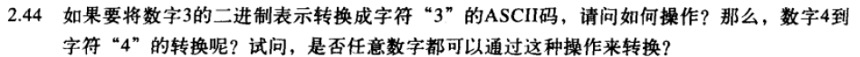

---
categories:
  - 读书
  - 计算机系统概论
tags:
  - 读书
  - 计算机系统概论
mathjax: true
title: 【计算机系统概论Yale.patt】2.数据的表示与计算
abbrlink: 465310364
date: 2023-05-27 21:41:50
---

[TOC]

<!--more-->

# 2.数据的表示与计算

## 2.1 bit

### 2.1.1 信号的编码表示

一个由自然语言描述的问题，最终必须转换为计算机内部的电路工作——电子的运动，才能得以解决

在计算机内部，电子器件控制着电子的运动：监测电压大小并做出不同的响应控制。

检测电路中的电压大小会导致电路比较复杂，但只检测电路中是否有电压则很简单，会大大减低电路复杂性

从符号层面，采用 `1` 表示两点间存在电压；`0` 表示两点之间不存在电压，即二进制表示方法

- `0` 并不变时电路中绝对不存在电压，仅代表当前 `0` 所代表的电压比 `1` 代表的电压更接近电压值 `0` 
- 机内将 $2.9V$ 表示为1

计算机需要定义足够大的数值范围才能工作。由于一条电路只有两个状态（1——有电压，0——无电压），为表示更多的数值状态，可以将多条线路合并使用。

通常 $k$ bit宽度（k条线路）可以表示 $2^k$ 个不同的电路状态，每个状态为k个0和1的bit序列组合，称该序列为编码，每个编码对应一个特定的值与电路状态

### 2.1.2 计算机采用二进制的原因

- 可行性：二进制只有01两个状态，能标识01两种状态的电子器件很多。
- 运算简易性：二进制运算法则少，运算简单，简化硬件结构
- 有逻辑代数的理论基础：二进制0和1正好和逻辑代数的真假对应

> 其实除了可行性，其他性质都是因为采用了二进制才进而凸显的，不过为了应试，就附上吧

### 2.1.3 数据类型

数据类型定义了：

- 数值的表示方式（编码方式）
- 数值相关的操作方法

>每个计算机指令集（ISA）都定义了一组数据类型及其相应的操作指令
>
>- 数据类型的设计取决于ISA的设计要求

#### 无符号整数

用于表示：执行次数，内存单元地址等没有大小意义，仅作为标记或计数的场景

k个bit可以表示 $2^k$ 个无符号整数（从 $0$ 到 $2^{k}-1$）

#### 有符号整数

在实际的算术运算中，存在着大量的负数。可以将 $2^k$ 个k-bit数分为两部分，一部分表示正数，另一部分表示负数

规定 `000...000` 表示数值0

计算机中，表示数值的正负需要占用一bit作为符号位，有四种数值表示方法——编码方式（二进制的不同解释方式）

##### 原码

n+1位定点(小数点)整数范围 $-2^n-1\sim2^n-1$

n+1位定点小数范围 $-1+2^{-n}\sim 1-2^{-n}$

- 字长足够，则可表示任意整数
- 不能表示任意小数，只能是2的整数次幂
- 真值0不唯一，可表示数少1

##### 反码

真值0不唯一：+0，-0

表示数值的范围和原码相同

##### 补码

$n+1$ 位二进制数可表示

- 定点整数 $1,\underbrace{00\cdots 00}_n.\sim 0,\underbrace{11\cdots 11}.$ ：$-2^n \sim 2^n-1$
- 定点小数 $1.\underbrace{00\cdots00}_n\sim 0.\underbrace{11\cdots11}_n$ ： $-1\sim 1-2^{-n}$

**补码特点**(机内码)

- 真值0的补码唯一
- 正数的补码二进制表示的无符号数，小于负数的补码表示的无符号二进制数
  - 如：127：0111 1111，-1；
- 数值位1越多表示数字越大
  - 0同侧编码值越大，真值越大
  - 正数的2进制编码小于负数的二进制编码 1000(-8) <0111(7) 

**原码变为补码**：从右到左，找到第一个1，其左边取反，其右边不变
$$
\begin{aligned}
&原码：0111 0100\\
&补码：1000 1100
\end{aligned}
$$

- 正数补码等于原码（什么编码都不变）
- 负数补码等于原码取反加一


**补码运算应满足的性质**

- 绝对值相同但符号相反的两个数之和应为0

- 相邻两个码字之间相差为00...001

  REPRESENTATION(value+1)=REPRESENTATION(value)+REPRESENTATION(1)

在计算机中，完成加法运算的是ALU，他是一种计算**机制** ，只会对二进制数进行加法操作，而不考虑其他因素（正数、负数或加法累计效果），即 **策略** 由上层指定

具体运算策略见组成原理对这部分的解释

##### 编码方式与范围

n位2进制编码

| 编码方式       | 最小值编码                    | 最小值      | 最大值编码                       | 最大值      | 数值范围                      |
| -------------- | ----------------------------- | ----------- | -------------------------------- | ----------- | ----------------------------- |
| 无符号定点整数 | $\underbrace{00...00}_n.$     | 0           | $\underbrace{11...11}_n.$        | $2^{n+1}-1$ | $0\le x\le 2^{n+1}-1$         |
| 无符号定点小数 | $.\underbrace{00...00}_n$     | 0           | $0.\underbrace{11...11}_n$       | $1-2^{-n}$  | $0\le x\le 1-2^{-n}$          |
| 原码定点整数   | $1,\underbrace{1...11}_{n-1}.$ | $-2^n+1$    | $0,\underbrace{1\cdots11}_{n-1}.$ | $2^n-1$     | $-2^n+1\le x \le 2^n-1$       |
| 原码定点小数   | $1.\underbrace{1...11}_{n-1}$ | $-1+2^{-n}$ | $0.\underbrace{1...11}_{n-1}$    | $1-2^{-n}$  | $-1-2^{-n}\le x \le 1-2^{-n}$ |
| 补码定点整数   | $1,\underbrace{0...00}_{n-1}.$ | $-2^n$      | $0,\underbrace{1...11}_{n-1}.$    | $2^n-1$     | $-2^n\le x \le 2^n-1$         |
| 补码定点小数   | $1.\underbrace{0...00}_{n-1}$ | $-1$        | $0.\underbrace{1...11}_{n-1}$    | $1-2^{-n}$  | $-1\le x \le 1-2^{-n}$        |

##### 移码

> 真值加一个常数

$$
\begin{aligned}
&[x]_移=2^n+x（-2^n\le x \le 2^n，机器字长为n+1）\\
&x_1=+10101，x_2=-10101，字长8位，则其移码表示为：\\
&[x_1]_移=2^7+10101=1,0010101,[x_2]_移=2^7+(-10101)=0,1101011
\end{aligned}
$$

- 只能表示整数
- 真值0唯一
- 二进制编码越大，所表示的数值越大
  - 移码大，真值大
  - 移码小，真值小

**n位二进制能表示 $2^n$ 个数字**

**移码一般是加10...01** ，即编码表示的无符号整数减去 $2^{n}-1$ 

##### 4-bit的不同编码方式

| 二进制 | 原码 | 反码 | 补码 | 移码+1001 |
| ------ | ---- | ---- | ---- | --------- |
| 0000   | 0    | 0    | 0    | -7        |
| 0001   | 1    | 1    | 1    | -6        |
| 0010   | 2    | 2    | 2    | -5        |
| 0011   | 3    | 3    | 3    | -4        |
| 0100   | 4    | 4    | 4    | -3        |
| 0101   | 5    | 5    | 5    | -2        |
| 0110   | 6    | 6    | 6    | -1        |
| 0111   | 7    | 7    | 7    | 0         |
| 1000   | -0   | -7   | -8   | 1         |
| 1001   | -1   | -6   | -7   | 2         |
| 1010   | -2   | -5   | -6   | 3         |
| 1011   | -3   | -4   | -5   | 4         |
| 1100   | -4   | -3   | -4   | 5         |
| 1101   | -5   | -2   | -3   | 6         |
| 1110   | -6   | -1   | -2   | 7         |
| 1111   | -7   | -0   | -1   | 8         |

### 2.1.4 IEEE754浮点数

> 浮点数可以表示很大的数值，也可以表示很小的数值，只是牺牲一些数值精度而已

符号位：1bit，表示数值的正负

数值范围：8bit，代表范围（指数，exponent）

数值精度：23bit，代表精度（位数部分，fraction）


#### 尾数

> 准确的，不存在任何误差的bit的位数为**精度**

在IEEE中，尾数是正则化的，即小数点左边有且仅有一个非零数

在二进制下， 正则化的尾数为 `1.xxxxx`

即用23bit尾数就可表示24位精度

#### 指数

8-bit的二进制数可表示255个无符号整数，在IEEE中，指数值范围为 $-126\sim 126$ ，剩余的两个指数 `00000000`  和 `11111111` 有特殊含义

指数部分为移码

- 实际的指数值等于该无符号整数减127之后的结果——相当于加 `1000 0001`

| 二进制    | 指数值    |
| --------- | --------- |
| 0000 0000 | 特殊含义  |
| 0000 0001 | -126      |
| .... .... | .... .... |
| 0111 1111 | 0         |
| 1000 0000 | 1         |
| .... .... | .... .... |
| 1111 1110 | 126       |
| 1111 1111 | 特殊含义  |

##### 0000 0000 含义

表示指数值为-126，但尾数不是正规化的

- 尾数全0 `0...0` ，则为0
- 尾数非0，则该浮点数的值为 $(-1)^s\times 0.尾数\times 2^{-126}$ 

##### 1111 1111含义

- 尾数全0，无穷大
- 尾数不全为0，非数值

#### 例

用IEEE浮点数标准表示 $-6\frac{5}{8}$

符号位为1

$\frac{5}{8}=.101$，$6=110$ ——$110.101$ 正则化后为 $1.10101\times 2^{2}$

指数部分 `2+127=0000 0010+0111 1111=1000 0001` 

故 IEEE的浮点数表示为：`1 1000 0001 101 0100 0000 0000 0000 0000`

---

IEEE浮点数0 0111 1011 00000000000000000000000表示什么数

符号位s=0，表示整数

指数部分：`0111 1011` -127 为 $123-127=-4$ 

尾数部分：`1.0xxx0`

所以该二进制数表示 $+1.0\times 2^{-4}$ 

## 2.2 进制转换

### 2.2.1 二转十

$a_7a_6a_5a_4a_3a_2a_1a_0$

1. 8bit补码数据，最高位 $a_7$ 为符号位

   - 为0，则直接进行第二步转换 $a'_{6}a'_{5}a'_{4}a'_{3}a'_{2}a'_{1}a'_{0}=a_6a_5a_4a_3a_2a_1a_0$

   - 为1，需要转换为绝对值相等的正数——取反+1

     $a'_{6}a'_{5}a'_{4}a'_{3}a'_{2}a'_{1}a'_{0}=\overline{a_6a_5a_4a_3a_2a_1a_0}+1$ 

2. $x=a^{'}_6\times 2^6+a_5 \times 2^5+a_4\times 2^4+a_3 \times 2^3+a_2\times 2^2+a_1 \times 2^1+a_0\times 1$

3. 若为负数，加上负号即可

### 2.2.2 十转二

1. 将十进制数N展开为2次幂的求和

   $N=a_6\times 2^6+a_5\times 2^5+a_4\times 2^4+a_3\times 2^3+a_2\times 2^2+a_1\times 2^1+a_0\times 2^0$ 

   反复执行一下操作，直至N变为0

   - 如果N为奇数，则左边最低位 $a_i$ 为1。如果N为偶数，则左边最低位 $a_i$ 为0
   - 即将等式两端同时减1（奇数）或0（偶数），消除最低位后，将等式两端同时除以2

   每执行一次，可以求得一个 $a_i$ 的值

2.  如果N值为正，则 $a_7$ 取值为0

3. 如果N值为负，则最高位补0，然后求该编码的补码，完成

和手算的取余，然后逆序一样


### 2.2.3 二转十六

适合计算机计算且方便人阅读

一个16bit的二进制数 $a_{15}a_{14}a_{13}a_{12}a_{11}a_{10}a_{9}a_{8}a_{7}a_{6}a_{5}a_{4}a_{3}a_{2}a_{1}a_{0}$

其相应的无符号整数表示为 
$$
\begin{aligned}
&2^{15}\times a_{15}+2^{14}\times a_{14}+2^{13}\times a_{13}+2^{12}\times a_{12}+2^{11}\times a_{11}+2^{10}\times a_{10}+2^{9}\times a_{9}+2^{8}\times a_{8}+\\
&2^{7}\times a_{7}+2^{6}\times a_{6}+2^{5}\times a_{5}+2^{4}\times a_{4}+2^{3}\times a_{3}+2^{2}\times a_{2}+2^{1}\times a_{1}+2^{0}\times a_{0}
\end{aligned}
$$
从低位到高位，每四位为一组
$$
\begin{aligned}
2^{12}\times [2^3\times a_{15}+2^{2}\times a_{14}+2^1\times a_{13}+2^{0}\times a_{12}]\\
+2^{8}\times [2^3\times a_{11}+2^{2}\times a_{10}+2^1\times a_{9}+2^{0}\times a_{8}]\\
+2^{4}\times [2^3\times a_{7}+2^{2}\times a_{6}+2^1\times a_{5}+2^{0}\times a_{4}]\\
+2^{0}\times [2^3\times a_{3}+2^{2}\times a_{2}+2^1\times a_{1}+2^{0}\times a_{0}]\\
=16^3\times h_3+16^2\times h_2+16^1\times h_1+16^0\times h_0
\end{aligned}
$$
由于 $h_i$ 共有16种取指($0\sim 15$) ，用符号 $0,1,2,3,4,5,6,7,8,9,A,B,C,D,E,F$ 作为 $h_i$ 的值

- 0表示 $0000$
- 1表示 $0001$
- A表示 $1010$
- F表示 $1111$

十六进制的主要好处在于方便记忆和使用。避免了因二进制数字串过长引起的誊写错误

## 2.3 bit运算

### 2.3.1 加减法

二进制加法与十进制加法相同，从右向左将两数按列对齐并依次相加；如果前列的加法产生进位，则该进位bit参加左边列的加法操作

---

11+3
$$
\begin{aligned}
&01011\\
&00011\\
&--\\
&01110\\
\end{aligned}
$$

---

**减法理解为加负数**，$A-B=A+(-B)$

---

14-9(01001)
$$
\begin{aligned}
&01110\\
&10111\\
&--\\
&00101
\end{aligned}
$$

---

加本数相当于乘2，在位运算相当于左移1为

$x+x\iff x<<1$

#### 符号扩展

将两个长度不等的二进制相加，需要进行对齐操作——符号扩展

补码运算 (Sign Extension，简称SEXT)

- 正数前0扩展不改变原值
- 负数前1扩展不改变原值


#### 溢出

运算结果超出编码的最大值或最小值的情况

无符号整数溢出情况：最高位发生进位

有符号整数溢出情况：

- 正数与正数相加
- 负数与负数相加

### 2.3.2 逻辑运算

对两个长度为 m-bit 的二进制数做逻辑运算，将两个操作数按位对齐，然后对其中每一对bit进行运算，称为按位逻辑操作

- 只影响本位，不是算术运算，所以没有进位

**作用：**

- 判断某位的取值(0/1)
  - 当判断最后一位是0或是1时，可判断二进制表示数值的奇偶

- 取出二进制数的某一位
- 某位置为0/1
- 位取反——非运算
- 用于比较两数是否相等——异或

#### 逻辑操作的描述方式——真值表

对于n个操作数的逻辑操作，构造

- 行数——$2^n$
  - n个操作数的可能组合数为 $2^n$ 种
- 列数——$n+1$
  - 前n列表示n个源操作数
  - 最后一列表示该组合方式下逻辑运算的结果

的真值表

#### 按位与

全1得1，有0得0

```cpp
a=0011101001101001
b=0101100100100001
a&b=
  0001100000100001
```

与运算作用：

**位置0** ：与0

- 应用：计算n二进制的个数—— 每步使最低位的1变0 `n=n&(n-1);count++;` 直至 `n==0` 

  减法，向最低可进位借1，改为变为0，与减1之后的数相与，可将最低可借位和低位置0，高位不变

**判断某位取值** ：与1 

**取特定位** ：屏蔽字位：两部分组成

- 关心的位——目标位取1
- 忽略的位——其余为0

作用是将关心的位提出来——取某位

---

如取出8-bit数据A的低2位，其屏蔽字为 `0000 0011` ，无论A取何值，与屏蔽字与的结果必然是 `00000000` 、`00000001` 、`00000010` 、`00000011` 中的一个

---

#### 或运算

全0得0，有1得1

```cpp
a=0011101001101001
b=0101100100100001
a|b=
  0111101101101001
```

与运算作用：

**位置1** ：或1

**判断某位取值** ：或1

#### 非运算

按位取反

```cpp
a=0011101001101001
~a=
  1100010110010110
```

#### 异或运算

按位异或

异或真值表

| A    | B    | XOR  |
| ---- | ---- | ---- |
| 0    | 0    | 0    |
| 1    | 0    | 1    |
| 0    | 1    | 1    |
| 1    | 1    | 0    |

- 两个输入值不同，则输出为1
- 两个输入值相同，则输出为0

```cpp
a=0011101001101001
b=0101100100100001
a^b=
  0110001101001000
```

用于判断两个二进制数是否相同

- 若两个数相等，则异或之后为0

#### 应用——位矢量

在复杂系统中，包含了很多独立单元，每个单元或忙或空闲。

假设存在n个单元，可以用一个 n-bit 的二进制数代表这n个单元。

- 当某个单元忙碌时，将相应的bit置1—— `|0...010...0` 
- 当某个单元空闲时，将相应的bit置0——`&1...101...1`

## 2.4 ASCII

> 用于在计算机处理单元和IO设备之间传递字符的8-bit编码标准。

键盘上每个键位一般不止对应一个ASCII码

- 通过功能键 `shift` 切换

每次按键都会产生唯一的ASCII码

## 2.5 习题

**2.5.1** 一个n-bit二进制数可表示 $2^n$ 个不同的二进制数

**2.5.2**

用二进制bit串表示26个英文字母，需要 $\lceil log_226\rceil=5$ bit，区分大小需要 $2\times \lceil log_226\rceil=6$ bit


$\lceil log_2400\rceil=9$ bit

$2^9-400=112$ 个

**2.5.4** 给定n-bit，可表示多少无符号整数，范围多大

可表示 $2^n$ 个无符号整数，范围为 $0\sim 2^n-1$

**2.5.5** 用5-bit二进制串表示数值，写出7和-7的反码，符号位码和补码表示 

|      | 原码  | 反码  | 补码  |
| ---- | ----- | ----- | ----- |
| 7    | 00111 | 00111 | 00111 |
| -7   | 10111 | 11000 | 11001 |

**2.5.6** 用6-bit补码表示32

`100000`

**2.5.7 ** 列出4-bit二进制补码能表示的所有整数

| 补码 | 数值 |
| ---- | ---- |
| 1000 | -8   |
| 1001 | -7   |
| 1010 | -6   |
| 1011 | -5   |
| 1100 | -4   |
| 1101 | -3   |
| 1110 | -2   |
| 1111 | -1   |
| 0000 | 0    |
| 0001 | 1    |
| 0010 | 2    |
| 0011 | 3    |
| 0100 | 4    |
| 0101 | 5    |
| 0110 | 6    |
| 0111 | 7    |


a. $2^{(8-1)}-1=2^7-1=127$ , 0111 1111

b. 可表示绝对值最大的负数为 $-2^7=-128$ ，其二进制数表示为 $1000 0000$

c. $2^{n-1}-1$ 

d. $-2^{n-1}$ 

**2.5.9** 如果用二进制补码方式表示摩尔常数 $6.0\times 10^{23}$ ，需要多少bit?

$2^n\ge 6\times 10^{23}\Rightarrow log_2n\ge log_2(6\times 10^{23})\Rightarrow n\ge 79$ 

需要1-bit作为符号位，所以共需要 80-bit


a. $1010\overset{取反+1}{=}1110=-6$

b. $2^1+2^3+2^4+2^6=64+16+8+2=90$

c. $11111110\xlongequal{取反至最低1}10000010=-2$

d. $0011100111010011=14803$

**2.5.11** 十进制数转为8-bit补码

a. 102=64+32+4+2=0110 0110

b. 64=0100 0000

c. 33=32+1=0010 0001

d. -128 = 1000 0000

e. 127=0111 1111


可被4整除的偶数

**2.5.13** 将二进制数改为8-bit数，且不允许改变原值

a. 1010——1111 1010

b. 011001——0001 1001

c. 1111111000——1111 1000

d. 01——0000 0001

**2.5.14** 二进制数加法

a. 1011+0001=1100

b. 0000+1010=1010

c. 1100+0011=1111

d. 0101+0110=1011

e. 1111+0001=1,0000，发生溢出

**2.5.15** 左移一位等价于乘2，右移一位等价于除2


a. 7的反码：0000 0111 -7的反码：1111 1000，相加为 1111 1111：-0的反码

b. 7的原码：0000 0111 -7的原码：1000 0111，相加为 1000 1110：-14

c. 7的补码：0000 0111 -7的补码：1111 1001，相加为 0000 0000：0

**2.5.17** 计算补码加法，并将结果转换为十进制数

a. 01+1011=0001+1011=1100：12

b. 11+01010101=0000 0011 + 0101 0101 = 0101 1000：88

c. 0101+110=0101+1110=0011：3

d. 01+10=11=-1

补码计算注意符号位扩展

**2.5.18** 计算无符号二进制加法，并将结果转换为十进制

a. 01+1011=1100 ：12

b. 11+01010101=1011000：88

c. 0101+110=1011 ：11

d. 01+10=11 ：3

**2.5.19** 将十进制数 -27 分别转换为8-bi补码，16-bit补码，32-bit补码，并阐述符号位扩展在这三种表达方式中的应用

-27的二进制形式：`1110 0101` ，补码符号位扩展 16-bit `1111 1111 1110 0101` ，32-bit $\underbrace{11\cdots 11}_{24} 1110 0101$

**2.5.20** 4-bit补码运算溢出，改为十进制验证

a. 1100+0011=1111 ：-1，不会发生溢出

-4+3=-1

b. 1100+0100=0000 ：0，不会发生溢出

-4+4=0

c. 0111+0001=1000 ：-8，发生溢出

7+1=8

d. 1000-0001=1000+1111=0111 ：7，发生溢出

-8-1=-9

e. 0111 + 1001 = 0000 ：0，不会发生溢出

7+-7=0

**2.5.21** 补码相加发生溢出情况：两个正数或两个负数相加才可能发生溢出

**2.5.22** 两个16-bit补码相加溢出的例子


**2.5.23** 两个无符号整数相加会溢出的情况：最左bit发生进位是发生溢出

**2.5.24** 两个16-bit无符号整数相加溢出的例子


**2.5.25** 为什么在补码方式下负数和正数相加并不会溢出

对于正数，运算后其结果一定小于正加数

对于负数，运算后其结果一定大于负加数


a. $\lceil log_264\rceil=6$ ，需要增加1bit符号位，所以最少需要7bit

b. 最大正整数 001 1111 = 63

c. 最大无符号整数：111 1111 = 127


 发生了溢出，两个正数补码相加，结果应为正数。由于发生溢出，结果为负数

**2.5.28** And逻辑运算什么条件为1

2输入为1时，And逻辑运算为1

**2.5.29**


a. 0101 0111 & 1101 0111 = 0101 0111

b. 101 & 110 = 100

c. 1110 0000 & 1011 0100 = 1010 0000

d. 0001 1111 & 1011 0100 = 0001 0100

e. (0011 & 0110) & 1101 = 0010 & 1101 = 0000

f. 0011 & (0110 & 1101) = 0011 & 0100 = 0000

**2.5.31** 什么情况下OR逻辑运算为1

**2.5.32**


**2.5.33** 

a. 0101 0111 | 1101 0111 =   1101 0111

b. 101 | 110 = 111

c. 1110 0000 | 1011 0100 = 1111 0100

d. 0001 1111 | 1011 0100 = 1011 1111

e. (0101 | 1100) | 1101 = 1101 | 1101 = 1101

f. 0101 | (1100 | 1101) = 0101 | 1101 = 1101

**2.5.34**

a. !(1011) | !(1100) = 0100 | 0011 = 0111

b. !(1000 & (1100 | 0101)) = !(1000 & 1101) = !1000 = 0111

c. !(!1101)=1101

d. (0110 | 0000) & 1111 = 0110 & 1111 = 0110

**2.5.35** 屏蔽字作用

修改设备状态：

- 置1：设为空闲
- 置0：设为忙碌


a. &1111 1011

b. | 0100 0100

c. &0000 0000

d. | 1111 1111

e. &0000 0100，左移5位


加法器符号位溢出判断 V=(n&m&!s) | (!n &!m&s)&1000 

若V=1000，则溢出

若V=0000，则无溢出


V=n&m&1000+(n+m)&!s&1000=(n&m+(n+m)&!s)&1000

- 一定不溢出：n与m都是0xxx ，$n+m=s<2^4-1$ 

**2.5.39** 将十进制数转化为IEEE格式浮点数

a. 3.75 11.11 $1.111\times 2^1$  尾数为 $.111 \underbrace{00\cdots0}_{20}$ ，移码为 $1+127=1000 0000$ ，符号位为0

b. $-55\frac{23}{64}=-(32+16+4+2+1+\frac{16+4+2+1}{64})=-110111.010111=-1.1011010101\times 2^{0000 0101}$ 
尾数为 $.101 1101 0111 \underbrace{00\cdots00}_{12}$ ，移码为 $5+127=0111 1111 +0000 0101=1000 0100$，符号为 1
c. 3.1415927
d. 64000 = 32768+16384+8192+4096+2048+512
$1111101000000000=1.111101\times 2^{0000 1111}$
尾数为 $111101\underbrace{00\cdots00}_{17}$ ，阶码为 $15+127=0000 1111+0111 1111=10001110$ 

**2.5.40** IEEE转换为十进制数

|编号|符号位|数符|阶码|指数|尾数|小数部分|二进制数|十进制数|
|---|---| --- | ---|---|---|---|---|---|
|a|0|正数|10000000|1|$\underbrace{00\cdots 0}_{23}$|1.0|$1.0\times 2^1$ |2|
|b|1|负数|10000011|4|$0001\underbrace{00\cdots 0}_{19}$|1.0001|-$1.0001\times 2^{4}$|-17|
|c|0|.|11111111|.|$\underbrace{00\cdots0}_{23}$|.|.|无穷|
|d|1|负数|10000000|1|$1001\underbrace{00\cdots 0}_{19}$|1.1001|$1.1001\times 2^{1}$|$-1.5625$|

**2.5.41**
a. 32-bit IEEE浮点数能表示的最大数值是多少？
阶码最大为 1111 1110 ，指数最大为126，尾数最大为 $\underbrace{11\cdots1}_{23}$ ，小数部分为 $1.\underbrace{11\cdots1}_{23}$ ，其十进制数表示为 $(2-2^{-23})\times 2^{126}$ 
b. 32-bit IEEE 浮点数能表示的最小数值是多少？
阶码最小为 0000 0001 ,指数最小为-126，尾数最小为 $00\cdots 0$，小数部分为 $1.\underbrace{00\cdots 0}_{23}$ ，其十进制数为 $-1.0\times 2^{-126}$


ASCII码

| 字符 | 十进制数 | ASCII     |
| ---- | -------- | --------- |
| 0    | 48       | 0011 0000 |
| 5    | 53       | 0011 0101 |
| 8    | 56       | 0011 1000 |
| A    | 65       | 0100 0001 |
| Z    | 90       | 0101 1010 |
| a    | 97       | 0110 0001 |
| m    | 109      | 0110 1101 |
| z    | 122      | 0111 1010 |


a. x48656c6c6f21

x48-0100 1000-72-H

x65-0110 0101-101-e

x6c-0110 1100-108-l

x6f-0110 1111-111-o

x21-0010 0001-33-!




3的二进制数为0000 0011，其ASCII为0011 0011

假设待转换的数值为n，其二进制B表示为 $0000 0000\sim 0000 1001$ ,表示为ASCII的二进制数为A

由于 '0' 的ASCII为 0110 0000，所以B转为A，只需要将高四位变为 0110 ，即ASCII码B的十进制数与数值n关系：B=n+48

**2.5.45** 二进制转十六进制

a. $\underbrace{1101}_{D} \underbrace{0001}_1 \underbrace{1010}_A \underbrace{1111}_F$ 


**2.5.47** 将十六进制补码转换为十进制数

a. xF0-1111 0000,其十进制数为1001 0000：-16

b. x7ff-02047111 1111 1111 ,其十进制数为2047 

c. x16-0001 0110，其十进制数为16+6=22

d. x8000-1000 0000 0000 0000,其十进制数为-32768


十六进制加法，逢16进1,

a. B+E=9+16，5+D+1=3+16,6+2+1=9，结果为X2939,最高bit没有发生变号，未发生溢出

b. 6+0=6,9+A=3+16,D+0+1=E，7+F=6，由于是异号相加，所以一定不发生溢出，结果为X6E36

c. D+7=4+16，9+5+1=F，3+3=6，A+A=4+16，同号相加，符号位变号，发生溢出

d. 6+2=8,9+1=A,D+4=1+16,7+7+1=F,同号相加，符号位变号，发生溢出


逻辑运算是按位运算，必须展开为二进制


转二进制，再转16进制

a. 25675=16384+8192+1024+64+8+2+1

$\underbrace{0110}_{6}  \underbrace{0100}_4 \underbrace{0100}_4 \underbrace{1011}_B$

b. 675.625=512+128+32+2+1+0.5+0.125

$10 1010 0011.101=1.010100011101\times 2^{9}=1.010100011101\times 2^{1001}$

表示为IEEE754格式，数符0，阶码9+127=128+8=1000 1000，尾数 $010100011101\underbrace{00\cdots0}_{9}$ 

0100 0100 0010 1000 1110 1000 0000 0000，其十六进制为X4428E800


**2.5.53**

$Q_1=!(A*B)=\overline{A}+\overline{B}$

$Q_2=!(!A * !B)=A+B$


**2.5.54**

$Q_1=!(!X+(XYZ))=X(\overline{X}+\overline{Y}+\overline{Z})=X\overline{Y}+X\overline{Z}$

$Q_2=\overline{(Y+Z)XYZ}=\overline{Y}\overline{Z}+\overline{X}+\overline{Y}+\overline{Z}=\overline{X}+\overline{Y}+\overline{Z}$


c. 023+221：3+1=0+4,2+2+1=1+4,0+2+1=3，所以310

d. 42/4=10(2),10/4=2(2),2/4=2,所以222

e. $123.3=3+2*4+1*16+\frac{3}{4}=27.75=11011.11$


1110 0101

数符1 负数

阶码1100，指数12-7=5

尾数1.101，小数1.101

$-1.101\times 2^{5}=-110100=-52$
