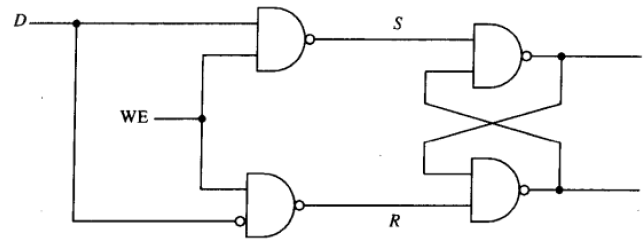
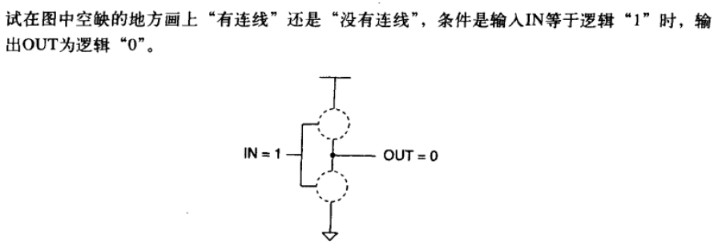
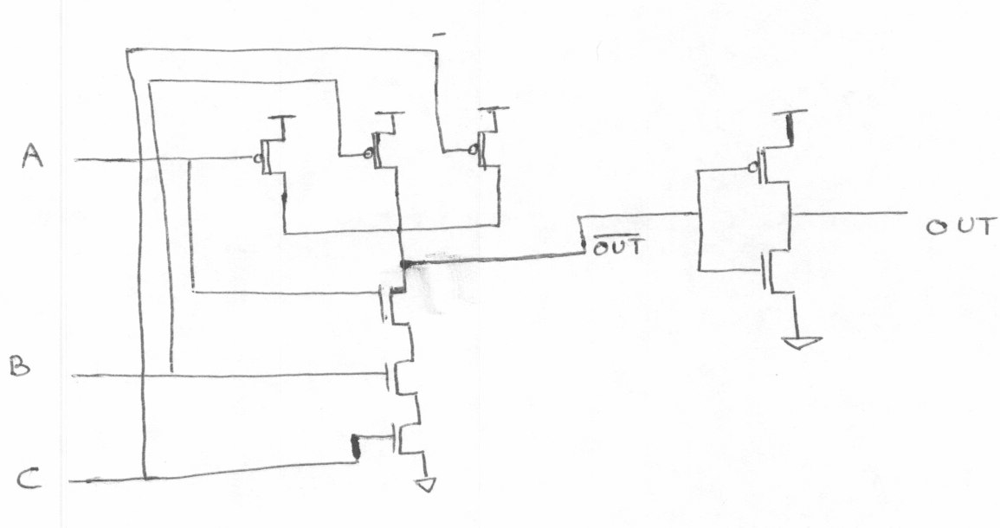
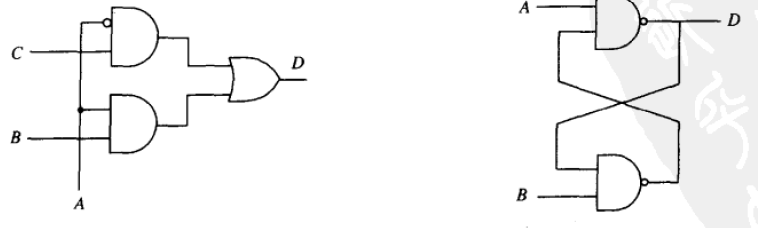
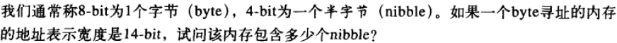

---
categories:
  - 读书
  - 计算机系统概论
tags:
  - 读书
  - 计算机系统概论
mathjax: true
title: 【计算机系统概论Yale.patt】3.数字逻辑
abbrlink: 151412114
date: 2023-06-20 19:23:37
---

[TOC]

<!--more-->

# 3.数字逻辑

- MOS晶体管工作原理
- 如何基于MOS晶体管实现逻辑门
- 如何通过逻辑门互连构建计算机的组成单元

## 3.1 MOS管

> MOS管(metal-oxide semicconductor) 金属氧化物半导体
>
> - 通常情况下假设MOS晶体管工作稳定，不会出现问题。
> - 其底层属于电气特性，属于电子学

使电路工作，需要满足两个条件：电源和闭合回路

MOS管相当于电路中开关的作用

- 栅极：使能端
- 源极、漏极：接入电路的两端

在栅极接通时，源极与漏极之间会形成一条通路——导通、闭路状态

源极和漏极之间断开，则处于——断开、开路状态

### 3.1.1 p型MOS晶体管

**低连通**

在栅极接入2.9V电压，源极和漏极断开

在栅极接入小于2.9V的电压，源极和漏极导通

### 3.1.2 n型MOS晶体管

**高连通**

在栅极接入2.9V电压，源极和漏极导通

在栅极接入小于2.9V的电压，源极和漏极断开

---

同时包含p-MOS管和n-MOS管的的电路称为CMOS电路——(互不金属氧化物半导体，Complementary Metal-Oxide Semiconductor)

## 3.2 逻辑门

将实现逻辑函数的COMS电路称为逻辑门电路

### 3.2.1 非门——反相器

- 一个p-型MOS管
- 一个n-型MOS管

### 3.2.2 或非门、或门

#### 或非门

- 两个p-型MOS管
- 两个n-型MOS管

#### 或门

- 三个p-型MOS管
- 三个n-型MOS管

### 3.2.3 与非门、与门

- 三个p-型MOS管
- 三个n-型MOS管

### 3.2.4 逻辑门符号表示

#### 逻辑门的数电表达式

$\overline{x}$ 表示 $x$ 的非

$a\cdot b$ 表示 $a$ 和 $b$ 相与

$a+b$ 表示 $a$ 和 $b$ 相或

#### 摩根定律

$\overline{a\cdot b}=\overline{a}+\overline{b}$

$\overline{a+b}=\overline{a}\cdot \overline{b}$

## 3.3 逻辑结构

逻辑结构分为两大类：不可存储信息——组合逻辑；可存储信息——存储单元

### 3.3.1 组合逻辑

组合逻辑(“决策单元”)的输出状态完全取决于当前逻辑结构的输入

- 译码器
- 多路复用器
- 全加器

#### 译码器

> 用于解释一个二进制数

在特定的输入模式下，相应的输出线被置位

- n个输入，$2^n$ 个输出

#### 多路复用器

> 从多个输入中选择一个

- $2^n$ 个输入，一个输出，n个选择线

#### 全加器

**1bit全加器**

逻辑表达式

$s_i=a_i\oplus b_i\oplus carry_i$ 

- 奇数个1置1
- 偶数个1或者3个0，置0

$carry_{i+1}=carry_i(a_i\oplus b_i)+a_ib_i$ 

- 三个输入中多于2个1，则有进位

**4bit全加器**

#### 可编程逻辑阵列

> 逻辑门的组合可以实现不同的输出值组合

可编程阵列(Programmable Logic Array,PLA)

通过“编程”多个与门（不同输入组合）与多个或门（不同输出组合）之间的连接关系，可以实现任何逻辑函数

**逻辑完备性**

PLA只要有与或非三种逻辑门，就可以实现任何逻辑函数。

- 因为与或非是逻辑完备的

### 3.3.2 存储单元

可以存储电路的历史信息，但不具备数据处理能力

#### R-S锁存器

- R=1,S=1，锁存——静态，输出不变
- R=1不变，S置0，输出置1
- S=1不变，R置1，输出置0
- R=0，S=0，锁存器状态不确定

**静态**

- $a=1\Rightarrow b=B=0\Rightarrow a=1$ 
- $a=0\Rightarrow b=B=1\Rightarrow a=0$

**S=0输出置1**

清除S，$S=0\Rightarrow a=1\Rightarrow b=0\Rightarrow a=1$

此时，S变为1，则锁存器处于静态

- $a=1\Rightarrow b=0\Rightarrow a=1$ 

**R=0输出置0** 

清除R，$R=0\Rightarrow b=1\Rightarrow a=0$ 

若R变为1，则锁存器进入静态

- $a=0\Rightarrow b=1\Rightarrow a=0$ 

#### 门控D锁存器

R-S锁存器+控制电路

只有(写入)控制信号 `WE=1` 有效时，才使锁存器的值等于输入值D

WE无效时，RS都等于1，R-S锁存器处于静态

WE瞬间置位时，两个与非门至少有一个为0

- D=1，S=0，输出=D=1
- D=0，R=0，输出=D=0

#### 寄存器

将多个bit组合成一个独立单元

#### 内存

每个 `位置` 可以被单独识别并独立存放的一个数据

位置标识符称为 `地址`

存储在位置中的bit数称为 `寻址能力` 

**寻址空间** ：可独立识别的位置总数

**寻址能力**：每个内存位置包含的bit 数=存储字长

**字线** ：通过译码器，对应的输出线置1，同字的bit都可被选中

- 每个bit与所在字线相与，与其他字线上的同bit位置相或（当然，由于只有一个字被选中，即一个字线为1，所以输出端的值为所选字的值）

## 3.4 时序电路

> 既能处理数据又能存储数据的逻辑电路单元

- 输出与当前输入、之前电路状态相关

- 存储单元：跟踪电路以前的状态
- 输出：由电路当前输入信号和存储单元信息共同决定
- 状态：系统在特定时刻和特定条件下的快照

### 3.4.1 有限状态机

**组成**

- 状态（有限数目）
  - 用状态集合表示可能处于的所有状态
- 外部输入（有限数目）
- 对外输出（有限数目）
- 任意状态间迁移（显式注明）
  - 从一个状态到另一个状态需要的条件
- 对外输出操作（显式标注）

#### 状态图

状态结节点：代表系统的一个状态

- 当前状态
- 下一状态

节点间连接线：代表一个状态到另一个状态的转换

- 状态间转移线代表了在当前状态下的所有可能操作（输入）
- 最终的转移取决于外部输入

系统输出既可以由当前状态唯一决定，也可以由当前状态和当前输入共同决定

如：时序锁密码为 R12-L22-R3

- 将输入值与操作历史结合，最终决定是否能将所打开。与旋转过程有关

#### 时钟

> 状态转移的触发机制——状态转移是通过时钟电路来触发的。

- 时钟：01交替变换的信号

有限状态机的状态转移发生在时钟周期的起始时刻

### 3.4.2 有限状态机的实现

- 外部输入

- 输出

- 存储单元

- 时钟电路

  

如：交通警示牌

- 外部输入：控制灯亮灭的开关
- 输出：控制1-2号灯亮的操作信号；控制3-4号灯亮的操作信号；控制5号灯亮的操作信号
- 存储单元：记录控制器的当前状态。反映系统之前的状态
- 时钟电路：周期的控制系统的状态转移

**组合逻辑**

- 外部输出：交通灯的操作信号
- 内部输出：存储单元的状态信息

组合逻辑电路：

5号灯亮的唯一情况是开关闭合且当前状态为11

3,4号灯亮的情况是开关闭合且状态为10与11

1,2号灯亮的情况为开关闭合且当前状态为01,10与11

**存储单元**

需要用到主从锁存器

- 由于当前时钟周期内，存储单元的输出是组合逻辑的输入——当前状态

  同时组合逻辑的输出又是存储单元的输入，该输入应等到下一时钟周期再写入存储单元

相当于两段式R-S锁存器

当前状态由锁存B输出，下一状态存入锁存A。

- 时钟前半周期，锁存A内容不变，即当前状态不变
- 时钟后半周期，锁存B内容不变，锁存A内容变为下一状态

---

存储单元1置1的情况是下一状态为10或11，则当前状态为01或10

存储单元2置1的情况是下一状态为01或11，则当前状态为00或10

## 3.5 习题

**3.1**

**3.2非门**

**3.3** 

2输入电路有4种输入组合，相应的每种输出有两种取值，所以理论上有 $2^4=16$ 种两输入逻辑

**3.4**

或非门

**3.5 枚举**

**3.6** 

可得逻辑表达式 $Z=\overline{\overline{A}+\overline{B}}=A\cdot B$

**3.7**

| A    | B    | OUT  |
| ---- | ---- | ---- |
| 0    | 0    | 1    |
| 0    | 1    | 冲突 |
| 1    | 0    | 冲突 |
| 1    | 1    | 0    |

在 $A\oplus B=1$ 的情况下，在源极和漏极之间会形成短路

**3.8** 

先简化表达式

$\overline{A(B+C)}=\overline{A}+\overline{B}\overline{C}$ 

A为0的情况，则Y一定为1，

A为1，且BC=1时，Y为0

**3.9 3.10** 都是先化简表达式

3.9为与门，3.10为或非门

**3.11**

三输入与门，只有 $A=B=C=1$ 时，输出为1，其余都为0

三输入或门

---

**与门标注MOS管的通断**

A = 1, B = 0, C = 0.

A = 0, B = 0, C = 0

A = 1, B = 1, C = 1

**或门标注MOS管的通断**

A = 1, B = 0, C = 0

A = 0, B = 0, C = 0

A = 1, B = 1, C = 1

**3.12 三输入译码器**

**3.13**

五输入译码器有 $2^5=32$ 根输出线

**3.14** 

$2^4=16$ 所以16输入多路选择器有4条选择线

**3.15 全加器**

A=7，B=11，A+B=18=10010

最高位有进位，发生溢出

**3.16**

相当于全加器本位运算结果

$S=A\oplus B\oplus C$

$Z=\overline{S}=\overline{S=A\oplus B\oplus C}$

**3.17**

**3.18 与或非门PLA**

(d) 缺少进位信息

**3.19**

A图是时序逻辑，B图是R-S锁存器

时序逻辑电路输出仅与当前输入有关

R-S锁存器，在A=B=1时，处于静止状态

- A=0，置1
- B=0，置0

**3.20**

三同一异 与门相关

**3.21**

$2\times 2^{14}=2^{15}$ 个半子

**3.22** 

$S_1$ 为片选信号，$S_0$ 为片内信号

**3.23**

$\overline{\overline{AB}\cdot \overline{B}\cdot \overline{C}+\overline{AB}}=AB+ \overline{(\overline{AB}+1)}=AB$

**3.24**

选通：

X=0，S=A+B

X=1，S=A+C

---

可令 $C=\overline{B},Carry_{in}=X$

**3.25**

1非1与1或，有三个门延迟

- 1bit加法器有3个门延迟，所以四个1bit加法器串联有12个门延迟

扩展为32位全加器，传输延迟为 $32\times 3=96$ 个

**3.26**

S=1：单数个1

C=1：2个1或三个1

**3.27**

S=0，Z=A

S=1，Z不变，存储之前的值。是一个存储单元

**3.29**

存储单元是覆盖式的，一旦被写入就无法恢复

**3.30**

$2^3\cdot 8B=64B$

**3.32**

内存地址指向一个存储字的位置

内存寻址能力是一个存储字的存储字长，一个存储字中有多少bit

**3.33**

**3.34**

**3.35**

**3.36**

组合逻辑，无存储功能，输出只与当前输入有关

**3.41**

三种输入：

N：投5美分

D：投10美分

Q：投25美分

9种状态

2种输出

- 只输出汽水
- 输出汽水并找零

**3.43**

**3.43**

即用与非门构造与或非三种逻辑门

$AB=\overline{\overline{AB}\cdot \overline{AB}}$

$\overline{A}=\overline{A\cdot A}$

$A+B=\overline{\overline{A}\cdot \overline{B}}$
